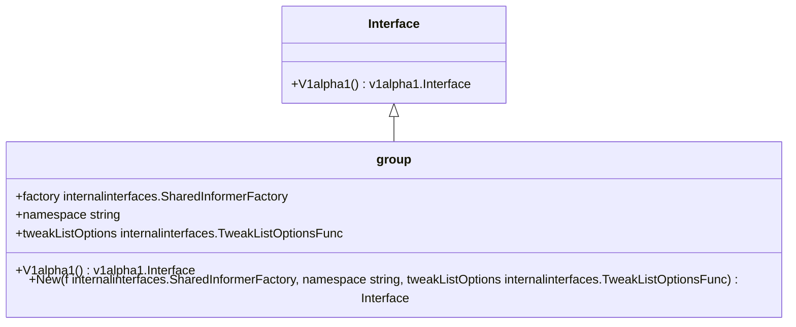

# Overview

Rollouts in Informers provide access to a shared informer and lister for managing Argo Rollouts. This document explores the key components and functionalities involved in managing rollouts using informers.

# <SwmToken path="pkg/client/informers/externalversions/rollouts/v1alpha1/rollout.go" pos="37:2:2" line-data="type RolloutInformer interface {">`RolloutInformer`</SwmToken> Interface

The <SwmToken path="pkg/client/informers/externalversions/rollouts/v1alpha1/rollout.go" pos="37:2:2" line-data="type RolloutInformer interface {">`RolloutInformer`</SwmToken> interface defines methods to retrieve a shared informer and a lister for Rollouts. It is implemented by the <SwmToken path="pkg/client/informers/externalversions/rollouts/v1alpha1/rollout.go" pos="42:2:2" line-data="type rolloutInformer struct {">`rolloutInformer`</SwmToken> struct, which includes a factory, <SwmToken path="pkg/client/informers/externalversions/rollouts/v1alpha1/analysisrun.go" pos="44:1:1" line-data="	tweakListOptions internalinterfaces.TweakListOptionsFunc">`tweakListOptions`</SwmToken> function, and namespace.

# Informer Method

The <SwmToken path="pkg/client/informers/externalversions/rollouts/v1alpha1/analysisrun.go" pos="38:1:1" line-data="	Informer() cache.SharedIndexInformer">`Informer`</SwmToken> method in <SwmToken path="pkg/client/informers/externalversions/rollouts/v1alpha1/rollout.go" pos="42:2:2" line-data="type rolloutInformer struct {">`rolloutInformer`</SwmToken> returns a shared index informer for Rollouts by calling the <SwmToken path="pkg/client/informers/externalversions/factory.go" pos="254:1:1" line-data="	InformerFor(obj runtime.Object, newFunc internalinterfaces.NewInformerFunc) cache.SharedIndexInformer">`InformerFor`</SwmToken> method with the Rollout type. This method is essential for initializing the informer with the necessary parameters.

# <SwmToken path="pkg/client/informers/externalversions/rollouts/v1alpha1/rollout.go" pos="51:2:2" line-data="func NewRolloutInformer(client versioned.Interface, namespace string, resyncPeriod time.Duration, indexers cache.Indexers) cache.SharedIndexInformer {">`NewRolloutInformer`</SwmToken> Function

The <SwmToken path="pkg/client/informers/externalversions/rollouts/v1alpha1/rollout.go" pos="51:2:2" line-data="func NewRolloutInformer(client versioned.Interface, namespace string, resyncPeriod time.Duration, indexers cache.Indexers) cache.SharedIndexInformer {">`NewRolloutInformer`</SwmToken> function constructs a new informer for the Rollout type, preferring the use of an informer factory to reduce memory footprint and server connections.

# <SwmToken path="pkg/client/informers/externalversions/rollouts/v1alpha1/rollout.go" pos="58:2:2" line-data="func NewFilteredRolloutInformer(client versioned.Interface, namespace string, resyncPeriod time.Duration, indexers cache.Indexers, tweakListOptions internalinterfaces.TweakListOptionsFunc) cache.SharedIndexInformer {">`NewFilteredRolloutInformer`</SwmToken> Function

The <SwmToken path="pkg/client/informers/externalversions/rollouts/v1alpha1/rollout.go" pos="58:2:2" line-data="func NewFilteredRolloutInformer(client versioned.Interface, namespace string, resyncPeriod time.Duration, indexers cache.Indexers, tweakListOptions internalinterfaces.TweakListOptionsFunc) cache.SharedIndexInformer {">`NewFilteredRolloutInformer`</SwmToken> function constructs a new filtered informer for the Rollout type, allowing for customization of list and watch options.

# Managing Rollouts

The `kubectl `<SwmToken path="pkg/client/informers/externalversions/rollouts/interface.go" pos="22:10:10" line-data="	internalinterfaces &quot;github.com/argoproj/argo-rollouts/pkg/client/informers/externalversions/internalinterfaces&quot;">`argo`</SwmToken>` `<SwmToken path="pkg/client/clientset/versioned/typed/rollouts/v1alpha1/rollout.go" pos="54:2:2" line-data="type rollouts struct {">`rollouts`</SwmToken> command consists of multiple subcommands which can be used to manage Argo Rollouts. For example, you can get the status of a rollout and watch its progress using `kubectl `<SwmToken path="pkg/client/informers/externalversions/rollouts/interface.go" pos="22:10:10" line-data="	internalinterfaces &quot;github.com/argoproj/argo-rollouts/pkg/client/informers/externalversions/internalinterfaces&quot;">`argo`</SwmToken>` `<SwmToken path="pkg/client/clientset/versioned/typed/rollouts/v1alpha1/rollout.go" pos="54:2:2" line-data="type rollouts struct {">`rollouts`</SwmToken>` `<SwmToken path="utils/ingress/wrapper.go" pos="454:9:9" line-data="func (w *IngressWrap) get(ctx context.Context, namespace, name string, opts metav1.GetOptions) (*Ingress, error) {">`get`</SwmToken>` `<SwmToken path="test/fixtures/common.go" pos="62:1:1" line-data="	rollout *unstructured.Unstructured">`rollout`</SwmToken>` guestbook -w`.

# Example Commands

Here are some example commands to manage rollouts:

- Get the status of a rollout: `kubectl `<SwmToken path="pkg/client/informers/externalversions/rollouts/interface.go" pos="22:10:10" line-data="	internalinterfaces &quot;github.com/argoproj/argo-rollouts/pkg/client/informers/externalversions/internalinterfaces&quot;">`argo`</SwmToken>` `<SwmToken path="pkg/client/clientset/versioned/typed/rollouts/v1alpha1/rollout.go" pos="54:2:2" line-data="type rollouts struct {">`rollouts`</SwmToken>` `<SwmToken path="utils/ingress/wrapper.go" pos="454:9:9" line-data="func (w *IngressWrap) get(ctx context.Context, namespace, name string, opts metav1.GetOptions) (*Ingress, error) {">`get`</SwmToken>` `<SwmToken path="test/fixtures/common.go" pos="62:1:1" line-data="	rollout *unstructured.Unstructured">`rollout`</SwmToken>` guestbook`
- Watch the progress of a rollout: `kubectl `<SwmToken path="pkg/client/informers/externalversions/rollouts/interface.go" pos="22:10:10" line-data="	internalinterfaces &quot;github.com/argoproj/argo-rollouts/pkg/client/informers/externalversions/internalinterfaces&quot;">`argo`</SwmToken>` `<SwmToken path="pkg/client/clientset/versioned/typed/rollouts/v1alpha1/rollout.go" pos="54:2:2" line-data="type rollouts struct {">`rollouts`</SwmToken>` `<SwmToken path="utils/ingress/wrapper.go" pos="454:9:9" line-data="func (w *IngressWrap) get(ctx context.Context, namespace, name string, opts metav1.GetOptions) (*Ingress, error) {">`get`</SwmToken>` `<SwmToken path="test/fixtures/common.go" pos="62:1:1" line-data="	rollout *unstructured.Unstructured">`rollout`</SwmToken>` guestbook -w`
- Pause a rollout: `kubectl `<SwmToken path="pkg/client/informers/externalversions/rollouts/interface.go" pos="22:10:10" line-data="	internalinterfaces &quot;github.com/argoproj/argo-rollouts/pkg/client/informers/externalversions/internalinterfaces&quot;">`argo`</SwmToken>` `<SwmToken path="pkg/client/clientset/versioned/typed/rollouts/v1alpha1/rollout.go" pos="54:2:2" line-data="type rollouts struct {">`rollouts`</SwmToken>` pause `<SwmToken path="test/fixtures/common.go" pos="62:1:1" line-data="	rollout *unstructured.Unstructured">`rollout`</SwmToken>` guestbook`
- Promote a rollout: `kubectl `<SwmToken path="pkg/client/informers/externalversions/rollouts/interface.go" pos="22:10:10" line-data="	internalinterfaces &quot;github.com/argoproj/argo-rollouts/pkg/client/informers/externalversions/internalinterfaces&quot;">`argo`</SwmToken>` `<SwmToken path="pkg/client/clientset/versioned/typed/rollouts/v1alpha1/rollout.go" pos="54:2:2" line-data="type rollouts struct {">`rollouts`</SwmToken>` promote `<SwmToken path="test/fixtures/common.go" pos="62:1:1" line-data="	rollout *unstructured.Unstructured">`rollout`</SwmToken>` guestbook`
- Abort a rollout: `kubectl `<SwmToken path="pkg/client/informers/externalversions/rollouts/interface.go" pos="22:10:10" line-data="	internalinterfaces &quot;github.com/argoproj/argo-rollouts/pkg/client/informers/externalversions/internalinterfaces&quot;">`argo`</SwmToken>` `<SwmToken path="pkg/client/clientset/versioned/typed/rollouts/v1alpha1/rollout.go" pos="54:2:2" line-data="type rollouts struct {">`rollouts`</SwmToken>` abort `<SwmToken path="test/fixtures/common.go" pos="62:1:1" line-data="	rollout *unstructured.Unstructured">`rollout`</SwmToken>` guestbook`
- Retry a rollout: `kubectl `<SwmToken path="pkg/client/informers/externalversions/rollouts/interface.go" pos="22:10:10" line-data="	internalinterfaces &quot;github.com/argoproj/argo-rollouts/pkg/client/informers/externalversions/internalinterfaces&quot;">`argo`</SwmToken>` `<SwmToken path="pkg/client/clientset/versioned/typed/rollouts/v1alpha1/rollout.go" pos="54:2:2" line-data="type rollouts struct {">`rollouts`</SwmToken>` retry `<SwmToken path="test/fixtures/common.go" pos="62:1:1" line-data="	rollout *unstructured.Unstructured">`rollout`</SwmToken>` guestbook`

# Main Functions

There are several main functions in this folder. Some of them are get rollout, pause rollout, promote rollout, abort rollout, and retry rollout. We will dive a little into get rollout and promote rollout.

# Get Rollout

The <SwmToken path="utils/ingress/wrapper.go" pos="454:9:9" line-data="func (w *IngressWrap) get(ctx context.Context, namespace, name string, opts metav1.GetOptions) (*Ingress, error) {">`get`</SwmToken>` `<SwmToken path="test/fixtures/common.go" pos="62:1:1" line-data="	rollout *unstructured.Unstructured">`rollout`</SwmToken> function retrieves details about a specific rollout, including a visual representation and metadata. It provides a tree view of the child resources created by the parent rollout.

# Promote Rollout

The `promote `<SwmToken path="test/fixtures/common.go" pos="62:1:1" line-data="	rollout *unstructured.Unstructured">`rollout`</SwmToken> function is used to manually promote a rollout to the next step. This is useful in scenarios where automatic promotion is not desired or when manual intervention is required.

# Rollouts API Endpoints

The Rollouts API Endpoints provide access to shared informers for resources in <SwmToken path="pkg/client/informers/externalversions/rollouts/interface.go" pos="28:3:3" line-data="	// V1alpha1 provides access to shared informers for resources in V1alpha1.">`V1alpha1`</SwmToken>. This is crucial for managing the lifecycle of Rollouts in Kubernetes.

# <SwmToken path="pkg/client/informers/externalversions/rollouts/interface.go" pos="28:3:3" line-data="	// V1alpha1 provides access to shared informers for resources in V1alpha1.">`V1alpha1`</SwmToken> Method

The <SwmToken path="pkg/client/informers/externalversions/rollouts/interface.go" pos="28:3:3" line-data="	// V1alpha1 provides access to shared informers for resources in V1alpha1.">`V1alpha1`</SwmToken> method provides access to shared informers for resources in <SwmToken path="pkg/client/informers/externalversions/rollouts/interface.go" pos="28:3:3" line-data="	// V1alpha1 provides access to shared informers for resources in V1alpha1.">`V1alpha1`</SwmToken>.

<SwmSnippet path="/pkg/client/informers/externalversions/rollouts/interface.go" line="27">

---

The <SwmToken path="pkg/client/informers/externalversions/rollouts/interface.go" pos="28:3:3" line-data="	// V1alpha1 provides access to shared informers for resources in V1alpha1.">`V1alpha1`</SwmToken> method is defined in the <SwmToken path="pkg/client/informers/externalversions/rollouts/interface.go" pos="27:2:2" line-data="type Interface interface {">`Interface`</SwmToken> interface and is essential for managing the lifecycle of Rollouts in Kubernetes.

```go
type Interface interface {
	// V1alpha1 provides access to shared informers for resources in V1alpha1.
	V1alpha1() v1alpha1.Interface
}
```

---

</SwmSnippet>

# New Function

The <SwmToken path="pkg/client/clientset/versioned/clientset.go" pos="114:2:2" line-data="func New(c rest.Interface) *Clientset {">`New`</SwmToken> function returns a new Interface, which is used to create a new instance of the informer interface for Rollouts. This is essential for initializing the informer with the necessary parameters.



&nbsp;

*This is an auto-generated document by Swimm 🌊 and has not yet been verified by a human*

<SwmMeta version="3.0.0" repo-id="Z2l0aHViJTNBJTNBaW50dWl0LWFyZ28tcm9sbG91dHMtZGVtbyUzQSUzQVN3aW1tLURlbW8=" repo-name="intuit-argo-rollouts-demo"><sup>Powered by [Swimm](/)</sup></SwmMeta>
