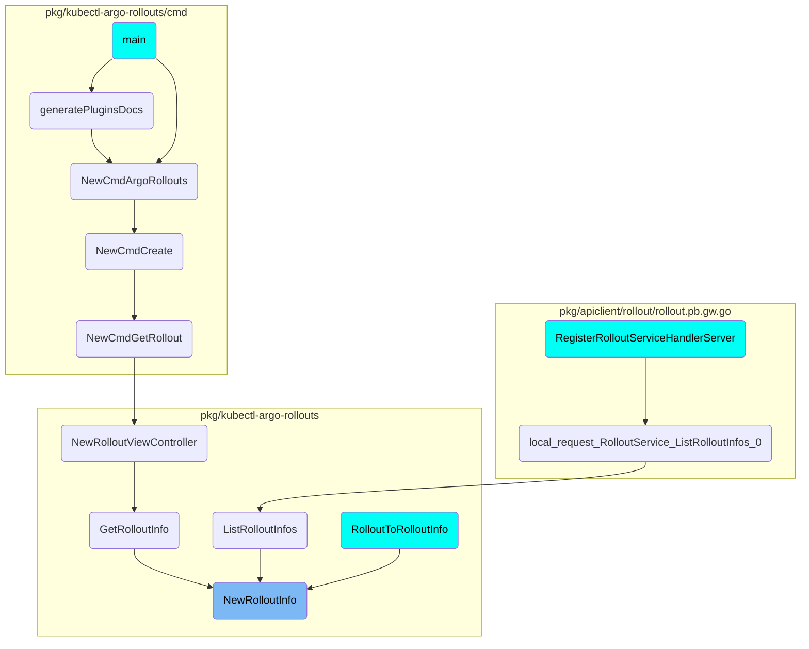

In this document, we will explain the process of gathering and processing information about a rollout. The process involves collecting data from various sources such as <SwmToken path="pkg/kubectl-argo-rollouts/info/rollout_info.go" pos="65:14:14" line-data="				for _, rs := range roInfo.ReplicaSets {">`ReplicaSets`</SwmToken>, Experiments, and <SwmToken path="pkg/kubectl-argo-rollouts/info/experiment_info.go" pos="36:3:3" line-data="	expInfo.AnalysisRuns = getAnalysisRunInfo(exp.UID, allAnalysisRuns)">`AnalysisRuns`</SwmToken>, determining the rollout strategy, and calculating traffic weights.

The flow starts by gathering all relevant information about the rollout, including details about <SwmToken path="pkg/kubectl-argo-rollouts/info/rollout_info.go" pos="65:14:14" line-data="				for _, rs := range roInfo.ReplicaSets {">`ReplicaSets`</SwmToken>, Experiments, and <SwmToken path="pkg/kubectl-argo-rollouts/info/experiment_info.go" pos="36:3:3" line-data="	expInfo.AnalysisRuns = getAnalysisRunInfo(exp.UID, allAnalysisRuns)">`AnalysisRuns`</SwmToken>. It then determines the rollout strategy, whether it's Canary or <SwmToken path="pkg/apis/rollouts/v1alpha1/types.go" pos="947:1:1" line-data="	BlueGreen BlueGreenStatus `json:&quot;blueGreen,omitempty&quot; protobuf:&quot;bytes,16,opt,name=blueGreen&quot;`">`BlueGreen`</SwmToken>, and calculates the desired and actual traffic weights. The process also involves collecting container information and setting the rollout status and message. This comprehensive information helps in understanding the state and progress of the rollout.

# Where is this flow used?

This flow starts from <SwmToken path="/pkg/kubectl-argo-rollouts/info/rollout_info.go" pos="20:2:2" line-data="func NewRolloutInfo(">`NewRolloutInfo`</SwmToken>, and is used multiple times in the codebase as represented in the following diagram:



&nbsp;

# Flow drill down

```mermaid
graph TD;
      subgraph pkgkubectlargorolloutsinfo["pkg/kubectl-argo-rollouts/info"]
dbea8efab7ac04fe02875e2ed672e7f699bd10fd75ba6e31a8ad01b43d41db6f(NewRolloutInfo):::mainFlowStyle --> 68ad6b586ae78f85d42c3fc4d6829ccdd39ab13049e1720a4134f3d52c8244d4(getExperimentInfo):::mainFlowStyle
end

subgraph pkgkubectlargorolloutsinfo["pkg/kubectl-argo-rollouts/info"]
68ad6b586ae78f85d42c3fc4d6829ccdd39ab13049e1720a4134f3d52c8244d4(getExperimentInfo):::mainFlowStyle --> c46faf8b207455af65cd30fb4709602c0d925556d62d11d127ec270f67fd27ca(NewExperimentInfo):::mainFlowStyle
end

subgraph pkgkubectlargorolloutsinfo["pkg/kubectl-argo-rollouts/info"]
c46faf8b207455af65cd30fb4709602c0d925556d62d11d127ec270f67fd27ca(NewExperimentInfo):::mainFlowStyle --> 55369aa5f70c732772bc213503ff1706a2d5afebabe292278e3ee7fbffdd2e1d(getAnalysisRunInfo)
end

subgraph pkgkubectlargorolloutsinfo["pkg/kubectl-argo-rollouts/info"]
c46faf8b207455af65cd30fb4709602c0d925556d62d11d127ec270f67fd27ca(NewExperimentInfo):::mainFlowStyle --> a44798ab395009ba3267d7e54ffe0a0ae20f0e97e43786f10945e174b19304a2(GetReplicaSetInfo):::mainFlowStyle
end

subgraph pkgkubectlargorolloutsinfo["pkg/kubectl-argo-rollouts/info"]
a44798ab395009ba3267d7e54ffe0a0ae20f0e97e43786f10945e174b19304a2(GetReplicaSetInfo):::mainFlowStyle --> 1c47a8441bf75284b2902c425ecbae66fdc00865af9f4162012585b17fc324d5(addPodInfos):::mainFlowStyle
end

subgraph pkgkubectlargorolloutsinfo["pkg/kubectl-argo-rollouts/info"]
1c47a8441bf75284b2902c425ecbae66fdc00865af9f4162012585b17fc324d5(addPodInfos):::mainFlowStyle --> 59eff10790d50b0821785cf217bfbc05a13add11d359d9a4b343d4fdb4060cda(newPodInfo):::mainFlowStyle
end


      classDef mainFlowStyle color:#000000,fill:#7CB9F4
classDef rootsStyle color:#000000,fill:#00FFF4
classDef Style1 color:#000000,fill:#00FFAA
classDef Style2 color:#000000,fill:#FFFF00
classDef Style3 color:#000000,fill:#AA7CB9
```



<SwmSnippet path="/pkg/kubectl-argo-rollouts/info/rollout_info.go" line="20">

---

## <SwmToken path="pkg/kubectl-argo-rollouts/info/rollout_info.go" pos="20:2:2" line-data="func NewRolloutInfo(">`NewRolloutInfo`</SwmToken>

The <SwmToken path="pkg/kubectl-argo-rollouts/info/rollout_info.go" pos="20:2:2" line-data="func NewRolloutInfo(">`NewRolloutInfo`</SwmToken> function aggregates all relevant information about a rollout, including <SwmToken path="pkg/kubectl-argo-rollouts/info/rollout_info.go" pos="65:14:14" line-data="				for _, rs := range roInfo.ReplicaSets {">`ReplicaSets`</SwmToken>, Experiments, and <SwmToken path="pkg/kubectl-argo-rollouts/info/experiment_info.go" pos="36:3:3" line-data="	expInfo.AnalysisRuns = getAnalysisRunInfo(exp.UID, allAnalysisRuns)">`AnalysisRuns`</SwmToken>. It determines the rollout strategy (Canary or <SwmToken path="pkg/apis/rollouts/v1alpha1/types.go" pos="947:1:1" line-data="	BlueGreen BlueGreenStatus `json:&quot;blueGreen,omitempty&quot; protobuf:&quot;bytes,16,opt,name=blueGreen&quot;`">`BlueGreen`</SwmToken>) and calculates the desired and actual weights for traffic management. This function also collects container information and sets the rollout status and message.

```go
func NewRolloutInfo(
	ro *v1alpha1.Rollout,
	allReplicaSets []*appsv1.ReplicaSet,
	allPods []*corev1.Pod,
	allExperiments []*v1alpha1.Experiment,
	allARs []*v1alpha1.AnalysisRun,
	workloadRef *appsv1.Deployment,
) *rollout.RolloutInfo {

	roInfo := rollout.RolloutInfo{
		ObjectMeta: &v1.ObjectMeta{
			Name:              ro.Name,
			Namespace:         ro.Namespace,
			Labels:            ro.Labels,
			Annotations:       ro.Annotations,
			UID:               ro.UID,
			CreationTimestamp: ro.CreationTimestamp,
			ResourceVersion:   ro.ObjectMeta.ResourceVersion,
		},
	}

```

---

</SwmSnippet>

<SwmSnippet path="/pkg/kubectl-argo-rollouts/info/rollout_info.go" line="45">

---

### Handling rollout strategy and status

This section of the <SwmToken path="pkg/kubectl-argo-rollouts/info/rollout_info.go" pos="20:2:2" line-data="func NewRolloutInfo(">`NewRolloutInfo`</SwmToken> function determines the rollout strategy (Canary or <SwmToken path="pkg/apis/rollouts/v1alpha1/types.go" pos="947:1:1" line-data="	BlueGreen BlueGreenStatus `json:&quot;blueGreen,omitempty&quot; protobuf:&quot;bytes,16,opt,name=blueGreen&quot;`">`BlueGreen`</SwmToken>) and calculates the current step and weights. It sets the strategy type, current step, desired weight, and actual weight based on the rollout's status and configuration.

```go
	if ro.Spec.Strategy.Canary != nil {
		roInfo.Strategy = "Canary"
		if ro.Status.CurrentStepIndex != nil && len(ro.Spec.Strategy.Canary.Steps) > 0 {
			roInfo.Step = fmt.Sprintf("%d/%d", *ro.Status.CurrentStepIndex, len(ro.Spec.Strategy.Canary.Steps))
			var steps []*v1alpha1.CanaryStep
			for i := range ro.Spec.Strategy.Canary.Steps {
				steps = append(steps, &ro.Spec.Strategy.Canary.Steps[i])
			}
			roInfo.Steps = steps
		}
		// NOTE that this is desired weight, not the actual current weight
		roInfo.SetWeight = strconv.Itoa(int(replicasetutil.GetCurrentSetWeight(ro)))

		roInfo.ActualWeight = "0"
		currentStep, _ := replicasetutil.GetCurrentCanaryStep(ro)

		if currentStep == nil {
			roInfo.ActualWeight = fmt.Sprintf("%d", weightutil.MaxTrafficWeight(ro))
		} else if ro.Status.AvailableReplicas > 0 {
			if ro.Spec.Strategy.Canary.TrafficRouting == nil {
				for _, rs := range roInfo.ReplicaSets {
```

---

</SwmSnippet>

<SwmSnippet path="/pkg/kubectl-argo-rollouts/info/experiment_info.go" line="40">

---

## <SwmToken path="pkg/kubectl-argo-rollouts/info/experiment_info.go" pos="40:2:2" line-data="func getExperimentInfo(">`getExperimentInfo`</SwmToken>

The <SwmToken path="pkg/kubectl-argo-rollouts/info/experiment_info.go" pos="40:2:2" line-data="func getExperimentInfo(">`getExperimentInfo`</SwmToken> function retrieves information about experiments associated with the rollout. It filters experiments based on ownership and sorts them by revision and creation timestamp. This function helps in understanding the experiments' status and their impact on the rollout.

```go
func getExperimentInfo(
	ro *v1alpha1.Rollout,
	allExperiments []*v1alpha1.Experiment,
	allReplicaSets []*appsv1.ReplicaSet,
	allAnalysisRuns []*v1alpha1.AnalysisRun,
	allPods []*corev1.Pod,
) []*rollout.ExperimentInfo {

	var expInfos []*rollout.ExperimentInfo
	for _, exp := range allExperiments {
		if ownerRef(exp.OwnerReferences, []types.UID{ro.UID}) == nil {
			continue
		}
		expInfo := NewExperimentInfo(exp, allReplicaSets, allAnalysisRuns, allPods)
		expInfos = append(expInfos, expInfo)
	}
	sort.Slice(expInfos[:], func(i, j int) bool {
		if expInfos[i].Revision > expInfos[j].Revision {
			return true
		}
		return expInfos[i].ObjectMeta.CreationTimestamp.Before(&expInfos[j].ObjectMeta.CreationTimestamp)
```

---

</SwmSnippet>

<SwmSnippet path="/pkg/kubectl-argo-rollouts/info/experiment_info.go" line="16">

---

## <SwmToken path="pkg/kubectl-argo-rollouts/info/experiment_info.go" pos="16:2:2" line-data="func NewExperimentInfo(">`NewExperimentInfo`</SwmToken>

The <SwmToken path="pkg/kubectl-argo-rollouts/info/experiment_info.go" pos="16:2:2" line-data="func NewExperimentInfo(">`NewExperimentInfo`</SwmToken> function creates a detailed information object for a given experiment. It includes metadata, status, message, and associated <SwmToken path="pkg/kubectl-argo-rollouts/info/experiment_info.go" pos="35:3:3" line-data="	expInfo.ReplicaSets = GetReplicaSetInfo(exp.UID, nil, allReplicaSets, allPods)">`ReplicaSets`</SwmToken> and <SwmToken path="pkg/kubectl-argo-rollouts/info/experiment_info.go" pos="36:3:3" line-data="	expInfo.AnalysisRuns = getAnalysisRunInfo(exp.UID, allAnalysisRuns)">`AnalysisRuns`</SwmToken>. This function is crucial for understanding the state and progress of experiments within a rollout.

```go
func NewExperimentInfo(
	exp *v1alpha1.Experiment,
	allReplicaSets []*appsv1.ReplicaSet,
	allAnalysisRuns []*v1alpha1.AnalysisRun,
	allPods []*corev1.Pod,
) *rollout.ExperimentInfo {

	expInfo := rollout.ExperimentInfo{
		ObjectMeta: &v1.ObjectMeta{
			Name:              exp.Name,
			Namespace:         exp.Namespace,
			CreationTimestamp: exp.CreationTimestamp,
			UID:               exp.UID,
		},
		Status:  string(exp.Status.Phase),
		Message: exp.Status.Message,
	}
	expInfo.Icon = analysisIcon(exp.Status.Phase)
	expInfo.Revision = int64(parseRevision(exp.ObjectMeta.Annotations))
	expInfo.ReplicaSets = GetReplicaSetInfo(exp.UID, nil, allReplicaSets, allPods)
	expInfo.AnalysisRuns = getAnalysisRunInfo(exp.UID, allAnalysisRuns)
```

---

</SwmSnippet>

<SwmSnippet path="/pkg/kubectl-argo-rollouts/info/analysisrun_info.go" line="15">

---

## <SwmToken path="pkg/kubectl-argo-rollouts/info/analysisrun_info.go" pos="15:2:2" line-data="func getAnalysisRunInfo(ownerUID types.UID, allAnalysisRuns []*v1alpha1.AnalysisRun) []*rollout.AnalysisRunInfo {">`getAnalysisRunInfo`</SwmToken>

The <SwmToken path="pkg/kubectl-argo-rollouts/info/analysisrun_info.go" pos="15:2:2" line-data="func getAnalysisRunInfo(ownerUID types.UID, allAnalysisRuns []*v1alpha1.AnalysisRun) []*rollout.AnalysisRunInfo {">`getAnalysisRunInfo`</SwmToken> function gathers information about analysis runs associated with the rollout. It includes metrics, status, and job information, which are essential for evaluating the success and progress of the analysis runs.

```go
func getAnalysisRunInfo(ownerUID types.UID, allAnalysisRuns []*v1alpha1.AnalysisRun) []*rollout.AnalysisRunInfo {
	var arInfos []*rollout.AnalysisRunInfo
	for _, run := range allAnalysisRuns {
		if ownerRef(run.OwnerReferences, []types.UID{ownerUID}) == nil {
			continue
		}
		arInfo := rollout.AnalysisRunInfo{
			ObjectMeta: &v1.ObjectMeta{
				Name:              run.Name,
				Namespace:         run.Namespace,
				CreationTimestamp: run.CreationTimestamp,
				UID:               run.UID,
			},
		}

		arInfo.SpecAndStatus = &rollout.AnalysisRunSpecAndStatus{
			Spec:   &run.Spec,
			Status: &run.Status,
		}

		if run.Spec.Metrics != nil {
```

---

</SwmSnippet>

<SwmSnippet path="/pkg/kubectl-argo-rollouts/info/replicaset_info.go" line="20">

---

## <SwmToken path="pkg/kubectl-argo-rollouts/info/replicaset_info.go" pos="20:2:2" line-data="func GetReplicaSetInfo(ownerUID types.UID, ro *v1alpha1.Rollout, allReplicaSets []*appsv1.ReplicaSet, allPods []*corev1.Pod) []*rollout.ReplicaSetInfo {">`GetReplicaSetInfo`</SwmToken>

The <SwmToken path="pkg/kubectl-argo-rollouts/info/replicaset_info.go" pos="20:2:2" line-data="func GetReplicaSetInfo(ownerUID types.UID, ro *v1alpha1.Rollout, allReplicaSets []*appsv1.ReplicaSet, allPods []*corev1.Pod) []*rollout.ReplicaSetInfo {">`GetReplicaSetInfo`</SwmToken> function collects information about <SwmToken path="pkg/kubectl-argo-rollouts/info/rollout_info.go" pos="65:14:14" line-data="				for _, rs := range roInfo.ReplicaSets {">`ReplicaSets`</SwmToken> related to the rollout. It includes metadata, status, images, and pod information. This function helps in understanding the state and health of <SwmToken path="pkg/kubectl-argo-rollouts/info/rollout_info.go" pos="65:14:14" line-data="				for _, rs := range roInfo.ReplicaSets {">`ReplicaSets`</SwmToken> within the rollout.

```go
func GetReplicaSetInfo(ownerUID types.UID, ro *v1alpha1.Rollout, allReplicaSets []*appsv1.ReplicaSet, allPods []*corev1.Pod) []*rollout.ReplicaSetInfo {
	var rsInfos []*rollout.ReplicaSetInfo
	for _, rs := range allReplicaSets {
		// if owned by replicaset
		if ownerRef(rs.OwnerReferences, []types.UID{ownerUID}) == nil {
			continue
		}
		rsInfo := &rollout.ReplicaSetInfo{
			ObjectMeta: &v1.ObjectMeta{
				Name:              rs.Name,
				Namespace:         rs.Namespace,
				CreationTimestamp: rs.CreationTimestamp,
				UID:               rs.UID,
			},
			Status:    getReplicaSetHealth(rs),
			Replicas:  rs.Status.Replicas,
			Available: rs.Status.AvailableReplicas,
		}
		rsInfo.Icon = replicaSetIcon(rsInfo.Status)
		rsInfo.Revision = int64(parseRevision(rs.ObjectMeta.Annotations))
		rsInfo.Template = parseExperimentTemplateName(rs.ObjectMeta.Annotations)
```

---

</SwmSnippet>

<SwmSnippet path="/pkg/kubectl-argo-rollouts/info/pod_info.go" line="15">

---

## <SwmToken path="pkg/kubectl-argo-rollouts/info/pod_info.go" pos="15:2:2" line-data="func addPodInfos(rsInfos []*rollout.ReplicaSetInfo, allPods []*corev1.Pod) []*rollout.ReplicaSetInfo {">`addPodInfos`</SwmToken>

The <SwmToken path="pkg/kubectl-argo-rollouts/info/pod_info.go" pos="15:2:2" line-data="func addPodInfos(rsInfos []*rollout.ReplicaSetInfo, allPods []*corev1.Pod) []*rollout.ReplicaSetInfo {">`addPodInfos`</SwmToken> function adds detailed pod information to the <SwmToken path="pkg/kubectl-argo-rollouts/info/rollout_info.go" pos="65:14:14" line-data="				for _, rs := range roInfo.ReplicaSets {">`ReplicaSets`</SwmToken>. It associates pods with their respective <SwmToken path="pkg/kubectl-argo-rollouts/info/rollout_info.go" pos="65:14:14" line-data="				for _, rs := range roInfo.ReplicaSets {">`ReplicaSets`</SwmToken> and sorts them by creation timestamp. This function is important for understanding the state and readiness of pods within the rollout.

```go
func addPodInfos(rsInfos []*rollout.ReplicaSetInfo, allPods []*corev1.Pod) []*rollout.ReplicaSetInfo {
	var uids []types.UID
	uidToRSInfoIdx := make(map[types.UID]int)
	for i, rsInfo := range rsInfos {
		uids = append(uids, rsInfo.ObjectMeta.UID)
		uidToRSInfoIdx[rsInfo.ObjectMeta.UID] = i
	}

	for _, pod := range allPods {
		owner := ownerRef(pod.OwnerReferences, uids)
		if owner == nil {
			continue
		}

		podInfo := newPodInfo(pod)
		idx := uidToRSInfoIdx[owner.UID]
		rsInfos[idx].Pods = append(rsInfos[idx].Pods, &podInfo)
	}

	for _, rsInfo := range rsInfos {
		sort.Slice(rsInfo.Pods[:], func(i, j int) bool {
```

---

</SwmSnippet>

<SwmSnippet path="/pkg/kubectl-argo-rollouts/info/pod_info.go" line="46">

---

## <SwmToken path="pkg/kubectl-argo-rollouts/info/pod_info.go" pos="46:2:2" line-data="func newPodInfo(pod *corev1.Pod) rollout.PodInfo {">`newPodInfo`</SwmToken>

The <SwmToken path="pkg/kubectl-argo-rollouts/info/pod_info.go" pos="46:2:2" line-data="func newPodInfo(pod *corev1.Pod) rollout.PodInfo {">`newPodInfo`</SwmToken> function creates a detailed information object for a given pod. It includes metadata, status, readiness, and restart count. This function is essential for monitoring the health and status of individual pods within the rollout.

```go
func newPodInfo(pod *corev1.Pod) rollout.PodInfo {
	podInfo := rollout.PodInfo{
		ObjectMeta: &v1.ObjectMeta{
			Name:              pod.Name,
			Namespace:         pod.Namespace,
			CreationTimestamp: pod.CreationTimestamp,
			UID:               pod.UID,
		},
	}
	restarts := 0
	totalContainers := len(pod.Spec.Containers)
	readyContainers := 0

	reason := string(pod.Status.Phase)
	if pod.Status.Reason != "" {
		reason = pod.Status.Reason
	}

	initializing := false
	for i, container := range pod.Status.InitContainerStatuses {
		restarts += int(container.RestartCount)
```

---

</SwmSnippet>

# 

*This is an auto-generated document by Swimm 🌊 and has not yet been verified by a human*

<SwmMeta version="3.0.0" repo-id="Z2l0aHViJTNBJTNBaW50dWl0LWFyZ28tcm9sbG91dHMtZGVtbyUzQSUzQVN3aW1tLURlbW8=" repo-name="intuit-argo-rollouts-demo"><sup>Powered by [Swimm](https://app.swimm.io/)</sup></SwmMeta>
