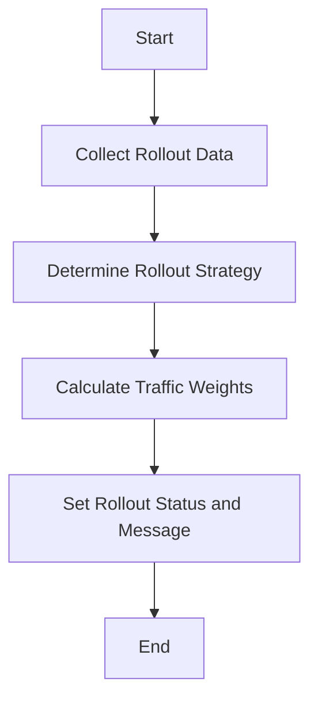

This document will cover the process of gathering and processing rollout information. We'll cover:

1. Collecting rollout data
2. Determining the rollout strategy
3. Calculating traffic weights
4. Setting rollout status and message.

Technical document: <SwmLink doc-title="Gathering and Processing Rollout Information">[Gathering and Processing Rollout Information](/.swm/gathering-and-processing-rollout-information.b77rcuey.sw.md)</SwmLink>

# [Collecting Rollout Data](http://localhost:5001/repos/Z2l0aHViJTNBJTNBaW50dWl0LWFyZ28tcm9sbG91dHMtZGVtbyUzQSUzQVN3aW1tLURlbW8=/docs/b77rcuey#newrolloutinfo)

The process begins by gathering all relevant information about the rollout. This includes details about <SwmToken path="pkg/apiclient/rollout/rollout.pb.go" pos="922:1:1" line-data="	ReplicaSets          []*ReplicaSetInfo  `protobuf:&quot;bytes,6,rep,name=replicaSets,proto3&quot; json:&quot;replicaSets,omitempty&quot;`">`ReplicaSets`</SwmToken>, Experiments, and <SwmToken path="pkg/client/listers/rollouts/v1alpha1/analysisrun.go" pos="35:1:1" line-data="	AnalysisRuns(namespace string) AnalysisRunNamespaceLister">`AnalysisRuns`</SwmToken>. This data collection is essential to understand the current state and history of the rollout. For example, <SwmToken path="pkg/apiclient/rollout/rollout.pb.go" pos="922:1:1" line-data="	ReplicaSets          []*ReplicaSetInfo  `protobuf:&quot;bytes,6,rep,name=replicaSets,proto3&quot; json:&quot;replicaSets,omitempty&quot;`">`ReplicaSets`</SwmToken> provide information about the different versions of the application being deployed, while Experiments and <SwmToken path="pkg/client/listers/rollouts/v1alpha1/analysisrun.go" pos="35:1:1" line-data="	AnalysisRuns(namespace string) AnalysisRunNamespaceLister">`AnalysisRuns`</SwmToken> offer insights into the testing and validation processes that have been conducted.

# [Determining the Rollout Strategy](http://localhost:5001/repos/Z2l0aHViJTNBJTNBaW50dWl0LWFyZ28tcm9sbG91dHMtZGVtbyUzQSUzQVN3aW1tLURlbW8=/docs/b77rcuey#handling-rollout-strategy-and-status)

Next, the system determines the rollout strategy, which can be either Canary or <SwmToken path="pkg/apis/rollouts/v1alpha1/types.go" pos="947:1:1" line-data="	BlueGreen BlueGreenStatus `json:&quot;blueGreen,omitempty&quot; protobuf:&quot;bytes,16,opt,name=blueGreen&quot;`">`BlueGreen`</SwmToken>. This decision is based on the configuration specified in the rollout's settings. The strategy dictates how the new version of the application will be gradually introduced to the users. For instance, a Canary strategy involves incrementally increasing the traffic to the new version, while a <SwmToken path="pkg/apis/rollouts/v1alpha1/types.go" pos="947:1:1" line-data="	BlueGreen BlueGreenStatus `json:&quot;blueGreen,omitempty&quot; protobuf:&quot;bytes,16,opt,name=blueGreen&quot;`">`BlueGreen`</SwmToken> strategy involves switching all traffic to the new version at once.

# [Calculating Traffic Weights](http://localhost:5001/repos/Z2l0aHViJTNBJTNBaW50dWl0LWFyZ28tcm9sbG91dHMtZGVtbyUzQSUzQVN3aW1tLURlbW8=/docs/b77rcuey#handling-rollout-strategy-and-status)

Once the strategy is determined, the system calculates the desired and actual traffic weights. The desired weight represents the target percentage of traffic that should be directed to the new version, while the actual weight indicates the current percentage. These calculations are crucial for ensuring that the rollout progresses smoothly and that any issues can be detected and addressed promptly.

# [Setting Rollout Status and Message](http://localhost:5001/repos/Z2l0aHViJTNBJTNBaW50dWl0LWFyZ28tcm9sbG91dHMtZGVtbyUzQSUzQVN3aW1tLURlbW8=/docs/b77rcuey#newrolloutinfo)

Finally, the system sets the rollout status and message. The status provides a high-level overview of the rollout's progress, such as whether it is in progress, completed, or failed. The message offers additional details, such as any errors encountered or specific actions taken. This information is vital for stakeholders to monitor the rollout and make informed decisions.

&nbsp;

*This is an auto-generated document by Swimm 🌊 and has not yet been verified by a human*

<SwmMeta version="3.0.0" repo-id="Z2l0aHViJTNBJTNBaW50dWl0LWFyZ28tcm9sbG91dHMtZGVtbyUzQSUzQVN3aW1tLURlbW8=" repo-name="intuit-argo-rollouts-demo">Powered by [Swimm](/)</SwmMeta>
