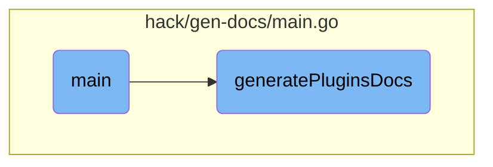

In this document, we will explain the process of generating documentation for notifications and plugins. The process involves orchestrating the documentation generation and calling specific functions to create the necessary documentation.

The flow starts with the main function, which orchestrates the entire documentation generation process. It calls two main functions: one for generating notifications documentation and another for generating plugins documentation. The plugins documentation generation involves initializing options, setting a static configuration directory, generating markdown files, and updating the MkDocs navigation if the files are successfully generated.

# Flow drill down



<SwmSnippet path="/hack/gen-docs/main.go" line="23">

---

## Main Function

The <SwmToken path="hack/gen-docs/main.go" pos="23:2:2" line-data="func main() {">`main`</SwmToken> function orchestrates the documentation generation process. It calls <SwmToken path="hack/gen-docs/main.go" pos="24:1:1" line-data="	generateNotificationsDocs()">`generateNotificationsDocs`</SwmToken> and <SwmToken path="hack/gen-docs/main.go" pos="25:1:1" line-data="	generatePluginsDocs()">`generatePluginsDocs`</SwmToken> to create the necessary documentation for notifications and plugins.

```go
func main() {
	generateNotificationsDocs()
	generatePluginsDocs()
}
```

---

</SwmSnippet>

<SwmSnippet path="/hack/gen-docs/main.go" line="48">

---

## Generating Plugin Documentation

The <SwmToken path="hack/gen-docs/main.go" pos="48:2:2" line-data="func generatePluginsDocs() {">`generatePluginsDocs`</SwmToken> function is responsible for generating the documentation for plugins. It initializes the necessary options and configurations, sets a static configuration directory to ensure consistency across different machines, and then generates the markdown documentation files. If the documentation files are successfully generated, it updates the MkDocs navigation to include the new plugin commands.

```go
func generatePluginsDocs() {
	tf, o := options.NewFakeArgoRolloutsOptions()

	// Set static config dir so that gen docs does not change depending on what machine it is ran on
	configDir := "$HOME/.kube/cache"
	o.ConfigFlags.CacheDir = &configDir

	defer tf.Cleanup()
	cmd := cmd.NewCmdArgoRollouts(o)

	os.RemoveAll("./docs/generated/kubectl-argo-rollouts")
	os.MkdirAll("./docs/generated/kubectl-argo-rollouts/", 0755)
	files, err := GenMarkdownTree(cmd, "./docs/generated/kubectl-argo-rollouts")
	if err != nil {
		log.Fatal(err)
	}
	if files != nil {
		if e := updateMkDocsNav("Kubectl Plugin", "Commands", files); e != nil {
			log.Fatal(e)
		}
	}
```

---

</SwmSnippet>

&nbsp;

*This is an auto-generated document by Swimm 🌊 and has not yet been verified by a human*

<SwmMeta version="3.0.0" repo-id="Z2l0aHViJTNBJTNBaW50dWl0LWFyZ28tcm9sbG91dHMtZGVtbyUzQSUzQVN3aW1tLURlbW8=" repo-name="intuit-argo-rollouts-demo"><sup>Powered by [Swimm](/)</sup></SwmMeta>
