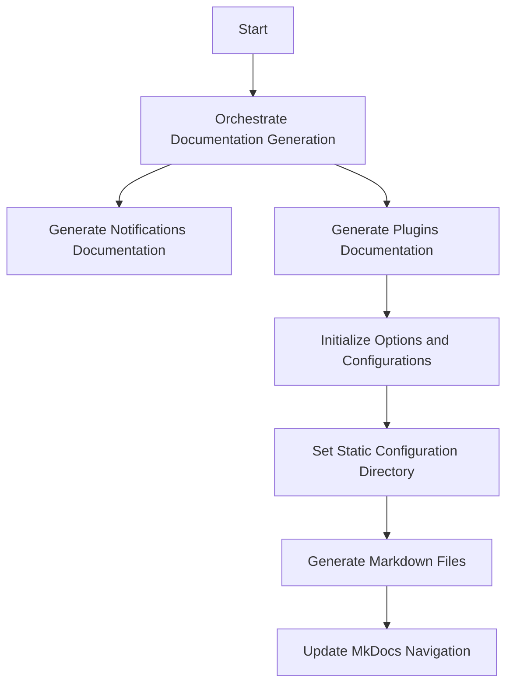

This document will cover the process of generating documentation for notifications and plugins. We'll cover:

1. Orchestrating the documentation generation
2. Generating notifications documentation
3. Generating plugins documentation

Technical document: <SwmLink doc-title="Generating Documentation Flow">[Generating Documentation Flow](/.swm/generating-documentation-flow.d8dockkg.sw.md)</SwmLink>

# [Orchestrating the documentation generation](http://localhost:5001/repos/Z2l0aHViJTNBJTNBaW50dWl0LWFyZ28tcm9sbG91dHMtZGVtbyUzQSUzQVN3aW1tLURlbW8=/docs/d8dockkg#main-function)

The process begins with orchestrating the entire documentation generation. This involves calling two main functions: one for generating notifications documentation and another for generating plugins documentation. This orchestration ensures that both types of documentation are created in a coordinated manner, providing a comprehensive set of documents for the end user.

# [Generating notifications documentation](http://localhost:5001/repos/Z2l0aHViJTNBJTNBaW50dWl0LWFyZ28tcm9sbG91dHMtZGVtbyUzQSUzQVN3aW1tLURlbW8=/docs/d8dockkg#main-function)

The first step in the orchestration is generating the notifications documentation. This function is responsible for creating detailed documentation about the notifications system, which helps users understand how notifications are managed and configured within the system. This documentation is crucial for users who need to set up or troubleshoot notifications.

# [Generating plugins documentation](http://localhost:5001/repos/Z2l0aHViJTNBJTNBaW50dWl0LWFyZ28tcm9sbG91dHMtZGVtbyUzQSUzQVN3aW1tLURlbW8=/docs/d8dockkg#generating-plugin-documentation)

The second step is generating the plugins documentation. This involves several sub-steps:

1. **Initialize Options and Configurations**: This step sets up the necessary options and configurations required for generating the documentation. It ensures that all settings are correctly initialized to avoid inconsistencies.

2. **Set Static Configuration Directory**: A static configuration directory is set to ensure that the documentation generation process is consistent across different machines. This prevents discrepancies that might arise from different environments.

3. **Generate Markdown Files**: The actual documentation files are generated in Markdown format. These files provide detailed information about the plugins, including their usage and configuration.

4. **Update MkDocs Navigation**: Once the Markdown files are successfully generated, the MkDocs navigation is updated to include the new plugin commands. This step ensures that the new documentation is easily accessible through the MkDocs interface, enhancing the user experience.

&nbsp;

*This is an auto-generated document by Swimm 🌊 and has not yet been verified by a human*

<SwmMeta version="3.0.0" repo-id="Z2l0aHViJTNBJTNBaW50dWl0LWFyZ28tcm9sbG91dHMtZGVtbyUzQSUzQVN3aW1tLURlbW8=" repo-name="intuit-argo-rollouts-demo">Powered by [Swimm](/)</SwmMeta>
