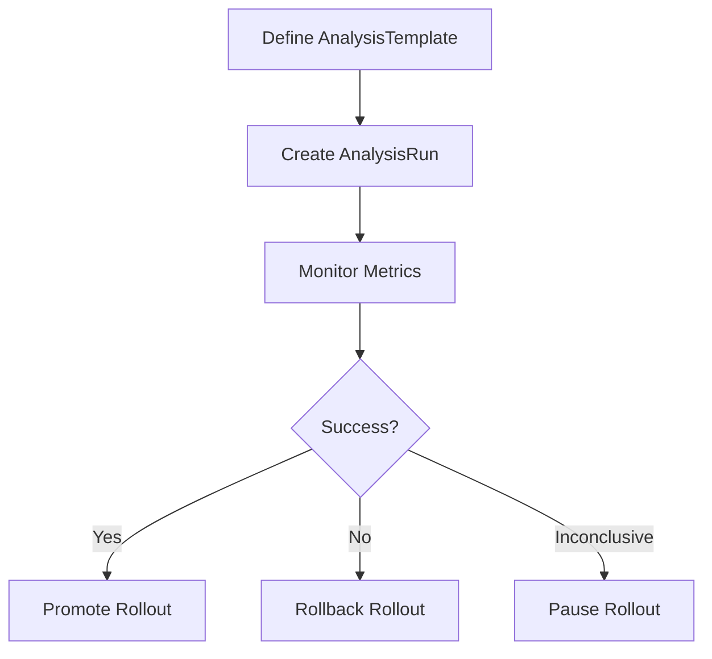

# Getting Started with <SwmToken path="pkg/client/clientset/versioned/typed/rollouts/v1alpha1/analysistemplate.go" pos="67:36:36" line-data="func (c *analysisTemplates) Get(ctx context.Context, name string, options v1.GetOptions) (result *v1alpha1.AnalysisTemplate, err error) {">`AnalysisTemplate`</SwmToken> in Clientset

The <SwmToken path="pkg/client/clientset/versioned/typed/rollouts/v1alpha1/analysistemplate.go" pos="67:36:36" line-data="func (c *analysisTemplates) Get(ctx context.Context, name string, options v1.GetOptions) (result *v1alpha1.AnalysisTemplate, err error) {">`AnalysisTemplate`</SwmToken> in the Clientset is a resource that defines the metrics to be queried during a rollout. It contains instructions on what metrics to query and the expected results for those metrics. The <SwmToken path="pkg/client/clientset/versioned/typed/rollouts/v1alpha1/analysistemplate.go" pos="67:36:36" line-data="func (c *analysisTemplates) Get(ctx context.Context, name string, options v1.GetOptions) (result *v1alpha1.AnalysisTemplate, err error) {">`AnalysisTemplate`</SwmToken> can be defined on a specific rollout or globally on the cluster to be shared by multiple rollouts as a <SwmToken path="pkg/apis/rollouts/v1alpha1/analysis_types.go" pos="19:2:2" line-data="type ClusterAnalysisTemplate struct {">`ClusterAnalysisTemplate`</SwmToken>.

## <SwmToken path="pkg/client/clientset/versioned/typed/rollouts/v1alpha1/analysistemplate.go" pos="33:16:16" line-data="// AnalysisTemplatesGetter has a method to return a AnalysisTemplateInterface.">`AnalysisTemplateInterface`</SwmToken>

The <SwmToken path="pkg/client/clientset/versioned/typed/rollouts/v1alpha1/analysistemplate.go" pos="33:16:16" line-data="// AnalysisTemplatesGetter has a method to return a AnalysisTemplateInterface.">`AnalysisTemplateInterface`</SwmToken> in the Clientset provides methods to create, update, delete, get, list, watch, and patch <SwmToken path="pkg/client/clientset/versioned/typed/rollouts/v1alpha1/analysistemplate.go" pos="67:36:36" line-data="func (c *analysisTemplates) Get(ctx context.Context, name string, options v1.GetOptions) (result *v1alpha1.AnalysisTemplate, err error) {">`AnalysisTemplate`</SwmToken> resources. The <SwmToken path="pkg/client/clientset/versioned/typed/rollouts/v1alpha1/analysistemplate.go" pos="67:6:6" line-data="func (c *analysisTemplates) Get(ctx context.Context, name string, options v1.GetOptions) (result *v1alpha1.AnalysisTemplate, err error) {">`analysisTemplates`</SwmToken> struct implements the <SwmToken path="pkg/client/clientset/versioned/typed/rollouts/v1alpha1/analysistemplate.go" pos="33:16:16" line-data="// AnalysisTemplatesGetter has a method to return a AnalysisTemplateInterface.">`AnalysisTemplateInterface`</SwmToken> and interacts with the Kubernetes API server to manage <SwmToken path="pkg/client/clientset/versioned/typed/rollouts/v1alpha1/analysistemplate.go" pos="67:36:36" line-data="func (c *analysisTemplates) Get(ctx context.Context, name string, options v1.GetOptions) (result *v1alpha1.AnalysisTemplate, err error) {">`AnalysisTemplate`</SwmToken> resources. The <SwmToken path="pkg/client/clientset/versioned/typed/rollouts/v1alpha1/analysistemplate.go" pos="58:2:2" line-data="// newAnalysisTemplates returns a AnalysisTemplates">`newAnalysisTemplates`</SwmToken> function returns an instance of <SwmToken path="pkg/client/clientset/versioned/typed/rollouts/v1alpha1/analysistemplate.go" pos="67:6:6" line-data="func (c *analysisTemplates) Get(ctx context.Context, name string, options v1.GetOptions) (result *v1alpha1.AnalysisTemplate, err error) {">`analysisTemplates`</SwmToken> which is used to perform operations on <SwmToken path="pkg/client/clientset/versioned/typed/rollouts/v1alpha1/analysistemplate.go" pos="67:36:36" line-data="func (c *analysisTemplates) Get(ctx context.Context, name string, options v1.GetOptions) (result *v1alpha1.AnalysisTemplate, err error) {">`AnalysisTemplate`</SwmToken> resources within a specified namespace.

## Defining an <SwmToken path="pkg/client/clientset/versioned/typed/rollouts/v1alpha1/analysistemplate.go" pos="67:36:36" line-data="func (c *analysisTemplates) Get(ctx context.Context, name string, options v1.GetOptions) (result *v1alpha1.AnalysisTemplate, err error) {">`AnalysisTemplate`</SwmToken>

An <SwmToken path="pkg/client/clientset/versioned/typed/rollouts/v1alpha1/analysistemplate.go" pos="67:36:36" line-data="func (c *analysisTemplates) Get(ctx context.Context, name string, options v1.GetOptions) (result *v1alpha1.AnalysisTemplate, err error) {">`AnalysisTemplate`</SwmToken> is defined using a YAML file where you specify the metrics to be monitored, the interval for checking these metrics, and the conditions for success or failure. For example, you can define a success rate metric with a success condition of <SwmToken path="pkg/client/clientset/versioned/typed/rollouts/v1alpha1/analysistemplate.go" pos="67:31:31" line-data="func (c *analysisTemplates) Get(ctx context.Context, name string, options v1.GetOptions) (result *v1alpha1.AnalysisTemplate, err error) {">`result`</SwmToken>` >= 0.95` and a failure limit of 3.

## Creating an <SwmToken path="pkg/apis/rollouts/v1alpha1/analysis_types.go" pos="367:2:2" line-data="type AnalysisRun struct {">`AnalysisRun`</SwmToken>

Once an <SwmToken path="pkg/client/clientset/versioned/typed/rollouts/v1alpha1/analysistemplate.go" pos="67:36:36" line-data="func (c *analysisTemplates) Get(ctx context.Context, name string, options v1.GetOptions) (result *v1alpha1.AnalysisTemplate, err error) {">`AnalysisTemplate`</SwmToken> is defined, you can create an <SwmToken path="pkg/apis/rollouts/v1alpha1/analysis_types.go" pos="367:2:2" line-data="type AnalysisRun struct {">`AnalysisRun`</SwmToken> from it. This involves using the `kubectl `<SwmToken path="pkg/client/clientset/versioned/typed/rollouts/v1alpha1/analysistemplate.go" pos="25:10:10" line-data="	v1alpha1 &quot;github.com/argoproj/argo-rollouts/pkg/apis/rollouts/v1alpha1&quot;">`argo`</SwmToken>` `<SwmToken path="pkg/client/clientset/versioned/typed/rollouts/v1alpha1/rollout.go" pos="54:2:2" line-data="type rollouts struct {">`rollouts`</SwmToken>` `<SwmToken path="utils/ingress/wrapper.go" pos="507:9:9" line-data="func (w *IngressWrap) create(ctx context.Context, namespace string, ingress *v1.Ingress, opts metav1.CreateOptions) (*Ingress, error) {">`create`</SwmToken>` analysisrun` command, which instantiates the <SwmToken path="pkg/client/clientset/versioned/typed/rollouts/v1alpha1/analysistemplate.go" pos="67:36:36" line-data="func (c *analysisTemplates) Get(ctx context.Context, name string, options v1.GetOptions) (result *v1alpha1.AnalysisTemplate, err error) {">`AnalysisTemplate`</SwmToken> and begins monitoring the specified metrics.



## Main Functions

There are several main functions in this folder. Some of them are Create, Update, Delete, Get, and List. We will dive a little into Create and Update.

<SwmSnippet path="/pkg/client/clientset/versioned/typed/rollouts/v1alpha1/analysistemplate.go" line="111">

---

### Create

The <SwmToken path="pkg/client/clientset/versioned/typed/rollouts/v1alpha1/analysistemplate.go" pos="111:2:2" line-data="// Create takes the representation of a analysisTemplate and creates it.  Returns the server&#39;s representation of the analysisTemplate, and an error, if there is any.">`Create`</SwmToken> function takes the representation of an <SwmToken path="pkg/client/clientset/versioned/typed/rollouts/v1alpha1/analysistemplate.go" pos="112:23:23" line-data="func (c *analysisTemplates) Create(ctx context.Context, analysisTemplate *v1alpha1.AnalysisTemplate, opts v1.CreateOptions) (result *v1alpha1.AnalysisTemplate, err error) {">`AnalysisTemplate`</SwmToken> and creates it. It returns the server's representation of the <SwmToken path="pkg/client/clientset/versioned/typed/rollouts/v1alpha1/analysistemplate.go" pos="112:23:23" line-data="func (c *analysisTemplates) Create(ctx context.Context, analysisTemplate *v1alpha1.AnalysisTemplate, opts v1.CreateOptions) (result *v1alpha1.AnalysisTemplate, err error) {">`AnalysisTemplate`</SwmToken> and an error if there is any.

```go
// Create takes the representation of a analysisTemplate and creates it.  Returns the server's representation of the analysisTemplate, and an error, if there is any.
func (c *analysisTemplates) Create(ctx context.Context, analysisTemplate *v1alpha1.AnalysisTemplate, opts v1.CreateOptions) (result *v1alpha1.AnalysisTemplate, err error) {
	result = &v1alpha1.AnalysisTemplate{}
	err = c.client.Post().
		Namespace(c.ns).
		Resource("analysistemplates").
		VersionedParams(&opts, scheme.ParameterCodec).
		Body(analysisTemplate).
		Do(ctx).
		Into(result)
	return
}
```

---

</SwmSnippet>

<SwmSnippet path="/pkg/client/clientset/versioned/typed/rollouts/v1alpha1/analysistemplate.go" line="124">

---

### Update

The <SwmToken path="pkg/client/clientset/versioned/typed/rollouts/v1alpha1/analysistemplate.go" pos="124:2:2" line-data="// Update takes the representation of a analysisTemplate and updates it. Returns the server&#39;s representation of the analysisTemplate, and an error, if there is any.">`Update`</SwmToken> function takes the representation of an <SwmToken path="pkg/client/clientset/versioned/typed/rollouts/v1alpha1/analysistemplate.go" pos="125:23:23" line-data="func (c *analysisTemplates) Update(ctx context.Context, analysisTemplate *v1alpha1.AnalysisTemplate, opts v1.UpdateOptions) (result *v1alpha1.AnalysisTemplate, err error) {">`AnalysisTemplate`</SwmToken> and updates it. It returns the server's representation of the <SwmToken path="pkg/client/clientset/versioned/typed/rollouts/v1alpha1/analysistemplate.go" pos="125:23:23" line-data="func (c *analysisTemplates) Update(ctx context.Context, analysisTemplate *v1alpha1.AnalysisTemplate, opts v1.UpdateOptions) (result *v1alpha1.AnalysisTemplate, err error) {">`AnalysisTemplate`</SwmToken> and an error if there is any.

```go
// Update takes the representation of a analysisTemplate and updates it. Returns the server's representation of the analysisTemplate, and an error, if there is any.
func (c *analysisTemplates) Update(ctx context.Context, analysisTemplate *v1alpha1.AnalysisTemplate, opts v1.UpdateOptions) (result *v1alpha1.AnalysisTemplate, err error) {
	result = &v1alpha1.AnalysisTemplate{}
	err = c.client.Put().
		Namespace(c.ns).
		Resource("analysistemplates").
		Name(analysisTemplate.Name).
		VersionedParams(&opts, scheme.ParameterCodec).
		Body(analysisTemplate).
		Do(ctx).
		Into(result)
	return
}
```

---

</SwmSnippet>

<SwmSnippet path="/pkg/client/clientset/versioned/typed/rollouts/v1alpha1/analysistemplate.go" line="138">

---

### Delete

The <SwmToken path="pkg/client/clientset/versioned/typed/rollouts/v1alpha1/analysistemplate.go" pos="138:2:2" line-data="// Delete takes name of the analysisTemplate and deletes it. Returns an error if one occurs.">`Delete`</SwmToken> function takes the name of the <SwmToken path="pkg/client/clientset/versioned/typed/rollouts/v1alpha1/analysistemplate.go" pos="67:36:36" line-data="func (c *analysisTemplates) Get(ctx context.Context, name string, options v1.GetOptions) (result *v1alpha1.AnalysisTemplate, err error) {">`AnalysisTemplate`</SwmToken> and deletes it. It returns an error if one occurs.

```go
// Delete takes name of the analysisTemplate and deletes it. Returns an error if one occurs.
func (c *analysisTemplates) Delete(ctx context.Context, name string, opts v1.DeleteOptions) error {
	return c.client.Delete().
		Namespace(c.ns).
		Resource("analysistemplates").
		Name(name).
		Body(&opts).
		Do(ctx).
		Error()
}
```

---

</SwmSnippet>

<SwmSnippet path="/pkg/client/clientset/versioned/typed/rollouts/v1alpha1/analysistemplate.go" line="66">

---

### Get

The <SwmToken path="pkg/client/clientset/versioned/typed/rollouts/v1alpha1/analysistemplate.go" pos="66:2:2" line-data="// Get takes name of the analysisTemplate, and returns the corresponding analysisTemplate object, and an error if there is any.">`Get`</SwmToken> function takes the name of the <SwmToken path="pkg/client/clientset/versioned/typed/rollouts/v1alpha1/analysistemplate.go" pos="67:36:36" line-data="func (c *analysisTemplates) Get(ctx context.Context, name string, options v1.GetOptions) (result *v1alpha1.AnalysisTemplate, err error) {">`AnalysisTemplate`</SwmToken> and returns the corresponding <SwmToken path="pkg/client/clientset/versioned/typed/rollouts/v1alpha1/analysistemplate.go" pos="67:36:36" line-data="func (c *analysisTemplates) Get(ctx context.Context, name string, options v1.GetOptions) (result *v1alpha1.AnalysisTemplate, err error) {">`AnalysisTemplate`</SwmToken> object and an error if there is any.

```go
// Get takes name of the analysisTemplate, and returns the corresponding analysisTemplate object, and an error if there is any.
func (c *analysisTemplates) Get(ctx context.Context, name string, options v1.GetOptions) (result *v1alpha1.AnalysisTemplate, err error) {
	result = &v1alpha1.AnalysisTemplate{}
	err = c.client.Get().
		Namespace(c.ns).
		Resource("analysistemplates").
		Name(name).
		VersionedParams(&options, scheme.ParameterCodec).
		Do(ctx).
		Into(result)
	return
}
```

---

</SwmSnippet>

<SwmSnippet path="/pkg/client/clientset/versioned/typed/rollouts/v1alpha1/analysistemplate.go" line="79">

---

### List

The `List` function takes label and field selectors and returns the list of <SwmToken path="pkg/client/clientset/versioned/typed/rollouts/v1alpha1/analysistemplate.go" pos="79:25:25" line-data="// List takes label and field selectors, and returns the list of AnalysisTemplates that match those selectors.">`AnalysisTemplates`</SwmToken> that match those selectors.

```go
// List takes label and field selectors, and returns the list of AnalysisTemplates that match those selectors.
func (c *analysisTemplates) List(ctx context.Context, opts v1.ListOptions) (result *v1alpha1.AnalysisTemplateList, err error) {
	var timeout time.Duration
	if opts.TimeoutSeconds != nil {
		timeout = time.Duration(*opts.TimeoutSeconds) * time.Second
	}
	result = &v1alpha1.AnalysisTemplateList{}
	err = c.client.Get().
		Namespace(c.ns).
		Resource("analysistemplates").
		VersionedParams(&opts, scheme.ParameterCodec).
		Timeout(timeout).
		Do(ctx).
		Into(result)
	return
}
```

---

</SwmSnippet>

&nbsp;

*This is an auto-generated document by Swimm 🌊 and has not yet been verified by a human*

<SwmMeta version="3.0.0" repo-id="Z2l0aHViJTNBJTNBaW50dWl0LWFyZ28tcm9sbG91dHMtZGVtbyUzQSUzQVN3aW1tLURlbW8=" repo-name="intuit-argo-rollouts-demo"><sup>Powered by [Swimm](/)</sup></SwmMeta>
