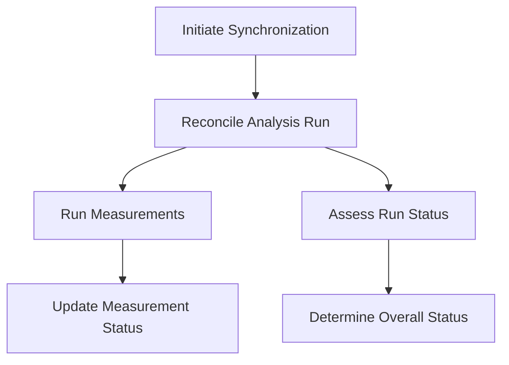

This document will cover the process of handling an analysis run, which includes:

1. Initiating synchronization
2. Reconciling the analysis run
3. Running measurements
4. Assessing the run status.

Technical document: <SwmLink doc-title="Handling an Analysis Run">[Handling an Analysis Run](/.swm/handling-an-analysis-run.j909bfeq.sw.md)</SwmLink>

# [Initiating Synchronization](http://localhost:5001/repos/Z2l0aHViJTNBJTNBaW50dWl0LWFyZ28tcm9sbG91dHMtZGVtbyUzQSUzQVN3aW1tLURlbW8=/docs/j909bfeq#synchandler)

The process begins with initiating synchronization. This step involves fetching the details of the analysis run. If the analysis run is marked for deletion, it is skipped. Otherwise, the system proceeds to reconcile the analysis run. This ensures that only active analysis runs are processed, maintaining system efficiency and accuracy.

# [Reconciling the Analysis Run](http://localhost:5001/repos/Z2l0aHViJTNBJTNBaW50dWl0LWFyZ28tcm9sbG91dHMtZGVtbyUzQSUzQVN3aW1tLURlbW8=/docs/j909bfeq#reconcileanalysisrun)

Reconciliation is the core step where the system checks the status of the analysis run. If the run is completed, it handles any necessary cleanup. If not, it resolves the metrics and validates them. This step is crucial for ensuring that the analysis run is up-to-date and all metrics are correctly identified and prepared for measurement.

# [Running Measurements](http://localhost:5001/repos/Z2l0aHViJTNBJTNBaW50dWl0LWFyZ28tcm9sbG91dHMtZGVtbyUzQSUzQVN3aW1tLURlbW8=/docs/j909bfeq#running-measurements)

In this step, the system executes the necessary measurements for each metric. It handles the parallel execution of tasks and updates the status of each metric based on the results. This ensures that all measurements are performed accurately and efficiently, providing reliable data for the analysis run.

# [Assessing the Run Status](http://localhost:5001/repos/Z2l0aHViJTNBJTNBaW50dWl0LWFyZ28tcm9sbG91dHMtZGVtbyUzQSUzQVN3aW1tLURlbW8=/docs/j909bfeq#assessrunstatus)

Finally, the system assesses the overall status of the analysis run by examining the status of individual metrics. If any metric is still running, the analysis run is considered ongoing. Once all metrics are completed, the system determines the worst status among them and sets it as the overall status. This step ensures that the analysis run accurately reflects the outcome of all its metrics, providing a clear and comprehensive result.

&nbsp;

*This is an auto-generated document by Swimm 🌊 and has not yet been verified by a human*

<SwmMeta version="3.0.0" repo-id="Z2l0aHViJTNBJTNBaW50dWl0LWFyZ28tcm9sbG91dHMtZGVtbyUzQSUzQVN3aW1tLURlbW8=" repo-name="intuit-argo-rollouts-demo">Powered by [Swimm](/)</SwmMeta>
