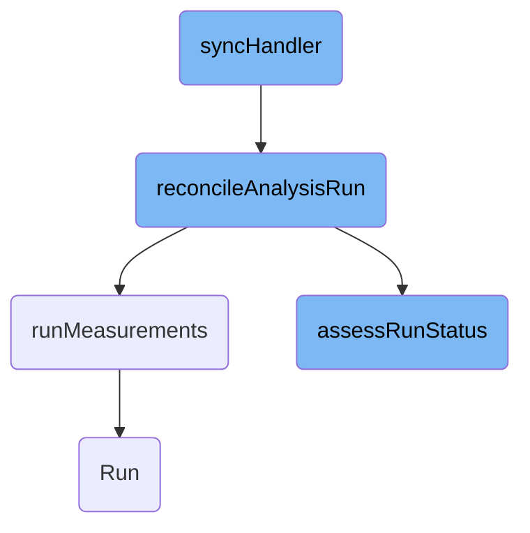

In this document, we will explain the process of handling an analysis run. The process involves initiating synchronization, reconciling the analysis run, running measurements, and assessing the run status.

The flow starts with initiating the synchronization process, where the system fetches the analysis run details. Next, it reconciles the analysis run by checking its status and resolving metrics. Then, it runs the necessary measurements and updates their status. Finally, it assesses the overall status of the analysis run based on the results of the measurements.

# Flow drill down



<SwmSnippet path="/analysis/controller.go" line="165">

---

## <SwmToken path="analysis/controller.go" pos="165:9:9" line-data="func (c *Controller) syncHandler(ctx context.Context, key string) error {">`syncHandler`</SwmToken>

The <SwmToken path="analysis/controller.go" pos="165:9:9" line-data="func (c *Controller) syncHandler(ctx context.Context, key string) error {">`syncHandler`</SwmToken> function is responsible for initiating the synchronization process for an analysis run. It starts by extracting the namespace and name from the provided key and fetching the corresponding analysis run. If the analysis run is marked for deletion, it skips further processing. Otherwise, it calls <SwmToken path="analysis/analysis.go" pos="43:9:9" line-data="func (c *Controller) reconcileAnalysisRun(origRun *v1alpha1.AnalysisRun) *v1alpha1.AnalysisRun {">`reconcileAnalysisRun`</SwmToken> to handle the core reconciliation logic and then persists the updated status.

```go
func (c *Controller) syncHandler(ctx context.Context, key string) error {
	startTime := timeutil.Now()
	namespace, name, err := cache.SplitMetaNamespaceKey(key)
	if err != nil {
		return err
	}
	log.WithField(logutil.AnalysisRunKey, name).WithField(logutil.NamespaceKey, namespace).Infof("Started syncing Analysis at (%v)", startTime)
	run, err := c.analysisRunLister.AnalysisRuns(namespace).Get(name)
	if k8serrors.IsNotFound(err) {
		log.WithField(logutil.AnalysisRunKey, name).WithField(logutil.NamespaceKey, namespace).Info("Analysis has been deleted")
		return nil
	}
	if err != nil {
		return err
	}

	defer func() {
		duration := time.Since(startTime)
		c.metricsServer.IncAnalysisRunReconcile(run, duration)
		logCtx := logutil.WithAnalysisRun(run).WithField("time_ms", duration.Seconds()*1e3)
		logCtx.Info("Reconciliation completed")
```

---

</SwmSnippet>

<SwmSnippet path="/analysis/analysis.go" line="43">

---

## <SwmToken path="analysis/analysis.go" pos="43:9:9" line-data="func (c *Controller) reconcileAnalysisRun(origRun *v1alpha1.AnalysisRun) *v1alpha1.AnalysisRun {">`reconcileAnalysisRun`</SwmToken>

The <SwmToken path="analysis/analysis.go" pos="43:9:9" line-data="func (c *Controller) reconcileAnalysisRun(origRun *v1alpha1.AnalysisRun) *v1alpha1.AnalysisRun {">`reconcileAnalysisRun`</SwmToken> function performs the main reconciliation logic for an analysis run. It first checks if the analysis run is completed and handles garbage collection if necessary. It then resolves metrics, validates them, and generates tasks for measurement. The function calls <SwmToken path="analysis/analysis.go" pos="311:2:2" line-data="// runMeasurements iterates a list of metric tasks, and runs, resumes, or terminates measurements">`runMeasurements`</SwmToken> to execute these tasks and <SwmToken path="analysis/analysis.go" pos="429:2:2" line-data="// assessRunStatus assesses the overall status of this AnalysisRun">`assessRunStatus`</SwmToken> to determine the overall status of the analysis run. Finally, it schedules the next reconciliation if needed.

```go
func (c *Controller) reconcileAnalysisRun(origRun *v1alpha1.AnalysisRun) *v1alpha1.AnalysisRun {
	logger := logutil.WithAnalysisRun(origRun)
	if origRun.Status.Phase.Completed() {
		err := c.maybeGarbageCollectAnalysisRun(origRun, logger)
		if err != nil {
			// TODO(jessesuen): surface errors to controller so they can be retried
			logger.Warnf("Failed to garbage collect analysis run: %v", err)
		}
		return origRun
	}
	run := origRun.DeepCopy()

	if run.Status.MetricResults == nil {
		run.Status.MetricResults = make([]v1alpha1.MetricResult, 0)
	}

	resolvedMetrics, err := getResolvedMetricsWithoutSecrets(run.Spec.Metrics, run.Spec.Args)
	if err != nil {
		message := fmt.Sprintf("Unable to resolve metric arguments: %v", err)
		logger.Warn(message)
		run.Status.Phase = v1alpha1.AnalysisPhaseError
```

---

</SwmSnippet>

<SwmSnippet path="/analysis/analysis.go" line="311">

---

### Running Measurements

The <SwmToken path="analysis/analysis.go" pos="311:2:2" line-data="// runMeasurements iterates a list of metric tasks, and runs, resumes, or terminates measurements">`runMeasurements`</SwmToken> function iterates over a list of metric tasks and executes, resumes, or terminates measurements as needed. It handles parallel execution of tasks and updates the status of each metric based on the results. This function ensures that all measurements are performed and their results are recorded accurately.

```go
// runMeasurements iterates a list of metric tasks, and runs, resumes, or terminates measurements
func (c *Controller) runMeasurements(run *v1alpha1.AnalysisRun, tasks []metricTask, dryRunMetricsMap map[string]bool) error {
	var wg sync.WaitGroup
	// resultsLock should be held whenever we are accessing or setting status.metricResults since
	// we are performing queries in parallel
	var resultsLock sync.Mutex
	terminating := analysisutil.IsTerminating(run)

	// resolve args for metric tasks
	// get list of secret values for log redaction
	tasks, secrets, err := c.resolveArgs(tasks, run.Spec.Args, run.Namespace)
	if err != nil {
		return err
	}

	for _, task := range tasks {
		wg.Add(1)

		go func(t metricTask) error {
			defer wg.Done()
			//redact secret values from logs
```

---

</SwmSnippet>

<SwmSnippet path="/analysis/analysis.go" line="429">

---

## <SwmToken path="analysis/analysis.go" pos="429:2:2" line-data="// assessRunStatus assesses the overall status of this AnalysisRun">`assessRunStatus`</SwmToken>

The <SwmToken path="analysis/analysis.go" pos="429:2:2" line-data="// assessRunStatus assesses the overall status of this AnalysisRun">`assessRunStatus`</SwmToken> function evaluates the overall status of an analysis run by examining the status of individual metrics. If any metric is still running, the analysis run is considered ongoing. Once all metrics are completed, the function determines the worst status among them and sets it as the overall status. This ensures that the analysis run accurately reflects the outcome of all its metrics.

```go
// assessRunStatus assesses the overall status of this AnalysisRun
// If any metric is not yet completed, the AnalysisRun is still considered Running
// Once all metrics are complete, the worst status is used as the overall AnalysisRun status
func (c *Controller) assessRunStatus(run *v1alpha1.AnalysisRun, metrics []v1alpha1.Metric, dryRunMetricsMap map[string]bool) (v1alpha1.AnalysisPhase, string) {
	var worstStatus v1alpha1.AnalysisPhase
	var worstMessage string
	terminating := analysisutil.IsTerminating(run)
	everythingCompleted := true

	if run.Status.StartedAt == nil {
		now := timeutil.MetaNow()
		run.Status.StartedAt = &now
	}
	if run.Spec.Terminate {
		worstMessage = "Run Terminated"
	}

	// Initialize Run & Dry-Run summary object
	runSummary := v1alpha1.RunSummary{
		Count:        0,
		Successful:   0,
```

---

</SwmSnippet>

<SwmSnippet path="/analysis/controller.go" line="146">

---

## Run

The <SwmToken path="analysis/controller.go" pos="146:9:9" line-data="func (c *Controller) Run(ctx context.Context, threadiness int) error {">`Run`</SwmToken> function starts the analysis workers that process analysis runs. It creates a specified number of worker goroutines that continuously fetch and process items from the work queue using the <SwmToken path="analysis/controller.go" pos="152:20:20" line-data="			controllerutil.RunWorker(ctx, c.analysisRunWorkQueue, logutil.AnalysisRunKey, c.syncHandler, c.metricsServer)">`syncHandler`</SwmToken> function. This function ensures that the analysis runs are processed concurrently and efficiently.

```go
func (c *Controller) Run(ctx context.Context, threadiness int) error {
	log.Info("Starting analysis workers")
	wg := sync.WaitGroup{}
	for i := 0; i < threadiness; i++ {
		wg.Add(1)
		go wait.Until(func() {
			controllerutil.RunWorker(ctx, c.analysisRunWorkQueue, logutil.AnalysisRunKey, c.syncHandler, c.metricsServer)
			log.Debug("Analysis worker has stopped")
			wg.Done()
		}, time.Second, ctx.Done())
	}
	log.Infof("Started %d analysis workers", threadiness)
	<-ctx.Done()
	wg.Wait()
	log.Info("All analysis workers have stopped")

	return nil
}
```

---

</SwmSnippet>

&nbsp;

*This is an auto-generated document by Swimm 🌊 and has not yet been verified by a human*

<SwmMeta version="3.0.0" repo-id="Z2l0aHViJTNBJTNBaW50dWl0LWFyZ28tcm9sbG91dHMtZGVtbyUzQSUzQVN3aW1tLURlbW8=" repo-name="intuit-argo-rollouts-demo"><sup>Powered by [Swimm](/)</sup></SwmMeta>
