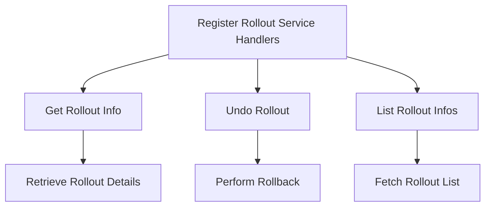

This document will cover the process of handling rollout requests, which includes:

1. Registering Rollout Service Handlers
2. Handling Get Rollout Info Requests
3. Handling Undo Rollout Requests
4. Listing Rollout Infos

Technical document: <SwmLink doc-title="Handling Rollout Requests">[Handling Rollout Requests](/.swm/handling-rollout-requests.p2k21voi.sw.md)</SwmLink>

# [Registering Rollout Service Handlers](http://localhost:5001/repos/Z2l0aHViJTNBJTNBaW50dWl0LWFyZ28tcm9sbG91dHMtZGVtbyUzQSUzQVN3aW1tLURlbW8=/docs/p2k21voi#registering-rollout-service-handlers)

The process begins by registering HTTP handlers for various rollout-related requests. This step maps different HTTP endpoints to corresponding service methods, enabling the handling of requests such as getting rollout information, undoing rollouts, and listing rollouts. This registration ensures that the system can respond to user requests related to rollouts.

# [Handling Get Rollout Info Requests](http://localhost:5001/repos/Z2l0aHViJTNBJTNBaW50dWl0LWFyZ28tcm9sbG91dHMtZGVtbyUzQSUzQVN3aW1tLURlbW8=/docs/p2k21voi#handling-get-rollout-info-requests)

When a request to get rollout information is received, the system extracts the necessary parameters, such as the namespace and name of the rollout. These parameters are then validated to ensure they are correct and complete. Once validated, the system retrieves the rollout details, which include information about the rollout's status, strategy, and associated resources like <SwmToken path="pkg/apiclient/rollout/rollout.pb.go" pos="922:1:1" line-data="	ReplicaSets          []*ReplicaSetInfo  `protobuf:&quot;bytes,6,rep,name=replicaSets,proto3&quot; json:&quot;replicaSets,omitempty&quot;`">`ReplicaSets`</SwmToken> and Pods. This information is then compiled and returned to the user.

# [Handling Undo Rollout Requests](http://localhost:5001/repos/Z2l0aHViJTNBJTNBaW50dWl0LWFyZ28tcm9sbG91dHMtZGVtbyUzQSUzQVN3aW1tLURlbW8=/docs/p2k21voi#handling-undo-rollout-requests)

For undoing a rollout, the system decodes the request body to extract the necessary parameters, such as the namespace and the specific rollout to be undone. These parameters are validated to ensure they are correct. The system then performs the rollback by interacting with the Kubernetes client to revert the rollout to a previous revision. After the rollback is completed, the updated rollout status is retrieved and returned to the user.

# [Listing Rollout Infos](http://localhost:5001/repos/Z2l0aHViJTNBJTNBaW50dWl0LWFyZ28tcm9sbG91dHMtZGVtbyUzQSUzQVN3aW1tLURlbW8=/docs/p2k21voi#handling-the-request)

Listing rollouts involves fetching the list of rollouts for a specified namespace. The system retrieves the rollouts and their associated resources, such as <SwmToken path="pkg/apiclient/rollout/rollout.pb.go" pos="922:1:1" line-data="	ReplicaSets          []*ReplicaSetInfo  `protobuf:&quot;bytes,6,rep,name=replicaSets,proto3&quot; json:&quot;replicaSets,omitempty&quot;`">`ReplicaSets`</SwmToken> and Pods. For each rollout, a comprehensive <SwmToken path="pkg/apiclient/rollout/rollout.pb.go" pos="709:2:2" line-data="type RolloutInfo struct {">`RolloutInfo`</SwmToken> object is created, which includes details like the rollout's strategy, status, and container images. This list of <SwmToken path="pkg/apiclient/rollout/rollout.pb.go" pos="709:2:2" line-data="type RolloutInfo struct {">`RolloutInfo`</SwmToken> objects is then compiled and returned to the user, providing a detailed overview of all rollouts in the specified namespace.

&nbsp;

*This is an auto-generated document by Swimm 🌊 and has not yet been verified by a human*

<SwmMeta version="3.0.0" repo-id="Z2l0aHViJTNBJTNBaW50dWl0LWFyZ28tcm9sbG91dHMtZGVtbyUzQSUzQVN3aW1tLURlbW8=" repo-name="intuit-argo-rollouts-demo">Powered by [Swimm](/)</SwmMeta>
