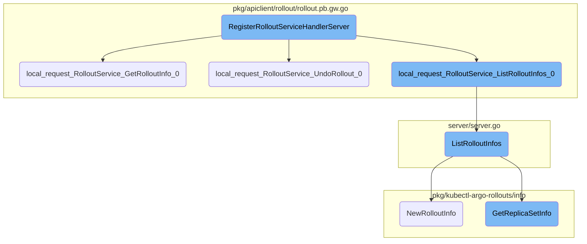
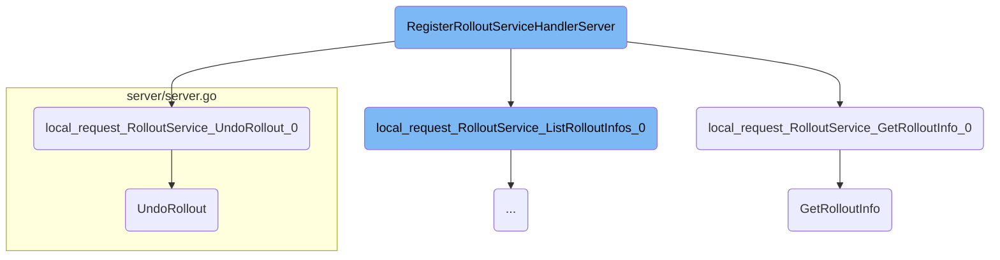
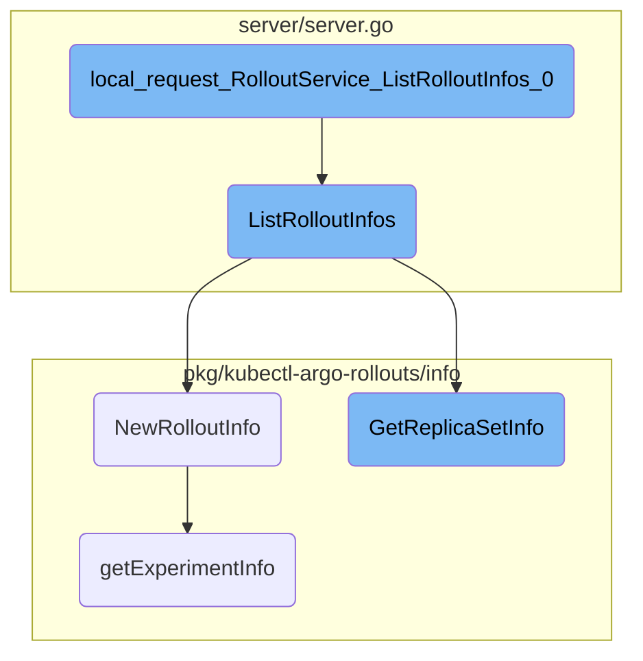

This document explains the process of handling rollout-related requests. The process involves registering HTTP handlers, processing requests to get rollout information, undoing rollouts, and listing rollouts.

The flow starts with registering HTTP handlers for various rollout-related requests. When a request to get rollout information is received, it extracts the necessary parameters, validates them, and retrieves the rollout details. For undoing a rollout, the request body is decoded to extract parameters, which are then validated before performing the rollback. Listing rollouts involves fetching the list of rollouts for a specified namespace, retrieving associated replica sets and pods, and compiling the information into a comprehensive list.

Here is a high level diagram of the flow, showing only the most important functions:



# Flow drill down

First, we'll zoom into this section of the flow:



<SwmSnippet path="/pkg/apiclient/rollout/rollout.pb.gw.go" line="924">

---

## Registering Rollout Service Handlers

The <SwmToken path="pkg/apiclient/rollout/rollout.pb.gw.go" pos="924:2:2" line-data="// RegisterRolloutServiceHandlerServer registers the http handlers for service RolloutService to &quot;mux&quot;.">`RegisterRolloutServiceHandlerServer`</SwmToken> function registers HTTP handlers for the <SwmToken path="pkg/apiclient/rollout/rollout.pb.gw.go" pos="924:16:16" line-data="// RegisterRolloutServiceHandlerServer registers the http handlers for service RolloutService to &quot;mux&quot;.">`RolloutService`</SwmToken>. It maps various HTTP endpoints to corresponding service methods, enabling the handling of rollout-related requests such as getting rollout info, listing rollouts, and undoing rollouts.

```go
// RegisterRolloutServiceHandlerServer registers the http handlers for service RolloutService to "mux".
// UnaryRPC     :call RolloutServiceServer directly.
// StreamingRPC :currently unsupported pending https://github.com/grpc/grpc-go/issues/906.
// Note that using this registration option will cause many gRPC library features to stop working. Consider using RegisterRolloutServiceHandlerFromEndpoint instead.
func RegisterRolloutServiceHandlerServer(ctx context.Context, mux *runtime.ServeMux, server RolloutServiceServer) error {

	mux.Handle("GET", pattern_RolloutService_GetRolloutInfo_0, func(w http.ResponseWriter, req *http.Request, pathParams map[string]string) {
		ctx, cancel := context.WithCancel(req.Context())
		defer cancel()
		var stream runtime.ServerTransportStream
		ctx = grpc.NewContextWithServerTransportStream(ctx, &stream)
		inboundMarshaler, outboundMarshaler := runtime.MarshalerForRequest(mux, req)
		rctx, err := runtime.AnnotateIncomingContext(ctx, mux, req)
		if err != nil {
			runtime.HTTPError(ctx, mux, outboundMarshaler, w, req, err)
			return
		}
		resp, md, err := local_request_RolloutService_GetRolloutInfo_0(rctx, inboundMarshaler, server, req, pathParams)
		md.HeaderMD, md.TrailerMD = metadata.Join(md.HeaderMD, stream.Header()), metadata.Join(md.TrailerMD, stream.Trailer())
		ctx = runtime.NewServerMetadataContext(ctx, md)
		if err != nil {
```

---

</SwmSnippet>

<SwmSnippet path="/pkg/apiclient/rollout/rollout.pb.gw.go" line="75">

---

## Handling Get Rollout Info Requests

The <SwmToken path="pkg/apiclient/rollout/rollout.pb.gw.go" pos="75:2:2" line-data="func local_request_RolloutService_GetRolloutInfo_0(ctx context.Context, marshaler runtime.Marshaler, server RolloutServiceServer, req *http.Request, pathParams map[string]string) (proto.Message, runtime.ServerMetadata, error) {">`local_request_RolloutService_GetRolloutInfo_0`</SwmToken> function processes requests to get rollout information. It extracts the namespace and name parameters from the request, validates them, and then calls the <SwmToken path="pkg/kubectl-argo-rollouts/viewcontroller/viewcontroller.go" pos="190:9:9" line-data="func (c *RolloutViewController) GetRolloutInfo() (*rollout.RolloutInfo, error) {">`GetRolloutInfo`</SwmToken> method on the server to retrieve the rollout details.

```go
func local_request_RolloutService_GetRolloutInfo_0(ctx context.Context, marshaler runtime.Marshaler, server RolloutServiceServer, req *http.Request, pathParams map[string]string) (proto.Message, runtime.ServerMetadata, error) {
	var protoReq RolloutInfoQuery
	var metadata runtime.ServerMetadata

	var (
		val string
		ok  bool
		err error
		_   = err
	)

	val, ok = pathParams["namespace"]
	if !ok {
		return nil, metadata, status.Errorf(codes.InvalidArgument, "missing parameter %s", "namespace")
	}

	protoReq.Namespace, err = runtime.String(val)

	if err != nil {
		return nil, metadata, status.Errorf(codes.InvalidArgument, "type mismatch, parameter: %s, error: %v", "namespace", err)
	}
```

---

</SwmSnippet>

<SwmSnippet path="/pkg/apiclient/rollout/rollout.pb.gw.go" line="757">

---

## Handling Undo Rollout Requests

The <SwmToken path="pkg/apiclient/rollout/rollout.pb.gw.go" pos="757:2:2" line-data="func local_request_RolloutService_UndoRollout_0(ctx context.Context, marshaler runtime.Marshaler, server RolloutServiceServer, req *http.Request, pathParams map[string]string) (proto.Message, runtime.ServerMetadata, error) {">`local_request_RolloutService_UndoRollout_0`</SwmToken> function processes requests to undo a rollout. It decodes the request body to extract the necessary parameters, validates them, and then calls the <SwmToken path="server/server.go" pos="389:9:9" line-data="func (s *ArgoRolloutsServer) UndoRollout(ctx context.Context, q *rollout.UndoRolloutRequest) (*v1alpha1.Rollout, error) {">`UndoRollout`</SwmToken> method on the server to perform the rollback.

```go
func local_request_RolloutService_UndoRollout_0(ctx context.Context, marshaler runtime.Marshaler, server RolloutServiceServer, req *http.Request, pathParams map[string]string) (proto.Message, runtime.ServerMetadata, error) {
	var protoReq UndoRolloutRequest
	var metadata runtime.ServerMetadata

	newReader, berr := utilities.IOReaderFactory(req.Body)
	if berr != nil {
		return nil, metadata, status.Errorf(codes.InvalidArgument, "%v", berr)
	}
	if err := marshaler.NewDecoder(newReader()).Decode(&protoReq); err != nil && err != io.EOF {
		return nil, metadata, status.Errorf(codes.InvalidArgument, "%v", err)
	}

	var (
		val string
		ok  bool
		err error
		_   = err
	)

	val, ok = pathParams["namespace"]
	if !ok {
```

---

</SwmSnippet>

<SwmSnippet path="/server/server.go" line="389">

---

### Undoing a Rollout

The <SwmToken path="server/server.go" pos="389:9:9" line-data="func (s *ArgoRolloutsServer) UndoRollout(ctx context.Context, q *rollout.UndoRolloutRequest) (*v1alpha1.Rollout, error) {">`UndoRollout`</SwmToken> method in the server implementation handles the actual rollback of a rollout. It interacts with the Kubernetes client to revert the rollout to a previous revision and then retrieves the updated rollout status.

```go
func (s *ArgoRolloutsServer) UndoRollout(ctx context.Context, q *rollout.UndoRolloutRequest) (*v1alpha1.Rollout, error) {
	rolloutIf := s.Options.DynamicClientset.Resource(v1alpha1.RolloutGVR).Namespace(q.GetNamespace())
	_, err := undo.RunUndoRollout(rolloutIf, s.Options.KubeClientset, q.GetRollout(), q.GetRevision())
	if err != nil {
		return nil, err
	}
	return s.getRollout(q.GetNamespace(), q.GetRollout())
}
```

---

</SwmSnippet>

<SwmSnippet path="/pkg/kubectl-argo-rollouts/viewcontroller/viewcontroller.go" line="190">

---

### Retrieving Rollout Information

The <SwmToken path="pkg/kubectl-argo-rollouts/viewcontroller/viewcontroller.go" pos="190:9:9" line-data="func (c *RolloutViewController) GetRolloutInfo() (*rollout.RolloutInfo, error) {">`GetRolloutInfo`</SwmToken> method in the view controller retrieves detailed information about a rollout. It gathers data from various Kubernetes resources such as <SwmToken path="server/server.go" pos="254:3:3" line-data="		ri.ReplicaSets = info.GetReplicaSetInfo(cur.UID, &amp;cur, allReplicaSets, allPods)">`ReplicaSets`</SwmToken>, Pods, Experiments, and <SwmToken path="pkg/client/listers/rollouts/v1alpha1/analysisrun.go" pos="35:1:1" line-data="	AnalysisRuns(namespace string) AnalysisRunNamespaceLister">`AnalysisRuns`</SwmToken>, and compiles it into a comprehensive rollout info object.

```go
func (c *RolloutViewController) GetRolloutInfo() (*rollout.RolloutInfo, error) {
	ro, err := c.rolloutLister.Get(c.name)
	if err != nil {
		return nil, err
	}

	allReplicaSets, err := c.replicaSetLister.List(labels.Everything())
	if err != nil {
		return nil, err
	}

	allPods, err := c.podLister.List(labels.Everything())
	if err != nil {
		return nil, err
	}

	allExps, err := c.experimentLister.List(labels.Everything())
	if err != nil {
		return nil, err
	}

```

---

</SwmSnippet>

Now, lets zoom into this section of the flow:



<SwmSnippet path="/pkg/apiclient/rollout/rollout.pb.gw.go" line="186">

---

## Handling the Request

The function <SwmToken path="pkg/apiclient/rollout/rollout.pb.gw.go" pos="186:2:2" line-data="func local_request_RolloutService_ListRolloutInfos_0(ctx context.Context, marshaler runtime.Marshaler, server RolloutServiceServer, req *http.Request, pathParams map[string]string) (proto.Message, runtime.ServerMetadata, error) {">`local_request_RolloutService_ListRolloutInfos_0`</SwmToken> handles the incoming request to list rollout information. It extracts the namespace parameter from the request path and validates it. If the namespace is missing or invalid, an error is returned. Otherwise, it calls the <SwmToken path="server/server.go" pos="236:2:2" line-data="// ListRolloutInfos returns a list of all rollouts">`ListRolloutInfos`</SwmToken> method on the server to fetch the rollout information for the specified namespace.

```go
func local_request_RolloutService_ListRolloutInfos_0(ctx context.Context, marshaler runtime.Marshaler, server RolloutServiceServer, req *http.Request, pathParams map[string]string) (proto.Message, runtime.ServerMetadata, error) {
	var protoReq RolloutInfoListQuery
	var metadata runtime.ServerMetadata

	var (
		val string
		ok  bool
		err error
		_   = err
	)

	val, ok = pathParams["namespace"]
	if !ok {
		return nil, metadata, status.Errorf(codes.InvalidArgument, "missing parameter %s", "namespace")
	}

	protoReq.Namespace, err = runtime.String(val)

	if err != nil {
		return nil, metadata, status.Errorf(codes.InvalidArgument, "type mismatch, parameter: %s, error: %v", "namespace", err)
	}
```

---

</SwmSnippet>

<SwmSnippet path="/server/server.go" line="236">

---

## Fetching Rollout Information

The <SwmToken path="server/server.go" pos="236:2:2" line-data="// ListRolloutInfos returns a list of all rollouts">`ListRolloutInfos`</SwmToken> method fetches the list of rollouts for the specified namespace. It retrieves the rollouts and their associated replica sets and pods. For each rollout, it creates a <SwmToken path="server/server.go" pos="250:10:10" line-data="	var riList []*rollout.RolloutInfo">`RolloutInfo`</SwmToken> object using the <SwmToken path="server/server.go" pos="253:7:7" line-data="		ri := info.NewRolloutInfo(&amp;cur, nil, nil, nil, nil, nil)">`NewRolloutInfo`</SwmToken> function, which includes details like strategy, status, and container images. The method then returns a list of <SwmToken path="server/server.go" pos="250:10:10" line-data="	var riList []*rollout.RolloutInfo">`RolloutInfo`</SwmToken> objects.

```go
// ListRolloutInfos returns a list of all rollouts
func (s *ArgoRolloutsServer) ListRolloutInfos(ctx context.Context, q *rollout.RolloutInfoListQuery) (*rollout.RolloutInfoList, error) {
	rolloutIf := s.Options.RolloutsClientset.ArgoprojV1alpha1().Rollouts(q.GetNamespace())
	rolloutList, err := rolloutIf.List(ctx, v1.ListOptions{})

	if err != nil {
		return nil, err
	}

	allReplicaSets, allPods, err := s.ListReplicaSetsAndPods(ctx, q.GetNamespace())
	if err != nil {
		return nil, err
	}

	var riList []*rollout.RolloutInfo
	for i := range rolloutList.Items {
		cur := rolloutList.Items[i]
		ri := info.NewRolloutInfo(&cur, nil, nil, nil, nil, nil)
		ri.ReplicaSets = info.GetReplicaSetInfo(cur.UID, &cur, allReplicaSets, allPods)
		riList = append(riList, ri)
	}
```

---

</SwmSnippet>

<SwmSnippet path="/pkg/kubectl-argo-rollouts/info/rollout_info.go" line="20">

---

### Creating <SwmToken path="pkg/kubectl-argo-rollouts/info/rollout_info.go" pos="27:5:5" line-data=") *rollout.RolloutInfo {">`RolloutInfo`</SwmToken>

The <SwmToken path="pkg/kubectl-argo-rollouts/info/rollout_info.go" pos="20:2:2" line-data="func NewRolloutInfo(">`NewRolloutInfo`</SwmToken> function creates a <SwmToken path="pkg/kubectl-argo-rollouts/info/rollout_info.go" pos="27:5:5" line-data=") *rollout.RolloutInfo {">`RolloutInfo`</SwmToken> object for a given rollout. It includes details such as the rollout's strategy (Canary or <SwmToken path="pkg/apis/rollouts/v1alpha1/types.go" pos="947:1:1" line-data="	BlueGreen BlueGreenStatus `json:&quot;blueGreen,omitempty&quot; protobuf:&quot;bytes,16,opt,name=blueGreen&quot;`">`BlueGreen`</SwmToken>), status, container images, and associated replica sets and experiments. This function ensures that all relevant information about the rollout is encapsulated in the <SwmToken path="pkg/kubectl-argo-rollouts/info/rollout_info.go" pos="27:5:5" line-data=") *rollout.RolloutInfo {">`RolloutInfo`</SwmToken> object.

```go
func NewRolloutInfo(
	ro *v1alpha1.Rollout,
	allReplicaSets []*appsv1.ReplicaSet,
	allPods []*corev1.Pod,
	allExperiments []*v1alpha1.Experiment,
	allARs []*v1alpha1.AnalysisRun,
	workloadRef *appsv1.Deployment,
) *rollout.RolloutInfo {

	roInfo := rollout.RolloutInfo{
		ObjectMeta: &v1.ObjectMeta{
			Name:              ro.Name,
			Namespace:         ro.Namespace,
			Labels:            ro.Labels,
			Annotations:       ro.Annotations,
			UID:               ro.UID,
			CreationTimestamp: ro.CreationTimestamp,
			ResourceVersion:   ro.ObjectMeta.ResourceVersion,
		},
	}

```

---

</SwmSnippet>

<SwmSnippet path="/pkg/kubectl-argo-rollouts/info/replicaset_info.go" line="20">

---

### Fetching <SwmToken path="pkg/kubectl-argo-rollouts/info/replicaset_info.go" pos="20:26:26" line-data="func GetReplicaSetInfo(ownerUID types.UID, ro *v1alpha1.Rollout, allReplicaSets []*appsv1.ReplicaSet, allPods []*corev1.Pod) []*rollout.ReplicaSetInfo {">`ReplicaSet`</SwmToken> Information

The <SwmToken path="pkg/kubectl-argo-rollouts/info/replicaset_info.go" pos="20:2:2" line-data="func GetReplicaSetInfo(ownerUID types.UID, ro *v1alpha1.Rollout, allReplicaSets []*appsv1.ReplicaSet, allPods []*corev1.Pod) []*rollout.ReplicaSetInfo {">`GetReplicaSetInfo`</SwmToken> function retrieves information about the replica sets associated with a rollout. It includes details such as the replica set's status, revision, and container images. This information is used to populate the <SwmToken path="server/server.go" pos="254:3:3" line-data="		ri.ReplicaSets = info.GetReplicaSetInfo(cur.UID, &amp;cur, allReplicaSets, allPods)">`ReplicaSets`</SwmToken> field in the <SwmToken path="server/server.go" pos="250:10:10" line-data="	var riList []*rollout.RolloutInfo">`RolloutInfo`</SwmToken> object.

```go
func GetReplicaSetInfo(ownerUID types.UID, ro *v1alpha1.Rollout, allReplicaSets []*appsv1.ReplicaSet, allPods []*corev1.Pod) []*rollout.ReplicaSetInfo {
	var rsInfos []*rollout.ReplicaSetInfo
	for _, rs := range allReplicaSets {
		// if owned by replicaset
		if ownerRef(rs.OwnerReferences, []types.UID{ownerUID}) == nil {
			continue
		}
		rsInfo := &rollout.ReplicaSetInfo{
			ObjectMeta: &v1.ObjectMeta{
				Name:              rs.Name,
				Namespace:         rs.Namespace,
				CreationTimestamp: rs.CreationTimestamp,
				UID:               rs.UID,
			},
			Status:    getReplicaSetHealth(rs),
			Replicas:  rs.Status.Replicas,
			Available: rs.Status.AvailableReplicas,
		}
		rsInfo.Icon = replicaSetIcon(rsInfo.Status)
		rsInfo.Revision = int64(parseRevision(rs.ObjectMeta.Annotations))
		rsInfo.Template = parseExperimentTemplateName(rs.ObjectMeta.Annotations)
```

---

</SwmSnippet>

<SwmSnippet path="/pkg/kubectl-argo-rollouts/info/experiment_info.go" line="40">

---

### Fetching Experiment Information

The <SwmToken path="pkg/kubectl-argo-rollouts/info/experiment_info.go" pos="40:2:2" line-data="func getExperimentInfo(">`getExperimentInfo`</SwmToken> function retrieves information about the experiments associated with a rollout. It includes details such as the experiment's revision and creation timestamp. This information is used to populate the <SwmToken path="pkg/client/clientset/versioned/typed/rollouts/v1alpha1/rollouts_client.go" pos="55:9:9" line-data="func (c *ArgoprojV1alpha1Client) Experiments(namespace string) ExperimentInterface {">`Experiments`</SwmToken> field in the <SwmToken path="server/server.go" pos="250:10:10" line-data="	var riList []*rollout.RolloutInfo">`RolloutInfo`</SwmToken> object.

```go
func getExperimentInfo(
	ro *v1alpha1.Rollout,
	allExperiments []*v1alpha1.Experiment,
	allReplicaSets []*appsv1.ReplicaSet,
	allAnalysisRuns []*v1alpha1.AnalysisRun,
	allPods []*corev1.Pod,
) []*rollout.ExperimentInfo {

	var expInfos []*rollout.ExperimentInfo
	for _, exp := range allExperiments {
		if ownerRef(exp.OwnerReferences, []types.UID{ro.UID}) == nil {
			continue
		}
		expInfo := NewExperimentInfo(exp, allReplicaSets, allAnalysisRuns, allPods)
		expInfos = append(expInfos, expInfo)
	}
	sort.Slice(expInfos[:], func(i, j int) bool {
		if expInfos[i].Revision > expInfos[j].Revision {
			return true
		}
		return expInfos[i].ObjectMeta.CreationTimestamp.Before(&expInfos[j].ObjectMeta.CreationTimestamp)
```

---

</SwmSnippet>

&nbsp;

*This is an auto-generated document by Swimm 🌊 and has not yet been verified by a human*

<SwmMeta version="3.0.0" repo-id="Z2l0aHViJTNBJTNBaW50dWl0LWFyZ28tcm9sbG91dHMtZGVtbyUzQSUzQVN3aW1tLURlbW8=" repo-name="intuit-argo-rollouts-demo"><sup>Powered by [Swimm](/)</sup></SwmMeta>
