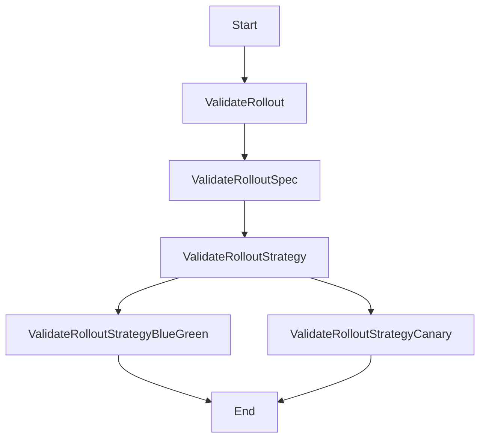

# Introduction to Rollout Validation

Rollout validation ensures that the specifications of a rollout are correct and meet the required criteria before deployment. It checks for the presence of necessary fields, such as selectors and templates, and verifies that their values are within acceptable ranges. Validation also ensures that the rollout strategies, such as blue-green or canary, are correctly configured and do not contain conflicting settings. It includes specific checks for traffic routing, anti-affinity rules, and other advanced deployment features to ensure they are properly set up. Validation helps prevent deployment errors by catching configuration issues early in the process, thus ensuring a smoother rollout.

<SwmSnippet path="/pkg/apis/rollouts/validation/validation.go" line="107">

---

# <SwmToken path="pkg/apis/rollouts/validation/validation.go" pos="107:2:2" line-data="// ValidateRolloutSpec checks for a valid spec otherwise returns a list of errors.">`ValidateRolloutSpec`</SwmToken> Function

The <SwmToken path="pkg/apis/rollouts/validation/validation.go" pos="107:2:2" line-data="// ValidateRolloutSpec checks for a valid spec otherwise returns a list of errors.">`ValidateRolloutSpec`</SwmToken> function checks for a valid rollout specification and returns a list of errors if any issues are found. It validates fields like replicas, selectors, templates, and rollout strategies.

```go
// ValidateRolloutSpec checks for a valid spec otherwise returns a list of errors.
func ValidateRolloutSpec(rollout *v1alpha1.Rollout, fldPath *field.Path) field.ErrorList {
	spec := rollout.Spec
	allErrs := field.ErrorList{}

	replicas := defaults.GetReplicasOrDefault(spec.Replicas)
	allErrs = append(allErrs, apivalidation.ValidateNonnegativeField(int64(replicas), fldPath.Child("replicas"))...)

	if spec.WorkloadRef == nil {
		if spec.Selector == nil {
			message := fmt.Sprintf(MissingFieldMessage, ".spec.selector")
			allErrs = append(allErrs, field.Required(fldPath.Child("selector"), message))
		} else {
			allErrs = append(allErrs, unversionedvalidation.ValidateLabelSelector(spec.Selector, unversionedvalidation.LabelSelectorValidationOptions{}, fldPath.Child("selector"))...)
			if len(spec.Selector.MatchLabels)+len(spec.Selector.MatchExpressions) == 0 {
				allErrs = append(allErrs, field.Invalid(fldPath.Child("selector"), spec.Selector, "empty selector is invalid for deployment"))
			}
		}
	}

	if !rollout.Spec.TemplateResolvedFromRef && (spec.WorkloadRef != nil && !spec.EmptyTemplate()) {
```

---

</SwmSnippet>

<SwmSnippet path="/pkg/apis/rollouts/validation/validation.go" line="101">

---

# <SwmToken path="pkg/apis/rollouts/validation/validation.go" pos="101:2:2" line-data="func ValidateRollout(rollout *v1alpha1.Rollout) field.ErrorList {">`ValidateRollout`</SwmToken> Function

The <SwmToken path="pkg/apis/rollouts/validation/validation.go" pos="101:2:2" line-data="func ValidateRollout(rollout *v1alpha1.Rollout) field.ErrorList {">`ValidateRollout`</SwmToken> function calls <SwmToken path="pkg/apis/rollouts/validation/validation.go" pos="103:10:10" line-data="	allErrs = append(allErrs, ValidateRolloutSpec(rollout, field.NewPath(&quot;spec&quot;))...)">`ValidateRolloutSpec`</SwmToken> to perform the validation checks on the rollout specification and aggregates any errors found.

```go
func ValidateRollout(rollout *v1alpha1.Rollout) field.ErrorList {
	allErrs := field.ErrorList{}
	allErrs = append(allErrs, ValidateRolloutSpec(rollout, field.NewPath("spec"))...)
	return allErrs
}
```

---

</SwmSnippet>

<SwmSnippet path="/pkg/apis/rollouts/validation/validation.go" line="200">

---

# <SwmToken path="pkg/apis/rollouts/validation/validation.go" pos="200:2:2" line-data="func ValidateRolloutStrategy(rollout *v1alpha1.Rollout, fldPath *field.Path) field.ErrorList {">`ValidateRolloutStrategy`</SwmToken> Function

The <SwmToken path="pkg/apis/rollouts/validation/validation.go" pos="200:2:2" line-data="func ValidateRolloutStrategy(rollout *v1alpha1.Rollout, fldPath *field.Path) field.ErrorList {">`ValidateRolloutStrategy`</SwmToken> function ensures that the rollout strategy is correctly configured, checking for the presence of either blue-green or canary strategies and validating their specific settings.

```go
func ValidateRolloutStrategy(rollout *v1alpha1.Rollout, fldPath *field.Path) field.ErrorList {
	strategy := rollout.Spec.Strategy
	allErrs := field.ErrorList{}
	if strategy.BlueGreen == nil && strategy.Canary == nil {
		message := fmt.Sprintf(MissingFieldMessage, ".spec.strategy.canary or .spec.strategy.blueGreen")
		allErrs = append(allErrs, field.Required(fldPath.Child("strategy"), message))
	} else if strategy.BlueGreen != nil && strategy.Canary != nil {
		errVal := fmt.Sprintf("blueGreen: %t canary: %t", rollout.Spec.Strategy.BlueGreen != nil, rollout.Spec.Strategy.Canary != nil)
		allErrs = append(allErrs, field.Invalid(fldPath.Child("strategy"), errVal, InvalidStrategyMessage))
	} else if strategy.BlueGreen != nil {
		allErrs = append(allErrs, ValidateRolloutStrategyBlueGreen(rollout, fldPath)...)
	} else if strategy.Canary != nil {
		allErrs = append(allErrs, ValidateRolloutStrategyCanary(rollout, fldPath)...)
	}
	return allErrs
}
```

---

</SwmSnippet>

<SwmSnippet path="/pkg/apis/rollouts/validation/validation.go" line="217">

---

# <SwmToken path="pkg/apis/rollouts/validation/validation.go" pos="217:2:2" line-data="func ValidateRolloutStrategyBlueGreen(rollout *v1alpha1.Rollout, fldPath *field.Path) field.ErrorList {">`ValidateRolloutStrategyBlueGreen`</SwmToken> Function

The <SwmToken path="pkg/apis/rollouts/validation/validation.go" pos="217:2:2" line-data="func ValidateRolloutStrategyBlueGreen(rollout *v1alpha1.Rollout, fldPath *field.Path) field.ErrorList {">`ValidateRolloutStrategyBlueGreen`</SwmToken> function validates the blue-green strategy settings, ensuring that services are correctly defined and do not conflict.

```go
func ValidateRolloutStrategyBlueGreen(rollout *v1alpha1.Rollout, fldPath *field.Path) field.ErrorList {
	blueGreen := rollout.Spec.Strategy.BlueGreen
	allErrs := field.ErrorList{}
	if blueGreen.ActiveService == blueGreen.PreviewService {
		allErrs = append(allErrs, field.Invalid(fldPath.Child("activeService"), blueGreen.ActiveService, DuplicatedServicesBlueGreenMessage))
	}
	revisionHistoryLimit := defaults.GetRevisionHistoryLimitOrDefault(rollout)
	if blueGreen.ScaleDownDelayRevisionLimit != nil && revisionHistoryLimit < *blueGreen.ScaleDownDelayRevisionLimit {
		allErrs = append(allErrs, field.Invalid(fldPath.Child("scaleDownDelayRevisionLimit"), *blueGreen.ScaleDownDelayRevisionLimit, ScaleDownLimitLargerThanRevisionLimit))
	}
	allErrs = append(allErrs, ValidateRolloutStrategyAntiAffinity(blueGreen.AntiAffinity, fldPath.Child("antiAffinity"))...)
	return allErrs
}
```

---

</SwmSnippet>

<SwmSnippet path="/pkg/apis/rollouts/validation/validation.go" line="255">

---

# <SwmToken path="pkg/apis/rollouts/validation/validation.go" pos="255:2:2" line-data="func ValidateRolloutStrategyCanary(rollout *v1alpha1.Rollout, fldPath *field.Path) field.ErrorList {">`ValidateRolloutStrategyCanary`</SwmToken> Function

The <SwmToken path="pkg/apis/rollouts/validation/validation.go" pos="255:2:2" line-data="func ValidateRolloutStrategyCanary(rollout *v1alpha1.Rollout, fldPath *field.Path) field.ErrorList {">`ValidateRolloutStrategyCanary`</SwmToken> function validates the canary strategy settings, checking for correct service definitions, traffic routing, and other canary-specific configurations.

```go
func ValidateRolloutStrategyCanary(rollout *v1alpha1.Rollout, fldPath *field.Path) field.ErrorList {
	canary := rollout.Spec.Strategy.Canary
	allErrs := field.ErrorList{}
	allErrs = append(allErrs, invalidMaxSurgeMaxUnavailable(rollout, fldPath.Child("maxSurge"))...)
	if canary.CanaryService != "" && canary.StableService != "" && canary.CanaryService == canary.StableService {
		allErrs = append(allErrs, field.Invalid(fldPath.Child("stableService"), canary.StableService, DuplicatedServicesCanaryMessage))
	}
	if canary.PingPong != nil {
		if canary.TrafficRouting != nil && canary.TrafficRouting.ALB == nil && canary.TrafficRouting.Istio == nil {
			allErrs = append(allErrs, field.Invalid(fldPath.Child("trafficRouting").Child("alb"), canary.TrafficRouting.ALB, PingPongWithRouterOnlyMessage))
		}
		if canary.PingPong.PingService == "" {
			allErrs = append(allErrs, field.Invalid(fldPath.Child("pingPong").Child("pingService"), canary.PingPong.PingService, InvalidPingPongProvidedMessage))
		}
		if canary.PingPong.PongService == "" {
			allErrs = append(allErrs, field.Invalid(fldPath.Child("pingPong").Child("pongService"), canary.PingPong.PongService, InvalidPingPongProvidedMessage))
		}
		if canary.PingPong.PingService == canary.PingPong.PongService {
			allErrs = append(allErrs, field.Invalid(fldPath.Child("pingPong").Child("pingService"), canary.PingPong.PingService, DuplicatedPingPongServicesMessage))
		}
		if canary.TrafficRouting != nil && canary.TrafficRouting.ALB != nil && canary.TrafficRouting.ALB.RootService == "" {
```

---

</SwmSnippet>



&nbsp;

*This is an auto-generated document by Swimm 🌊 and has not yet been verified by a human*

<SwmMeta version="3.0.0" repo-id="Z2l0aHViJTNBJTNBaW50dWl0LWFyZ28tcm9sbG91dHMtZGVtbyUzQSUzQVN3aW1tLURlbW8=" repo-name="intuit-argo-rollouts-demo"><sup>Powered by [Swimm](/)</sup></SwmMeta>
