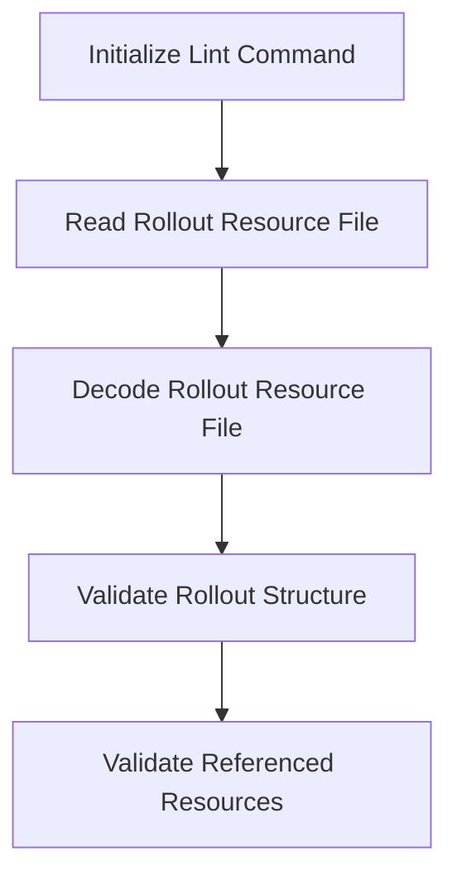

This document will cover the process of linting and validating Rollout resources. We'll cover:

1. Initializing the lint command
2. Reading and decoding the Rollout resource file
3. Validating the Rollout structure and referenced resources.

Technical document: <SwmLink doc-title="Linting and Validating Rollout Resources">[Linting and Validating Rollout Resources](/.swm/linting-and-validating-rollout-resources.q9cmrcv3.sw.md)</SwmLink>

# [Initializing the lint command](http://localhost:5001/repos/Z2l0aHViJTNBJTNBaW50dWl0LWFyZ28tcm9sbG91dHMtZGVtbyUzQSUzQVN3aW1tLURlbW8=/docs/q9cmrcv3#newcmdlint)

The lint command is initialized to set up the usage, flags, and execution function. This command is responsible for linting and validating a Rollout resource from a file. It ensures that the user can specify the file to be linted and validated.

# [Reading and decoding the Rollout resource file](http://localhost:5001/repos/Z2l0aHViJTNBJTNBaW50dWl0LWFyZ28tcm9sbG91dHMtZGVtbyUzQSUzQVN3aW1tLURlbW8=/docs/q9cmrcv3#lintresource)

When the lint command is executed, it reads the Rollout resource file specified by the user. The content of the file is then decoded to ensure it can be processed further. This step is crucial as it converts the file content into a format that can be validated.

# [Validating the Rollout structure and referenced resources](http://localhost:5001/repos/Z2l0aHViJTNBJTNBaW50dWl0LWFyZ28tcm9sbG91dHMtZGVtbyUzQSUzQVN3aW1tLURlbW8=/docs/q9cmrcv3#validaterollout)

The validation process ensures that the Rollout conforms to the expected schema. It checks the structure of the Rollout and validates all referenced resources such as services, analysis templates, and virtual services. This step accumulates any errors encountered, ensuring that the Rollout is correctly configured and all necessary components are available.

&nbsp;

*This is an auto-generated document by Swimm 🌊 and has not yet been verified by a human*

<SwmMeta version="3.0.0" repo-id="Z2l0aHViJTNBJTNBaW50dWl0LWFyZ28tcm9sbG91dHMtZGVtbyUzQSUzQVN3aW1tLURlbW8=" repo-name="intuit-argo-rollouts-demo">Powered by [Swimm](/)</SwmMeta>
