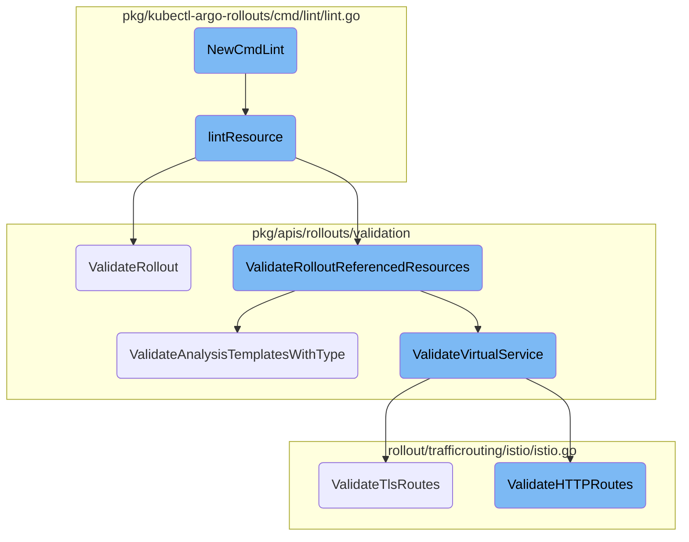
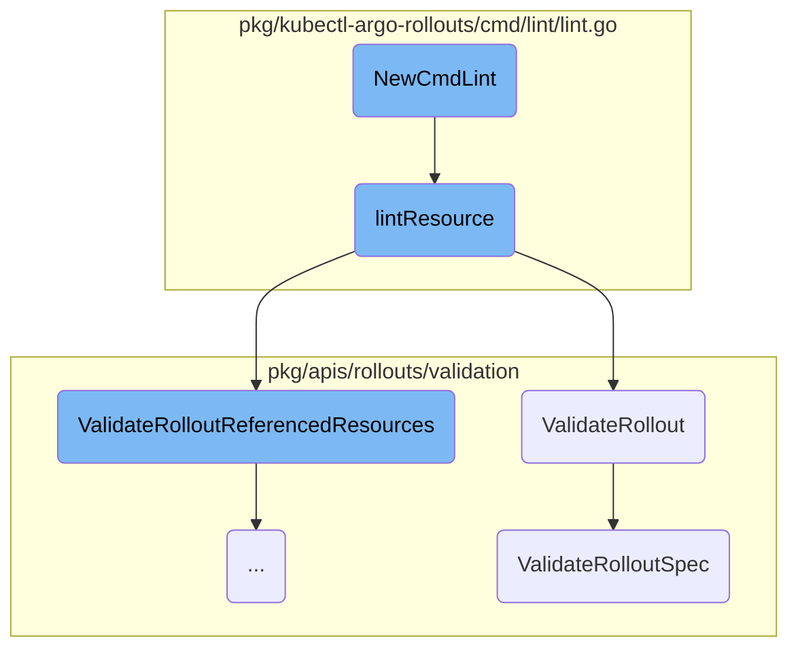
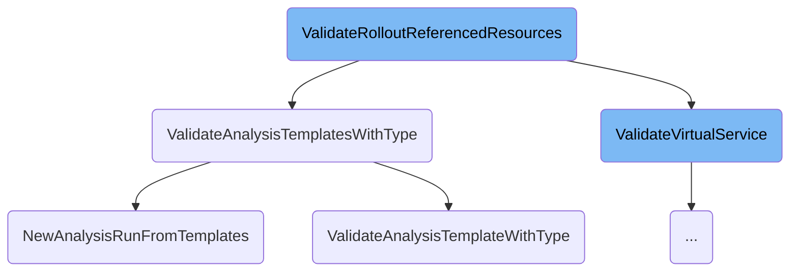
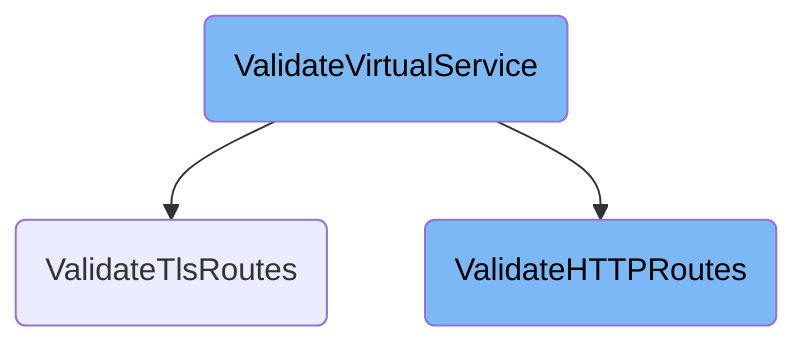

In this document, we will explain the process of linting and validating a Rollout resource using the <SwmToken path="pkg/kubectl-argo-rollouts/cmd/lint/lint.go" pos="40:2:2" line-data="// NewCmdLint returns a new instance of a `rollouts lint` command">`NewCmdLint`</SwmToken> command. This process involves initializing the lint command, reading the Rollout resource file, decoding its content, and validating its structure and referenced resources.

The flow starts with initializing the lint command, which sets up the command usage, flags, and execution function. When the command is executed, it reads the Rollout resource file, decodes its content, and validates its structure and referenced resources. The validation process ensures that the Rollout conforms to the expected schema and references valid resources, accumulating any errors encountered during the process.

Here is a high level diagram of the flow, showing only the most important functions:



# Flow drill down

First, we'll zoom into this section of the flow:



<SwmSnippet path="/pkg/kubectl-argo-rollouts/cmd/lint/lint.go" line="40">

---

## <SwmToken path="pkg/kubectl-argo-rollouts/cmd/lint/lint.go" pos="40:2:2" line-data="// NewCmdLint returns a new instance of a `rollouts lint` command">`NewCmdLint`</SwmToken>

<SwmToken path="pkg/kubectl-argo-rollouts/cmd/lint/lint.go" pos="40:2:2" line-data="// NewCmdLint returns a new instance of a `rollouts lint` command">`NewCmdLint`</SwmToken> initializes the lint command which is responsible for linting and validating a Rollout resource from a file. It sets up the command usage, flags, and the execution function which calls <SwmToken path="pkg/kubectl-argo-rollouts/cmd/lint/lint.go" pos="56:5:5" line-data="			return lintOptions.lintResource(lintOptions.File)">`lintResource`</SwmToken>.

```go
// NewCmdLint returns a new instance of a `rollouts lint` command
func NewCmdLint(o *options.ArgoRolloutsOptions) *cobra.Command {
	lintOptions := LintOptions{
		ArgoRolloutsOptions: *o,
	}
	var cmd = &cobra.Command{
		Use:          "lint",
		Short:        "Lint and validate a Rollout",
		Long:         "This command lints and validates a new Rollout resource from a file.",
		Example:      o.Example(lintExample),
		SilenceUsage: true,
		RunE: func(c *cobra.Command, args []string) error {
			if lintOptions.File == "" {
				return o.UsageErr(c)
			}

			return lintOptions.lintResource(lintOptions.File)
		},
	}
	cmd.Flags().StringVarP(&lintOptions.File, "filename", "f", "", "File to lint")
	return cmd
```

---

</SwmSnippet>

<SwmSnippet path="/pkg/kubectl-argo-rollouts/cmd/lint/lint.go" line="67">

---

## <SwmToken path="pkg/kubectl-argo-rollouts/cmd/lint/lint.go" pos="67:9:9" line-data="func (l *LintOptions) lintResource(path string) error {">`lintResource`</SwmToken>

The <SwmToken path="pkg/kubectl-argo-rollouts/cmd/lint/lint.go" pos="67:9:9" line-data="func (l *LintOptions) lintResource(path string) error {">`lintResource`</SwmToken> function reads the Rollout resource file, decodes it, and validates its structure and referenced resources. It ensures that the Rollout conforms to the expected schema and references valid resources, accumulating any errors encountered during the process.

```go
func (l *LintOptions) lintResource(path string) error {
	fileBytes, err := os.ReadFile(path)
	if err != nil {
		return err
	}

	var un unstructured.Unstructured
	var refResource validation.ReferencedResources
	var fileRollouts []v1alpha1.Rollout

	decoder := goyaml.NewDecoder(bytes.NewReader(fileBytes))
	for {
		var value any
		if err := decoder.Decode(&value); err != nil {
			if err != io.EOF {
				return err
			}
			break
		}
		if value == nil {
			continue
```

---

</SwmSnippet>

<SwmSnippet path="/pkg/kubectl-argo-rollouts/cmd/lint/lint.go" line="77">

---

### Decoding and Validating the Rollout

The function decodes the YAML content of the Rollout file and checks if the <SwmToken path="pkg/kubectl-argo-rollouts/cmd/lint/lint.go" pos="98:7:7" line-data="		gvk := un.GroupVersionKind()">`GroupVersionKind`</SwmToken> matches the Rollout kind. If it does, it unmarshals the content into a Rollout object and validates the referenced resources.

```go
	decoder := goyaml.NewDecoder(bytes.NewReader(fileBytes))
	for {
		var value any
		if err := decoder.Decode(&value); err != nil {
			if err != io.EOF {
				return err
			}
			break
		}
		if value == nil {
			continue
		}
		valueBytes, err := goyaml.Marshal(value)
		if err != nil {
			return err
		}

		if err = yaml.UnmarshalStrict(valueBytes, &un, yaml.DisallowUnknownFields); err != nil {
			return err
		}

```

---

</SwmSnippet>

<SwmSnippet path="/pkg/apis/rollouts/validation/validation.go" line="101">

---

## <SwmToken path="pkg/apis/rollouts/validation/validation.go" pos="101:2:2" line-data="func ValidateRollout(rollout *v1alpha1.Rollout) field.ErrorList {">`ValidateRollout`</SwmToken>

<SwmToken path="pkg/apis/rollouts/validation/validation.go" pos="101:2:2" line-data="func ValidateRollout(rollout *v1alpha1.Rollout) field.ErrorList {">`ValidateRollout`</SwmToken> validates the Rollout object by calling <SwmToken path="pkg/apis/rollouts/validation/validation.go" pos="103:10:10" line-data="	allErrs = append(allErrs, ValidateRolloutSpec(rollout, field.NewPath(&quot;spec&quot;))...)">`ValidateRolloutSpec`</SwmToken> to ensure the Rollout specification is correct. It accumulates any errors found during the validation process.

```go
func ValidateRollout(rollout *v1alpha1.Rollout) field.ErrorList {
	allErrs := field.ErrorList{}
	allErrs = append(allErrs, ValidateRolloutSpec(rollout, field.NewPath("spec"))...)
	return allErrs
}
```

---

</SwmSnippet>

<SwmSnippet path="/pkg/apis/rollouts/validation/validation.go" line="107">

---

## <SwmToken path="pkg/apis/rollouts/validation/validation.go" pos="107:2:2" line-data="// ValidateRolloutSpec checks for a valid spec otherwise returns a list of errors.">`ValidateRolloutSpec`</SwmToken>

<SwmToken path="pkg/apis/rollouts/validation/validation.go" pos="107:2:2" line-data="// ValidateRolloutSpec checks for a valid spec otherwise returns a list of errors.">`ValidateRolloutSpec`</SwmToken> performs detailed validation of the Rollout specification. It checks for valid replicas, selectors, workload references, and other critical fields. It ensures that the Rollout configuration adheres to the expected standards and constraints.

```go
// ValidateRolloutSpec checks for a valid spec otherwise returns a list of errors.
func ValidateRolloutSpec(rollout *v1alpha1.Rollout, fldPath *field.Path) field.ErrorList {
	spec := rollout.Spec
	allErrs := field.ErrorList{}

	replicas := defaults.GetReplicasOrDefault(spec.Replicas)
	allErrs = append(allErrs, apivalidation.ValidateNonnegativeField(int64(replicas), fldPath.Child("replicas"))...)

	if spec.WorkloadRef == nil {
		if spec.Selector == nil {
			message := fmt.Sprintf(MissingFieldMessage, ".spec.selector")
			allErrs = append(allErrs, field.Required(fldPath.Child("selector"), message))
		} else {
			allErrs = append(allErrs, unversionedvalidation.ValidateLabelSelector(spec.Selector, unversionedvalidation.LabelSelectorValidationOptions{}, fldPath.Child("selector"))...)
			if len(spec.Selector.MatchLabels)+len(spec.Selector.MatchExpressions) == 0 {
				allErrs = append(allErrs, field.Invalid(fldPath.Child("selector"), spec.Selector, "empty selector is invalid for deployment"))
			}
		}
	}

	if !rollout.Spec.TemplateResolvedFromRef && (spec.WorkloadRef != nil && !spec.EmptyTemplate()) {
```

---

</SwmSnippet>

Now, lets zoom into this section of the flow:



<SwmSnippet path="/pkg/apis/rollouts/validation/validation_references.go" line="70">

---

## <SwmToken path="pkg/apis/rollouts/validation/validation_references.go" pos="70:2:2" line-data="func ValidateRolloutReferencedResources(rollout *v1alpha1.Rollout, referencedResources ReferencedResources) field.ErrorList {">`ValidateRolloutReferencedResources`</SwmToken>

The <SwmToken path="pkg/apis/rollouts/validation/validation_references.go" pos="70:2:2" line-data="func ValidateRolloutReferencedResources(rollout *v1alpha1.Rollout, referencedResources ReferencedResources) field.ErrorList {">`ValidateRolloutReferencedResources`</SwmToken> function is responsible for validating all the resources referenced in a rollout. It iterates through different types of referenced resources such as services, analysis templates, ingresses, virtual services, ambassador mappings, and app mesh resources, and validates each one. This ensures that all the components required for a successful rollout are correctly configured and available.

```go
func ValidateRolloutReferencedResources(rollout *v1alpha1.Rollout, referencedResources ReferencedResources) field.ErrorList {
	allErrs := field.ErrorList{}
	for _, service := range referencedResources.ServiceWithType {
		allErrs = append(allErrs, ValidateService(service, rollout)...)
	}
	for _, templates := range referencedResources.AnalysisTemplatesWithType {
		allErrs = append(allErrs, ValidateAnalysisTemplatesWithType(rollout, templates)...)
	}
	for _, ingress := range referencedResources.Ingresses {
		allErrs = append(allErrs, ValidateIngress(rollout, &ingress)...)
	}
	for _, vsvc := range referencedResources.VirtualServices {
		allErrs = append(allErrs, ValidateVirtualService(rollout, vsvc)...)
	}
	for _, mapping := range referencedResources.AmbassadorMappings {
		allErrs = append(allErrs, ValidateAmbassadorMapping(mapping)...)
	}
	for _, appmeshRes := range referencedResources.AppMeshResources {
		allErrs = append(allErrs, ValidateAppMeshResource(appmeshRes)...)
	}
	return allErrs
```

---

</SwmSnippet>

<SwmSnippet path="/pkg/apis/rollouts/validation/validation_references.go" line="121">

---

## <SwmToken path="pkg/apis/rollouts/validation/validation_references.go" pos="121:2:2" line-data="func ValidateAnalysisTemplatesWithType(rollout *v1alpha1.Rollout, templates AnalysisTemplatesWithType) field.ErrorList {">`ValidateAnalysisTemplatesWithType`</SwmToken>

The <SwmToken path="pkg/apis/rollouts/validation/validation_references.go" pos="121:2:2" line-data="func ValidateAnalysisTemplatesWithType(rollout *v1alpha1.Rollout, templates AnalysisTemplatesWithType) field.ErrorList {">`ValidateAnalysisTemplatesWithType`</SwmToken> function validates the analysis templates associated with a rollout. It checks the templates' names, arguments, and other configurations to ensure they are correct. If any errors are found, they are added to the error list. This step is crucial for ensuring that the analysis phase of the rollout can be executed without issues.

```go
func ValidateAnalysisTemplatesWithType(rollout *v1alpha1.Rollout, templates AnalysisTemplatesWithType) field.ErrorList {
	allErrs := field.ErrorList{}
	fldPath := GetAnalysisTemplateWithTypeFieldPath(templates.TemplateType, templates.CanaryStepIndex)
	if fldPath == nil {
		return allErrs
	}

	templateNames := GetAnalysisTemplateNames(templates)
	value := fmt.Sprintf("templateNames: %s", templateNames)
	_, err := analysisutil.NewAnalysisRunFromTemplates(templates.AnalysisTemplates, templates.ClusterAnalysisTemplates, buildAnalysisArgs(templates.Args, rollout), []v1alpha1.DryRun{}, []v1alpha1.MeasurementRetention{}, make(map[string]string), make(map[string]string), "", "", "")
	if err != nil {
		allErrs = append(allErrs, field.Invalid(fldPath, value, err.Error()))
		return allErrs
	}

	if rollout.Spec.Strategy.Canary != nil {
		for _, step := range rollout.Spec.Strategy.Canary.Steps {
			if step.Analysis != nil {
				_, err := analysisutil.NewAnalysisRunFromTemplates(templates.AnalysisTemplates, templates.ClusterAnalysisTemplates, buildAnalysisArgs(templates.Args, rollout), step.Analysis.DryRun, step.Analysis.MeasurementRetention, make(map[string]string), make(map[string]string), "", "", "")
				if err != nil {
					allErrs = append(allErrs, field.Invalid(fldPath, value, err.Error()))
```

---

</SwmSnippet>

<SwmSnippet path="/utils/analysis/helpers.go" line="291">

---

### <SwmToken path="utils/analysis/helpers.go" pos="291:2:2" line-data="func NewAnalysisRunFromTemplates(templates []*v1alpha1.AnalysisTemplate, clusterTemplates []*v1alpha1.ClusterAnalysisTemplate, args []v1alpha1.Argument, dryRunMetrics []v1alpha1.DryRun,">`NewAnalysisRunFromTemplates`</SwmToken>

The <SwmToken path="utils/analysis/helpers.go" pos="291:2:2" line-data="func NewAnalysisRunFromTemplates(templates []*v1alpha1.AnalysisTemplate, clusterTemplates []*v1alpha1.ClusterAnalysisTemplate, args []v1alpha1.Argument, dryRunMetrics []v1alpha1.DryRun,">`NewAnalysisRunFromTemplates`</SwmToken> function creates a new analysis run from the provided templates. It merges arguments, dry run metrics, and measurement retention metrics, and constructs a new <SwmToken path="utils/analysis/helpers.go" pos="294:16:16" line-data="	name, generateName, namespace string) (*v1alpha1.AnalysisRun, error) {">`AnalysisRun`</SwmToken> object. This function is used within <SwmToken path="pkg/apis/rollouts/validation/validation_references.go" pos="76:10:10" line-data="		allErrs = append(allErrs, ValidateAnalysisTemplatesWithType(rollout, templates)...)">`ValidateAnalysisTemplatesWithType`</SwmToken> to simulate the creation of an analysis run and catch any potential errors in the template configurations.

```go
func NewAnalysisRunFromTemplates(templates []*v1alpha1.AnalysisTemplate, clusterTemplates []*v1alpha1.ClusterAnalysisTemplate, args []v1alpha1.Argument, dryRunMetrics []v1alpha1.DryRun,
	measurementRetentionMetrics []v1alpha1.MeasurementRetention,
	labels map[string]string, annotations map[string]string,
	name, generateName, namespace string) (*v1alpha1.AnalysisRun, error) {
	template, err := FlattenTemplates(templates, clusterTemplates)
	if err != nil {
		return nil, err
	}
	newArgs, err := MergeArgs(args, template.Spec.Args)
	if err != nil {
		return nil, err
	}
	dryRun, err := mergeDryRunMetrics(dryRunMetrics, template.Spec.DryRun)
	if err != nil {
		return nil, err
	}
	measurementRetention, err := mergeMeasurementRetentionMetrics(measurementRetentionMetrics, template.Spec.MeasurementRetention)
	if err != nil {
		return nil, err
	}
	ar := v1alpha1.AnalysisRun{
```

---

</SwmSnippet>

<SwmSnippet path="/pkg/apis/rollouts/validation/validation_references.go" line="157">

---

### <SwmToken path="pkg/apis/rollouts/validation/validation_references.go" pos="157:2:2" line-data="func ValidateAnalysisTemplateWithType(rollout *v1alpha1.Rollout, template *v1alpha1.AnalysisTemplate, clusterTemplate *v1alpha1.ClusterAnalysisTemplate, templateType AnalysisTemplateType, fldPath *field.Path) field.ErrorList {">`ValidateAnalysisTemplateWithType`</SwmToken>

The <SwmToken path="pkg/apis/rollouts/validation/validation_references.go" pos="157:2:2" line-data="func ValidateAnalysisTemplateWithType(rollout *v1alpha1.Rollout, template *v1alpha1.AnalysisTemplate, clusterTemplate *v1alpha1.ClusterAnalysisTemplate, templateType AnalysisTemplateType, fldPath *field.Path) field.ErrorList {">`ValidateAnalysisTemplateWithType`</SwmToken> function validates individual analysis templates or cluster analysis templates. It checks the template specifications, arguments, and metrics to ensure they are correctly defined. This function is called within <SwmToken path="pkg/apis/rollouts/validation/validation_references.go" pos="76:10:10" line-data="		allErrs = append(allErrs, ValidateAnalysisTemplatesWithType(rollout, templates)...)">`ValidateAnalysisTemplatesWithType`</SwmToken> for each template to perform detailed validation and catch any specific issues.

```go
func ValidateAnalysisTemplateWithType(rollout *v1alpha1.Rollout, template *v1alpha1.AnalysisTemplate, clusterTemplate *v1alpha1.ClusterAnalysisTemplate, templateType AnalysisTemplateType, fldPath *field.Path) field.ErrorList {
	allErrs := field.ErrorList{}

	var templateSpec v1alpha1.AnalysisTemplateSpec
	var templateName string

	if clusterTemplate != nil {
		templateName, templateSpec = clusterTemplate.Name, clusterTemplate.Spec
	} else if template != nil {
		templateName, templateSpec = template.Name, template.Spec
	}

	if templateType != BackgroundAnalysis {
		setArgValuePlaceHolder(templateSpec.Args)
		resolvedMetrics, err := validateAnalysisMetrics(templateSpec.Metrics, templateSpec.Args)
		if err != nil {
			msg := fmt.Sprintf("AnalysisTemplate %s: %v", templateName, err)
			allErrs = append(allErrs, field.Invalid(fldPath, templateName, msg))
		} else {
			for _, metric := range resolvedMetrics {
				effectiveCount := metric.EffectiveCount()
```

---

</SwmSnippet>

Now, lets zoom into this section of the flow:



<SwmSnippet path="/pkg/apis/rollouts/validation/validation_references.go" line="357">

---

## <SwmToken path="pkg/apis/rollouts/validation/validation_references.go" pos="357:2:2" line-data="func ValidateVirtualService(rollout *v1alpha1.Rollout, obj unstructured.Unstructured) field.ErrorList {">`ValidateVirtualService`</SwmToken>

The <SwmToken path="pkg/apis/rollouts/validation/validation_references.go" pos="357:2:2" line-data="func ValidateVirtualService(rollout *v1alpha1.Rollout, obj unstructured.Unstructured) field.ErrorList {">`ValidateVirtualService`</SwmToken> function ensures that the Istio <SwmToken path="pkg/apis/rollouts/validation/validation_references.go" pos="377:24:24" line-data="		virtualServices = []v1alpha1.IstioVirtualService{*rollout.Spec.Strategy.Canary.TrafficRouting.Istio.VirtualService}">`VirtualService`</SwmToken> is correctly configured for canary deployments. It checks if the rollout object is configured with Istio traffic routing and validates the existence and correctness of HTTP, TLS, and TCP routes. If any of these routes are missing or invalid, it returns an error.

```go
func ValidateVirtualService(rollout *v1alpha1.Rollout, obj unstructured.Unstructured) field.ErrorList {
	var fldPath *field.Path
	var virtualServices []v1alpha1.IstioVirtualService
	allErrs := field.ErrorList{}
	newObj := obj.DeepCopy()

	if rollout.Spec.Strategy.Canary == nil ||
		rollout.Spec.Strategy.Canary.TrafficRouting == nil ||
		rollout.Spec.Strategy.Canary.TrafficRouting.Istio == nil {

		msg := "Rollout object is not configured with Istio traffic routing"
		allErrs = append(allErrs, field.Invalid(field.NewPath("spec", "strategy", "canary", "trafficRouting", "istio"), rollout.Name, msg))
		return allErrs
	}

	if istioutil.MultipleVirtualServiceConfigured(rollout) {
		fldPath = field.NewPath("spec", "strategy", "canary", "trafficRouting", "istio", "virtualServices", "name")
		virtualServices = rollout.Spec.Strategy.Canary.TrafficRouting.Istio.VirtualServices
	} else {
		fldPath = field.NewPath("spec", "strategy", "canary", "trafficRouting", "istio", "virtualService", "name")
		virtualServices = []v1alpha1.IstioVirtualService{*rollout.Spec.Strategy.Canary.TrafficRouting.Istio.VirtualService}
```

---

</SwmSnippet>

<SwmSnippet path="/pkg/apis/rollouts/validation/validation_references.go" line="363">

---

### Checking Istio Traffic Routing Configuration

The function first checks if the rollout object is configured with Istio traffic routing. If not, it appends an error message indicating that the rollout object is not configured with Istio traffic routing.

```go
	if rollout.Spec.Strategy.Canary == nil ||
		rollout.Spec.Strategy.Canary.TrafficRouting == nil ||
		rollout.Spec.Strategy.Canary.TrafficRouting.Istio == nil {

		msg := "Rollout object is not configured with Istio traffic routing"
		allErrs = append(allErrs, field.Invalid(field.NewPath("spec", "strategy", "canary", "trafficRouting", "istio"), rollout.Name, msg))
		return allErrs
	}
```

---

</SwmSnippet>

<SwmSnippet path="/pkg/apis/rollouts/validation/validation_references.go" line="395">

---

### Validating HTTP Routes

If HTTP routes are present, the function validates them by calling <SwmToken path="pkg/apis/rollouts/validation/validation_references.go" pos="401:7:7" line-data="					err = istio.ValidateHTTPRoutes(rollout, virtualService.Routes, httpRoutes)">`ValidateHTTPRoutes`</SwmToken>. If the routes are invalid, it appends an error message indicating the issue with the HTTP routes.

```go
			if errHttp == nil {
				httpRoutes, err := istio.GetHttpRoutes(httpRoutesI)
				if err != nil {
					msg := "Unable to get HTTP routes for Istio VirtualService"
					allErrs = append(allErrs, field.Invalid(fldPath, vsvcName, msg))
				} else {
					err = istio.ValidateHTTPRoutes(rollout, virtualService.Routes, httpRoutes)
					if err != nil {
						msg := fmt.Sprintf("Istio VirtualService has invalid HTTP routes. Error: %s", err.Error())
						allErrs = append(allErrs, field.Invalid(fldPath, vsvcName, msg))
					}
				}
			}
```

---

</SwmSnippet>

<SwmSnippet path="/rollout/trafficrouting/istio/istio.go" line="1078">

---

## <SwmToken path="rollout/trafficrouting/istio/istio.go" pos="1078:2:2" line-data="func ValidateTlsRoutes(r *v1alpha1.Rollout, vsvcTLSRoutes []v1alpha1.TLSRoute, tlsRoutes []VirtualServiceTLSRoute) error {">`ValidateTlsRoutes`</SwmToken>

The <SwmToken path="rollout/trafficrouting/istio/istio.go" pos="1078:2:2" line-data="func ValidateTlsRoutes(r *v1alpha1.Rollout, vsvcTLSRoutes []v1alpha1.TLSRoute, tlsRoutes []VirtualServiceTLSRoute) error {">`ValidateTlsRoutes`</SwmToken> function ensures that all the TLS routes in the rollout exist and have the correct destinations. It checks if the routes have exactly two destinations and validates them against the stable and canary services.

```go
func ValidateTlsRoutes(r *v1alpha1.Rollout, vsvcTLSRoutes []v1alpha1.TLSRoute, tlsRoutes []VirtualServiceTLSRoute) error {
	stableSvc, canarySvc := trafficrouting.GetStableAndCanaryServices(r, false)

	routeIndexesToPatch, err := getTlsRouteIndexesToPatch(vsvcTLSRoutes, tlsRoutes)
	if err != nil {
		return err
	}
	for _, routeIndex := range routeIndexesToPatch {
		route := tlsRoutes[routeIndex]
		err := validateVirtualServiceRouteDestinations(route.Route, stableSvc, canarySvc, r.Spec.Strategy.Canary.TrafficRouting.Istio.DestinationRule)
		if err != nil {
			return err
		}
	}
	if len(vsvcTLSRoutes) == 0 && len(tlsRoutes) > 1 {
		return fmt.Errorf("spec.tls[] should be set in VirtualService and it must have exactly one route when omitting spec.strategy.canary.trafficRouting.istio.virtualService.tlsRoutes")
	}
	return nil
}
```

---

</SwmSnippet>

<SwmSnippet path="/rollout/trafficrouting/istio/istio.go" line="1041">

---

## <SwmToken path="rollout/trafficrouting/istio/istio.go" pos="1041:2:2" line-data="func ValidateHTTPRoutes(r *v1alpha1.Rollout, routeNames []string, httpRoutes []VirtualServiceHTTPRoute) error {">`ValidateHTTPRoutes`</SwmToken>

The <SwmToken path="rollout/trafficrouting/istio/istio.go" pos="1041:2:2" line-data="func ValidateHTTPRoutes(r *v1alpha1.Rollout, routeNames []string, httpRoutes []VirtualServiceHTTPRoute) error {">`ValidateHTTPRoutes`</SwmToken> function ensures that all the HTTP routes in the rollout exist and are correctly configured. It validates the routes against the stable and canary services and checks if the routes are within the managed routes.

```go
func ValidateHTTPRoutes(r *v1alpha1.Rollout, routeNames []string, httpRoutes []VirtualServiceHTTPRoute) error {
	stableSvc, canarySvc := trafficrouting.GetStableAndCanaryServices(r, false)

	routeIndexesToPatch, err := getHttpRouteIndexesToPatch(routeNames, httpRoutes)
	if err != nil {
		return err
	}
	for _, routeIndex := range routeIndexesToPatch {
		route := httpRoutes[routeIndex]
		err := validateVirtualServiceRouteDestinations(route.Route, stableSvc, canarySvc, r.Spec.Strategy.Canary.TrafficRouting.Istio.DestinationRule)
		if err != nil {
			return err
		}
	}

	httpRoutesBytes, err := json.Marshal(httpRoutes)
	if err != nil {
		return fmt.Errorf("[ValidateHTTPRoutes] failed to marshal http routes: %w", err)
	}
	var httpRoutesI []any
	err = json.Unmarshal(httpRoutesBytes, &httpRoutesI)
```

---

</SwmSnippet>

&nbsp;

*This is an auto-generated document by Swimm 🌊 and has not yet been verified by a human*

<SwmMeta version="3.0.0" repo-id="Z2l0aHViJTNBJTNBaW50dWl0LWFyZ28tcm9sbG91dHMtZGVtbyUzQSUzQVN3aW1tLURlbW8=" repo-name="intuit-argo-rollouts-demo"><sup>Powered by [Swimm](/)</sup></SwmMeta>
