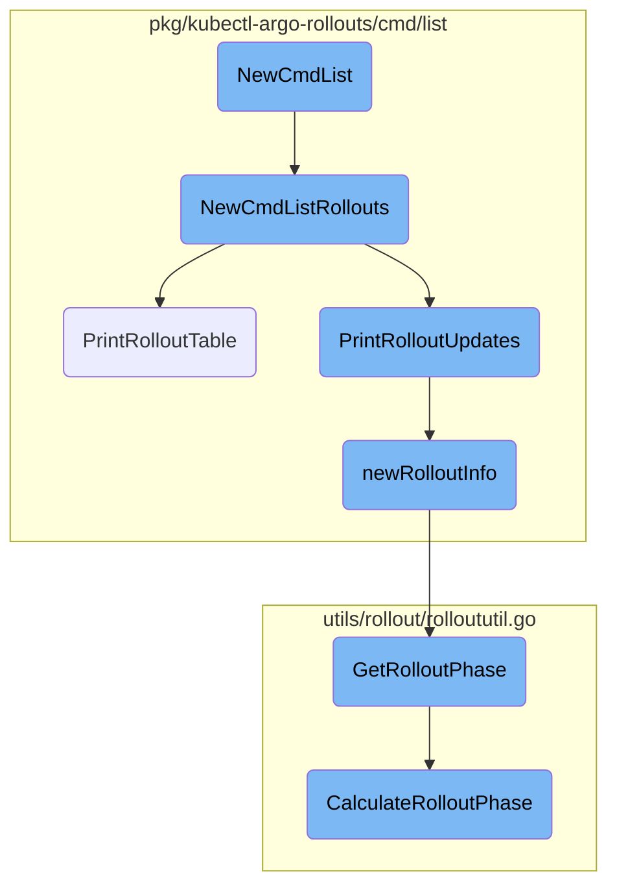
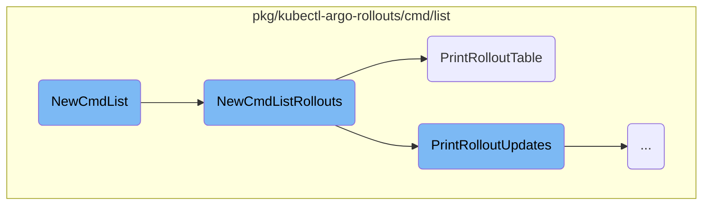
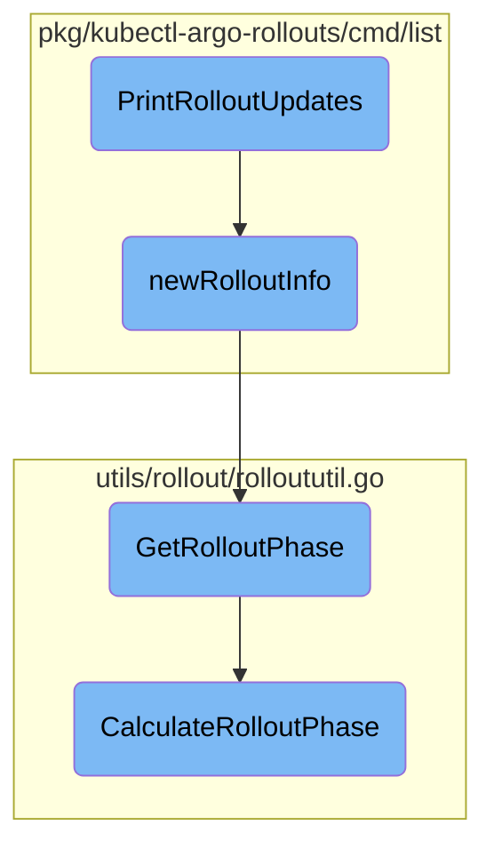

In this document, we will explain the process of listing rollouts or experiments. The process involves initializing the command, setting up subcommands, and displaying the rollouts in a user-friendly format.

The flow starts with initializing the command for listing rollouts or experiments. This command sets up the structure and adds subcommands for listing rollouts and experiments. When listing rollouts, it configures options like namespace and watch mode, retrieves the list of rollouts, and prints them in a table format. The table includes details such as namespace and timestamps if specified. Additionally, the flow includes monitoring changes to rollouts and printing updates, ensuring only meaningful changes are displayed.

Here is a high level diagram of the flow, showing only the most important functions:



# Flow drill down

First, we'll zoom into this section of the flow:



<SwmSnippet path="/pkg/kubectl-argo-rollouts/cmd/list/list.go" line="34">

---

## <SwmToken path="pkg/kubectl-argo-rollouts/cmd/list/list.go" pos="34:2:2" line-data="// NewCmdList returns a new instance of an `rollouts list` command">`NewCmdList`</SwmToken>

<SwmToken path="pkg/kubectl-argo-rollouts/cmd/list/list.go" pos="34:2:2" line-data="// NewCmdList returns a new instance of an `rollouts list` command">`NewCmdList`</SwmToken> initializes the command for listing rollouts or experiments. It sets up the command structure and adds subcommands for listing rollouts and experiments.

```go
// NewCmdList returns a new instance of an `rollouts list` command
func NewCmdList(o *options.ArgoRolloutsOptions) *cobra.Command {
	var cmd = &cobra.Command{
		Use:          "list <rollout|experiment>",
		Short:        "List rollouts or experiments",
		Long:         listUsage,
		Example:      o.Example(listExample),
		SilenceUsage: true,
		RunE: func(c *cobra.Command, args []string) error {
			return o.UsageErr(c)
		},
	}
	cmd.AddCommand(NewCmdListRollouts(o))
	cmd.AddCommand(NewCmdListExperiments(o))
	return cmd
}
```

---

</SwmSnippet>

<SwmSnippet path="/pkg/kubectl-argo-rollouts/cmd/list/list_rollouts.go" line="34">

---

## <SwmToken path="pkg/kubectl-argo-rollouts/cmd/list/list_rollouts.go" pos="34:2:2" line-data="// NewCmdListRollouts returns a new instance of an `rollouts list rollouts` command">`NewCmdListRollouts`</SwmToken>

<SwmToken path="pkg/kubectl-argo-rollouts/cmd/list/list_rollouts.go" pos="34:2:2" line-data="// NewCmdListRollouts returns a new instance of an `rollouts list rollouts` command">`NewCmdListRollouts`</SwmToken> sets up the command specifically for listing rollouts. It configures options such as namespace and watch mode, retrieves the list of rollouts, and calls <SwmToken path="pkg/kubectl-argo-rollouts/cmd/list/list_rollouts.go" pos="82:2:2" line-data="// PrintRolloutTable prints rollouts in table format">`PrintRolloutTable`</SwmToken> to display them.

```go
// NewCmdListRollouts returns a new instance of an `rollouts list rollouts` command
func NewCmdListRollouts(o *options.ArgoRolloutsOptions) *cobra.Command {
	listOptions := ListOptions{
		ArgoRolloutsOptions: *o,
	}

	var cmd = &cobra.Command{
		Use:          "rollouts",
		Short:        "List rollouts",
		Long:         listRolloutsUsage,
		Aliases:      []string{"ro", "rollout"},
		Example:      o.Example(listRolloutsExample),
		SilenceUsage: true,
		RunE: func(c *cobra.Command, args []string) error {
			ctx := c.Context()
			var namespace string
			if listOptions.allNamespaces {
				namespace = metav1.NamespaceAll
			} else {
				namespace = o.Namespace()
			}
```

---

</SwmSnippet>

<SwmSnippet path="/pkg/kubectl-argo-rollouts/cmd/list/list_rollouts.go" line="82">

---

### Displaying Rollouts

<SwmToken path="pkg/kubectl-argo-rollouts/cmd/list/list_rollouts.go" pos="82:2:2" line-data="// PrintRolloutTable prints rollouts in table format">`PrintRolloutTable`</SwmToken> is responsible for printing the list of rollouts in a table format. It handles formatting the output, including namespace and timestamps if specified, and ensures the rollouts are displayed in a user-friendly manner.

```go
// PrintRolloutTable prints rollouts in table format
func (o *ListOptions) PrintRolloutTable(roList *v1alpha1.RolloutList) error {
	if len(roList.Items) == 0 && !o.watch {
		fmt.Fprintln(o.ErrOut, "No resources found.")
		return nil
	}
	w := tabwriter.NewWriter(o.Out, 0, 0, 2, ' ', 0)
	headerStr := headerFmtString
	if o.allNamespaces {
		headerStr = "NAMESPACE\t" + headerStr
	}
	if o.timestamps {
		headerStr = "TIMESTAMP\t" + headerStr
	}
	fmt.Fprintf(w, headerStr)
	for _, ro := range roList.Items {
		roLine := newRolloutInfo(ro)
		fmt.Fprintln(w, roLine.String(o.timestamps, o.allNamespaces))
	}
	_ = w.Flush()
	return nil
```

---

</SwmSnippet>

Now, lets zoom into this section of the flow:



<SwmSnippet path="/pkg/kubectl-argo-rollouts/cmd/list/list_rollouts.go" line="105">

---

## Monitoring Rollout Updates

The <SwmToken path="pkg/kubectl-argo-rollouts/cmd/list/list_rollouts.go" pos="105:2:2" line-data="// PrintRolloutUpdates watches for changes to rollouts and prints the updates">`PrintRolloutUpdates`</SwmToken> function is responsible for monitoring changes to rollouts and printing updates. It sets up a watch on the rollouts and uses a ticker to periodically flush the output. The function maintains a map of previously printed rollout lines to ensure only meaningful changes are printed. If an error occurs while watching, it attempts to <SwmToken path="pkg/kubectl-argo-rollouts/cmd/list/list_rollouts.go" pos="141:31:33" line-data="			// if we get here, it means an error on the watch. try to re-establish the watch">`re-establish`</SwmToken> the watch up to five times before giving up.

```go
// PrintRolloutUpdates watches for changes to rollouts and prints the updates
func (o *ListOptions) PrintRolloutUpdates(ctx context.Context, rolloutIf argoprojv1alpha1.RolloutInterface, roList *v1alpha1.RolloutList) error {
	w := tabwriter.NewWriter(o.Out, 0, 0, 2, ' ', 0)

	opts := o.ListOptions()
	opts.ResourceVersion = roList.ListMeta.ResourceVersion
	watchIf, err := rolloutIf.Watch(ctx, opts)
	if err != nil {
		return err
	}
	// ticker is used to flush the tabwriter every few moments so that table is aligned when there
	// are a flood of results in the watch channel
	ticker := time.NewTicker(500 * time.Millisecond)

	// prevLines remembers the most recent rollout lines we printed, so that we only print new lines
	// when they have have changed in a meaningful way
	prevLines := make(map[infoKey]rolloutInfo)
	for _, ro := range roList.Items {
		roLine := newRolloutInfo(ro)
		prevLines[roLine.key()] = roLine
	}
```

---

</SwmSnippet>

<SwmSnippet path="/pkg/kubectl-argo-rollouts/cmd/list/rollloutinfo.go" line="42">

---

## Creating Rollout Information

The <SwmToken path="pkg/kubectl-argo-rollouts/cmd/list/rollloutinfo.go" pos="42:2:2" line-data="func newRolloutInfo(ro v1alpha1.Rollout) rolloutInfo {">`newRolloutInfo`</SwmToken> function creates a <SwmToken path="pkg/kubectl-argo-rollouts/cmd/list/rollloutinfo.go" pos="42:11:11" line-data="func newRolloutInfo(ro v1alpha1.Rollout) rolloutInfo {">`rolloutInfo`</SwmToken> object from a given rollout. It extracts various details such as the rollout's name, namespace, strategy, step, and status. The function also determines the desired number of replicas and the current state of the rollout, including ready, up-to-date, and available replicas.

```go
func newRolloutInfo(ro v1alpha1.Rollout) rolloutInfo {
	ri := rolloutInfo{}
	ri.name = ro.Name
	ri.namespace = ro.Namespace
	ri.strategy = "unknown"
	ri.step = "-"
	ri.setWeight = "-"

	if ro.Spec.Strategy.Canary != nil {
		ri.strategy = "Canary"
		if ro.Status.CurrentStepIndex != nil && len(ro.Spec.Strategy.Canary.Steps) > 0 {
			ri.step = fmt.Sprintf("%d/%d", *ro.Status.CurrentStepIndex, len(ro.Spec.Strategy.Canary.Steps))
		}
		// NOTE that this is desired weight, not the actual current weight
		ri.setWeight = strconv.Itoa(int(replicasetutil.GetCurrentSetWeight(&ro)))

		// TODO(jessesuen) in the future, we want to calculate the actual weight
		// if ro.Phase.AvailableReplicas == 0 {
		// 	ri.weight = "0"
		// } else {
		// 	ri.weight = fmt.Sprintf("%d", (ro.Phase.UpdatedReplicas*100)/ro.Phase.AvailableReplicas)
```

---

</SwmSnippet>

<SwmSnippet path="/utils/rollout/rolloututil.go" line="23">

---

## Determining Rollout Phase

The <SwmToken path="utils/rollout/rolloututil.go" pos="23:2:2" line-data="// GetRolloutPhase returns a status and message for a rollout. Takes into consideration whether">`GetRolloutPhase`</SwmToken> function determines the current phase of a rollout. It checks if the rollout's generation has been observed and whether the rollout is unpausing. If the rollout's phase is already set, it returns that phase; otherwise, it falls back to calculating the phase <SwmToken path="utils/rollout/rolloututil.go" pos="41:20:22" line-data="	// for v0.10 and below, fall back to client-side calculation">`client-side`</SwmToken> using the <SwmToken path="utils/rollout/rolloututil.go" pos="25:10:10" line-data="// use this instead of CalculateRolloutPhase">`CalculateRolloutPhase`</SwmToken> function.

```go
// GetRolloutPhase returns a status and message for a rollout. Takes into consideration whether
// or not metadata.generation was observed in status.observedGeneration
// use this instead of CalculateRolloutPhase
func GetRolloutPhase(ro *v1alpha1.Rollout) (v1alpha1.RolloutPhase, string) {
	if !isGenerationObserved(ro) {
		return v1alpha1.RolloutPhaseProgressing, "waiting for rollout spec update to be observed"
	}
	if IsUnpausing(ro) {
		return v1alpha1.RolloutPhaseProgressing, "waiting for rollout to unpause"
	}
	if ro.Spec.TemplateResolvedFromRef && !isWorkloadGenerationObserved(ro) {
		return v1alpha1.RolloutPhaseProgressing, "waiting for rollout spec update to be observed for the reference workload"
	}

	if ro.Status.Phase != "" {
		// for 1.0+ phase/message is calculated controller side
		return ro.Status.Phase, ro.Status.Message
	}
	// for v0.10 and below, fall back to client-side calculation
	return CalculateRolloutPhase(ro.Spec, ro.Status)
}
```

---

</SwmSnippet>

<SwmSnippet path="/utils/rollout/rolloututil.go" line="84">

---

### Calculating Rollout Phase

The <SwmToken path="utils/rollout/rolloututil.go" pos="84:2:2" line-data="// CalculateRolloutPhase calculates a rollout phase and message for the given rollout based on">`CalculateRolloutPhase`</SwmToken> function calculates the phase of a rollout based on its specification and status. It checks various conditions such as invalid specifications, paused states, and the progress of replica updates. The function determines if the rollout is progressing, paused, degraded, or healthy based on these conditions.

```go
// CalculateRolloutPhase calculates a rollout phase and message for the given rollout based on
// rollout spec and status. This function is intended to be used by the controller (and not
// by clients). Clients should instead call GetRolloutPhase, which takes into consideration
// status.observedGeneration
func CalculateRolloutPhase(spec v1alpha1.RolloutSpec, status v1alpha1.RolloutStatus) (v1alpha1.RolloutPhase, string) {
	ro := v1alpha1.Rollout{
		Spec:   spec,
		Status: status,
	}
	for _, cond := range ro.Status.Conditions {
		if cond.Type == v1alpha1.InvalidSpec {
			return v1alpha1.RolloutPhaseDegraded, fmt.Sprintf("%s: %s", v1alpha1.InvalidSpec, cond.Message)
		}
		switch cond.Reason {
		case conditions.RolloutAbortedReason, conditions.TimedOutReason:
			return v1alpha1.RolloutPhaseDegraded, fmt.Sprintf("%s: %s", cond.Reason, cond.Message)
		}
	}
	if ro.Spec.Paused {
		return v1alpha1.RolloutPhasePaused, "manually paused"
	}
```

---

</SwmSnippet>

&nbsp;

*This is an auto-generated document by Swimm 🌊 and has not yet been verified by a human*

<SwmMeta version="3.0.0" repo-id="Z2l0aHViJTNBJTNBaW50dWl0LWFyZ28tcm9sbG91dHMtZGVtbyUzQSUzQVN3aW1tLURlbW8=" repo-name="intuit-argo-rollouts-demo"><sup>Powered by [Swimm](/)</sup></SwmMeta>
