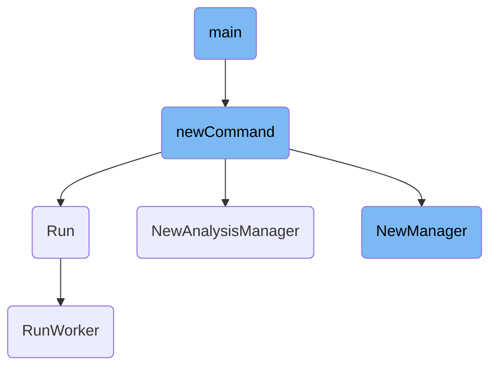

This document explains the flow of initializing and running the main deployment controller for Kubernetes using Argo Rollouts. The process involves setting up the command, initializing the manager, and running the controller threads.

The flow starts with setting up the command that includes various configurations and options. Then, it initializes the manager responsible for managing different controllers. Finally, the controller threads are started, which process items from the work queue continuously.

# Flow drill down



<SwmSnippet path="/cmd/rollouts-controller/main.go" line="324">

---

## Executing the Command

The <SwmToken path="cmd/rollouts-controller/main.go" pos="324:2:2" line-data="func main() {">`main`</SwmToken> function is responsible for executing the command that initializes the deployment controller. It calls <SwmToken path="cmd/rollouts-controller/main.go" pos="325:7:13" line-data="	if err := newCommand().Execute(); err != nil {">`newCommand().Execute()`</SwmToken>, which sets up and runs the command. If an error occurs during execution, it prints the error and exits the program.

```go
func main() {
	if err := newCommand().Execute(); err != nil {
		fmt.Println(err)
		os.Exit(1)
	}
}
```

---

</SwmSnippet>

<SwmSnippet path="/cmd/rollouts-controller/main.go" line="52">

---

## Setting Up the Command

The <SwmToken path="cmd/rollouts-controller/main.go" pos="52:2:2" line-data="func newCommand() *cobra.Command {">`newCommand`</SwmToken> function sets up the command with various configurations and options. It initializes client configurations, logging settings, and other parameters required for the deployment controller. It also sets up signal handling for graceful shutdown and initializes various Kubernetes clients and informers.

```go
func newCommand() *cobra.Command {
	var (
		clientConfig                   clientcmd.ClientConfig
		rolloutResyncPeriod            int64
		logLevel                       string
		logFormat                      string
		klogLevel                      int
		metricsPort                    int
		healthzPort                    int
		instanceID                     string
		qps                            float32
		burst                          int
		rolloutThreads                 int
		experimentThreads              int
		analysisThreads                int
		serviceThreads                 int
		ingressThreads                 int
		istioVersion                   string
		trafficSplitVersion            string
		traefikAPIGroup                string
		traefikVersion                 string
```

---

</SwmSnippet>

<SwmSnippet path="/cmd/rollouts-controller/main.go" line="214">

---

### Initializing the Manager

The command execution flow includes initializing the manager, which is responsible for managing the various controllers. Depending on the enabled controllers, it either initializes an `AnalysisManager` or a general <SwmToken path="cmd/rollouts-controller/main.go" pos="214:8:8" line-data="			var cm *controller.Manager">`Manager`</SwmToken> to handle rollouts, services, ingress, experiments, and analysis runs.

```go
			var cm *controller.Manager

			enabledControllers, err := getEnabledControllers(controllersEnabled)
			checkError(err)

			// currently only supports running analysis controller independently
			if enabledControllers[controllerAnalysis] {
				log.Info("Running only analysis controller")
				cm = controller.NewAnalysisManager(
					namespace,
					kubeClient,
					argoprojClient,
					jobInformerFactory.Batch().V1().Jobs(),
					tolerantinformer.NewTolerantAnalysisRunInformer(dynamicInformerFactory),
					tolerantinformer.NewTolerantAnalysisTemplateInformer(dynamicInformerFactory),
					tolerantinformer.NewTolerantClusterAnalysisTemplateInformer(clusterDynamicInformerFactory),
					resyncDuration,
					metricsPort,
					healthzPort,
					k8sRequestProvider,
					dynamicInformerFactory,
```

---

</SwmSnippet>

<SwmSnippet path="/ingress/ingress.go" line="105">

---

## Running the Controller

The <SwmToken path="ingress/ingress.go" pos="105:2:2" line-data="// Run starts the controller threads">`Run`</SwmToken> function in the ingress controller starts the controller threads. It initializes worker threads that process items from the work queue. The function ensures that all workers are started and waits for the context to be done before stopping the workers.

```go
// Run starts the controller threads
func (c *Controller) Run(ctx context.Context, threadiness int) error {
	log.Info("Starting Ingress workers")
	wg := sync.WaitGroup{}
	for i := 0; i < threadiness; i++ {
		wg.Add(1)
		go wait.Until(func() {
			controllerutil.RunWorker(ctx, c.ingressWorkqueue, logutil.IngressKey, c.syncIngress, c.metricServer)
			wg.Done()
			log.Debug("Ingress worker has stopped")
		}, time.Second, ctx.Done())
	}

	log.Info("Started Ingress workers")
	<-ctx.Done()
	wg.Wait()
	log.Info("All ingress workers have stopped")

	return nil
}
```

---

</SwmSnippet>

<SwmSnippet path="/controller/controller.go" line="170">

---

## Creating the Analysis Manager

The <SwmToken path="controller/controller.go" pos="170:2:2" line-data="func NewAnalysisManager(">`NewAnalysisManager`</SwmToken> function initializes the analysis manager, which is responsible for managing analysis runs. It sets up various informers, work queues, and metrics servers required for the analysis controller.

```go
func NewAnalysisManager(
	namespace string,
	kubeclientset kubernetes.Interface,
	argoprojclientset clientset.Interface,
	jobInformer batchinformers.JobInformer,
	analysisRunInformer informers.AnalysisRunInformer,
	analysisTemplateInformer informers.AnalysisTemplateInformer,
	clusterAnalysisTemplateInformer informers.ClusterAnalysisTemplateInformer,
	resyncPeriod time.Duration,
	metricsPort int,
	healthzPort int,
	k8sRequestProvider *metrics.K8sRequestsCountProvider,
	dynamicInformerFactory dynamicinformer.DynamicSharedInformerFactory,
	clusterDynamicInformerFactory dynamicinformer.DynamicSharedInformerFactory,
	namespaced bool,
	kubeInformerFactory kubeinformers.SharedInformerFactory,
	jobInformerFactory kubeinformers.SharedInformerFactory,
) *Manager {
	runtime.Must(rolloutscheme.AddToScheme(scheme.Scheme))
	log.Info("Creating event broadcaster")

```

---

</SwmSnippet>

<SwmSnippet path="/controller/controller.go" line="249">

---

## Creating the General Manager

The <SwmToken path="controller/controller.go" pos="249:2:2" line-data="// NewManager returns a new manager to manage all the controllers">`NewManager`</SwmToken> function initializes the general manager, which manages all the controllers including rollouts, services, ingress, experiments, and analysis runs. It sets up various informers, work queues, and metrics servers required for these controllers.

```go
// NewManager returns a new manager to manage all the controllers
func NewManager(
	namespace string,
	kubeclientset kubernetes.Interface,
	argoprojclientset clientset.Interface,
	dynamicclientset dynamic.Interface,
	smiclientset smiclientset.Interface,
	discoveryClient discovery.DiscoveryInterface,
	replicaSetInformer appsinformers.ReplicaSetInformer,
	servicesInformer coreinformers.ServiceInformer,
	ingressWrap *ingressutil.IngressWrap,
	jobInformer batchinformers.JobInformer,
	rolloutsInformer informers.RolloutInformer,
	experimentsInformer informers.ExperimentInformer,
	analysisRunInformer informers.AnalysisRunInformer,
	analysisTemplateInformer informers.AnalysisTemplateInformer,
	clusterAnalysisTemplateInformer informers.ClusterAnalysisTemplateInformer,
	istioPrimaryDynamicClient dynamic.Interface,
	istioVirtualServiceInformer cache.SharedIndexInformer,
	istioDestinationRuleInformer cache.SharedIndexInformer,
	notificationConfigMapInformerFactory kubeinformers.SharedInformerFactory,
```

---

</SwmSnippet>

<SwmSnippet path="/utils/controller/controller.go" line="102">

---

## Running the Worker

The <SwmToken path="utils/controller/controller.go" pos="102:2:2" line-data="// RunWorker is a long-running function that will continually call the">`RunWorker`</SwmToken> function is a <SwmToken path="utils/controller/controller.go" pos="102:8:10" line-data="// RunWorker is a long-running function that will continually call the">`long-running`</SwmToken> function that continually calls <SwmToken path="utils/controller/controller.go" pos="103:2:2" line-data="// processNextWorkItem function in order to read and process a message on the">`processNextWorkItem`</SwmToken> to read and process messages from the work queue. This function ensures that the work queue is processed continuously.

```go
// RunWorker is a long-running function that will continually call the
// processNextWorkItem function in order to read and process a message on the
// workqueue.
func RunWorker(ctx context.Context, workqueue workqueue.RateLimitingInterface, objType string, syncHandler func(context.Context, string) error, metricServer *metrics.MetricsServer) {
	for processNextWorkItem(ctx, workqueue, objType, syncHandler, metricServer) {
	}
}
```

---

</SwmSnippet>

&nbsp;

*This is an auto-generated document by Swimm 🌊 and has not yet been verified by a human*

<SwmMeta version="3.0.0" repo-id="Z2l0aHViJTNBJTNBaW50dWl0LWFyZ28tcm9sbG91dHMtZGVtbyUzQSUzQVN3aW1tLURlbW8=" repo-name="intuit-argo-rollouts-demo"><sup>Powered by [Swimm](/)</sup></SwmMeta>
