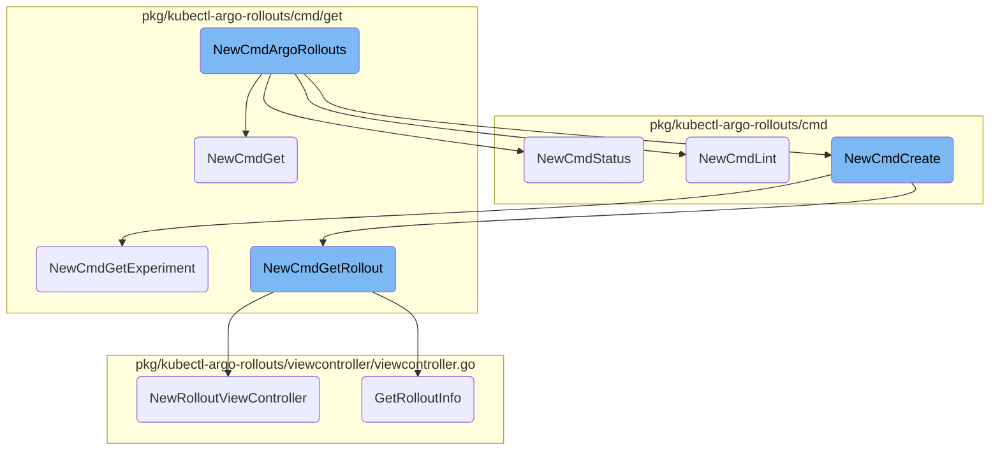
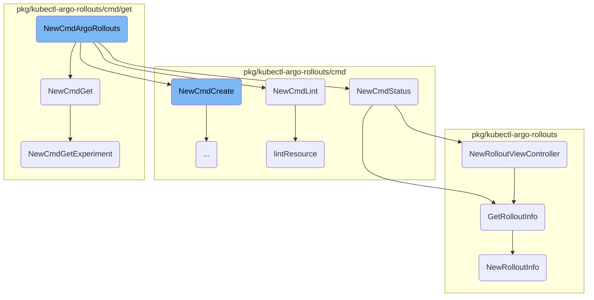
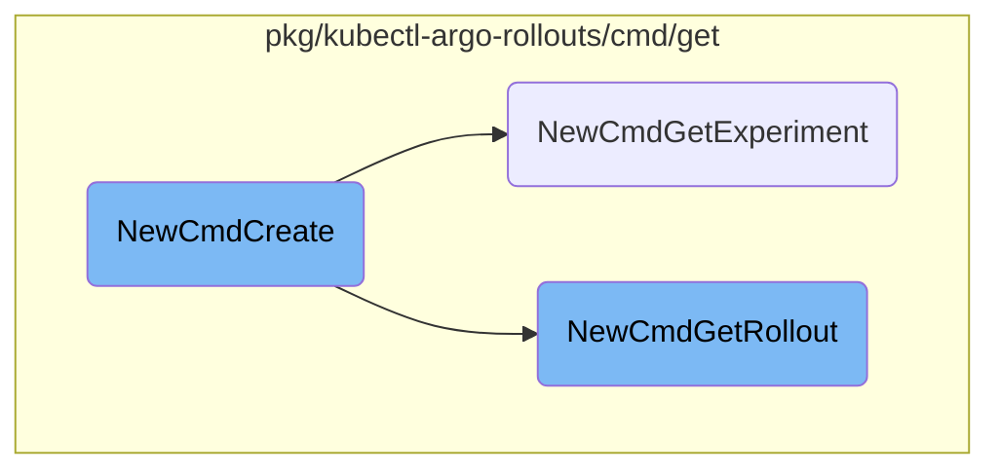
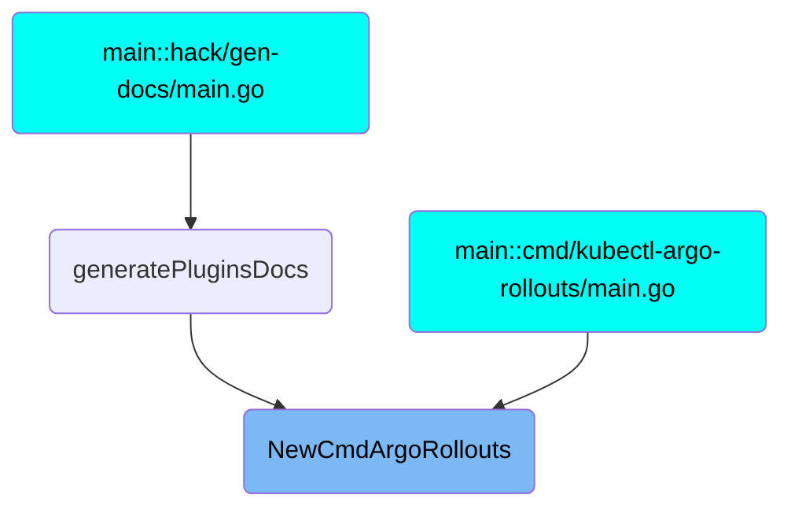

This document provides an overview of how the <SwmToken path="pkg/kubectl-argo-rollouts/cmd/cmd.go" pos="46:2:2" line-data="// NewCmdArgoRollouts returns new instance of rollouts command.">`NewCmdArgoRollouts`</SwmToken> function initializes and manages various commands for Argo Rollouts. It explains the setup of subcommands like <SwmToken path="pkg/kubectl-argo-rollouts/cmd/cmd.go" pos="61:5:5" line-data="	cmd.AddCommand(create.NewCmdCreate(o))">`create`</SwmToken>, <SwmToken path="pkg/kubectl-argo-rollouts/cmd/cmd.go" pos="62:5:5" line-data="	cmd.AddCommand(get.NewCmdGet(o))">`get`</SwmToken>, <SwmToken path="pkg/kubectl-argo-rollouts/cmd/cmd.go" pos="63:5:5" line-data="	cmd.AddCommand(lint.NewCmdLint(o))">`lint`</SwmToken>, and <SwmToken path="pkg/kubectl-argo-rollouts/cmd/status/status.go" pos="38:19:19" line-data="// NewCmdStatus returns a new instance of a `rollouts status` command">`status`</SwmToken>, which are essential for different operations on Argo Rollouts.

The <SwmToken path="pkg/kubectl-argo-rollouts/cmd/cmd.go" pos="46:2:2" line-data="// NewCmdArgoRollouts returns new instance of rollouts command.">`NewCmdArgoRollouts`</SwmToken> function is like the main control center for managing Argo Rollouts. It sets up different subcommands that allow users to perform various tasks. For example, the <SwmToken path="pkg/kubectl-argo-rollouts/cmd/cmd.go" pos="61:5:5" line-data="	cmd.AddCommand(create.NewCmdCreate(o))">`create`</SwmToken> command helps in creating new rollouts, the <SwmToken path="pkg/kubectl-argo-rollouts/cmd/cmd.go" pos="62:5:5" line-data="	cmd.AddCommand(get.NewCmdGet(o))">`get`</SwmToken> command retrieves details about existing rollouts, the <SwmToken path="pkg/kubectl-argo-rollouts/cmd/cmd.go" pos="63:5:5" line-data="	cmd.AddCommand(lint.NewCmdLint(o))">`lint`</SwmToken> command checks the rollout configurations for errors, and the <SwmToken path="pkg/kubectl-argo-rollouts/cmd/status/status.go" pos="38:19:19" line-data="// NewCmdStatus returns a new instance of a `rollouts status` command">`status`</SwmToken> command shows the current status of a rollout. This setup ensures that users have a comprehensive tool to manage their rollouts effectively.

Here is a high level diagram of the flow, showing only the most important functions:



# Flow drill down

First, we'll zoom into this section of the flow:



<SwmSnippet path="/pkg/kubectl-argo-rollouts/cmd/cmd.go" line="46">

---

## Managing Argo Rollouts commands

The <SwmToken path="pkg/kubectl-argo-rollouts/cmd/cmd.go" pos="46:2:2" line-data="// NewCmdArgoRollouts returns new instance of rollouts command.">`NewCmdArgoRollouts`</SwmToken> function initializes the main command for managing Argo Rollouts. It sets up various subcommands like <SwmToken path="pkg/kubectl-argo-rollouts/cmd/cmd.go" pos="61:5:5" line-data="	cmd.AddCommand(create.NewCmdCreate(o))">`create`</SwmToken>, <SwmToken path="pkg/kubectl-argo-rollouts/cmd/cmd.go" pos="62:5:5" line-data="	cmd.AddCommand(get.NewCmdGet(o))">`get`</SwmToken>, <SwmToken path="pkg/kubectl-argo-rollouts/cmd/cmd.go" pos="63:5:5" line-data="	cmd.AddCommand(lint.NewCmdLint(o))">`lint`</SwmToken>, <SwmToken path="pkg/kubectl-argo-rollouts/cmd/status/status.go" pos="38:19:19" line-data="// NewCmdStatus returns a new instance of a `rollouts status` command">`status`</SwmToken>, and others, which are essential for different operations on Argo Rollouts. This function ensures that users have a comprehensive CLI tool to manage their rollouts effectively.

```go
// NewCmdArgoRollouts returns new instance of rollouts command.
func NewCmdArgoRollouts(o *options.ArgoRolloutsOptions) *cobra.Command {
	cmd := &cobra.Command{
		Use:               "kubectl-argo-rollouts COMMAND",
		Short:             "Manage argo rollouts",
		Long:              "This command consists of multiple subcommands which can be used to manage Argo Rollouts.",
		Example:           o.Example(example),
		SilenceUsage:      true,
		PersistentPreRunE: o.PersistentPreRunE,
		RunE: func(c *cobra.Command, args []string) error {
			return o.UsageErr(c)
		},
	}

	o.AddKubectlFlags(cmd)
	cmd.AddCommand(create.NewCmdCreate(o))
	cmd.AddCommand(get.NewCmdGet(o))
	cmd.AddCommand(lint.NewCmdLint(o))
	cmd.AddCommand(list.NewCmdList(o))
	cmd.AddCommand(pause.NewCmdPause(o))
	cmd.AddCommand(promote.NewCmdPromote(o))
```

---

</SwmSnippet>

<SwmSnippet path="/pkg/kubectl-argo-rollouts/cmd/get/get.go" line="107">

---

## Retrieving Rollout Details

The <SwmToken path="pkg/kubectl-argo-rollouts/cmd/get/get.go" pos="107:2:2" line-data="// NewCmdGet returns a new instance of an `rollouts get` command">`NewCmdGet`</SwmToken> function is responsible for retrieving details about rollouts and experiments. It adds subcommands like <SwmToken path="pkg/kubectl-argo-rollouts/cmd/get/get.go" pos="119:5:5" line-data="	cmd.AddCommand(NewCmdGetRollout(o))">`NewCmdGetRollout`</SwmToken> and <SwmToken path="pkg/kubectl-argo-rollouts/cmd/get/get.go" pos="120:5:5" line-data="	cmd.AddCommand(NewCmdGetExperiment(o))">`NewCmdGetExperiment`</SwmToken> to provide specific details about these resources. This function helps users to fetch and view detailed information about their rollouts and experiments.

```go
// NewCmdGet returns a new instance of an `rollouts get` command
func NewCmdGet(o *options.ArgoRolloutsOptions) *cobra.Command {
	var cmd = &cobra.Command{
		Use:          "get <rollout|experiment> RESOURCE_NAME",
		Short:        "Get details about rollouts and experiments",
		Long:         getUsage,
		Example:      o.Example(getExample),
		SilenceUsage: true,
		RunE: func(c *cobra.Command, args []string) error {
			return o.UsageErr(c)
		},
	}
	cmd.AddCommand(NewCmdGetRollout(o))
	cmd.AddCommand(NewCmdGetExperiment(o))
	return cmd
}
```

---

</SwmSnippet>

<SwmSnippet path="/pkg/kubectl-argo-rollouts/cmd/status/status.go" line="38">

---

## Showing Rollout Status

The <SwmToken path="pkg/kubectl-argo-rollouts/cmd/status/status.go" pos="38:2:2" line-data="// NewCmdStatus returns a new instance of a `rollouts status` command">`NewCmdStatus`</SwmToken> function shows the status of a specific rollout. It creates a <SwmToken path="pkg/kubectl-argo-rollouts/viewcontroller/viewcontroller.go" pos="67:29:29" line-data="func NewRolloutViewController(namespace string, name string, kubeClient kubernetes.Interface, rolloutClient rolloutclientset.Interface) *RolloutViewController {">`RolloutViewController`</SwmToken> to monitor the rollout's status and provides options to watch the status until the rollout is complete. This function is crucial for users to monitor the health and progress of their rollouts.

```go
// NewCmdStatus returns a new instance of a `rollouts status` command
func NewCmdStatus(o *options.ArgoRolloutsOptions) *cobra.Command {
	statusOptions := StatusOptions{
		ArgoRolloutsOptions: *o,
	}

	var cmd = &cobra.Command{
		Use:          "status ROLLOUT_NAME",
		Short:        "Show the status of a rollout",
		Long:         statusLong,
		Example:      o.Example(statusExample),
		SilenceUsage: true,
		RunE: func(c *cobra.Command, args []string) error {
			if len(args) != 1 {
				return o.UsageErr(c)
			}
			name := args[0]
			controller := viewcontroller.NewRolloutViewController(o.Namespace(), name, statusOptions.KubeClientset(), statusOptions.RolloutsClientset())
			ctx, cancel := context.WithCancel(context.Background())
			defer cancel()
			signals.SetupSignalHandler(cancel)
```

---

</SwmSnippet>

<SwmSnippet path="/pkg/kubectl-argo-rollouts/cmd/lint/lint.go" line="40">

---

## Linting Rollout Resources

The <SwmToken path="pkg/kubectl-argo-rollouts/cmd/lint/lint.go" pos="40:2:2" line-data="// NewCmdLint returns a new instance of a `rollouts lint` command">`NewCmdLint`</SwmToken> function validates a new Rollout resource from a file. It uses the <SwmToken path="pkg/kubectl-argo-rollouts/cmd/lint/lint.go" pos="56:5:5" line-data="			return lintOptions.lintResource(lintOptions.File)">`lintResource`</SwmToken> method to perform the validation. This function ensures that the rollout configurations are correct and adhere to the required standards before deployment.

```go
// NewCmdLint returns a new instance of a `rollouts lint` command
func NewCmdLint(o *options.ArgoRolloutsOptions) *cobra.Command {
	lintOptions := LintOptions{
		ArgoRolloutsOptions: *o,
	}
	var cmd = &cobra.Command{
		Use:          "lint",
		Short:        "Lint and validate a Rollout",
		Long:         "This command lints and validates a new Rollout resource from a file.",
		Example:      o.Example(lintExample),
		SilenceUsage: true,
		RunE: func(c *cobra.Command, args []string) error {
			if lintOptions.File == "" {
				return o.UsageErr(c)
			}

			return lintOptions.lintResource(lintOptions.File)
		},
	}
	cmd.Flags().StringVarP(&lintOptions.File, "filename", "f", "", "File to lint")
	return cmd
```

---

</SwmSnippet>

<SwmSnippet path="/pkg/kubectl-argo-rollouts/cmd/lint/lint.go" line="67">

---

### Validating Rollout Resources

The <SwmToken path="pkg/kubectl-argo-rollouts/cmd/lint/lint.go" pos="67:9:9" line-data="func (l *LintOptions) lintResource(path string) error {">`lintResource`</SwmToken> method reads and validates the Rollout resource file. It checks for syntax errors, unknown fields, and ensures that all referenced resources are correctly defined. This method is essential for catching configuration issues early in the deployment process.

```go
func (l *LintOptions) lintResource(path string) error {
	fileBytes, err := os.ReadFile(path)
	if err != nil {
		return err
	}

	var un unstructured.Unstructured
	var refResource validation.ReferencedResources
	var fileRollouts []v1alpha1.Rollout

	decoder := goyaml.NewDecoder(bytes.NewReader(fileBytes))
	for {
		var value any
		if err := decoder.Decode(&value); err != nil {
			if err != io.EOF {
				return err
			}
			break
		}
		if value == nil {
			continue
```

---

</SwmSnippet>

<SwmSnippet path="/pkg/kubectl-argo-rollouts/viewcontroller/viewcontroller.go" line="67">

---

## Creating Rollout View Controller

The <SwmToken path="pkg/kubectl-argo-rollouts/viewcontroller/viewcontroller.go" pos="67:2:2" line-data="func NewRolloutViewController(namespace string, name string, kubeClient kubernetes.Interface, rolloutClient rolloutclientset.Interface) *RolloutViewController {">`NewRolloutViewController`</SwmToken> function initializes a new <SwmToken path="pkg/kubectl-argo-rollouts/viewcontroller/viewcontroller.go" pos="67:29:29" line-data="func NewRolloutViewController(namespace string, name string, kubeClient kubernetes.Interface, rolloutClient rolloutclientset.Interface) *RolloutViewController {">`RolloutViewController`</SwmToken> to manage and monitor the state of a rollout. It sets up informers to keep track of the rollout's status and updates. This function is key to providing real-time monitoring and control over rollouts.

```go
func NewRolloutViewController(namespace string, name string, kubeClient kubernetes.Interface, rolloutClient rolloutclientset.Interface) *RolloutViewController {
	vc := newViewController(namespace, name, kubeClient, rolloutClient)
	vc.cacheSyncs = append(
		vc.cacheSyncs,
		vc.rolloutsInformerFactory.Argoproj().V1alpha1().Rollouts().Informer().HasSynced,
	)
	rvc := RolloutViewController{
		viewController: vc,
	}
	vc.getObj = func() (any, error) {
		return rvc.GetRolloutInfo()
	}
	return &rvc
}
```

---

</SwmSnippet>

<SwmSnippet path="/pkg/kubectl-argo-rollouts/viewcontroller/viewcontroller.go" line="190">

---

### Fetching Rollout Information

The <SwmToken path="pkg/kubectl-argo-rollouts/viewcontroller/viewcontroller.go" pos="190:9:9" line-data="func (c *RolloutViewController) GetRolloutInfo() (*rollout.RolloutInfo, error) {">`GetRolloutInfo`</SwmToken> method retrieves detailed information about a rollout, including its status, replica sets, pods, experiments, and analysis runs. This method consolidates all relevant data to provide a comprehensive view of the rollout's state.

```go
func (c *RolloutViewController) GetRolloutInfo() (*rollout.RolloutInfo, error) {
	ro, err := c.rolloutLister.Get(c.name)
	if err != nil {
		return nil, err
	}

	allReplicaSets, err := c.replicaSetLister.List(labels.Everything())
	if err != nil {
		return nil, err
	}

	allPods, err := c.podLister.List(labels.Everything())
	if err != nil {
		return nil, err
	}

	allExps, err := c.experimentLister.List(labels.Everything())
	if err != nil {
		return nil, err
	}

```

---

</SwmSnippet>

<SwmSnippet path="/pkg/kubectl-argo-rollouts/info/rollout_info.go" line="20">

---

## Creating Rollout Information

The <SwmToken path="pkg/kubectl-argo-rollouts/info/rollout_info.go" pos="20:2:2" line-data="func NewRolloutInfo(">`NewRolloutInfo`</SwmToken> function constructs a <SwmToken path="pkg/kubectl-argo-rollouts/info/rollout_info.go" pos="27:5:5" line-data=") *rollout.RolloutInfo {">`RolloutInfo`</SwmToken> object that encapsulates all the details about a rollout. It includes information about the rollout's strategy, steps, weights, containers, and status. This function is crucial for generating a complete and accurate representation of the rollout's state.

```go
func NewRolloutInfo(
	ro *v1alpha1.Rollout,
	allReplicaSets []*appsv1.ReplicaSet,
	allPods []*corev1.Pod,
	allExperiments []*v1alpha1.Experiment,
	allARs []*v1alpha1.AnalysisRun,
	workloadRef *appsv1.Deployment,
) *rollout.RolloutInfo {

	roInfo := rollout.RolloutInfo{
		ObjectMeta: &v1.ObjectMeta{
			Name:              ro.Name,
			Namespace:         ro.Namespace,
			Labels:            ro.Labels,
			Annotations:       ro.Annotations,
			UID:               ro.UID,
			CreationTimestamp: ro.CreationTimestamp,
			ResourceVersion:   ro.ObjectMeta.ResourceVersion,
		},
	}

```

---

</SwmSnippet>

<SwmSnippet path="/pkg/kubectl-argo-rollouts/cmd/get/get_experiment.go" line="29">

---

## Retrieving Experiment Details

The <SwmToken path="pkg/kubectl-argo-rollouts/cmd/get/get_experiment.go" pos="29:2:2" line-data="// NewCmdGetExperiment returns a new instance of an `rollouts get experiment` command">`NewCmdGetExperiment`</SwmToken> function retrieves details about a specific experiment. It creates an <SwmToken path="pkg/kubectl-argo-rollouts/viewcontroller/viewcontroller.go" pos="59:2:2" line-data="type ExperimentViewController struct {">`ExperimentViewController`</SwmToken> to monitor the experiment's status and provides options to watch for live updates. This function helps users to get detailed insights into their experiments.

```go
// NewCmdGetExperiment returns a new instance of an `rollouts get experiment` command
func NewCmdGetExperiment(o *options.ArgoRolloutsOptions) *cobra.Command {
	getOptions := GetOptions{
		ArgoRolloutsOptions: *o,
	}

	var cmd = &cobra.Command{
		Use:          "experiment EXPERIMENT_NAME",
		Aliases:      []string{"exp", "experiments"},
		Short:        "Get details about an Experiment",
		Long:         "Get details about and visual representation of a experiment. " + getUsageCommon,
		Example:      o.Example(experimentExample),
		SilenceUsage: true,
		RunE: func(c *cobra.Command, args []string) error {
			if len(args) != 1 {
				return o.UsageErr(c)
			}
			name := args[0]
			controller := viewcontroller.NewExperimentViewController(o.Namespace(), name, getOptions.KubeClientset(), getOptions.RolloutsClientset())
			ctx := context.Background()
			controller.Start(ctx)
```

---

</SwmSnippet>

Now, lets zoom into this section of the flow:



<SwmSnippet path="/pkg/kubectl-argo-rollouts/cmd/create/create.go" line="68">

---

## Creating Kubernetes Resources

The <SwmToken path="pkg/kubectl-argo-rollouts/cmd/create/create.go" pos="68:2:2" line-data="// NewCmdCreate returns a new instance of an `rollouts create` command">`NewCmdCreate`</SwmToken> function is responsible for creating various Kubernetes resources such as Rollouts, Experiments, <SwmToken path="pkg/client/listers/rollouts/v1alpha1/analysistemplate.go" pos="35:1:1" line-data="	AnalysisTemplates(namespace string) AnalysisTemplateNamespaceLister">`AnalysisTemplates`</SwmToken>, <SwmToken path="pkg/apis/rollouts/validation/validation_references.go" pos="38:1:1" line-data="	ClusterAnalysisTemplates []*v1alpha1.ClusterAnalysisTemplate">`ClusterAnalysisTemplates`</SwmToken>, and <SwmToken path="pkg/client/listers/rollouts/v1alpha1/analysisrun.go" pos="35:1:1" line-data="	AnalysisRuns(namespace string) AnalysisRunNamespaceLister">`AnalysisRuns`</SwmToken>. It reads the resource definitions from files and creates them in the Kubernetes cluster. If the <SwmToken path="pkg/kubectl-argo-rollouts/cmd/create/create.go" pos="100:15:16" line-data="					getCmd.SetArgs([]string{obj.Name, &quot;--watch&quot;})">`--watch`</SwmToken> flag is set, it will also monitor the created resource for live updates.

```go
// NewCmdCreate returns a new instance of an `rollouts create` command
func NewCmdCreate(o *options.ArgoRolloutsOptions) *cobra.Command {
	createOptions := CreateOptions{
		ArgoRolloutsOptions: *o,
	}
	var cmd = &cobra.Command{
		Use:          "create",
		Short:        "Create a Rollout, Experiment, AnalysisTemplate, ClusterAnalysisTemplate, or AnalysisRun resource",
		Long:         "This command creates a new Rollout, Experiment, AnalysisTemplate, ClusterAnalysisTemplate, or AnalysisRun resource from a file.",
		Example:      o.Example(createExample),
		SilenceUsage: true,
		RunE: func(c *cobra.Command, args []string) error {
			createOptions.DynamicClientset()
			if len(createOptions.Files) == 0 {
				return o.UsageErr(c)
			}
			if len(createOptions.Files) > 1 && createOptions.Watch {
				return errors.New("Cannot watch multiple resources")
			}

			var objs []runtime.Object
```

---

</SwmSnippet>

<SwmSnippet path="/pkg/kubectl-argo-rollouts/cmd/create/create.go" line="80">

---

### Handling Multiple Files and Watch Flag

The function checks if multiple files are provided and if the <SwmToken path="pkg/kubectl-argo-rollouts/cmd/create/create.go" pos="100:15:16" line-data="					getCmd.SetArgs([]string{obj.Name, &quot;--watch&quot;})">`--watch`</SwmToken> flag is set. If both conditions are true, it returns an error because watching multiple resources simultaneously is not supported.

```go
			createOptions.DynamicClientset()
			if len(createOptions.Files) == 0 {
				return o.UsageErr(c)
			}
			if len(createOptions.Files) > 1 && createOptions.Watch {
				return errors.New("Cannot watch multiple resources")
			}
```

---

</SwmSnippet>

<SwmSnippet path="/pkg/kubectl-argo-rollouts/cmd/create/create.go" line="88">

---

### Creating Resources from Files

The function iterates over the provided files, creates the resources, and appends them to a list. If any error occurs during resource creation, it returns the error.

```go
			var objs []runtime.Object
			for _, f := range createOptions.Files {
				obj, err := createOptions.createResource(f)
				if err != nil {
					return err
				}
				objs = append(objs, obj)
			}
```

---

</SwmSnippet>

<SwmSnippet path="/pkg/kubectl-argo-rollouts/cmd/create/create.go" line="96">

---

### Watching Created Resources

If the <SwmToken path="pkg/kubectl-argo-rollouts/cmd/create/create.go" pos="100:15:16" line-data="					getCmd.SetArgs([]string{obj.Name, &quot;--watch&quot;})">`--watch`</SwmToken> flag is set, the function determines the type of the created resource (Rollout or Experiment) and executes the corresponding <SwmToken path="pkg/kubectl-argo-rollouts/cmd/create/create.go" pos="99:5:5" line-data="					getCmd := get.NewCmdGetRollout(o)">`get`</SwmToken> command to watch live updates.

```go
			if createOptions.Watch {
				switch obj := objs[0].(type) {
				case *v1alpha1.Rollout:
					getCmd := get.NewCmdGetRollout(o)
					getCmd.SetArgs([]string{obj.Name, "--watch"})
					return getCmd.Execute()
				case *v1alpha1.Experiment:
					getCmd := get.NewCmdGetExperiment(o)
					getCmd.SetArgs([]string{obj.Name, "--watch"})
					return getCmd.Execute()
				default:
					return errors.New("Can only watch resources of type Rollout or Experiment")
				}
			}
```

---

</SwmSnippet>

<SwmSnippet path="/pkg/kubectl-argo-rollouts/cmd/get/get_rollout.go" line="34">

---

## Getting Rollout Details

The <SwmToken path="pkg/kubectl-argo-rollouts/cmd/get/get_rollout.go" pos="34:2:2" line-data="// NewCmdGetRollout returns a new instance of an `rollouts get rollout` command">`NewCmdGetRollout`</SwmToken> function is responsible for retrieving details about a specific Rollout. It sets up a controller to fetch and display the Rollout information. If the <SwmToken path="pkg/kubectl-argo-rollouts/cmd/create/create.go" pos="100:15:16" line-data="					getCmd.SetArgs([]string{obj.Name, &quot;--watch&quot;})">`--watch`</SwmToken> flag is set, it continuously monitors the Rollout for updates and displays them in real-time.

```go
// NewCmdGetRollout returns a new instance of an `rollouts get rollout` command
func NewCmdGetRollout(o *options.ArgoRolloutsOptions) *cobra.Command {
	getOptions := GetOptions{
		ArgoRolloutsOptions: *o,
	}

	var cmd = &cobra.Command{
		Use:          "rollout ROLLOUT_NAME",
		Short:        "Get details about a rollout",
		Long:         "Get details about and visual representation of a rollout. " + getUsageCommon,
		Aliases:      []string{"ro", "rollouts"},
		Example:      o.Example(getRolloutExample),
		SilenceUsage: true,
		RunE: func(c *cobra.Command, args []string) error {
			if len(args) != 1 {
				return o.UsageErr(c)
			}
			name := args[0]
			controller := viewcontroller.NewRolloutViewController(o.Namespace(), name, getOptions.KubeClientset(), getOptions.RolloutsClientset())
			ctx, cancel := context.WithCancel(context.Background())
			defer cancel()
```

---

</SwmSnippet>

<SwmSnippet path="/pkg/kubectl-argo-rollouts/cmd/get/get_rollout.go" line="52">

---

### Setting Up the Controller

The function initializes a <SwmToken path="pkg/kubectl-argo-rollouts/viewcontroller/viewcontroller.go" pos="67:29:29" line-data="func NewRolloutViewController(namespace string, name string, kubeClient kubernetes.Interface, rolloutClient rolloutclientset.Interface) *RolloutViewController {">`RolloutViewController`</SwmToken> to manage the retrieval and display of Rollout information. It also sets up a signal handler to handle cancellation.

```go
			controller := viewcontroller.NewRolloutViewController(o.Namespace(), name, getOptions.KubeClientset(), getOptions.RolloutsClientset())
			ctx, cancel := context.WithCancel(context.Background())
			defer cancel()
			signals.SetupSignalHandler(cancel)
			controller.Start(ctx)
```

---

</SwmSnippet>

<SwmSnippet path="/pkg/kubectl-argo-rollouts/cmd/get/get_rollout.go" line="58">

---

### Fetching and Displaying Rollout Information

The function fetches the Rollout information and prints it. If the <SwmToken path="pkg/kubectl-argo-rollouts/cmd/create/create.go" pos="100:15:16" line-data="					getCmd.SetArgs([]string{obj.Name, &quot;--watch&quot;})">`--watch`</SwmToken> flag is not set, it simply displays the current state of the Rollout.

```go
			ri, err := controller.GetRolloutInfo()
			if err != nil {
				return err
			}
			if !getOptions.Watch {
				getOptions.PrintRollout(ri)
			} else {
```

---

</SwmSnippet>

<SwmSnippet path="/pkg/kubectl-argo-rollouts/cmd/get/get_rollout.go" line="65">

---

### Watching Rollout Updates

If the <SwmToken path="pkg/kubectl-argo-rollouts/cmd/create/create.go" pos="100:15:16" line-data="					getCmd.SetArgs([]string{obj.Name, &quot;--watch&quot;})">`--watch`</SwmToken> flag is set, the function sets up a channel to receive Rollout updates and continuously displays them until the context is cancelled or a timeout occurs.

```go
				rolloutUpdates := make(chan *rollout.RolloutInfo)
				var rolloutUpdatesMutex sync.Mutex

				controller.RegisterCallback(func(roInfo *rollout.RolloutInfo) {
					rolloutUpdatesMutex.Lock()
					defer rolloutUpdatesMutex.Unlock()
					rolloutUpdates <- roInfo
				})
				stopCh := ctx.Done()
				if getOptions.TimeoutSeconds > 0 {
					ts := time.Duration(getOptions.TimeoutSeconds)
					newCtx, cancel := context.WithTimeout(ctx, ts*time.Second)
					ctx = newCtx
					defer cancel()
					stopCh = newCtx.Done()
				}
				go getOptions.WatchRollout(stopCh, rolloutUpdates)
				controller.Run(ctx)
				rolloutUpdatesMutex.Lock()
				defer rolloutUpdatesMutex.Unlock()
				close(rolloutUpdates)
```

---

</SwmSnippet>

# Where is this flow used?

This flow is used multiple times in the codebase as represented in the following diagram:



&nbsp;

*This is an auto-generated document by Swimm 🌊 and has not yet been verified by a human*

<SwmMeta version="3.0.0" repo-id="Z2l0aHViJTNBJTNBaW50dWl0LWFyZ28tcm9sbG91dHMtZGVtbyUzQSUzQVN3aW1tLURlbW8=" repo-name="intuit-argo-rollouts-demo"><sup>Powered by [Swimm](https://app.swimm.io/)</sup></SwmMeta>
