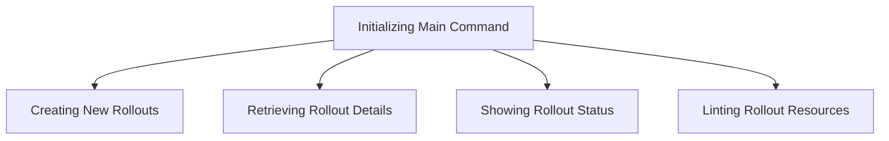

This document will cover the process of managing Argo Rollouts commands, which includes:

1. Initializing the main command
2. Creating new rollouts
3. Retrieving rollout details
4. Showing rollout status
5. Linting rollout resources.

Technical document: <SwmLink doc-title="Managing Argo Rollouts Commands">[Managing Argo Rollouts Commands](/.swm/managing-argo-rollouts-commands.losv28z9.sw.md)</SwmLink>

# [Initializing the Main Command](http://localhost:5001/repos/Z2l0aHViJTNBJTNBaW50dWl0LWFyZ28tcm9sbG91dHMtZGVtbyUzQSUzQVN3aW1tLURlbW8=/docs/losv28z9#managing-argo-rollouts-commands)

The main command for managing Argo Rollouts is initialized to provide a comprehensive CLI tool. This command sets up various subcommands like <SwmToken path="utils/ingress/wrapper.go" pos="507:9:9" line-data="func (w *IngressWrap) create(ctx context.Context, namespace string, ingress *v1.Ingress, opts metav1.CreateOptions) (*Ingress, error) {">`create`</SwmToken>, <SwmToken path="utils/ingress/wrapper.go" pos="454:9:9" line-data="func (w *IngressWrap) get(ctx context.Context, namespace, name string, opts metav1.GetOptions) (*Ingress, error) {">`get`</SwmToken>, `lint`, and <SwmToken path="pkg/kubectl-argo-rollouts/cmd/list/rollloutinfo.go" pos="27:1:1" line-data="	status       string">`status`</SwmToken>, which are essential for different operations on Argo Rollouts. This setup ensures that users have a unified interface to manage their rollouts effectively.

# [Creating New Rollouts](http://localhost:5001/repos/Z2l0aHViJTNBJTNBaW50dWl0LWFyZ28tcm9sbG91dHMtZGVtbyUzQSUzQVN3aW1tLURlbW8=/docs/losv28z9#creating-kubernetes-resources)

The <SwmToken path="utils/ingress/wrapper.go" pos="507:9:9" line-data="func (w *IngressWrap) create(ctx context.Context, namespace string, ingress *v1.Ingress, opts metav1.CreateOptions) (*Ingress, error) {">`create`</SwmToken> command allows users to create various Kubernetes resources such as Rollouts, Experiments, <SwmToken path="pkg/client/listers/rollouts/v1alpha1/analysistemplate.go" pos="35:1:1" line-data="	AnalysisTemplates(namespace string) AnalysisTemplateNamespaceLister">`AnalysisTemplates`</SwmToken>, <SwmToken path="pkg/apis/rollouts/validation/validation_references.go" pos="38:1:1" line-data="	ClusterAnalysisTemplates []*v1alpha1.ClusterAnalysisTemplate">`ClusterAnalysisTemplates`</SwmToken>, and <SwmToken path="pkg/client/listers/rollouts/v1alpha1/analysisrun.go" pos="35:1:1" line-data="	AnalysisRuns(namespace string) AnalysisRunNamespaceLister">`AnalysisRuns`</SwmToken>. Users provide resource definitions through files, and the command creates these resources in the Kubernetes cluster. If the `--watch` flag is set, the command will also monitor the created resource for live updates, ensuring that users can track the creation process in real-time.

# [Retrieving Rollout Details](http://localhost:5001/repos/Z2l0aHViJTNBJTNBaW50dWl0LWFyZ28tcm9sbG91dHMtZGVtbyUzQSUzQVN3aW1tLURlbW8=/docs/losv28z9#retrieving-rollout-details)

The <SwmToken path="utils/ingress/wrapper.go" pos="454:9:9" line-data="func (w *IngressWrap) get(ctx context.Context, namespace, name string, opts metav1.GetOptions) (*Ingress, error) {">`get`</SwmToken> command retrieves details about rollouts and experiments. It includes subcommands like <SwmToken path="utils/ingress/wrapper.go" pos="454:9:9" line-data="func (w *IngressWrap) get(ctx context.Context, namespace, name string, opts metav1.GetOptions) (*Ingress, error) {">`get`</SwmToken>` `<SwmToken path="test/fixtures/common.go" pos="62:1:1" line-data="	rollout *unstructured.Unstructured">`rollout`</SwmToken> and <SwmToken path="utils/ingress/wrapper.go" pos="454:9:9" line-data="func (w *IngressWrap) get(ctx context.Context, namespace, name string, opts metav1.GetOptions) (*Ingress, error) {">`get`</SwmToken>` experiment` to provide specific details about these resources. This command helps users fetch and view detailed information about their rollouts and experiments, enabling them to make informed decisions based on the current state of their deployments.

# [Showing Rollout Status](http://localhost:5001/repos/Z2l0aHViJTNBJTNBaW50dWl0LWFyZ28tcm9sbG91dHMtZGVtbyUzQSUzQVN3aW1tLURlbW8=/docs/losv28z9#showing-rollout-status)

The <SwmToken path="pkg/kubectl-argo-rollouts/cmd/list/rollloutinfo.go" pos="27:1:1" line-data="	status       string">`status`</SwmToken> command shows the status of a specific rollout. It creates a <SwmToken path="pkg/kubectl-argo-rollouts/viewcontroller/viewcontroller.go" pos="55:2:2" line-data="type RolloutViewController struct {">`RolloutViewController`</SwmToken> to monitor the rollout's status and provides options to watch the status until the rollout is complete. This command is crucial for users to monitor the health and progress of their rollouts, ensuring that any issues can be identified and addressed promptly.

# [Linting Rollout Resources](http://localhost:5001/repos/Z2l0aHViJTNBJTNBaW50dWl0LWFyZ28tcm9sbG91dHMtZGVtbyUzQSUzQVN3aW1tLURlbW8=/docs/losv28z9#linting-rollout-resources)

The `lint` command validates a new Rollout resource from a file. It uses the <SwmToken path="pkg/kubectl-argo-rollouts/cmd/lint/lint.go" pos="67:9:9" line-data="func (l *LintOptions) lintResource(path string) error {">`lintResource`</SwmToken> method to perform the validation, checking for syntax errors, unknown fields, and ensuring that all referenced resources are correctly defined. This command ensures that the rollout configurations are correct and adhere to the required standards before deployment, reducing the risk of deployment failures due to configuration issues.

&nbsp;

*This is an auto-generated document by Swimm 🌊 and has not yet been verified by a human*

<SwmMeta version="3.0.0" repo-id="Z2l0aHViJTNBJTNBaW50dWl0LWFyZ28tcm9sbG91dHMtZGVtbyUzQSUzQVN3aW1tLURlbW8=" repo-name="intuit-argo-rollouts-demo">Powered by [Swimm](/)</SwmMeta>
