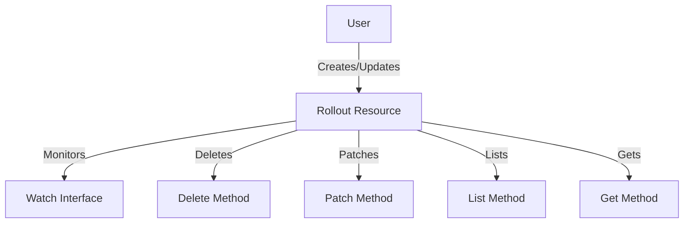

# What is Rollout in Clientset

Rollout refers to the deployment process managed by Argo Rollouts within the Kubernetes ecosystem. In the Clientset, Rollout is represented by the <SwmToken path="pkg/client/clientset/versioned/typed/rollouts/v1alpha1/rollout.go" pos="68:6:6" line-data="func (c *rollouts) Get(ctx context.Context, name string, options v1.GetOptions) (result *v1alpha1.Rollout, err error) {">`rollouts`</SwmToken> struct, which implements the <SwmToken path="pkg/client/clientset/versioned/typed/rollouts/v1alpha1/rollout.go" pos="33:16:16" line-data="// RolloutsGetter has a method to return a RolloutInterface.">`RolloutInterface`</SwmToken>.

The <SwmToken path="pkg/client/clientset/versioned/typed/rollouts/v1alpha1/rollout.go" pos="68:6:6" line-data="func (c *rollouts) Get(ctx context.Context, name string, options v1.GetOptions) (result *v1alpha1.Rollout, err error) {">`rollouts`</SwmToken> struct contains methods to create, update, delete, get, list, and watch Rollout resources. These methods facilitate the management of Rollout resources within a Kubernetes cluster.

## Initializing Rollouts

The <SwmToken path="pkg/client/clientset/versioned/typed/rollouts/v1alpha1/rollout.go" pos="59:2:2" line-data="// newRollouts returns a Rollouts">`newRollouts`</SwmToken> function initializes a new instance of the <SwmToken path="pkg/client/clientset/versioned/typed/rollouts/v1alpha1/rollout.go" pos="68:6:6" line-data="func (c *rollouts) Get(ctx context.Context, name string, options v1.GetOptions) (result *v1alpha1.Rollout, err error) {">`rollouts`</SwmToken> struct, setting up the REST client and namespace.

## Retrieving Rollouts

The <SwmToken path="pkg/client/clientset/versioned/typed/rollouts/v1alpha1/rollout.go" pos="67:2:2" line-data="// Get takes name of the rollout, and returns the corresponding rollout object, and an error if there is any.">`Get`</SwmToken> method retrieves a specific Rollout resource by name, while the `List` method fetches a list of Rollout resources based on label and field selectors.

<SwmSnippet path="/pkg/client/clientset/versioned/typed/rollouts/v1alpha1/rollout.go" line="67">

---

The <SwmToken path="pkg/client/clientset/versioned/typed/rollouts/v1alpha1/rollout.go" pos="67:2:2" line-data="// Get takes name of the rollout, and returns the corresponding rollout object, and an error if there is any.">`Get`</SwmToken> function retrieves a specific rollout resource by name and returns the corresponding rollout object and an error if there is any.

```go
// Get takes name of the rollout, and returns the corresponding rollout object, and an error if there is any.
func (c *rollouts) Get(ctx context.Context, name string, options v1.GetOptions) (result *v1alpha1.Rollout, err error) {
	result = &v1alpha1.Rollout{}
	err = c.client.Get().
		Namespace(c.ns).
		Resource("rollouts").
		Name(name).
		VersionedParams(&options, scheme.ParameterCodec).
		Do(ctx).
		Into(result)
	return
```

---

</SwmSnippet>

<SwmSnippet path="/pkg/client/clientset/versioned/typed/rollouts/v1alpha1/rollout.go" line="80">

---

The `List` function takes label and field selectors and returns the list of rollouts that match those selectors.

```go
// List takes label and field selectors, and returns the list of Rollouts that match those selectors.
func (c *rollouts) List(ctx context.Context, opts v1.ListOptions) (result *v1alpha1.RolloutList, err error) {
	var timeout time.Duration
	if opts.TimeoutSeconds != nil {
		timeout = time.Duration(*opts.TimeoutSeconds) * time.Second
	}
	result = &v1alpha1.RolloutList{}
	err = c.client.Get().
		Namespace(c.ns).
		Resource("rollouts").
		VersionedParams(&opts, scheme.ParameterCodec).
		Timeout(timeout).
		Do(ctx).
		Into(result)
	return
}
```

---

</SwmSnippet>

## Creating and Updating Rollouts

The <SwmToken path="pkg/client/clientset/versioned/typed/rollouts/v1alpha1/rollout.go" pos="112:2:2" line-data="// Create takes the representation of a rollout and creates it.  Returns the server&#39;s representation of the rollout, and an error, if there is any.">`Create`</SwmToken> method handles the creation of a Rollout resource, while the <SwmToken path="pkg/client/clientset/versioned/typed/rollouts/v1alpha1/rollout.go" pos="125:2:2" line-data="// Update takes the representation of a rollout and updates it. Returns the server&#39;s representation of the rollout, and an error, if there is any.">`Update`</SwmToken> method is used to update an existing Rollout. Both methods return the server's representation of the Rollout.

<SwmSnippet path="/pkg/client/clientset/versioned/typed/rollouts/v1alpha1/rollout.go" line="112">

---

The <SwmToken path="pkg/client/clientset/versioned/typed/rollouts/v1alpha1/rollout.go" pos="112:2:2" line-data="// Create takes the representation of a rollout and creates it.  Returns the server&#39;s representation of the rollout, and an error, if there is any.">`Create`</SwmToken> function takes the representation of a rollout and creates it. It returns the server's representation of the rollout and an error if there is any.

```go
// Create takes the representation of a rollout and creates it.  Returns the server's representation of the rollout, and an error, if there is any.
func (c *rollouts) Create(ctx context.Context, rollout *v1alpha1.Rollout, opts v1.CreateOptions) (result *v1alpha1.Rollout, err error) {
	result = &v1alpha1.Rollout{}
	err = c.client.Post().
		Namespace(c.ns).
		Resource("rollouts").
		VersionedParams(&opts, scheme.ParameterCodec).
		Body(rollout).
		Do(ctx).
		Into(result)
	return
}
```

---

</SwmSnippet>

<SwmSnippet path="/pkg/client/clientset/versioned/typed/rollouts/v1alpha1/rollout.go" line="125">

---

The <SwmToken path="pkg/client/clientset/versioned/typed/rollouts/v1alpha1/rollout.go" pos="125:2:2" line-data="// Update takes the representation of a rollout and updates it. Returns the server&#39;s representation of the rollout, and an error, if there is any.">`Update`</SwmToken> function takes the representation of a rollout and updates it. It returns the server's representation of the rollout and an error if there is any.

```go
// Update takes the representation of a rollout and updates it. Returns the server's representation of the rollout, and an error, if there is any.
func (c *rollouts) Update(ctx context.Context, rollout *v1alpha1.Rollout, opts v1.UpdateOptions) (result *v1alpha1.Rollout, err error) {
	result = &v1alpha1.Rollout{}
	err = c.client.Put().
		Namespace(c.ns).
		Resource("rollouts").
		Name(rollout.Name).
		VersionedParams(&opts, scheme.ParameterCodec).
		Body(rollout).
		Do(ctx).
		Into(result)
	return
}
```

---

</SwmSnippet>

## Deleting Rollouts

The <SwmToken path="pkg/client/clientset/versioned/typed/rollouts/v1alpha1/rollout.go" pos="155:2:2" line-data="// Delete takes name of the rollout and deletes it. Returns an error if one occurs.">`Delete`</SwmToken> method removes a specific Rollout resource by name, and the <SwmToken path="pkg/client/clientset/versioned/typed/rollouts/v1alpha1/rollout.go" pos="166:2:2" line-data="// DeleteCollection deletes a collection of objects.">`DeleteCollection`</SwmToken> method deletes a collection of Rollout resources.

<SwmSnippet path="/pkg/client/clientset/versioned/typed/rollouts/v1alpha1/rollout.go" line="155">

---

The <SwmToken path="pkg/client/clientset/versioned/typed/rollouts/v1alpha1/rollout.go" pos="155:2:2" line-data="// Delete takes name of the rollout and deletes it. Returns an error if one occurs.">`Delete`</SwmToken> function removes a specific Rollout resource by name and returns an error if one occurs.

```go
// Delete takes name of the rollout and deletes it. Returns an error if one occurs.
func (c *rollouts) Delete(ctx context.Context, name string, opts v1.DeleteOptions) error {
	return c.client.Delete().
		Namespace(c.ns).
		Resource("rollouts").
		Name(name).
		Body(&opts).
		Do(ctx).
		Error()
}
```

---

</SwmSnippet>

<SwmSnippet path="/pkg/client/clientset/versioned/typed/rollouts/v1alpha1/rollout.go" line="166">

---

The <SwmToken path="pkg/client/clientset/versioned/typed/rollouts/v1alpha1/rollout.go" pos="166:2:2" line-data="// DeleteCollection deletes a collection of objects.">`DeleteCollection`</SwmToken> function deletes a collection of Rollout resources.

```go
// DeleteCollection deletes a collection of objects.
func (c *rollouts) DeleteCollection(ctx context.Context, opts v1.DeleteOptions, listOpts v1.ListOptions) error {
	var timeout time.Duration
	if listOpts.TimeoutSeconds != nil {
		timeout = time.Duration(*listOpts.TimeoutSeconds) * time.Second
	}
	return c.client.Delete().
		Namespace(c.ns).
		Resource("rollouts").
```

---

</SwmSnippet>

## Watching Rollouts

The <SwmToken path="pkg/client/clientset/versioned/typed/rollouts/v1alpha1/rollout.go" pos="97:2:2" line-data="// Watch returns a watch.Interface that watches the requested rollouts.">`Watch`</SwmToken> method returns a <SwmToken path="pkg/client/clientset/versioned/typed/rollouts/v1alpha1/rollout.go" pos="97:8:10" line-data="// Watch returns a watch.Interface that watches the requested rollouts.">`watch.Interface`</SwmToken> that watches for changes to Rollout resources, allowing for real-time monitoring.

<SwmSnippet path="/pkg/client/clientset/versioned/typed/rollouts/v1alpha1/rollout.go" line="97">

---

The <SwmToken path="pkg/client/clientset/versioned/typed/rollouts/v1alpha1/rollout.go" pos="97:2:2" line-data="// Watch returns a watch.Interface that watches the requested rollouts.">`Watch`</SwmToken> function returns a <SwmToken path="pkg/client/clientset/versioned/typed/rollouts/v1alpha1/rollout.go" pos="97:8:10" line-data="// Watch returns a watch.Interface that watches the requested rollouts.">`watch.Interface`</SwmToken> that watches the requested rollouts, allowing for real-time monitoring.

```go
// Watch returns a watch.Interface that watches the requested rollouts.
func (c *rollouts) Watch(ctx context.Context, opts v1.ListOptions) (watch.Interface, error) {
	var timeout time.Duration
	if opts.TimeoutSeconds != nil {
		timeout = time.Duration(*opts.TimeoutSeconds) * time.Second
	}
	opts.Watch = true
	return c.client.Get().
		Namespace(c.ns).
		Resource("rollouts").
		VersionedParams(&opts, scheme.ParameterCodec).
		Timeout(timeout).
		Watch(ctx)
}
```

---

</SwmSnippet>

## Patching Rollouts

The <SwmToken path="pkg/client/clientset/versioned/typed/rollouts/v1alpha1/rollout.go" pos="182:2:2" line-data="// Patch applies the patch and returns the patched rollout.">`Patch`</SwmToken> method applies a patch to a Rollout resource and returns the updated Rollout.

<SwmSnippet path="/pkg/client/clientset/versioned/typed/rollouts/v1alpha1/rollout.go" line="182">

---

The <SwmToken path="pkg/client/clientset/versioned/typed/rollouts/v1alpha1/rollout.go" pos="182:2:2" line-data="// Patch applies the patch and returns the patched rollout.">`Patch`</SwmToken> function applies a patch to a Rollout resource and returns the updated Rollout.

```go
// Patch applies the patch and returns the patched rollout.
func (c *rollouts) Patch(ctx context.Context, name string, pt types.PatchType, data []byte, opts v1.PatchOptions, subresources ...string) (result *v1alpha1.Rollout, err error) {
	result = &v1alpha1.Rollout{}
	err = c.client.Patch(pt).
		Namespace(c.ns).
		Resource("rollouts").
		Name(name).
		SubResource(subresources...).
		VersionedParams(&opts, scheme.ParameterCodec).
		Body(data).
		Do(ctx).
		Into(result)
	return
}
```

---

</SwmSnippet>



&nbsp;

*This is an auto-generated document by Swimm 🌊 and has not yet been verified by a human*

<SwmMeta version="3.0.0" repo-id="Z2l0aHViJTNBJTNBaW50dWl0LWFyZ28tcm9sbG91dHMtZGVtbyUzQSUzQVN3aW1tLURlbW8=" repo-name="intuit-argo-rollouts-demo"><sup>Powered by [Swimm](/)</sup></SwmMeta>
