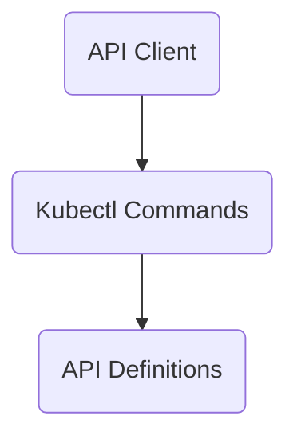

The repository 'intuit-argo-rollouts-demo' provides advanced deployment capabilities for Kubernetes through Argo Rollouts. It supports blue-green and canary deployments, integrates with ingress controllers and service meshes for traffic management, and can automate promotion or rollback based on metrics.

## Main Components

### Client Library

- **Clientset**
  - **Clusteranalysistemplate**
    - <SwmLink doc-title="ClusterAnalysisTemplate Overview">[ClusterAnalysisTemplate Overview](/.swm/clusteranalysistemplate-overview.ouu7gmd5.sw.md)</SwmLink>
    - **Classes**
      - <SwmLink doc-title="The ClusterAnalysisTemplatesGetter class">[The ClusterAnalysisTemplatesGetter class](/.swm/the-clusteranalysistemplatesgetter-class.x3sp9.sw.md)</SwmLink>
  - **Analysistemplate**
    - <SwmLink doc-title="Getting Started with AnalysisTemplate in Clientset">[Getting Started with AnalysisTemplate in Clientset](/.swm/getting-started-with-analysistemplate-in-clientset.294ch405.sw.md)</SwmLink>
  - **Analysisrun**
    - <SwmLink doc-title="Exploring AnalysisRun">[Exploring AnalysisRun](/.swm/exploring-analysisrun.a298k53k.sw.md)</SwmLink>
  - **Rollout**
    - <SwmLink doc-title="Managing Rollouts in Clientset">[Managing Rollouts in Clientset](/.swm/managing-rollouts-in-clientset.5267ldgy.sw.md)</SwmLink>
  - **Experiment**
    - <SwmLink doc-title="Getting Started with Experiment in Clientset">[Getting Started with Experiment in Clientset](/.swm/getting-started-with-experiment-in-clientset.g51jjyxb.sw.md)</SwmLink>
  - **Fake**
    - <SwmLink doc-title="Fake Clients for Testing">[Fake Clients for Testing](/.swm/fake-clients-for-testing.5w1z1tma.sw.md)</SwmLink>
  - **Classes**
    - <SwmLink doc-title="The AnalysisRunExpansion class">[The AnalysisRunExpansion class](/.swm/the-analysisrunexpansion-class.npjss.sw.md)</SwmLink>
    - <SwmLink doc-title="The AnalysisTemplateExpansion class">[The AnalysisTemplateExpansion class](/.swm/the-analysistemplateexpansion-class.w9ph3.sw.md)</SwmLink>
    - <SwmLink doc-title="The ClusterAnalysisTemplateExpansion class">[The ClusterAnalysisTemplateExpansion class](/.swm/the-clusteranalysistemplateexpansion-class.qu6to.sw.md)</SwmLink>
    - <SwmLink doc-title="The ExperimentExpansion class">[The ExperimentExpansion class](/.swm/the-experimentexpansion-class.ep1td.sw.md)</SwmLink>
    - <SwmLink doc-title="The RolloutExpansion class">[The RolloutExpansion class](/.swm/the-rolloutexpansion-class.kdnxf.sw.md)</SwmLink>
- **Listers**
  - <SwmLink doc-title="Listers in Client Library">[Listers in Client Library](/.swm/listers-in-client-library.brr3nlcb.sw.md)</SwmLink>
  - **Classes**
    - <SwmLink doc-title="The AnalysisRunListerExpansion class">[The AnalysisRunListerExpansion class](/.swm/the-analysisrunlisterexpansion-class.xkkc2.sw.md)</SwmLink>
    - <SwmLink doc-title="The AnalysisRunNamespaceListerExpansion class">[The AnalysisRunNamespaceListerExpansion class](/.swm/the-analysisrunnamespacelisterexpansion-class.9i499.sw.md)</SwmLink>
    - <SwmLink doc-title="The AnalysisTemplateListerExpansion class">[The AnalysisTemplateListerExpansion class](/.swm/the-analysistemplatelisterexpansion-class.6x11b.sw.md)</SwmLink>
    - <SwmLink doc-title="The AnalysisTemplateNamespaceListerExpansion class">[The AnalysisTemplateNamespaceListerExpansion class](/.swm/the-analysistemplatenamespacelisterexpansion-class.vymbo.sw.md)</SwmLink>
    - <SwmLink doc-title="The ClusterAnalysisTemplateListerExpansion class">[The ClusterAnalysisTemplateListerExpansion class](/.swm/the-clusteranalysistemplatelisterexpansion-class.ckelp.sw.md)</SwmLink>
    - <SwmLink doc-title="The ExperimentListerExpansion class">[The ExperimentListerExpansion class](/.swm/the-experimentlisterexpansion-class.932qq.sw.md)</SwmLink>
    - <SwmLink doc-title="The ExperimentNamespaceListerExpansion class">[The ExperimentNamespaceListerExpansion class](/.swm/the-experimentnamespacelisterexpansion-class.rudxj.sw.md)</SwmLink>
    - <SwmLink doc-title="The RolloutListerExpansion class">[The RolloutListerExpansion class](/.swm/the-rolloutlisterexpansion-class.jixx5.sw.md)</SwmLink>
    - <SwmLink doc-title="The RolloutNamespaceListerExpansion class">[The RolloutNamespaceListerExpansion class](/.swm/the-rolloutnamespacelisterexpansion-class.0ta1f.sw.md)</SwmLink>
- **Informers**
  - <SwmLink doc-title="Introduction to Informers in Client Library">[Introduction to Informers in Client Library](/.swm/introduction-to-informers-in-client-library.wx3kwpep.sw.md)</SwmLink>
  - **Rollouts**
    - <SwmLink doc-title="Exploring Rollouts in Informers">[Exploring Rollouts in Informers](/.swm/exploring-rollouts-in-informers.w95myrqv.sw.md)</SwmLink>

### API Client

- <SwmLink doc-title="API Client Overview">[API Client Overview](/.swm/api-client-overview.njkmo85r.sw.md)</SwmLink>

### Kubectl Commands

- **Info**
  - <SwmLink doc-title="Info Functionality in Kubectl Commands">[Info Functionality in Kubectl Commands](/.swm/info-functionality-in-kubectl-commands.vma24ja3.sw.md)</SwmLink>
  - **Rollout info**
    - <SwmLink doc-title="Getting Started with Rollout Details">[Getting Started with Rollout Details](/.swm/getting-started-with-rollout-details.s0debl5i.sw.md)</SwmLink>
  - **Flows**
    - <SwmLink doc-title="Gathering and Processing Rollout Information">[Gathering and Processing Rollout Information](/.swm/gathering-and-processing-rollout-information.b77rcuey.sw.md)</SwmLink>
    - <SwmLink doc-title="Handling Rollout Requests">[Handling Rollout Requests](/.swm/handling-rollout-requests.p2k21voi.sw.md)</SwmLink>
- **Cmd**
  - **Lint**
    - <SwmLink doc-title="Basic Concepts of Lint Command">[Basic Concepts of Lint Command](/.swm/basic-concepts-of-lint-command.saqk48h6.sw.md)</SwmLink>
  - **Create**
    - <SwmLink doc-title="Getting Started with the Create Command">[Getting Started with the Create Command](/.swm/getting-started-with-the-create-command.2umeaswa.sw.md)</SwmLink>
  - **List**
    - <SwmLink doc-title="Understanding List Command">[Understanding List Command](/.swm/understanding-list-command.ylxx7dos.sw.md)</SwmLink>
    - **Flows**
      - <SwmLink doc-title="Listing Rollouts or Experiments">[Listing Rollouts or Experiments](/.swm/listing-rollouts-or-experiments.l477e5mn.sw.md)</SwmLink>
  - **Undo**
    - <SwmLink doc-title="Rollback Functionality">[Rollback Functionality](/.swm/rollback-functionality.pw3b9xq5.sw.md)</SwmLink>
    - **Flows**
      - <SwmLink doc-title="Rollback Deployment Flow">[Rollback Deployment Flow](/.swm/rollback-deployment-flow.8p8q9llb.sw.md)</SwmLink>
  - **Get**
    - <SwmLink doc-title="Getting Started with the Get Command">[Getting Started with the Get Command](/.swm/getting-started-with-the-get-command.196ontdy.sw.md)</SwmLink>
    - **Get rollout**
      - <SwmLink doc-title="Get Rollout Details">[Get Rollout Details](/.swm/get-rollout-details.mewqaqt5.sw.md)</SwmLink>
    - **Flows**
      - <SwmLink doc-title="Managing Argo Rollouts Commands">[Managing Argo Rollouts Commands](/.swm/managing-argo-rollouts-commands.losv28z9.sw.md)</SwmLink>
      - <SwmLink doc-title="Retrieving and Displaying Experiment Details">[Retrieving and Displaying Experiment Details](/.swm/retrieving-and-displaying-experiment-details.7cxd08qq.sw.md)</SwmLink>
- **Flows**
  - <SwmLink doc-title="Generating Documentation Flow">[Generating Documentation Flow](/.swm/generating-documentation-flow.d8dockkg.sw.md)</SwmLink>

### API Definitions

- **Validation**
  - **Validation**
    - <SwmLink doc-title="Introduction to Rollout Validation">[Introduction to Rollout Validation](/.swm/introduction-to-rollout-validation.5i1jn8b2.sw.md)</SwmLink>
  - **Validation references**
    - <SwmLink doc-title="Validation References">[Validation References](/.swm/validation-references.jik6m8jn.sw.md)</SwmLink>
    - **Flows**
      - <SwmLink doc-title="Validating Rollout Configurations and Resources">[Validating Rollout Configurations and Resources](/.swm/validating-rollout-configurations-and-resources.f8119j89.sw.md)</SwmLink>
- <SwmToken path="pkg/client/informers/externalversions/rollouts/interface.go" pos="29:1:1" line-data="	V1alpha1() v1alpha1.Interface">`V1alpha1`</SwmToken>
  - <SwmLink doc-title="Introduction to API Versioning in V1alpha1">[Introduction to API Versioning in V1alpha1](/.swm/introduction-to-api-versioning-in-v1alpha1.mvi3lsnp.sw.md)</SwmLink>

### Flows

- <SwmLink doc-title="Linting and Validating Rollout Resources">[Linting and Validating Rollout Resources](/.swm/linting-and-validating-rollout-resources.q9cmrcv3.sw.md)</SwmLink>
- <SwmLink doc-title="Reconciliation Process in Deployments">[Reconciliation Process in Deployments](/.swm/reconciliation-process-in-deployments.a51xyju0.sw.md)</SwmLink>
- <SwmLink doc-title="Rollout Synchronization Process">[Rollout Synchronization Process](/.swm/rollout-synchronization-process.lpvpup0r.sw.md)</SwmLink>
- <SwmLink doc-title="Main Deployment Controller Flow">[Main Deployment Controller Flow](/.swm/main-deployment-controller-flow.symz5qdt.sw.md)</SwmLink>
- <SwmLink doc-title="Handling an Analysis Run">[Handling an Analysis Run](/.swm/handling-an-analysis-run.j909bfeq.sw.md)</SwmLink>

&nbsp;

*This is an auto-generated document by Swimm 🌊 and has not yet been verified by a human*

<SwmMeta version="3.0.0" repo-id="Z2l0aHViJTNBJTNBaW50dWl0LWFyZ28tcm9sbG91dHMtZGVtbyUzQSUzQVN3aW1tLURlbW8=" repo-name="intuit-argo-rollouts-demo">Powered by [Swimm](https://app.swimm.io/)</SwmMeta>
