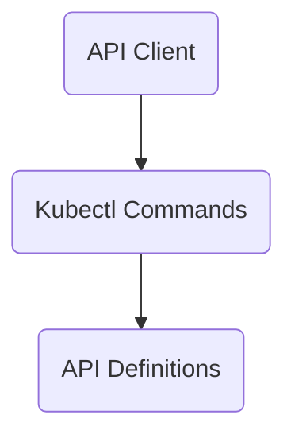

The repository 'intuit-argo-rollouts-demo' provides advanced deployment capabilities for Kubernetes through Argo Rollouts. It supports blue-green and canary deployments, integrates with ingress controllers and service meshes for traffic management, and can automate promotion or rollback based on metrics.

## Main Components

### Kubectl Commands

- **Info**
  - **Flows**
    - <SwmLink doc-title="Gathering and processing rollout information">[Gathering and processing rollout information](.swm/gathering-and-processing-rollout-information.uusoaokf.sw.md)</SwmLink>
    - <SwmLink doc-title="Handling rollout requests">[Handling rollout requests](.swm/handling-rollout-requests.i0xoo3tk.sw.md)</SwmLink>
- **Cmd**
  - **List**
    - **Flows**
      - <SwmLink doc-title="Listing rollouts or experiments">[Listing rollouts or experiments](.swm/listing-rollouts-or-experiments.q60pkmpm.sw.md)</SwmLink>
  - **Undo**
    - **Flows**
      - <SwmLink doc-title="Rollback deployment flow">[Rollback deployment flow](.swm/rollback-deployment-flow.chy17tt9.sw.md)</SwmLink>
  - **Get**
    - **Flows**
      - <SwmLink doc-title="Managing argo rollouts commands">[Managing argo rollouts commands](.swm/managing-argo-rollouts-commands.r90v8myi.sw.md)</SwmLink>
      - <SwmLink doc-title="Retrieving and displaying experiment details">[Retrieving and displaying experiment details](.swm/retrieving-and-displaying-experiment-details.di6r9l2b.sw.md)</SwmLink>
- **Flows**
  - <SwmLink doc-title="Generating documentation for notifications and plugins">[Generating documentation for notifications and plugins](.swm/generating-documentation-for-notifications-and-plugins.1y8ikfn8.sw.md)</SwmLink>

### API Definitions

- **Validation**
  - **Validation references**
    - **Flows**
      - <SwmLink doc-title="Validating rollout configurations and resources">[Validating rollout configurations and resources](.swm/validating-rollout-configurations-and-resources.ll3qf81w.sw.md)</SwmLink>

### Flows

- <SwmLink doc-title="Linting and validating rollout resources">[Linting and validating rollout resources](.swm/linting-and-validating-rollout-resources.ldrvfwg6.sw.md)</SwmLink>
- <SwmLink doc-title="Reconciliation process in deployments">[Reconciliation process in deployments](.swm/reconciliation-process-in-deployments.ms2hllss.sw.md)</SwmLink>
- <SwmLink doc-title="Rollout synchronization process">[Rollout synchronization process](.swm/rollout-synchronization-process.dmw8m3qw.sw.md)</SwmLink>
- <SwmLink doc-title="Main deployment controller flow">[Main deployment controller flow](.swm/main-deployment-controller-flow.1xlrw6dk.sw.md)</SwmLink>
- <SwmLink doc-title="Handling an analysis run">[Handling an analysis run](.swm/handling-an-analysis-run.caq4q5d5.sw.md)</SwmLink>

&nbsp;

*This is an auto-generated document by Swimm 🌊 and has not yet been verified by a human*

<SwmMeta version="3.0.0" repo-id="Z2l0aHViJTNBJTNBaW50dWl0LWFyZ28tcm9sbG91dHMtZGVtbyUzQSUzQVN3aW1tLURlbW8=" repo-name="intuit-argo-rollouts-demo">Powered by [Swimm](http://localhost:5001/)</SwmMeta>
