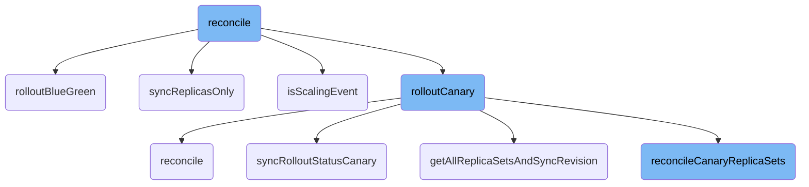
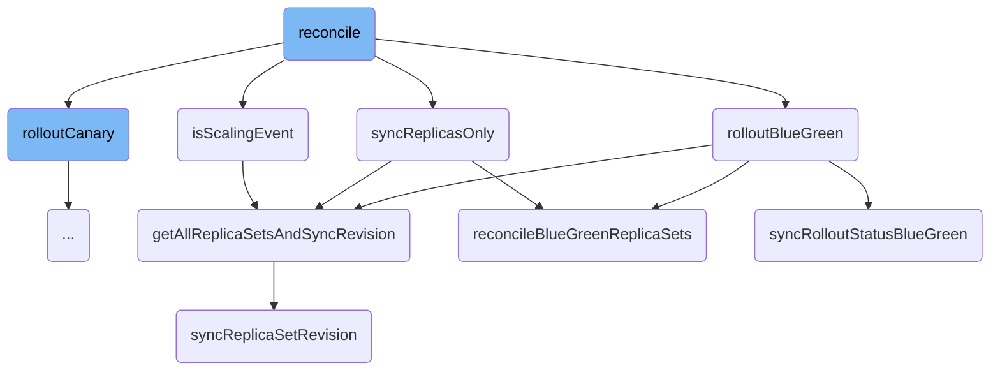
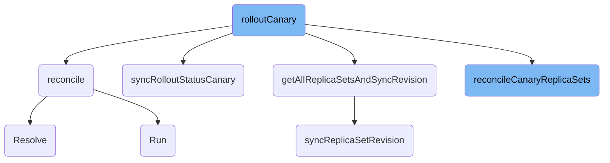

In this document, we will explain the reconciliation process. Reconciliation is a crucial part of managing deployments, ensuring that the actual state of the system matches the desired state. This process involves checking for paused conditions, determining if a scaling event has occurred, and then proceeding with the appropriate deployment strategy, such as Blue-Green or Canary.

The flow starts by checking if there are any paused conditions that need to be addressed. If everything is fine, it then checks if a scaling event has occurred, which means the number of replicas might need to be adjusted. If a scaling event is detected, it updates the replicas accordingly. Depending on the deployment strategy, it either follows the Blue-Green or Canary process to ensure the new version is rolled out smoothly. This involves tasks like synchronizing replica sets, updating rollout statuses, and managing services.

Here is a high level diagram of the flow, showing only the most important functions:



# Flow drill down

First, we'll zoom into this section of the flow:



<SwmSnippet path="/rollout/context.go" line="51">

---

## Reconcile Function

The <SwmToken path="rollout/context.go" pos="51:9:9" line-data="func (c *rolloutContext) reconcile() error {">`reconcile`</SwmToken> function is the entry point for the reconciliation process. It first checks for paused conditions and then determines if a scaling event has occurred. If a scaling event is detected, it calls <SwmToken path="rollout/context.go" pos="63:5:5" line-data="		return c.syncReplicasOnly()">`syncReplicasOnly`</SwmToken>. If the deployment strategy is Blue-Green, it calls <SwmToken path="rollout/context.go" pos="67:5:5" line-data="		return c.rolloutBlueGreen()">`rolloutBlueGreen`</SwmToken>; otherwise, it defaults to the Canary strategy.

```go
func (c *rolloutContext) reconcile() error {
	err := c.checkPausedConditions()
	if err != nil {
		return err
	}

	isScalingEvent, err := c.isScalingEvent()
	if err != nil {
		return err
	}

	if isScalingEvent {
		return c.syncReplicasOnly()
	}

	if c.rollout.Spec.Strategy.BlueGreen != nil {
		return c.rolloutBlueGreen()
	}

	// Due to the rollout validation before this, when we get here strategy is canary
	return c.rolloutCanary()
```

---

</SwmSnippet>

<SwmSnippet path="/rollout/bluegreen.go" line="18">

---

## Rollout Blue-Green

The <SwmToken path="rollout/bluegreen.go" pos="18:2:2" line-data="// rolloutBlueGreen implements the logic for rolling a new replica set.">`rolloutBlueGreen`</SwmToken> function handles the Blue-Green deployment strategy. It first retrieves the preview and active services, then synchronizes the replica sets and updates the rollout status. It also manages the reconciliation of the preview service, pod restarts, and various other tasks to ensure the Blue-Green deployment is correctly managed.

```go
// rolloutBlueGreen implements the logic for rolling a new replica set.
func (c *rolloutContext) rolloutBlueGreen() error {
	previewSvc, activeSvc, err := c.getPreviewAndActiveServices()
	if err != nil {
		return err
	}
	c.newRS, err = c.getAllReplicaSetsAndSyncRevision()
	if err != nil {
		return fmt.Errorf("failed to getAllReplicaSetsAndSyncRevision in rolloutBlueGreen create true: %w", err)
	}

	// This must happen right after the new replicaset is created
	err = c.reconcilePreviewService(previewSvc)
	if err != nil {
		return err
	}

	if replicasetutil.CheckPodSpecChange(c.rollout, c.newRS) {
		return c.syncRolloutStatusBlueGreen(previewSvc, activeSvc)
	}

```

---

</SwmSnippet>

<SwmSnippet path="/rollout/sync.go" line="271">

---

## Sync Replicas Only

The <SwmToken path="rollout/sync.go" pos="271:2:2" line-data="// syncReplicasOnly is responsible for reconciling rollouts on scaling events.">`syncReplicasOnly`</SwmToken> function is responsible for handling scaling events. It updates the replica sets and synchronizes the rollout status. If the strategy is Blue-Green, it reconciles the Blue-Green replica sets; otherwise, it defaults to the Canary strategy.

```go
// syncReplicasOnly is responsible for reconciling rollouts on scaling events.
func (c *rolloutContext) syncReplicasOnly() error {
	c.log.Infof("Syncing replicas only due to scaling event")
	var err error
	c.newRS, err = c.getAllReplicaSetsAndSyncRevision()
	if err != nil {
		return fmt.Errorf("failed to getAllReplicaSetsAndSyncRevision in syncReplicasOnly: %w", err)
	}
	newStatus := c.rollout.Status.DeepCopy()

	// NOTE: it is possible for newRS to be nil (e.g. when template and replicas changed at same time)
	if c.rollout.Spec.Strategy.BlueGreen != nil {
		_, activeSvc, err := c.getPreviewAndActiveServices()
		if err != nil {
			return nil
		}
		if err := c.reconcileBlueGreenReplicaSets(activeSvc); err != nil {
			// If we get an error while trying to scale, the rollout will be requeued
			// so we can abort this resync
			return fmt.Errorf("failed to reconcileBlueGreenReplicaSets in syncReplicasOnly: %w", err)
		}
```

---

</SwmSnippet>

<SwmSnippet path="/rollout/sync.go" line="316">

---

## Is Scaling Event

The <SwmToken path="rollout/sync.go" pos="316:2:2" line-data="// isScalingEvent checks whether the provided rollout has been updated with a scaling event">`isScalingEvent`</SwmToken> function checks if a scaling event has occurred by comparing the desired replicas annotation in the active replica sets with the rollout's desired replicas.

```go
// isScalingEvent checks whether the provided rollout has been updated with a scaling event
// by looking at the desired-replicas annotation in the active replica sets of the rollout.
//
// rsList should come from getReplicaSetsForRollout(r).
func (c *rolloutContext) isScalingEvent() (bool, error) {
	var err error
	c.newRS, err = c.getAllReplicaSetsAndSyncRevision()
	if err != nil {
		return false, fmt.Errorf("failed to getAllReplicaSetsAndSyncRevision in isScalingEvent: %w", err)
	}

	for _, rs := range controller.FilterActiveReplicaSets(c.allRSs) {
		desired, ok := annotations.GetDesiredReplicasAnnotation(rs)
		if !ok {
			continue
		}
		if desired != defaults.GetReplicasOrDefault(c.rollout.Spec.Replicas) {
			return true, nil
		}
	}
	return false, nil
```

---

</SwmSnippet>

<SwmSnippet path="/rollout/sync.go" line="34">

---

## Get All Replica Sets and Sync Revision

The <SwmToken path="rollout/sync.go" pos="34:2:2" line-data="// getAllReplicaSetsAndSyncRevision returns all the replica sets for the provided rollout (new and all old), with new RS&#39;s and rollout&#39;s revision updated.">`getAllReplicaSetsAndSyncRevision`</SwmToken> function retrieves all the replica sets for the rollout and updates the revision number for the new replica set.

```go
// getAllReplicaSetsAndSyncRevision returns all the replica sets for the provided rollout (new and all old), with new RS's and rollout's revision updated.
//
//  1. Get all old RSes this rollout targets, and calculate the max revision number among them (maxOldV).
//  2. Get new RS this rollout targets (whose pod template matches rollout's), and update new RS's revision number to (maxOldV + 1),
//     only if its revision number is smaller than (maxOldV + 1). If this step failed, we'll update it in the next rollout sync loop.
//  3. Copy new RS's revision number to rollout (update rollout's revision). If this step failed, we'll update it in the next rollout sync loop.
//  4. If there's no existing new RS and createIfNotExisted is true, create one with appropriate revision number (maxOldRevision + 1) and replicas.
//     Note that the pod-template-hash will be added to adopted RSes and pods.
//
// Note that currently the rollout controller is using caches to avoid querying the server for reads.
// This may lead to stale reads of replica sets, thus incorrect  v status.
func (c *rolloutContext) getAllReplicaSetsAndSyncRevision() (*appsv1.ReplicaSet, error) {
	// Get new replica set with the updated revision number
	newRS, err := c.syncReplicaSetRevision()
	if err != nil {
		return nil, err
	}

	return newRS, nil
}
```

---

</SwmSnippet>

<SwmSnippet path="/rollout/sync.go" line="55">

---

## Sync Replica Set Revision

The <SwmToken path="rollout/sync.go" pos="58:9:9" line-data="func (c *rolloutContext) syncReplicaSetRevision() (*appsv1.ReplicaSet, error) {">`syncReplicaSetRevision`</SwmToken> function updates the revision number for the new replica set and synchronizes its annotations with the rollout.

```go
// Returns a replica set that matches the intent of the given rollout. Returns nil if the new replica set doesn't exist yet.
// 1. Get existing new RS (the RS that the given rollout targets, whose pod template is the same as rollout's).
// 2. If there's existing new RS, update its revision number if it's smaller than (maxOldRevision + 1), where maxOldRevision is the max revision number among all old RSes.
func (c *rolloutContext) syncReplicaSetRevision() (*appsv1.ReplicaSet, error) {
	if c.newRS == nil {
		return nil, nil
	}
	ctx := context.TODO()

	// Calculate the max revision number among all old RSes
	maxOldRevision := replicasetutil.MaxRevision(c.olderRSs)
	// Calculate revision number for this new replica set
	newRevision := strconv.FormatInt(maxOldRevision+1, 10)

	// Latest replica set exists. We need to sync its annotations (includes copying all but
	// annotationsToSkip from the parent rollout, and update revision and desiredReplicas)
	// and also update the revision annotation in the rollout with the
	// latest revision.
	rsCopy := c.newRS.DeepCopy()

	// Set existing new replica set's annotation
```

---

</SwmSnippet>

<SwmSnippet path="/rollout/bluegreen.go" line="88">

---

## Reconcile Blue-Green Replica Sets

The <SwmToken path="rollout/bluegreen.go" pos="88:9:9" line-data="func (c *rolloutContext) reconcileBlueGreenReplicaSets(activeSvc *corev1.Service) error {">`reconcileBlueGreenReplicaSets`</SwmToken> function manages the scaling down of old, <SwmToken path="rollout/bluegreen.go" pos="101:9:11" line-data="	// Scale down old non-active, non-stable replicasets, if we can.">`non-active`</SwmToken>, and <SwmToken path="rollout/bluegreen.go" pos="101:14:16" line-data="	// Scale down old non-active, non-stable replicasets, if we can.">`non-stable`</SwmToken> replica sets, and ensures the new and stable replica sets are correctly reconciled.

```go
func (c *rolloutContext) reconcileBlueGreenReplicaSets(activeSvc *corev1.Service) error {
	err := c.removeScaleDownDeadlines()
	if err != nil {
		return err
	}
	err = c.reconcileBlueGreenStableReplicaSet()
	if err != nil {
		return err
	}
	_, err = c.reconcileNewReplicaSet()
	if err != nil {
		return err
	}
	// Scale down old non-active, non-stable replicasets, if we can.
	_, err = c.reconcileOtherReplicaSets()
	if err != nil {
		return err
	}
	if err := c.reconcileRevisionHistoryLimit(c.otherRSs); err != nil {
		return err
	}
```

---

</SwmSnippet>

<SwmSnippet path="/rollout/bluegreen.go" line="268">

---

## Sync Rollout Status Blue-Green

The <SwmToken path="rollout/bluegreen.go" pos="268:9:9" line-data="func (c *rolloutContext) syncRolloutStatusBlueGreen(previewSvc *corev1.Service, activeSvc *corev1.Service) error {">`syncRolloutStatusBlueGreen`</SwmToken> function updates the rollout status for Blue-Green deployments, including handling pod spec changes, promotion conditions, and updating the active and preview selectors.

```go
func (c *rolloutContext) syncRolloutStatusBlueGreen(previewSvc *corev1.Service, activeSvc *corev1.Service) error {
	newStatus := c.calculateBaseStatus()
	newStatus.StableRS = c.rollout.Status.StableRS

	if replicasetutil.CheckPodSpecChange(c.rollout, c.newRS) {
		c.resetRolloutStatus(&newStatus)
	}
	if c.rollout.Status.PromoteFull || c.isRollbackWithinWindow() {
		c.pauseContext.ClearPauseConditions()
		c.pauseContext.RemoveAbort()
	}

	previewSelector := serviceutil.GetRolloutSelectorLabel(previewSvc)
	if previewSelector != c.rollout.Status.BlueGreen.PreviewSelector {
		c.log.Infof("Updating preview selector (%s -> %s)", c.rollout.Status.BlueGreen.PreviewSelector, previewSelector)
	}
	newStatus.BlueGreen.PreviewSelector = previewSelector

	activeSelector := serviceutil.GetRolloutSelectorLabel(activeSvc)
	if activeSelector != c.rollout.Status.BlueGreen.ActiveSelector {
		c.log.Infof("Updating active selector (%s -> %s)", c.rollout.Status.BlueGreen.ActiveSelector, activeSelector)
```

---

</SwmSnippet>

Now, lets zoom into this section of the flow:



<SwmSnippet path="/rollout/canary.go" line="20">

---

## <SwmToken path="rollout/canary.go" pos="20:9:9" line-data="func (c *rolloutContext) rolloutCanary() error {">`rolloutCanary`</SwmToken>

The <SwmToken path="rollout/canary.go" pos="20:9:9" line-data="func (c *rolloutContext) rolloutCanary() error {">`rolloutCanary`</SwmToken> function is responsible for managing the canary deployment process. It checks if the pod template or steps have changed and synchronizes the rollout status accordingly. It also handles various reconciliation tasks such as restarting pods, managing metadata, and handling traffic routing.

```go
func (c *rolloutContext) rolloutCanary() error {
	var err error
	if replicasetutil.PodTemplateOrStepsChanged(c.rollout, c.newRS) {
		c.newRS, err = c.getAllReplicaSetsAndSyncRevision()
		if err != nil {
			return fmt.Errorf("failed to getAllReplicaSetsAndSyncRevision in rolloutCanary with PodTemplateOrStepsChanged: %w", err)
		}
		return c.syncRolloutStatusCanary()
	}

	c.newRS, err = c.getAllReplicaSetsAndSyncRevision()
	if err != nil {
		return fmt.Errorf("failed to getAllReplicaSetsAndSyncRevision in rolloutCanary create true: %w", err)
	}

	err = c.podRestarter.Reconcile(c)
	if err != nil {
		return err
	}

	err = c.reconcileEphemeralMetadata()
```

---

</SwmSnippet>

<SwmSnippet path="/rollout/canary.go" line="22">

---

### Checking Pod Template or Steps Change

The function first checks if the pod template or steps have changed using <SwmToken path="rollout/canary.go" pos="22:3:5" line-data="	if replicasetutil.PodTemplateOrStepsChanged(c.rollout, c.newRS) {">`replicasetutil.PodTemplateOrStepsChanged`</SwmToken>. If changes are detected, it synchronizes the replica sets and updates the rollout status.

```go
	if replicasetutil.PodTemplateOrStepsChanged(c.rollout, c.newRS) {
		c.newRS, err = c.getAllReplicaSetsAndSyncRevision()
		if err != nil {
			return fmt.Errorf("failed to getAllReplicaSetsAndSyncRevision in rolloutCanary with PodTemplateOrStepsChanged: %w", err)
		}
		return c.syncRolloutStatusCanary()
	}
```

---

</SwmSnippet>

<SwmSnippet path="/rollout/canary.go" line="35">

---

### Reconciliation Tasks

The function performs various reconciliation tasks such as restarting pods, managing ephemeral metadata, and handling traffic routing. These tasks ensure that the canary deployment is correctly managed and any necessary updates are applied.

```go
	err = c.podRestarter.Reconcile(c)
	if err != nil {
		return err
	}

	err = c.reconcileEphemeralMetadata()
	if err != nil {
		return err
	}

	if err := c.reconcileRevisionHistoryLimit(c.otherRSs); err != nil {
		return err
	}

	if err := c.reconcilePingAndPongService(); err != nil {
		return err
	}

	if err := c.reconcileStableAndCanaryService(); err != nil {
		return err
	}
```

---

</SwmSnippet>

<SwmSnippet path="/rollout/canary.go" line="66">

---

### Handling Analysis Runs and Pauses

The function handles analysis runs and checks if a pause is required due to inconclusive analysis results. If a pause is detected, it updates the rollout status accordingly.

```go
	err = c.reconcileAnalysisRuns()
	if c.pauseContext.HasAddPause() {
		c.log.Info("Detected pause due to inconclusive AnalysisRun")
		return c.syncRolloutStatusCanary()
	}
	if err != nil {
		return err
	}
```

---

</SwmSnippet>

<SwmSnippet path="/rollout/canary.go" line="90">

---

### Final Synchronization

Finally, the function calls <SwmToken path="rollout/canary.go" pos="95:5:5" line-data="	return c.syncRolloutStatusCanary()">`syncRolloutStatusCanary`</SwmToken> to ensure that the rollout status is up-to-date with the latest changes and reconciliation results.

```go
	err = c.stepPluginContext.reconcile(c)
	if err != nil {
		return err
	}

	return c.syncRolloutStatusCanary()
```

---

</SwmSnippet>

&nbsp;

*This is an auto-generated document by Swimm 🌊 and has not yet been verified by a human*

<SwmMeta version="3.0.0" repo-id="Z2l0aHViJTNBJTNBaW50dWl0LWFyZ28tcm9sbG91dHMtZGVtbyUzQSUzQVN3aW1tLURlbW8=" repo-name="intuit-argo-rollouts-demo"><sup>Powered by [Swimm](/)</sup></SwmMeta>
