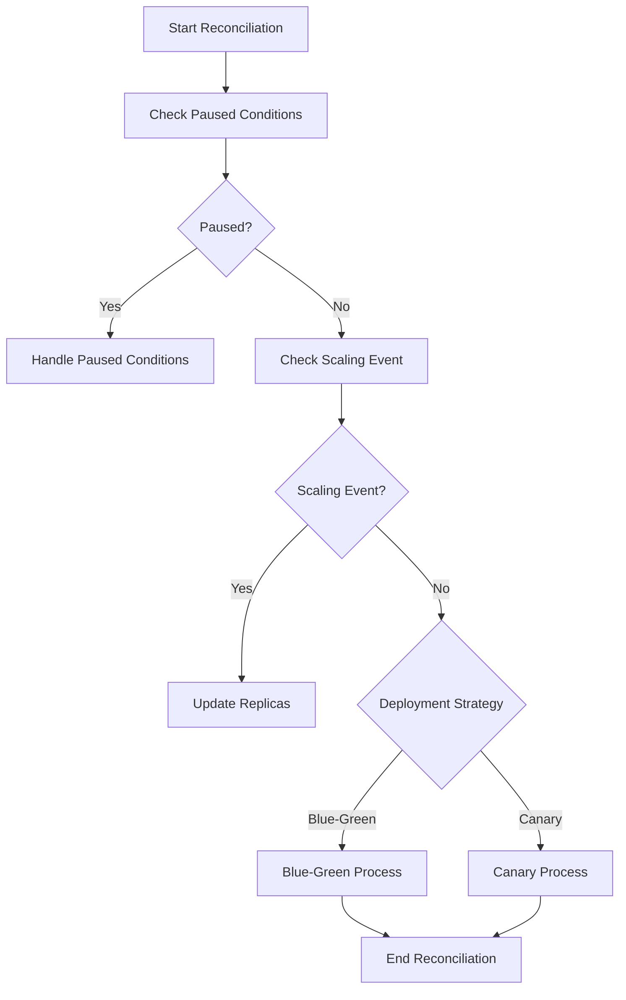

This document will cover the Reconciliation Process in Deployments, which includes:

1. Checking for paused conditions
2. Determining if a scaling event has occurred
3. Proceeding with the appropriate deployment strategy (Blue-Green or Canary).

Technical document: <SwmLink doc-title="Reconciliation Process in Deployments">[Reconciliation Process in Deployments](/.swm/reconciliation-process-in-deployments.a51xyju0.sw.md)</SwmLink>

# [Checking for Paused Conditions](http://localhost:5001/repos/Z2l0aHViJTNBJTNBaW50dWl0LWFyZ28tcm9sbG91dHMtZGVtbyUzQSUzQVN3aW1tLURlbW8=/docs/a51xyju0#reconcile-function)

The reconciliation process begins by checking if there are any paused conditions that need to be addressed. Paused conditions can occur due to various reasons such as manual intervention or automated checks that have flagged an issue. If a paused condition is detected, the system will handle it accordingly before proceeding. This ensures that any potential issues are resolved before moving forward with the deployment.

# [Determining if a Scaling Event has Occurred](http://localhost:5001/repos/Z2l0aHViJTNBJTNBaW50dWl0LWFyZ28tcm9sbG91dHMtZGVtbyUzQSUzQVN3aW1tLURlbW8=/docs/a51xyju0#is-scaling-event)

Next, the process checks if a scaling event has occurred. A scaling event means that the number of replicas (instances of the application) needs to be adjusted. This is determined by comparing the desired number of replicas with the current number. If a scaling event is detected, the system will update the replicas to match the desired state. This step ensures that the application can handle the required load and maintain performance.

# [Blue-Green Deployment Strategy](http://localhost:5001/repos/Z2l0aHViJTNBJTNBaW50dWl0LWFyZ28tcm9sbG91dHMtZGVtbyUzQSUzQVN3aW1tLURlbW8=/docs/a51xyju0#rollout-blue-green)

If the deployment strategy is Blue-Green, the system will follow the Blue-Green process. This involves creating a new replica set for the new version of the application while keeping the old version running. The new version is deployed to a 'blue' environment, and once it is verified to be working correctly, traffic is switched from the 'green' environment (old version) to the 'blue' environment (new version). This strategy allows for zero-downtime deployments and easy rollback if issues are detected.

# [Canary Deployment Strategy](http://localhost:5001/repos/Z2l0aHViJTNBJTNBaW50dWl0LWFyZ28tcm9sbG91dHMtZGVtbyUzQSUzQVN3aW1tLURlbW8=/docs/a51xyju0#rolloutcanary)

If the deployment strategy is Canary, the system will follow the Canary process. This involves gradually rolling out the new version of the application to a small subset of users before deploying it to the entire user base. The system monitors the performance and stability of the new version during this phase. If any issues are detected, the rollout can be paused or rolled back. This strategy minimizes the risk of introducing issues to the entire user base and allows for controlled testing of the new version.

&nbsp;

*This is an auto-generated document by Swimm 🌊 and has not yet been verified by a human*

<SwmMeta version="3.0.0" repo-id="Z2l0aHViJTNBJTNBaW50dWl0LWFyZ28tcm9sbG91dHMtZGVtbyUzQSUzQVN3aW1tLURlbW8=" repo-name="intuit-argo-rollouts-demo">Powered by [Swimm](/)</SwmMeta>
