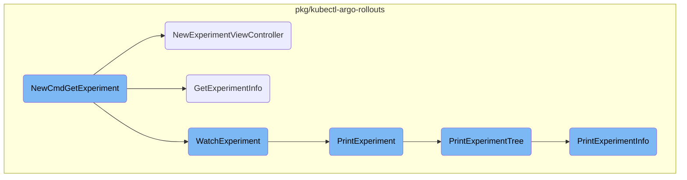
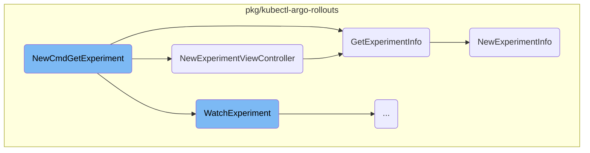
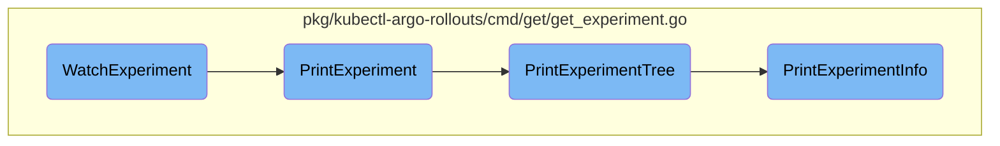

This document explains the process of retrieving and displaying details about an experiment. The process involves initializing the command, retrieving experiment information, and displaying it in a user-friendly format.

The flow starts by initializing a command to get experiment details. Once the command is run, it retrieves the experiment name and creates a controller to manage the experiment's information. The controller fetches detailed information about the experiment, including associated replica sets, pods, and analysis runs. This information is then formatted and displayed to the user, either as a one-time output or with live updates if the watch flag is set.

Here is a high level diagram of the flow, showing only the most important functions:



# Flow drill down

First, we'll zoom into this section of the flow:



<SwmSnippet path="/pkg/kubectl-argo-rollouts/cmd/get/get_experiment.go" line="29">

---

## Retrieving and Displaying Experiment Details

The <SwmToken path="pkg/kubectl-argo-rollouts/cmd/get/get_experiment.go" pos="29:2:2" line-data="// NewCmdGetExperiment returns a new instance of an `rollouts get experiment` command">`NewCmdGetExperiment`</SwmToken> function is responsible for creating a new command to get details about an experiment. It initializes the command with necessary options and sets up the execution flow. When the command is run, it retrieves the experiment name from the arguments, creates a new <SwmToken path="pkg/kubectl-argo-rollouts/viewcontroller/viewcontroller.go" pos="82:29:29" line-data="func NewExperimentViewController(namespace string, name string, kubeClient kubernetes.Interface, rolloutClient rolloutclientset.Interface) *ExperimentViewController {">`ExperimentViewController`</SwmToken>, and starts it. Depending on whether the watch flag is set, it either prints the experiment details once or watches for live updates.

```go
// NewCmdGetExperiment returns a new instance of an `rollouts get experiment` command
func NewCmdGetExperiment(o *options.ArgoRolloutsOptions) *cobra.Command {
	getOptions := GetOptions{
		ArgoRolloutsOptions: *o,
	}

	var cmd = &cobra.Command{
		Use:          "experiment EXPERIMENT_NAME",
		Aliases:      []string{"exp", "experiments"},
		Short:        "Get details about an Experiment",
		Long:         "Get details about and visual representation of a experiment. " + getUsageCommon,
		Example:      o.Example(experimentExample),
		SilenceUsage: true,
		RunE: func(c *cobra.Command, args []string) error {
			if len(args) != 1 {
				return o.UsageErr(c)
			}
			name := args[0]
			controller := viewcontroller.NewExperimentViewController(o.Namespace(), name, getOptions.KubeClientset(), getOptions.RolloutsClientset())
			ctx := context.Background()
			controller.Start(ctx)
```

---

</SwmSnippet>

<SwmSnippet path="/pkg/kubectl-argo-rollouts/viewcontroller/viewcontroller.go" line="82">

---

The <SwmToken path="pkg/kubectl-argo-rollouts/viewcontroller/viewcontroller.go" pos="82:2:2" line-data="func NewExperimentViewController(namespace string, name string, kubeClient kubernetes.Interface, rolloutClient rolloutclientset.Interface) *ExperimentViewController {">`NewExperimentViewController`</SwmToken> function creates a new instance of <SwmToken path="pkg/kubectl-argo-rollouts/viewcontroller/viewcontroller.go" pos="82:29:29" line-data="func NewExperimentViewController(namespace string, name string, kubeClient kubernetes.Interface, rolloutClient rolloutclientset.Interface) *ExperimentViewController {">`ExperimentViewController`</SwmToken>. It initializes the view controller with the namespace, experiment name, Kubernetes client, and rollouts client. The view controller is responsible for managing the retrieval and updates of experiment information.

```go
func NewExperimentViewController(namespace string, name string, kubeClient kubernetes.Interface, rolloutClient rolloutclientset.Interface) *ExperimentViewController {
	vc := newViewController(namespace, name, kubeClient, rolloutClient)
	evc := ExperimentViewController{
		viewController: vc,
	}
	vc.getObj = func() (any, error) {
		return evc.GetExperimentInfo()
	}
	return &evc
}
```

---

</SwmSnippet>

<SwmSnippet path="/pkg/kubectl-argo-rollouts/viewcontroller/viewcontroller.go" line="238">

---

The <SwmToken path="pkg/kubectl-argo-rollouts/viewcontroller/viewcontroller.go" pos="238:9:9" line-data="func (c *ExperimentViewController) GetExperimentInfo() (*rollout.ExperimentInfo, error) {">`GetExperimentInfo`</SwmToken> method in <SwmToken path="pkg/kubectl-argo-rollouts/viewcontroller/viewcontroller.go" pos="238:6:6" line-data="func (c *ExperimentViewController) GetExperimentInfo() (*rollout.ExperimentInfo, error) {">`ExperimentViewController`</SwmToken> retrieves detailed information about the experiment. It fetches the experiment object, associated replica sets, pods, and analysis runs. This information is then used to create an <SwmToken path="pkg/kubectl-argo-rollouts/viewcontroller/viewcontroller.go" pos="238:17:17" line-data="func (c *ExperimentViewController) GetExperimentInfo() (*rollout.ExperimentInfo, error) {">`ExperimentInfo`</SwmToken> object, which encapsulates all the relevant details about the experiment.

```go
func (c *ExperimentViewController) GetExperimentInfo() (*rollout.ExperimentInfo, error) {
	exp, err := c.experimentLister.Get(c.name)
	if err != nil {
		return nil, err
	}
	allReplicaSets, err := c.replicaSetLister.List(labels.Everything())
	if err != nil {
		return nil, err
	}
	allPods, err := c.podLister.List(labels.Everything())
	if err != nil {
		return nil, err
	}
	allAnalysisRuns, err := c.analysisRunLister.List(labels.Everything())
	if err != nil {
		return nil, err
	}
	expInfo := info.NewExperimentInfo(exp, allReplicaSets, allAnalysisRuns, allPods)
	return expInfo, nil
}
```

---

</SwmSnippet>

<SwmSnippet path="/pkg/kubectl-argo-rollouts/info/experiment_info.go" line="16">

---

The <SwmToken path="pkg/kubectl-argo-rollouts/info/experiment_info.go" pos="16:2:2" line-data="func NewExperimentInfo(">`NewExperimentInfo`</SwmToken> function constructs an <SwmToken path="pkg/kubectl-argo-rollouts/info/experiment_info.go" pos="21:5:5" line-data=") *rollout.ExperimentInfo {">`ExperimentInfo`</SwmToken> object using the experiment, replica sets, analysis runs, and pods. This object contains metadata, status, and other relevant details about the experiment, which are used for displaying the experiment information to the user.

```go
func NewExperimentInfo(
	exp *v1alpha1.Experiment,
	allReplicaSets []*appsv1.ReplicaSet,
	allAnalysisRuns []*v1alpha1.AnalysisRun,
	allPods []*corev1.Pod,
) *rollout.ExperimentInfo {

	expInfo := rollout.ExperimentInfo{
		ObjectMeta: &v1.ObjectMeta{
			Name:              exp.Name,
			Namespace:         exp.Namespace,
			CreationTimestamp: exp.CreationTimestamp,
			UID:               exp.UID,
		},
		Status:  string(exp.Status.Phase),
		Message: exp.Status.Message,
	}
	expInfo.Icon = analysisIcon(exp.Status.Phase)
	expInfo.Revision = int64(parseRevision(exp.ObjectMeta.Annotations))
	expInfo.ReplicaSets = GetReplicaSetInfo(exp.UID, nil, allReplicaSets, allPods)
	expInfo.AnalysisRuns = getAnalysisRunInfo(exp.UID, allAnalysisRuns)
```

---

</SwmSnippet>

Now, lets zoom into this section of the flow:



<SwmSnippet path="/pkg/kubectl-argo-rollouts/cmd/get/get_experiment.go" line="75">

---

## Monitoring Experiment Updates

The <SwmToken path="pkg/kubectl-argo-rollouts/cmd/get/get_experiment.go" pos="75:9:9" line-data="func (o *GetOptions) WatchExperiment(stopCh &lt;-chan struct{}, expUpdates chan *rollout.ExperimentInfo) {">`WatchExperiment`</SwmToken> function is responsible for monitoring updates to an experiment. It uses a ticker to periodically check for updates and a channel to receive experiment information. If an update is received, it clears the current display and prints the new experiment information, ensuring the terminal does not flicker by rate-limiting updates.

```go
func (o *GetOptions) WatchExperiment(stopCh <-chan struct{}, expUpdates chan *rollout.ExperimentInfo) {
	ticker := time.NewTicker(time.Second)
	var currExpInfo *rollout.ExperimentInfo
	// preventFlicker is used to rate-limit the updates we print to the terminal when updates occur
	// so rapidly that it causes the terminal to flicker
	var preventFlicker time.Time

	for {
		select {
		case expInfo := <-expUpdates:
			currExpInfo = expInfo
		case <-ticker.C:
		case <-stopCh:
			return
		}
		if currExpInfo != nil && time.Now().After(preventFlicker.Add(200*time.Millisecond)) {
			o.Clear()
			o.PrintExperiment(currExpInfo)
			preventFlicker = time.Now()
		}
	}
```

---

</SwmSnippet>

<SwmSnippet path="/pkg/kubectl-argo-rollouts/cmd/get/get_experiment.go" line="98">

---

## Displaying Experiment Information

The <SwmToken path="pkg/kubectl-argo-rollouts/cmd/get/get_experiment.go" pos="98:9:9" line-data="func (o *GetOptions) PrintExperiment(exInfo *rollout.ExperimentInfo) {">`PrintExperiment`</SwmToken> function formats and displays the experiment's metadata, status, and associated images. It ensures that all relevant information is presented in a user-friendly format and then calls <SwmToken path="pkg/kubectl-argo-rollouts/cmd/get/get_experiment.go" pos="114:3:3" line-data="	o.PrintExperimentTree(exInfo)">`PrintExperimentTree`</SwmToken> to display the hierarchical structure of the experiment.

```go
func (o *GetOptions) PrintExperiment(exInfo *rollout.ExperimentInfo) {
	fmt.Fprintf(o.Out, tableFormat, "Name:", exInfo.ObjectMeta.Name)
	fmt.Fprintf(o.Out, tableFormat, "Namespace:", exInfo.ObjectMeta.Namespace)
	fmt.Fprintf(o.Out, tableFormat, "Status:", o.colorize(exInfo.Icon)+" "+exInfo.Status)
	if exInfo.Message != "" {
		fmt.Fprintf(o.Out, tableFormat, "Message:", exInfo.Message)
	}
	images := info.ExperimentImages(exInfo)
	if len(images) > 0 {
		fmt.Fprintf(o.Out, tableFormat, "Images:", o.formatImage(images[0]))
		for i := 1; i < len(images); i++ {
			fmt.Fprintf(o.Out, tableFormat, "", o.formatImage(images[i]))
		}
	}

	fmt.Fprintf(o.Out, "\n")
	o.PrintExperimentTree(exInfo)
}
```

---

</SwmSnippet>

<SwmSnippet path="/pkg/kubectl-argo-rollouts/cmd/get/get_experiment.go" line="117">

---

## Displaying Experiment Hierarchy

The <SwmToken path="pkg/kubectl-argo-rollouts/cmd/get/get_experiment.go" pos="117:9:9" line-data="func (o *GetOptions) PrintExperimentTree(exInfo *rollout.ExperimentInfo) {">`PrintExperimentTree`</SwmToken> function is responsible for displaying the hierarchical structure of the experiment. It uses a tab writer to format the output and calls <SwmToken path="pkg/kubectl-argo-rollouts/cmd/get/get_experiment.go" pos="120:3:3" line-data="	o.PrintExperimentInfo(w, *exInfo, &quot;&quot;, &quot;&quot;)">`PrintExperimentInfo`</SwmToken> to print detailed information about the experiment.

```go
func (o *GetOptions) PrintExperimentTree(exInfo *rollout.ExperimentInfo) {
	w := ansiterm.NewTabWriter(o.Out, 0, 0, 2, ' ', 0)
	o.PrintHeader(w)
	o.PrintExperimentInfo(w, *exInfo, "", "")
	_ = w.Flush()
}
```

---

</SwmSnippet>

<SwmSnippet path="/pkg/kubectl-argo-rollouts/cmd/get/get_experiment.go" line="124">

---

## Detailed Experiment Information

The <SwmToken path="pkg/kubectl-argo-rollouts/cmd/get/get_experiment.go" pos="124:9:9" line-data="func (o *GetOptions) PrintExperimentInfo(w io.Writer, expInfo rollout.ExperimentInfo, prefix string, subpfx string) {">`PrintExperimentInfo`</SwmToken> function prints detailed information about the experiment, including its name, status, and associated replica sets and analysis runs. It ensures that all relevant details are displayed in a structured and readable format.

```go
func (o *GetOptions) PrintExperimentInfo(w io.Writer, expInfo rollout.ExperimentInfo, prefix string, subpfx string) {
	name := o.colorizeStatus(expInfo.ObjectMeta.Name, expInfo.Status)
	infoCols := []string{}
	total := len(expInfo.ReplicaSets) + len(expInfo.AnalysisRuns)
	curr := 0
	fmt.Fprintf(w, "%s%s %s\t%s\t%s %s\t%s\t%v\n", prefix, IconExperiment, name, "Experiment", o.colorize(expInfo.Icon), expInfo.Status, info.Age(*expInfo.ObjectMeta), strings.Join(infoCols, ","))

	for _, rsInfo := range expInfo.ReplicaSets {
		childPrefix, childSubpfx := getPrefixes(curr == total-1, subpfx)
		o.PrintReplicaSetInfo(w, *rsInfo, childPrefix, childSubpfx)
		curr++
	}
	for _, arInfo := range expInfo.AnalysisRuns {
		arPrefix, arChildPrefix := getPrefixes(curr == total-1, subpfx)
		o.PrintAnalysisRunInfo(w, *arInfo, arPrefix, arChildPrefix)
		curr++
	}
```

---

</SwmSnippet>

&nbsp;

*This is an auto-generated document by Swimm 🌊 and has not yet been verified by a human*

<SwmMeta version="3.0.0" repo-id="Z2l0aHViJTNBJTNBaW50dWl0LWFyZ28tcm9sbG91dHMtZGVtbyUzQSUzQVN3aW1tLURlbW8=" repo-name="intuit-argo-rollouts-demo"><sup>Powered by [Swimm](/)</sup></SwmMeta>
