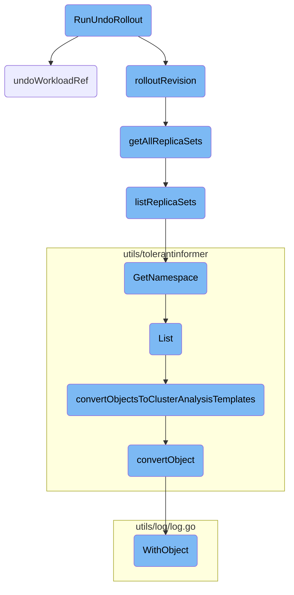
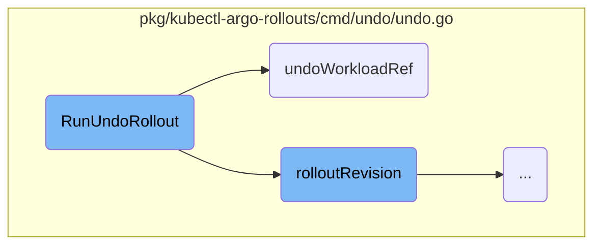
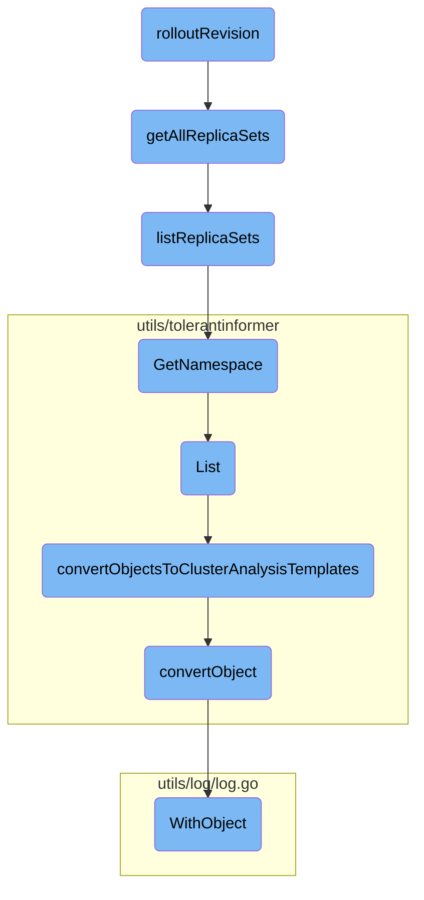

In this document, we will explain the process of rolling back a deployment using the <SwmToken path="pkg/kubectl-argo-rollouts/cmd/undo/undo.go" pos="70:2:2" line-data="// RunUndoRollout performs the execution of &#39;rollouts undo&#39; sub command">`RunUndoRollout`</SwmToken> command. This process involves several steps, including retrieving the current rollout object, determining the desired revision, and applying the necessary patches to revert to the specified revision.

The flow starts by retrieving the current state of the deployment. It then checks if the current state matches the desired rollback state. If they match, the rollback is skipped. If they don't match, it prepares the necessary changes to revert the deployment to the desired state. Finally, it applies these changes to the appropriate resources, ensuring the deployment is rolled back correctly.

Here is a high level diagram of the flow, showing only the most important functions:



# Flow drill down

First, we'll zoom into this section of the flow:



<SwmSnippet path="/pkg/kubectl-argo-rollouts/cmd/undo/undo.go" line="70">

---

## Handling the rollback of a rollout

The <SwmToken path="pkg/kubectl-argo-rollouts/cmd/undo/undo.go" pos="70:2:2" line-data="// RunUndoRollout performs the execution of &#39;rollouts undo&#39; sub command">`RunUndoRollout`</SwmToken> function is responsible for executing the 'rollouts undo' command. It retrieves the current rollout object and the desired revision's replica set. If the current template matches the desired revision, it skips the rollback. Otherwise, it prepares a patch to restore the rollout to the specified revision. If the rollout has a workload reference, it delegates the patching to the <SwmToken path="pkg/kubectl-argo-rollouts/cmd/undo/undo.go" pos="117:2:2" line-data="func undoWorkloadRef(c kubernetes.Interface, rollout *v1alpha1.Rollout, patchType types.PatchType, patch []byte) error {">`undoWorkloadRef`</SwmToken> function.

```go
// RunUndoRollout performs the execution of 'rollouts undo' sub command
func RunUndoRollout(rolloutIf dynamic.ResourceInterface, c kubernetes.Interface, name string, toRevision int64) (string, error) {
	ctx := context.TODO()
	var err error

	ro, err := rolloutIf.Get(ctx, name, metav1.GetOptions{})
	if err != nil {
		return "", err
	}
	rsForRevision, err := rolloutRevision(ro, c, toRevision)
	if err != nil {
		return "", err
	}

	equal, err := equalIgnoreHash(ro, rsForRevision)
	if err != nil {
		return "", err
	}
	if equal {
		return fmt.Sprintf("skipped rollback (current template already matches revision %d)", toRevision), nil
	}
```

---

</SwmSnippet>

<SwmSnippet path="/pkg/kubectl-argo-rollouts/cmd/undo/undo.go" line="117">

---

### Patching the workload reference

The <SwmToken path="pkg/kubectl-argo-rollouts/cmd/undo/undo.go" pos="117:2:2" line-data="func undoWorkloadRef(c kubernetes.Interface, rollout *v1alpha1.Rollout, patchType types.PatchType, patch []byte) error {">`undoWorkloadRef`</SwmToken> function handles the patching of the workload reference. It determines the type of workload (e.g., Deployment, <SwmToken path="pkg/kubectl-argo-rollouts/cmd/undo/undo.go" pos="126:4:4" line-data="	case &quot;ReplicaSet&quot;:">`ReplicaSet`</SwmToken>, <SwmToken path="pkg/kubectl-argo-rollouts/cmd/undo/undo.go" pos="128:4:4" line-data="	case &quot;PodTemplate&quot;:">`PodTemplate`</SwmToken>) and applies the patch accordingly. If the workload type is not supported, it returns an error. This function ensures that the correct workload is updated during the rollback process.

```go
func undoWorkloadRef(c kubernetes.Interface, rollout *v1alpha1.Rollout, patchType types.PatchType, patch []byte) error {
	var err error

	refName := rollout.Spec.WorkloadRef.Name
	namespace := rollout.GetNamespace()

	switch rollout.Spec.WorkloadRef.Kind {
	case "Deployment":
		_, err = c.AppsV1().Deployments(namespace).Patch(context.TODO(), refName, patchType, patch, metav1.PatchOptions{})
	case "ReplicaSet":
		_, err = c.AppsV1().ReplicaSets(namespace).Patch(context.TODO(), refName, patchType, patch, metav1.PatchOptions{})
	case "PodTemplate":
		_, err = c.CoreV1().PodTemplates(namespace).Patch(context.TODO(), refName, patchType, patch, metav1.PatchOptions{})
	default:
		return fmt.Errorf("workload of type %s is not supported", rollout.Spec.WorkloadRef.Kind)
	}
	return err
}
```

---

</SwmSnippet>

Now, lets zoom into this section of the flow:



<SwmSnippet path="/pkg/kubectl-argo-rollouts/cmd/undo/undo.go" line="136">

---

## Rollout Revision

The <SwmToken path="pkg/kubectl-argo-rollouts/cmd/undo/undo.go" pos="136:2:2" line-data="func rolloutRevision(ro *unstructured.Unstructured, c kubernetes.Interface, toRevision int64) (*appsv1.ReplicaSet, error) {">`rolloutRevision`</SwmToken> function is responsible for determining the target revision to which the deployment should be rolled back. It retrieves all replica sets associated with the rollout and identifies the latest and previous revisions. If a specific revision is requested, it returns the corresponding replica set; otherwise, it defaults to the previous revision.

```go
func rolloutRevision(ro *unstructured.Unstructured, c kubernetes.Interface, toRevision int64) (*appsv1.ReplicaSet, error) {
	allRSs, err := getAllReplicaSets(ro, c.AppsV1())
	if err != nil {
		return nil, fmt.Errorf("failed to retrieve replica sets from rollout %s: %v", ro.GetName(), err)
	}
	var (
		latestReplicaSet   *appsv1.ReplicaSet
		latestRevision     = int64(-1)
		previousReplicaSet *appsv1.ReplicaSet
		previousRevision   = int64(-1)
	)
	for _, rs := range allRSs {
		if v, err := revision(rs); err == nil {
			if toRevision == 0 {
				if latestRevision < v {
					// newest one we've seen so far
					previousRevision = latestRevision
					previousReplicaSet = latestReplicaSet
					latestRevision = v
					latestReplicaSet = rs
				} else if previousRevision < v {
```

---

</SwmSnippet>

<SwmSnippet path="/pkg/kubectl-argo-rollouts/cmd/undo/undo.go" line="189">

---

## Get All Replica Sets

The <SwmToken path="pkg/kubectl-argo-rollouts/cmd/undo/undo.go" pos="189:2:2" line-data="func getAllReplicaSets(ro *unstructured.Unstructured, c appsclient.AppsV1Interface) ([]*appsv1.ReplicaSet, error) {">`getAllReplicaSets`</SwmToken> function retrieves all replica sets associated with the given rollout. It calls <SwmToken path="pkg/kubectl-argo-rollouts/cmd/undo/undo.go" pos="190:8:8" line-data="	rsList, err := listReplicaSets(ro, rsListFromClient(c))">`listReplicaSets`</SwmToken> to get the list of replica sets from the Kubernetes API.

```go
func getAllReplicaSets(ro *unstructured.Unstructured, c appsclient.AppsV1Interface) ([]*appsv1.ReplicaSet, error) {
	rsList, err := listReplicaSets(ro, rsListFromClient(c))
	if err != nil {
		return nil, err
	}
	return rsList, nil
}
```

---

</SwmSnippet>

<SwmSnippet path="/pkg/kubectl-argo-rollouts/cmd/undo/undo.go" line="213">

---

## List Replica Sets

The <SwmToken path="pkg/kubectl-argo-rollouts/cmd/undo/undo.go" pos="213:2:2" line-data="func listReplicaSets(ro *unstructured.Unstructured, getRSList rsListFunc) ([]*appsv1.ReplicaSet, error) {">`listReplicaSets`</SwmToken> function lists all replica sets in the namespace of the rollout that match the rollout's label selector. It filters the replica sets to include only those controlled by the rollout.

```go
func listReplicaSets(ro *unstructured.Unstructured, getRSList rsListFunc) ([]*appsv1.ReplicaSet, error) {
	namespace := ro.GetNamespace()
	labelSelector, err := extractLabelSelector(ro.Object)
	if err != nil {
		return nil, err
	}
	selector, err := metav1.LabelSelectorAsSelector(labelSelector)
	if err != nil {
		return nil, err
	}
	options := metav1.ListOptions{LabelSelector: selector.String()}
	all, err := getRSList(namespace, options)
	if err != nil {
		return nil, err
	}
	// Only include those whose ControllerRef matches the rollout.
	owned := make([]*appsv1.ReplicaSet, 0, len(all))
	for _, rs := range all {
		if metav1.IsControlledBy(rs, ro) {
			owned = append(owned, rs)
		}
```

---

</SwmSnippet>

<SwmSnippet path="/server/server.go" line="345">

---

## Get Namespace

The <SwmToken path="server/server.go" pos="345:9:9" line-data="func (s *ArgoRolloutsServer) GetNamespace(ctx context.Context, e *empty.Empty) (*rollout.NamespaceInfo, error) {">`GetNamespace`</SwmToken> function retrieves the namespace information for the rollout. It lists all rollouts and compiles a list of unique namespaces where these rollouts are deployed.

```go
func (s *ArgoRolloutsServer) GetNamespace(ctx context.Context, e *empty.Empty) (*rollout.NamespaceInfo, error) {
	var m = make(map[string]bool)
	var namespaces []string

	rolloutList, err := s.Options.RolloutsClientset.ArgoprojV1alpha1().Rollouts("").List(ctx, v1.ListOptions{})
	if err == nil {
		for _, r := range rolloutList.Items {
			ns := r.Namespace
			if !m[ns] {
				m[ns] = true
				namespaces = append(namespaces, ns)
			}
		}
	}

	return &rollout.NamespaceInfo{Namespace: s.Options.Namespace, AvailableNamespaces: namespaces}, nil
}
```

---

</SwmSnippet>

<SwmSnippet path="/utils/tolerantinformer/clusteranalysistemplate.go" line="39">

---

## List Cluster Analysis Templates

The `List` function in <SwmToken path="utils/tolerantinformer/clusteranalysistemplate.go" pos="39:6:6" line-data="func (t *tolerantClusterAnalysisTemplateLister) List(selector labels.Selector) ([]*v1alpha1.ClusterAnalysisTemplate, error) {">`tolerantClusterAnalysisTemplateLister`</SwmToken> lists all cluster analysis templates that match the given selector. It converts the objects to cluster analysis templates using <SwmToken path="utils/tolerantinformer/clusteranalysistemplate.go" pos="44:3:3" line-data="	return convertObjectsToClusterAnalysisTemplates(objects)">`convertObjectsToClusterAnalysisTemplates`</SwmToken>.

```go
func (t *tolerantClusterAnalysisTemplateLister) List(selector labels.Selector) ([]*v1alpha1.ClusterAnalysisTemplate, error) {
	objects, err := t.delegate.List(selector)
	if err != nil {
		return nil, err
	}
	return convertObjectsToClusterAnalysisTemplates(objects)
}
```

---

</SwmSnippet>

<SwmSnippet path="/utils/tolerantinformer/clusteranalysistemplate.go" line="57">

---

## Convert Objects to Cluster Analysis Templates

The <SwmToken path="utils/tolerantinformer/clusteranalysistemplate.go" pos="57:2:2" line-data="func convertObjectsToClusterAnalysisTemplates(objects []runtime.Object) ([]*v1alpha1.ClusterAnalysisTemplate, error) {">`convertObjectsToClusterAnalysisTemplates`</SwmToken> function converts a list of runtime objects to cluster analysis templates. It iterates over the objects and uses <SwmToken path="utils/tolerantinformer/clusteranalysistemplate.go" pos="62:5:5" line-data="		err := convertObject(obj, vs[i])">`convertObject`</SwmToken> to perform the conversion.

```go
func convertObjectsToClusterAnalysisTemplates(objects []runtime.Object) ([]*v1alpha1.ClusterAnalysisTemplate, error) {
	var firstErr error
	vs := make([]*v1alpha1.ClusterAnalysisTemplate, len(objects))
	for i, obj := range objects {
		vs[i] = &v1alpha1.ClusterAnalysisTemplate{}
		err := convertObject(obj, vs[i])
		if err != nil && firstErr != nil {
			firstErr = err
		}
	}
	return vs, firstErr
}
```

---

</SwmSnippet>

<SwmSnippet path="/utils/tolerantinformer/tollerantinformer.go" line="14">

---

## Convert Object

The <SwmToken path="utils/tolerantinformer/tollerantinformer.go" pos="14:2:2" line-data="// convertObject converts a runtime.Object into the supplied concrete typed object">`convertObject`</SwmToken> function converts a runtime object into a specified typed object. It uses the default unstructured converter and falls back to JSON unmarshalling if the conversion fails.

```go
// convertObject converts a runtime.Object into the supplied concrete typed object
// typedObj should be a pointer to a typed object which is desired to be filled in.
// This is a best effort conversion which ignores unmarshalling errors.
func convertObject(object runtime.Object, typedObj any) error {
	un, ok := object.(*unstructured.Unstructured)
	if !ok {
		return fmt.Errorf("malformed object: expected \"*unstructured.Unstructured\", got \"%s\"", reflect.TypeOf(object).Name())
	}
	err := runtime.DefaultUnstructuredConverter.FromUnstructured(un.Object, typedObj)
	if err != nil {
		logCtx := logutil.WithObject(un)
		logCtx.Warnf("malformed object: %v", err)
		// When DefaultUnstructuredConverter.FromUnstructured fails to convert an object, it
		// fails fast, not bothering to unmarshal the rest of the contents.
		// When this happens, we fall back to golang json unmarshalling, since golang json
		// unmarshalling continues to unmarshal all the remaining fields, which allows us to
		// return back a mostly complete, and likely still usable object. This approach is
		// preferred over the other options, which is to either return an error, or ignore the
		// object completely.
		_ = fromUnstructuredViaJSON(un.Object, typedObj)
	}
```

---

</SwmSnippet>

<SwmSnippet path="/utils/log/log.go" line="45">

---

## Logging Context with Object

The <SwmToken path="utils/log/log.go" pos="45:2:2" line-data="// WithObject returns a logging context for an object which includes &lt;kind&gt;=&lt;name&gt; and namespace=&lt;namespace&gt;">`WithObject`</SwmToken> function returns a logging context for an object, including its kind and namespace. This helps in logging detailed information about the object during the rollback process.

```go
// WithObject returns a logging context for an object which includes <kind>=<name> and namespace=<namespace>
func WithObject(obj runtime.Object) *log.Entry {
	logCtx := log.NewEntry(log.StandardLogger())
	gvk := obj.GetObjectKind().GroupVersionKind()
	kind := gvk.Kind
	if kind == "" {
		// it's possible for kind can be empty
		switch obj.(type) {
		case *v1alpha1.Rollout:
			kind = "rollout"
		case *v1alpha1.AnalysisRun:
			kind = "analysisrun"
		case *v1alpha1.AnalysisTemplate:
			kind = "analysistemplate"
		case *v1alpha1.ClusterAnalysisTemplate:
			kind = "clusteranalysistemplate"
		case *v1alpha1.Experiment:
			kind = "experiment"
		}
	}
	objectMeta, err := meta.Accessor(obj)
```

---

</SwmSnippet>

&nbsp;

*This is an auto-generated document by Swimm 🌊 and has not yet been verified by a human*

<SwmMeta version="3.0.0" repo-id="Z2l0aHViJTNBJTNBaW50dWl0LWFyZ28tcm9sbG91dHMtZGVtbyUzQSUzQVN3aW1tLURlbW8=" repo-name="intuit-argo-rollouts-demo"><sup>Powered by [Swimm](/)</sup></SwmMeta>
