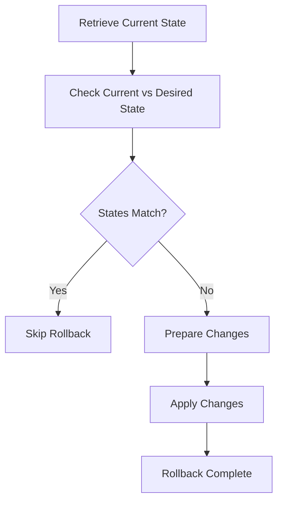

This document will cover the rollback deployment flow, which includes:

1. Retrieving the current state of the deployment
2. Checking if the current state matches the desired rollback state
3. Preparing the necessary changes to revert the deployment
4. Applying these changes to the appropriate resources.

Technical document: <SwmLink doc-title="Rollback Deployment Flow">[Rollback Deployment Flow](/.swm/rollback-deployment-flow.8p8q9llb.sw.md)</SwmLink>

# [Retrieving the current state of the deployment](http://localhost:5001/repos/Z2l0aHViJTNBJTNBaW50dWl0LWFyZ28tcm9sbG91dHMtZGVtbyUzQSUzQVN3aW1tLURlbW8=/docs/8p8q9llb#runundorollout)

The first step in the rollback deployment flow is to retrieve the current state of the deployment. This involves accessing the current rollout object, which contains all the necessary information about the deployment's current configuration and status. This step ensures that we have the most up-to-date information before proceeding with the rollback process.

# [Checking if the current state matches the desired rollback state](http://localhost:5001/repos/Z2l0aHViJTNBJTNBaW50dWl0LWFyZ28tcm9sbG91dHMtZGVtbyUzQSUzQVN3aW1tLURlbW8=/docs/8p8q9llb#runundorollout)

Once the current state is retrieved, the next step is to compare it with the desired rollback state. This involves checking if the current deployment configuration matches the configuration of the desired revision. If they match, it means the deployment is already in the desired state, and the rollback can be skipped. If they do not match, it indicates that changes are needed to revert the deployment to the desired state.

# [Preparing the necessary changes to revert the deployment](http://localhost:5001/repos/Z2l0aHViJTNBJTNBaW50dWl0LWFyZ28tcm9sbG91dHMtZGVtbyUzQSUzQVN3aW1tLURlbW8=/docs/8p8q9llb#runundorollout)

If the current state does not match the desired rollback state, the next step is to prepare the necessary changes to revert the deployment. This involves creating a patch that will update the deployment's configuration to match the desired revision. The patch is carefully constructed to ensure that all relevant aspects of the deployment are correctly reverted, including any changes to the workload references.

# [Applying these changes to the appropriate resources](http://localhost:5001/repos/Z2l0aHViJTNBJTNBaW50dWl0LWFyZ28tcm9sbG91dHMtZGVtbyUzQSUzQVN3aW1tLURlbW8=/docs/8p8q9llb#undoworkloadref)

The final step in the rollback deployment flow is to apply the prepared changes to the appropriate resources. This involves updating the deployment's workload references, such as Deployments, <SwmToken path="pkg/apiclient/rollout/rollout.pb.go" pos="922:1:1" line-data="	ReplicaSets          []*ReplicaSetInfo  `protobuf:&quot;bytes,6,rep,name=replicaSets,proto3&quot; json:&quot;replicaSets,omitempty&quot;`">`ReplicaSets`</SwmToken>, or PodTemplates, with the new configuration. The changes are applied in a way that ensures the deployment is correctly reverted to the desired state, and any errors during this process are handled appropriately to maintain the integrity of the deployment.

&nbsp;

*This is an auto-generated document by Swimm 🌊 and has not yet been verified by a human*

<SwmMeta version="3.0.0" repo-id="Z2l0aHViJTNBJTNBaW50dWl0LWFyZ28tcm9sbG91dHMtZGVtbyUzQSUzQVN3aW1tLURlbW8=" repo-name="intuit-argo-rollouts-demo">Powered by [Swimm](/)</SwmMeta>
