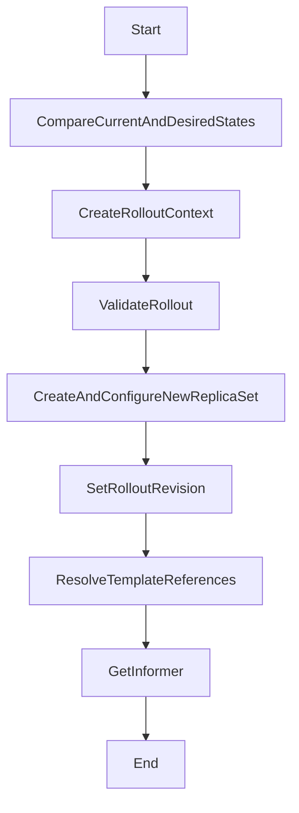

The Rollout Synchronization Process ensures that the actual state of a rollout matches its desired state. This document will cover:

1. Comparing Current and Desired States
2. Creating Rollout Context
3. Validating the Rollout
4. Creating and Configuring the New ReplicaSet
5. Setting the Rollout Revision
6. Resolving Template References
7. Getting Informer

Technical document: <SwmLink doc-title="Rollout Synchronization Process">[Rollout Synchronization Process](/.swm/rollout-synchronization-process.lpvpup0r.sw.md)</SwmLink>

# [Comparing Current and Desired States](http://localhost:5001/repos/Z2l0aHViJTNBJTNBaW50dWl0LWFyZ28tcm9sbG91dHMtZGVtbyUzQSUzQVN3aW1tLURlbW8=/docs/lpvpup0r#synchandler)

The synchronization process begins by comparing the current state of the rollout with its desired state. This step identifies any discrepancies between the two states. If differences are found, the system attempts to reconcile them to ensure the rollout progresses as expected. This involves updating the status of the rollout to reflect its current phase.

# [Creating Rollout Context](http://localhost:5001/repos/Z2l0aHViJTNBJTNBaW50dWl0LWFyZ28tcm9sbG91dHMtZGVtbyUzQSUzQVN3aW1tLURlbW8=/docs/lpvpup0r#creating-the-rollout-context)

The next step is to create a context for the rollout. This context gathers all necessary information, such as the new, stable, and older <SwmToken path="pkg/apiclient/rollout/rollout.pb.go" pos="922:1:1" line-data="	ReplicaSets          []*ReplicaSetInfo  `protobuf:&quot;bytes,6,rep,name=replicaSets,proto3&quot; json:&quot;replicaSets,omitempty&quot;`">`ReplicaSets`</SwmToken>, current and old experiments, and analysis runs. This context is crucial for managing the state and progress of the rollout, ensuring that all relevant data is available for decision-making.

# [Validating the Rollout](http://localhost:5001/repos/Z2l0aHViJTNBJTNBaW50dWl0LWFyZ28tcm9sbG91dHMtZGVtbyUzQSUzQVN3aW1tLURlbW8=/docs/lpvpup0r#validating-the-rollout)

The rollout configuration is then validated to check for any errors in the rollout specification and referenced resources. This step ensures that the rollout is correctly configured and that all referenced resources, such as services and analysis templates, are available and properly set up. If any validation errors are found, they are returned to be handled appropriately.

# [Creating and Configuring the New ReplicaSet](http://localhost:5001/repos/Z2l0aHViJTNBJTNBaW50dWl0LWFyZ28tcm9sbG91dHMtZGVtbyUzQSUzQVN3aW1tLURlbW8=/docs/lpvpup0r#creating-and-configuring-the-new-replicaset)

If a new ReplicaSet is needed, it is created and configured. This involves calculating the new revision number, setting up the ReplicaSet template, and handling potential hash collisions. The new ReplicaSet is configured with the appropriate labels, annotations, and metadata based on the rollout strategy (Canary or Blue-Green). This step ensures that the new ReplicaSet is correctly set up to handle the deployment.

# [Setting the Rollout Revision](http://localhost:5001/repos/Z2l0aHViJTNBJTNBaW50dWl0LWFyZ28tcm9sbG91dHMtZGVtbyUzQSUzQVN3aW1tLURlbW8=/docs/lpvpup0r#setting-the-rollout-revision)

The rollout is then updated with the new revision number. This step is crucial for tracking the progress and state of the rollout, ensuring that the system can correctly identify and manage different versions of the application. The new revision number helps in maintaining a clear history of changes and updates.

# [Resolving Template References](http://localhost:5001/repos/Z2l0aHViJTNBJTNBaW50dWl0LWFyZ28tcm9sbG91dHMtZGVtbyUzQSUzQVN3aW1tLURlbW8=/docs/lpvpup0r#resolving-template-references)

The system checks if the rollout has a template reference and resolves the pod template. This step ensures that the rollout uses the correct pod template, which is essential for maintaining consistency and correctness in the deployment process. It verifies that the template is correctly referenced and available.

# [Getting Informer](http://localhost:5001/repos/Z2l0aHViJTNBJTNBaW50dWl0LWFyZ28tcm9sbG91dHMtZGVtbyUzQSUzQVN3aW1tLURlbW8=/docs/lpvpup0r#getting-informer)

Finally, an informer is created to watch all resources of a given group version kind. This step is important for monitoring the state of the resources and ensuring that the rollout can react to changes in the environment. The informer helps in keeping track of the resources and their states, providing real-time updates to the system.

&nbsp;

*This is an auto-generated document by Swimm 🌊 and has not yet been verified by a human*

<SwmMeta version="3.0.0" repo-id="Z2l0aHViJTNBJTNBaW50dWl0LWFyZ28tcm9sbG91dHMtZGVtbyUzQSUzQVN3aW1tLURlbW8=" repo-name="intuit-argo-rollouts-demo">Powered by [Swimm](/)</SwmMeta>
