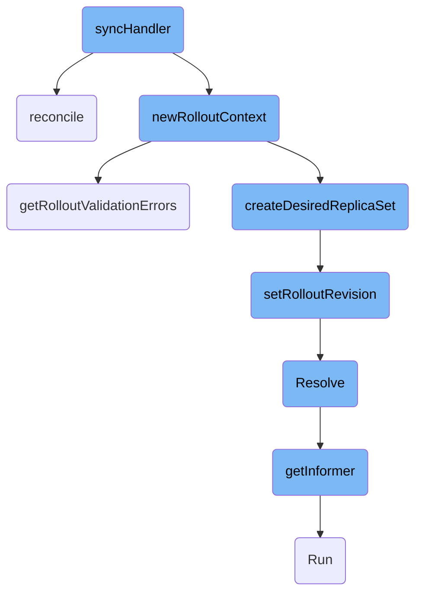
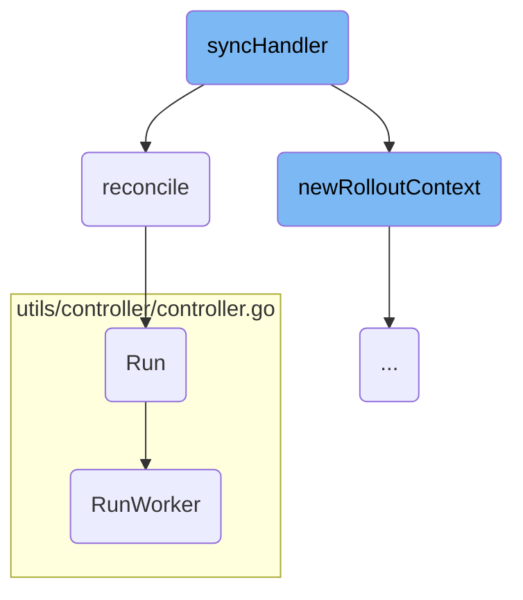
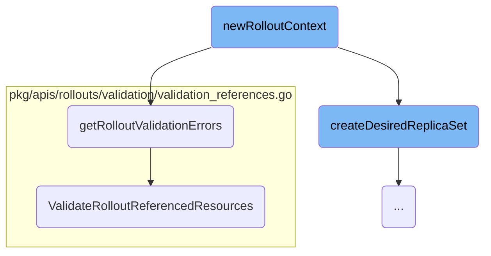
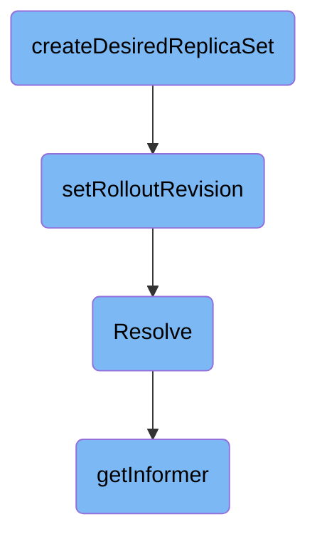

This document explains the process of synchronizing the actual state of a rollout with its desired state. The synchronization process involves several steps to ensure that the rollout progresses as expected and handles any discrepancies.

The synchronization process starts by comparing the current state of the rollout with the desired state. If there are any differences, the system attempts to reconcile them. This involves creating a context for the rollout, validating the rollout configuration, creating and configuring a new <SwmToken path="rollout/sync.go" pos="134:17:17" line-data="func (c *rolloutContext) createDesiredReplicaSet() (*appsv1.ReplicaSet, error) {">`ReplicaSet`</SwmToken> if needed, and updating the rollout with the new revision number. Throughout this process, the system ensures that all referenced resources are correctly configured and available.

Here is a high level diagram of the flow, showing only the most important functions:



# Flow drill down

First, we'll zoom into this section of the flow:



<SwmSnippet path="/rollout/controller.go" line="379">

---

## <SwmToken path="rollout/controller.go" pos="379:2:2" line-data="// syncHandler compares the actual state with the desired, and attempts to">`syncHandler`</SwmToken>

The <SwmToken path="rollout/controller.go" pos="379:2:2" line-data="// syncHandler compares the actual state with the desired, and attempts to">`syncHandler`</SwmToken> function is responsible for comparing the actual state of a rollout with the desired state and attempting to converge the two. It updates the Phase block of the Rollout resource with the current status. This function ensures that the rollout is progressing as expected and handles any discrepancies by reconciling the states.

```go
// syncHandler compares the actual state with the desired, and attempts to
// converge the two. It then updates the Phase block of the Rollout resource
// with the current status of the resource.
func (c *Controller) syncHandler(ctx context.Context, key string) error {
	startTime := timeutil.Now()
	namespace, name, err := cache.SplitMetaNamespaceKey(key)
	if err != nil {
		return err
	}
	rollout, err := c.rolloutsLister.Rollouts(namespace).Get(name)
	if k8serrors.IsNotFound(err) {
		return nil
	}
	if err != nil {
		return err
	}

	// Remarshal the rollout to normalize all fields so that when we calculate hashes against the
	// rollout spec and pod template spec, the hash will be consistent. See issue #70
	// This also returns a copy of the rollout to prevent mutation of the informer cache.
	r := remarshalRollout(rollout)
```

---

</SwmSnippet>

<SwmSnippet path="/rollout/stepplugin.go" line="29">

---

## reconcile

The <SwmToken path="rollout/stepplugin.go" pos="29:9:9" line-data="func (spc *stepPluginContext) reconcile(c *rolloutContext) error {">`reconcile`</SwmToken> function in <SwmPath>[rollout/stepplugin.go](rollout/stepplugin.go)</SwmPath> handles the detailed reconciliation logic for the rollout. It manages the state transitions of step plugins, aborts steps if necessary, and ensures that the rollout progresses through its defined steps. This function is crucial for maintaining the integrity and progression of the rollout process.

```go
func (spc *stepPluginContext) reconcile(c *rolloutContext) error {
	rollout := c.rollout.DeepCopy()
	spc.stepPluginStatuses = rollout.Status.Canary.StepPluginStatuses

	//On abort, we need to abort all successful previous steps
	if c.pauseContext.IsAborted() {
		for i := len(spc.stepPluginStatuses) - 1; i >= 0; i-- {
			pluginStatus := spc.stepPluginStatuses[i]
			if pluginStatus.Operation != v1alpha1.StepPluginOperationRun {
				// Only call abort for Run operation.
				continue
			}
			pluginStep := rollout.Spec.Strategy.Canary.Steps[pluginStatus.Index]
			if pluginStep.Plugin == nil {
				continue
			}

			stepPlugin, err := spc.resolver.Resolve(pluginStatus.Index, *pluginStep.Plugin, c.log)
			if err != nil {
				return spc.handleError(c, fmt.Errorf("could not create step plugin at index %d : %w", pluginStatus.Index, err))
			}
```

---

</SwmSnippet>

<SwmSnippet path="/rollout/controller.go" line="349">

---

## Run

The <SwmToken path="rollout/controller.go" pos="349:2:2" line-data="// Run will set up the event handlers for types we are interested in, as well">`Run`</SwmToken> function sets up the event handlers, syncs informer caches, and starts the workers that process the rollouts. It ensures that the controller is actively monitoring and managing the rollout resources.

```go
// Run will set up the event handlers for types we are interested in, as well
// as syncing informer caches and starting workers. It will block until stopCh
// is closed, at which point it will shutdown the workqueue and wait for
// workers to finish processing their current work items.
func (c *Controller) Run(ctx context.Context, threadiness int) error {
	log.Info("Starting Rollout workers")
	wg := sync.WaitGroup{}
	for i := 0; i < threadiness; i++ {
		wg.Add(1)
		go wait.Until(func() {
			controllerutil.RunWorker(ctx, c.rolloutWorkqueue, logutil.RolloutKey, c.syncHandler, c.metricsServer)
			log.Debug("Rollout worker has stopped")
			wg.Done()
		}, time.Second, ctx.Done())
	}
	log.Info("Started rollout workers")

	wg.Add(1)
	go c.IstioController.Run(ctx)

	<-ctx.Done()
```

---

</SwmSnippet>

<SwmSnippet path="/utils/controller/controller.go" line="102">

---

## <SwmToken path="utils/controller/controller.go" pos="102:2:2" line-data="// RunWorker is a long-running function that will continually call the">`RunWorker`</SwmToken>

The <SwmToken path="utils/controller/controller.go" pos="102:2:2" line-data="// RunWorker is a long-running function that will continually call the">`RunWorker`</SwmToken> function is a <SwmToken path="utils/controller/controller.go" pos="102:8:10" line-data="// RunWorker is a long-running function that will continually call the">`long-running`</SwmToken> function that continuously processes items from the workqueue. It ensures that the <SwmToken path="utils/controller/controller.go" pos="105:23:23" line-data="func RunWorker(ctx context.Context, workqueue workqueue.RateLimitingInterface, objType string, syncHandler func(context.Context, string) error, metricServer *metrics.MetricsServer) {">`syncHandler`</SwmToken> is called for each item, maintaining the flow of reconciliation and state management for the rollouts.

```go
// RunWorker is a long-running function that will continually call the
// processNextWorkItem function in order to read and process a message on the
// workqueue.
func RunWorker(ctx context.Context, workqueue workqueue.RateLimitingInterface, objType string, syncHandler func(context.Context, string) error, metricServer *metrics.MetricsServer) {
	for processNextWorkItem(ctx, workqueue, objType, syncHandler, metricServer) {
	}
}
```

---

</SwmSnippet>

Now, lets zoom into this section of the flow:



<SwmSnippet path="/rollout/controller.go" line="485">

---

## Creating the Rollout Context

The <SwmToken path="rollout/controller.go" pos="485:9:9" line-data="func (c *Controller) newRolloutContext(rollout *v1alpha1.Rollout) (*rolloutContext, error) {">`newRolloutContext`</SwmToken> function is responsible for creating the context for a rollout. It gathers all necessary information such as the new, stable, and older <SwmToken path="pkg/apiclient/rollout/rollout.pb.go" pos="922:1:1" line-data="	ReplicaSets          []*ReplicaSetInfo  `protobuf:&quot;bytes,6,rep,name=replicaSets,proto3&quot; json:&quot;replicaSets,omitempty&quot;`">`ReplicaSets`</SwmToken>, current and old experiments, and analysis runs. This context is crucial for managing the state and progress of the rollout.

```go
func (c *Controller) newRolloutContext(rollout *v1alpha1.Rollout) (*rolloutContext, error) {
	rsList, err := c.getReplicaSetsForRollouts(rollout)
	if err != nil {
		return nil, err
	}

	newRS := replicasetutil.FindNewReplicaSet(rollout, rsList)
	olderRSs := replicasetutil.FindOldReplicaSets(rollout, rsList, newRS)
	stableRS := replicasetutil.GetStableRS(rollout, newRS, olderRSs)
	otherRSs := replicasetutil.GetOtherRSs(rollout, newRS, stableRS, rsList)

	exList, err := c.getExperimentsForRollout(rollout)
	if err != nil {
		return nil, err
	}
	currentEx := experimentutil.GetCurrentExperiment(rollout, exList)
	otherExs := experimentutil.GetOldExperiments(rollout, exList)

	arList, err := c.getAnalysisRunsForRollout(rollout)
	if err != nil {
		return nil, err
```

---

</SwmSnippet>

<SwmSnippet path="/rollout/controller.go" line="578">

---

## Validating the Rollout

The <SwmToken path="rollout/controller.go" pos="578:9:9" line-data="func (c *rolloutContext) getRolloutValidationErrors() error {">`getRolloutValidationErrors`</SwmToken> function validates the rollout configuration. It checks for any errors in the rollout specification and referenced resources. If any validation errors are found, they are returned to be handled appropriately.

```go
func (c *rolloutContext) getRolloutValidationErrors() error {
	rolloutValidationErrors := validation.ValidateRollout(c.rollout)
	if len(rolloutValidationErrors) > 0 {
		return rolloutValidationErrors[0]
	}

	refResources, err := c.getRolloutReferencedResources()
	if err != nil {
		return err
	}

	rolloutValidationErrors = validation.ValidateRolloutReferencedResources(c.rollout, *refResources)
	if len(rolloutValidationErrors) > 0 {
		return rolloutValidationErrors[0]
	}
	return nil
}
```

---

</SwmSnippet>

<SwmSnippet path="/pkg/apis/rollouts/validation/validation_references.go" line="70">

---

### Validating Referenced Resources

The <SwmToken path="pkg/apis/rollouts/validation/validation_references.go" pos="70:2:2" line-data="func ValidateRolloutReferencedResources(rollout *v1alpha1.Rollout, referencedResources ReferencedResources) field.ErrorList {">`ValidateRolloutReferencedResources`</SwmToken> function validates the resources referenced by the rollout, such as services, analysis templates, ingresses, virtual services, ambassador mappings, and <SwmToken path="pkg/apis/rollouts/v1alpha1/types.go" pos="375:1:1" line-data="	AppMesh *AppMeshTrafficRouting `json:&quot;appMesh,omitempty&quot; protobuf:&quot;bytes,6,opt,name=appMesh&quot;`">`AppMesh`</SwmToken> resources. This ensures that all referenced resources are correctly configured and available.

```go
func ValidateRolloutReferencedResources(rollout *v1alpha1.Rollout, referencedResources ReferencedResources) field.ErrorList {
	allErrs := field.ErrorList{}
	for _, service := range referencedResources.ServiceWithType {
		allErrs = append(allErrs, ValidateService(service, rollout)...)
	}
	for _, templates := range referencedResources.AnalysisTemplatesWithType {
		allErrs = append(allErrs, ValidateAnalysisTemplatesWithType(rollout, templates)...)
	}
	for _, ingress := range referencedResources.Ingresses {
		allErrs = append(allErrs, ValidateIngress(rollout, &ingress)...)
	}
	for _, vsvc := range referencedResources.VirtualServices {
		allErrs = append(allErrs, ValidateVirtualService(rollout, vsvc)...)
	}
	for _, mapping := range referencedResources.AmbassadorMappings {
		allErrs = append(allErrs, ValidateAmbassadorMapping(mapping)...)
	}
	for _, appmeshRes := range referencedResources.AppMeshResources {
		allErrs = append(allErrs, ValidateAppMeshResource(appmeshRes)...)
	}
	return allErrs
```

---

</SwmSnippet>

Now, lets zoom into this section of the flow:



<SwmSnippet path="/rollout/sync.go" line="134">

---

## Creating and Configuring the New <SwmToken path="rollout/sync.go" pos="134:17:17" line-data="func (c *rolloutContext) createDesiredReplicaSet() (*appsv1.ReplicaSet, error) {">`ReplicaSet`</SwmToken>

The <SwmToken path="rollout/sync.go" pos="134:9:9" line-data="func (c *rolloutContext) createDesiredReplicaSet() (*appsv1.ReplicaSet, error) {">`createDesiredReplicaSet`</SwmToken> function is responsible for creating a new <SwmToken path="rollout/sync.go" pos="134:17:17" line-data="func (c *rolloutContext) createDesiredReplicaSet() (*appsv1.ReplicaSet, error) {">`ReplicaSet`</SwmToken> for the rollout. It calculates the new revision number, sets up the <SwmToken path="rollout/sync.go" pos="134:17:17" line-data="func (c *rolloutContext) createDesiredReplicaSet() (*appsv1.ReplicaSet, error) {">`ReplicaSet`</SwmToken> template, and handles potential hash collisions. This function ensures that the new <SwmToken path="rollout/sync.go" pos="134:17:17" line-data="func (c *rolloutContext) createDesiredReplicaSet() (*appsv1.ReplicaSet, error) {">`ReplicaSet`</SwmToken> is correctly configured with the appropriate labels, annotations, and metadata based on the rollout strategy (Canary or Blue-Green).

```go
func (c *rolloutContext) createDesiredReplicaSet() (*appsv1.ReplicaSet, error) {
	ctx := context.TODO()
	// Calculate the max revision number among all old RSes
	maxOldRevision := replicasetutil.MaxRevision(c.olderRSs)
	// Calculate revision number for this new replica set
	newRevision := strconv.FormatInt(maxOldRevision+1, 10)

	// new ReplicaSet does not exist, create one.
	newRSTemplate := *c.rollout.Spec.Template.DeepCopy()
	// Add default anti-affinity rule if antiAffinity bool set and RSTemplate meets requirements
	newRSTemplate.Spec.Affinity = replicasetutil.GenerateReplicaSetAffinity(*c.rollout)
	podTemplateSpecHash := hash.ComputePodTemplateHash(&c.rollout.Spec.Template, c.rollout.Status.CollisionCount)
	newRSTemplate.Labels = labelsutil.CloneAndAddLabel(c.rollout.Spec.Template.Labels, v1alpha1.DefaultRolloutUniqueLabelKey, podTemplateSpecHash)
	// Add podTemplateHash label to selector.
	newRSSelector := labelsutil.CloneSelectorAndAddLabel(c.rollout.Spec.Selector, v1alpha1.DefaultRolloutUniqueLabelKey, podTemplateSpecHash)

	// Create new ReplicaSet
	newRS := &appsv1.ReplicaSet{
		ObjectMeta: metav1.ObjectMeta{
			Name:            c.rollout.Name + "-" + podTemplateSpecHash,
			Namespace:       c.rollout.Namespace,
```

---

</SwmSnippet>

<SwmSnippet path="/rollout/sync.go" line="117">

---

### Setting the Rollout Revision

The <SwmToken path="rollout/sync.go" pos="117:9:9" line-data="func (c *rolloutContext) setRolloutRevision(revision string) error {">`setRolloutRevision`</SwmToken> function updates the rollout with the new revision number. This step is crucial for tracking the progress and state of the rollout, ensuring that the system can correctly identify and manage different versions of the application.

```go
func (c *rolloutContext) setRolloutRevision(revision string) error {
	if annotations.SetRolloutRevision(c.rollout, revision) {
		updatedRollout, err := c.argoprojclientset.ArgoprojV1alpha1().Rollouts(c.rollout.Namespace).Update(context.TODO(), c.rollout, metav1.UpdateOptions{})
		if err != nil {
			c.log.WithError(err).Error("Error: updating rollout revision")
			return err
		}
		c.rollout = updatedRollout.DeepCopy()
		if err := c.refResolver.Resolve(c.rollout); err != nil {
			return err
		}
		c.newRollout = updatedRollout
		c.recorder.Eventf(c.rollout, record.EventOptions{EventReason: conditions.RolloutUpdatedReason}, conditions.RolloutUpdatedMessage, revision)
	}
	return nil
}
```

---

</SwmSnippet>

<SwmSnippet path="/rollout/templateref.go" line="126">

---

### Resolving Template References

The <SwmToken path="rollout/templateref.go" pos="126:2:2" line-data="// Resolve verifies if given rollout has template reference and resolves pod template">`Resolve`</SwmToken> function checks if the rollout has a template reference and resolves the pod template. This step ensures that the rollout uses the correct pod template, which is essential for maintaining consistency and correctness in the deployment process.

```go
// Resolve verifies if given rollout has template reference and resolves pod template
func (r *informerBasedTemplateResolver) Resolve(rollout *v1alpha1.Rollout) error {
	if rollout.Spec.WorkloadRef == nil {
		annotations.RemoveRolloutWorkloadRefGeneration(rollout)
		return nil
	}

	// When workloadRef is resolved for the first time, TemplateResolvedFromRef = false.
	// In this case, template must not be set
	if !rollout.Spec.TemplateResolvedFromRef && !rollout.Spec.EmptyTemplate() {
		return fmt.Errorf("template must be empty for workload reference rollout")
	}

	gvk := schema.FromAPIVersionAndKind(rollout.Spec.WorkloadRef.APIVersion, rollout.Spec.WorkloadRef.Kind)

	info, ok := infoByGroupKind[gvk.GroupKind()]
	if !ok {
		return fmt.Errorf("workload of type %s/%s is not supported", gvk.Group, gvk.Kind)
	}

	informer, err := r.getInformer(gvk)
```

---

</SwmSnippet>

<SwmSnippet path="/rollout/templateref.go" line="282">

---

### Getting Informer

The <SwmToken path="rollout/templateref.go" pos="282:2:2" line-data="// getInformer on-demand creates and informer that watches all resources of a given group version kind">`getInformer`</SwmToken> function creates an informer that watches all resources of a given group version kind. This step is important for monitoring the state of the resources and ensuring that the rollout can react to changes in the environment.

```go
// getInformer on-demand creates and informer that watches all resources of a given group version kind
func (r *informerBasedTemplateResolver) getInformer(gvk schema.GroupVersionKind) (informers.GenericInformer, error) {
	r.informersLock.Lock()
	getInformer, ok := r.informers[gvk]
	if !ok {
		var initLock sync.Mutex
		initialized := false
		var informer informers.GenericInformer
		getInformer = func() (informers.GenericInformer, error) {
			initLock.Lock()
			defer initLock.Unlock()
			if !initialized {
				if i, err := r.newInformerForGVK(gvk); err != nil {
					return nil, err
				} else {
					informer = i
				}
				go informer.Informer().Run(r.ctx.Done())
				ctx, cancel := context.WithTimeout(r.ctx, r.informerSyncTimeout)
				defer cancel()
				if !cache.WaitForCacheSync(ctx.Done(), informer.Informer().HasSynced) {
```

---

</SwmSnippet>

&nbsp;

*This is an auto-generated document by Swimm 🌊 and has not yet been verified by a human*

<SwmMeta version="3.0.0" repo-id="Z2l0aHViJTNBJTNBaW50dWl0LWFyZ28tcm9sbG91dHMtZGVtbyUzQSUzQVN3aW1tLURlbW8=" repo-name="intuit-argo-rollouts-demo"><sup>Powered by [Swimm](/)</sup></SwmMeta>
