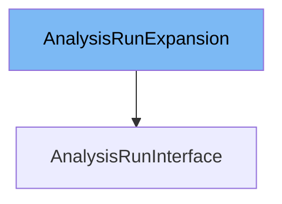

This document will cover the topic of the <SwmToken path="pkg/client/clientset/versioned/typed/rollouts/v1alpha1/generated_expansion.go" pos="21:2:2" line-data="type AnalysisRunExpansion interface{}">`AnalysisRunExpansion`</SwmToken> interface. We will cover:

1. What is <SwmToken path="pkg/client/clientset/versioned/typed/rollouts/v1alpha1/generated_expansion.go" pos="21:2:2" line-data="type AnalysisRunExpansion interface{}">`AnalysisRunExpansion`</SwmToken>
2. Variables and functions
3. Usage example



# What is <SwmToken path="pkg/client/clientset/versioned/typed/rollouts/v1alpha1/generated_expansion.go" pos="21:2:2" line-data="type AnalysisRunExpansion interface{}">`AnalysisRunExpansion`</SwmToken>

The <SwmToken path="pkg/client/clientset/versioned/typed/rollouts/v1alpha1/generated_expansion.go" pos="21:2:2" line-data="type AnalysisRunExpansion interface{}">`AnalysisRunExpansion`</SwmToken> interface is defined in the file <SwmPath>[pkg/client/clientset/versioned/typed/rollouts/v1alpha1/generated_expansion.go](pkg/client/clientset/versioned/typed/rollouts/v1alpha1/generated_expansion.go)</SwmPath>. It is part of the Kubernetes <SwmToken path="pkg/client/clientset/versioned/typed/rollouts/v1alpha1/analysisrun.go" pos="30:8:10" line-data="	rest &quot;k8s.io/client-go/rest&quot;">`client-go`</SwmToken> library and is used to extend the functionalities of the <SwmToken path="pkg/apis/rollouts/v1alpha1/analysis_types.go" pos="367:2:2" line-data="type AnalysisRun struct {">`AnalysisRun`</SwmToken> resource in the Argo Rollouts project. This interface allows developers to add custom methods to the <SwmToken path="pkg/apis/rollouts/v1alpha1/analysis_types.go" pos="367:2:2" line-data="type AnalysisRun struct {">`AnalysisRun`</SwmToken> client without modifying the generated client code.

<SwmSnippet path="/pkg/client/clientset/versioned/typed/rollouts/v1alpha1/generated_expansion.go" line="21">

---

# Variables and functions

The <SwmToken path="pkg/client/clientset/versioned/typed/rollouts/v1alpha1/generated_expansion.go" pos="21:2:2" line-data="type AnalysisRunExpansion interface{}">`AnalysisRunExpansion`</SwmToken> interface is defined as an empty interface. This means it does not have any methods by default, but it can be extended with custom methods as needed.

```go
type AnalysisRunExpansion interface{}
```

---

</SwmSnippet>

# Usage example

To use the <SwmToken path="pkg/client/clientset/versioned/typed/rollouts/v1alpha1/generated_expansion.go" pos="21:2:2" line-data="type AnalysisRunExpansion interface{}">`AnalysisRunExpansion`</SwmToken> interface, you would typically define custom methods in a separate file and then implement those methods for the <SwmToken path="pkg/apis/rollouts/v1alpha1/analysis_types.go" pos="367:2:2" line-data="type AnalysisRun struct {">`AnalysisRun`</SwmToken> client. Here is an example of how you might extend the <SwmToken path="pkg/apis/rollouts/v1alpha1/analysis_types.go" pos="367:2:2" line-data="type AnalysisRun struct {">`AnalysisRun`</SwmToken> client with a custom method.

<SwmSnippet path="/pkg/client/clientset/versioned/typed/rollouts/v1alpha1/analysisrun.go" line="1">

---

In this example, the <SwmToken path="pkg/client/clientset/versioned/typed/rollouts/v1alpha1/analysisrun.go" pos="33:16:16" line-data="// AnalysisRunsGetter has a method to return a AnalysisRunInterface.">`AnalysisRunInterface`</SwmToken> is extended with a custom method <SwmToken path="utils/experiment/experiment.go" pos="174:2:2" line-data="func GetAnalysisRunStatus(exStatus v1alpha1.ExperimentStatus, name string) *v1alpha1.ExperimentAnalysisRunStatus {">`GetAnalysisRunStatus`</SwmToken>. This method can be implemented to provide additional functionality for retrieving the status of an <SwmToken path="pkg/apis/rollouts/v1alpha1/analysis_types.go" pos="367:2:2" line-data="type AnalysisRun struct {">`AnalysisRun`</SwmToken>.

```go
/*
Copyright The Kubernetes Authors.

Licensed under the Apache License, Version 2.0 (the "License");
you may not use this file except in compliance with the License.
You may obtain a copy of the License at

    http://www.apache.org/licenses/LICENSE-2.0

Unless required by applicable law or agreed to in writing, software
distributed under the License is distributed on an "AS IS" BASIS,
WITHOUT WARRANTIES OR CONDITIONS OF ANY KIND, either express or implied.
See the License for the specific language governing permissions and
limitations under the License.
*/
```

---

</SwmSnippet>

&nbsp;

*This is an auto-generated document by Swimm 🌊 and has not yet been verified by a human*

<SwmMeta version="3.0.0" repo-id="Z2l0aHViJTNBJTNBaW50dWl0LWFyZ28tcm9sbG91dHMtZGVtbyUzQSUzQVN3aW1tLURlbW8=" repo-name="intuit-argo-rollouts-demo"><sup>Powered by [Swimm](/)</sup></SwmMeta>
