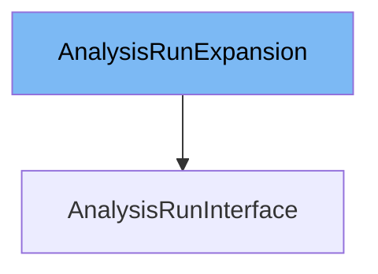

This document will cover the topic of the `AnalysisRunInterface` class. We will cover:

1. What is `AnalysisRunExpansion`
2. What is `AnalysisRunInterface`
3. Variables and functions in `AnalysisRunInterface`



# What is AnalysisRunExpansion

The `AnalysisRunExpansion` interface is defined in `pkg/client/clientset/versioned/typed/rollouts/v1alpha1/generated_expansion.go`. It is an empty interface that can be used to extend the `AnalysisRunInterface` with additional methods. This allows for custom methods to be added to the `AnalysisRunInterface` without modifying the generated code.

# What is AnalysisRunInterface

The `AnalysisRunInterface` in `pkg/client/clientset/versioned/typed/rollouts/v1alpha1/analysisrun.go` is an interface that provides methods to work with `AnalysisRun` resources. It includes methods for creating, updating, deleting, getting, listing, watching, and patching `AnalysisRun` resources. The `AnalysisRunInterface` inherits from the `AnalysisRunExpansion` interface, allowing for additional methods to be added through the `AnalysisRunExpansion` interface.

<SwmSnippet path="/pkg/client/clientset/versioned/typed/rollouts/v1alpha1/analysisrun.go" line="67" repo-id="Z2l0aHViJTNBJTNBaW50dWl0LWFyZ28tcm9sbG91dHMtZGVtbyUzQSUzQVN3aW1tLURlbW8=">

---

# Variables and functions

The `Get` function takes the name of the `AnalysisRun` and returns the corresponding `AnalysisRun` object and an error if there is any. It uses the `client.Get()` method to fetch the `AnalysisRun` resource from the Kubernetes API server.

```go
// Get takes name of the analysisRun, and returns the corresponding analysisRun object, and an error if there is any.
func (c *analysisRuns) Get(ctx context.Context, name string, options v1.GetOptions) (result *v1alpha1.AnalysisRun, err error) {
	result = &v1alpha1.AnalysisRun{}
	err = c.client.Get().
		Namespace(c.ns).
		Resource("analysisruns").
		Name(name).
		VersionedParams(&options, scheme.ParameterCodec).
		Do(ctx).
		Into(result)
	return
}
```

---

</SwmSnippet>

<SwmSnippet path="/pkg/client/clientset/versioned/typed/rollouts/v1alpha1/analysisrun.go" line="80" repo-id="Z2l0aHViJTNBJTNBaW50dWl0LWFyZ28tcm9sbG91dHMtZGVtbyUzQSUzQVN3aW1tLURlbW8=">

---

The `List` function takes label and field selectors and returns the list of `AnalysisRuns` that match those selectors. It uses the `client.Get()` method to fetch the list of `AnalysisRun` resources from the Kubernetes API server.

```go
// List takes label and field selectors, and returns the list of AnalysisRuns that match those selectors.
func (c *analysisRuns) List(ctx context.Context, opts v1.ListOptions) (result *v1alpha1.AnalysisRunList, err error) {
	var timeout time.Duration
	if opts.TimeoutSeconds != nil {
		timeout = time.Duration(*opts.TimeoutSeconds) * time.Second
	}
	result = &v1alpha1.AnalysisRunList{}
	err = c.client.Get().
		Namespace(c.ns).
		Resource("analysisruns").
		VersionedParams(&opts, scheme.ParameterCodec).
		Timeout(timeout).
		Do(ctx).
		Into(result)
	return
}
```

---

</SwmSnippet>

<SwmSnippet path="/pkg/client/clientset/versioned/typed/rollouts/v1alpha1/analysisrun.go" line="97" repo-id="Z2l0aHViJTNBJTNBaW50dWl0LWFyZ28tcm9sbG91dHMtZGVtbyUzQSUzQVN3aW1tLURlbW8=">

---

The `Watch` function returns a `watch.Interface` that watches the requested `AnalysisRuns`. It uses the `client.Get()` method to create a watch on the `AnalysisRun` resources.

```go
// Watch returns a watch.Interface that watches the requested analysisRuns.
func (c *analysisRuns) Watch(ctx context.Context, opts v1.ListOptions) (watch.Interface, error) {
	var timeout time.Duration
	if opts.TimeoutSeconds != nil {
		timeout = time.Duration(*opts.TimeoutSeconds) * time.Second
	}
	opts.Watch = true
	return c.client.Get().
		Namespace(c.ns).
		Resource("analysisruns").
		VersionedParams(&opts, scheme.ParameterCodec).
		Timeout(timeout).
		Watch(ctx)
}
```

---

</SwmSnippet>

<SwmSnippet path="/pkg/client/clientset/versioned/typed/rollouts/v1alpha1/analysisrun.go" line="112" repo-id="Z2l0aHViJTNBJTNBaW50dWl0LWFyZ28tcm9sbG91dHMtZGVtbyUzQSUzQVN3aW1tLURlbW8=">

---

The `Create` function takes the representation of an `AnalysisRun` and creates it. It returns the server's representation of the `AnalysisRun` and an error if there is any. It uses the `client.Post()` method to create the `AnalysisRun` resource in the Kubernetes API server.

```go
// Create takes the representation of a analysisRun and creates it.  Returns the server's representation of the analysisRun, and an error, if there is any.
func (c *analysisRuns) Create(ctx context.Context, analysisRun *v1alpha1.AnalysisRun, opts v1.CreateOptions) (result *v1alpha1.AnalysisRun, err error) {
	result = &v1alpha1.AnalysisRun{}
	err = c.client.Post().
		Namespace(c.ns).
		Resource("analysisruns").
		VersionedParams(&opts, scheme.ParameterCodec).
		Body(analysisRun).
		Do(ctx).
		Into(result)
	return
}
```

---

</SwmSnippet>

<SwmSnippet path="/pkg/client/clientset/versioned/typed/rollouts/v1alpha1/analysisrun.go" line="125" repo-id="Z2l0aHViJTNBJTNBaW50dWl0LWFyZ28tcm9sbG91dHMtZGVtbyUzQSUzQVN3aW1tLURlbW8=">

---

The `Update` function takes the representation of an `AnalysisRun` and updates it. It returns the server's representation of the `AnalysisRun` and an error if there is any. It uses the `client.Put()` method to update the `AnalysisRun` resource in the Kubernetes API server.

```go
// Update takes the representation of a analysisRun and updates it. Returns the server's representation of the analysisRun, and an error, if there is any.
func (c *analysisRuns) Update(ctx context.Context, analysisRun *v1alpha1.AnalysisRun, opts v1.UpdateOptions) (result *v1alpha1.AnalysisRun, err error) {
	result = &v1alpha1.AnalysisRun{}
	err = c.client.Put().
		Namespace(c.ns).
		Resource("analysisruns").
		Name(analysisRun.Name).
		VersionedParams(&opts, scheme.ParameterCodec).
		Body(analysisRun).
		Do(ctx).
		Into(result)
	return
```

---

</SwmSnippet>

<SwmSnippet path="/pkg/client/clientset/versioned/typed/rollouts/v1alpha1/analysisrun.go" line="139" repo-id="Z2l0aHViJTNBJTNBaW50dWl0LWFyZ28tcm9sbG91dHMtZGVtbyUzQSUzQVN3aW1tLURlbW8=">

---

The `UpdateStatus` function updates the status of an `AnalysisRun`. It returns the server's representation of the `AnalysisRun` and an error if there is any. It uses the `client.Put()` method to update the status of the `AnalysisRun` resource in the Kubernetes API server.

```go
// UpdateStatus was generated because the type contains a Status member.
// Add a +genclient:noStatus comment above the type to avoid generating UpdateStatus().
func (c *analysisRuns) UpdateStatus(ctx context.Context, analysisRun *v1alpha1.AnalysisRun, opts v1.UpdateOptions) (result *v1alpha1.AnalysisRun, err error) {
	result = &v1alpha1.AnalysisRun{}
	err = c.client.Put().
		Namespace(c.ns).
		Resource("analysisruns").
		Name(analysisRun.Name).
		SubResource("status").
		VersionedParams(&opts, scheme.ParameterCodec).
		Body(analysisRun).
		Do(ctx).
		Into(result)
	return
```

---

</SwmSnippet>

<SwmSnippet path="/pkg/client/clientset/versioned/typed/rollouts/v1alpha1/analysisrun.go" line="154" repo-id="Z2l0aHViJTNBJTNBaW50dWl0LWFyZ28tcm9sbG91dHMtZGVtbyUzQSUzQVN3aW1tLURlbW8=">

---

The `Delete` function takes the name of the `AnalysisRun` and deletes it. It returns an error if one occurs. It uses the `client.Delete()` method to delete the `AnalysisRun` resource from the Kubernetes API server.

```go

// Delete takes name of the analysisRun and deletes it. Returns an error if one occurs.
func (c *analysisRuns) Delete(ctx context.Context, name string, opts v1.DeleteOptions) error {
	return c.client.Delete().
		Namespace(c.ns).
		Resource("analysisruns").
		Name(name).
		Body(&opts).
		Do(ctx).
		Error()
}
```

---

</SwmSnippet>

<SwmSnippet path="/pkg/client/clientset/versioned/typed/rollouts/v1alpha1/analysisrun.go" line="166" repo-id="Z2l0aHViJTNBJTNBaW50dWl0LWFyZ28tcm9sbG91dHMtZGVtbyUzQSUzQVN3aW1tLURlbW8=">

---

The `DeleteCollection` function deletes a collection of `AnalysisRun` objects. It returns an error if one occurs. It uses the `client.Delete()` method to delete the collection of `AnalysisRun` resources from the Kubernetes API server.

```go
// DeleteCollection deletes a collection of objects.
func (c *analysisRuns) DeleteCollection(ctx context.Context, opts v1.DeleteOptions, listOpts v1.ListOptions) error {
	var timeout time.Duration
	if listOpts.TimeoutSeconds != nil {
		timeout = time.Duration(*listOpts.TimeoutSeconds) * time.Second
	}
	return c.client.Delete().
		Namespace(c.ns).
		Resource("analysisruns").
		VersionedParams(&listOpts, scheme.ParameterCodec).
		Timeout(timeout).
		Body(&opts).
		Do(ctx).
		Error()
}
```

---

</SwmSnippet>

<SwmSnippet path="/pkg/client/clientset/versioned/typed/rollouts/v1alpha1/analysisrun.go" line="182" repo-id="Z2l0aHViJTNBJTNBaW50dWl0LWFyZ28tcm9sbG91dHMtZGVtbyUzQSUzQVN3aW1tLURlbW8=">

---

The `Patch` function applies the patch and returns the patched `AnalysisRun`. It uses the `client.Patch()` method to apply the patch to the `AnalysisRun` resource in the Kubernetes API server.

```go
// Patch applies the patch and returns the patched analysisRun.
func (c *analysisRuns) Patch(ctx context.Context, name string, pt types.PatchType, data []byte, opts v1.PatchOptions, subresources ...string) (result *v1alpha1.AnalysisRun, err error) {
	result = &v1alpha1.AnalysisRun{}
	err = c.client.Patch(pt).
		Namespace(c.ns).
		Resource("analysisruns").
		Name(name).
		SubResource(subresources...).
		VersionedParams(&opts, scheme.ParameterCodec).
		Body(data).
		Do(ctx).
		Into(result)
	return
}
```

---

</SwmSnippet>

&nbsp;

*This is an auto-generated document by Swimm 🌊 and has not yet been verified by a human*

<SwmMeta version="3.0.0"><sup>Powered by [Swimm](https://staging.swimm.cloud/)</sup></SwmMeta>
