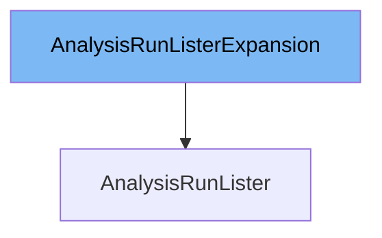

This document will cover the class `AnalysisRunLister`. We will discuss:

1. What is `AnalysisRunListerExpansion`
2. What is `AnalysisRunLister`
3. Variables and functions in `AnalysisRunLister`



# What is AnalysisRunListerExpansion

`AnalysisRunListerExpansion` is an interface that allows custom methods to be added to the `AnalysisRunLister` interface. This interface is part of the code generated by `lister-gen` and is used to extend the functionality of the lister without modifying the generated code. It is defined in `pkg/client/listers/rollouts/v1alpha1/expansion_generated.go`.

# What is AnalysisRunLister

`AnalysisRunLister` is an interface that helps list `AnalysisRun` objects in the Kubernetes cluster. It provides methods to list all `AnalysisRuns` and to get `AnalysisRuns` within a specific namespace. This interface is defined in `pkg/client/listers/rollouts/v1alpha1/analysisrun.go` and is used to interact with the Kubernetes API to retrieve `AnalysisRun` objects. The `AnalysisRunLister` interface extends the `AnalysisRunListerExpansion` interface, allowing for additional custom methods to be added.

<SwmSnippet path="/pkg/client/listers/rollouts/v1alpha1/analysisrun.go" line="49" repo-id="Z2l0aHViJTNBJTNBaW50dWl0LWFyZ28tcm9sbG91dHMtZGVtbyUzQSUzQVN3aW1tLURlbW8=">

---

# Variables and functions

The `List` function lists all `AnalysisRuns` in the indexer. It takes a `labels.Selector` as an argument and returns a slice of `AnalysisRun` objects and an error. This function uses the `cache.ListAll` method to retrieve the `AnalysisRun` objects from the indexer.

```go
// List lists all AnalysisRuns in the indexer.
func (s *analysisRunLister) List(selector labels.Selector) (ret []*v1alpha1.AnalysisRun, err error) {
	err = cache.ListAll(s.indexer, selector, func(m interface{}) {
		ret = append(ret, m.(*v1alpha1.AnalysisRun))
	})
	return ret, err
}
```

---

</SwmSnippet>

<SwmSnippet path="/pkg/client/listers/rollouts/v1alpha1/analysisrun.go" line="57" repo-id="Z2l0aHViJTNBJTNBaW50dWl0LWFyZ28tcm9sbG91dHMtZGVtbyUzQSUzQVN3aW1tLURlbW8=">

---

The `AnalysisRuns` function returns an object that can list and get `AnalysisRuns` within a specific namespace. It takes a namespace string as an argument and returns an `AnalysisRunNamespaceLister` object.

```go
// AnalysisRuns returns an object that can list and get AnalysisRuns.
func (s *analysisRunLister) AnalysisRuns(namespace string) AnalysisRunNamespaceLister {
	return analysisRunNamespaceLister{indexer: s.indexer, namespace: namespace}
}
```

---

</SwmSnippet>

<SwmSnippet path="/pkg/client/listers/rollouts/v1alpha1/analysisrun.go" line="81" repo-id="Z2l0aHViJTNBJTNBaW50dWl0LWFyZ28tcm9sbG91dHMtZGVtbyUzQSUzQVN3aW1tLURlbW8=">

---

The `List` function in the `AnalysisRunNamespaceLister` interface lists all `AnalysisRuns` in the indexer for a given namespace. It takes a `labels.Selector` as an argument and returns a slice of `AnalysisRun` objects and an error. This function uses the `cache.ListAllByNamespace` method to retrieve the `AnalysisRun` objects from the indexer.

```go
// List lists all AnalysisRuns in the indexer for a given namespace.
func (s analysisRunNamespaceLister) List(selector labels.Selector) (ret []*v1alpha1.AnalysisRun, err error) {
	err = cache.ListAllByNamespace(s.indexer, s.namespace, selector, func(m interface{}) {
		ret = append(ret, m.(*v1alpha1.AnalysisRun))
	})
	return ret, err
}
```

---

</SwmSnippet>

<SwmSnippet path="/pkg/client/listers/rollouts/v1alpha1/analysisrun.go" line="89" repo-id="Z2l0aHViJTNBJTNBaW50dWl0LWFyZ28tcm9sbG91dHMtZGVtbyUzQSUzQVN3aW1tLURlbW8=">

---

The `Get` function in the `AnalysisRunNamespaceLister` interface retrieves the `AnalysisRun` from the indexer for a given namespace and name. It takes a name string as an argument and returns an `AnalysisRun` object and an error. This function uses the `indexer.GetByKey` method to retrieve the `AnalysisRun` object from the indexer.

```go
// Get retrieves the AnalysisRun from the indexer for a given namespace and name.
func (s analysisRunNamespaceLister) Get(name string) (*v1alpha1.AnalysisRun, error) {
	obj, exists, err := s.indexer.GetByKey(s.namespace + "/" + name)
	if err != nil {
		return nil, err
	}
	if !exists {
		return nil, errors.NewNotFound(v1alpha1.Resource("analysisrun"), name)
	}
	return obj.(*v1alpha1.AnalysisRun), nil
}
```

---

</SwmSnippet>

&nbsp;

*This is an auto-generated document by Swimm 🌊 and has not yet been verified by a human*

<SwmMeta version="3.0.0"><sup>Powered by [Swimm](https://staging.swimm.cloud/)</sup></SwmMeta>
