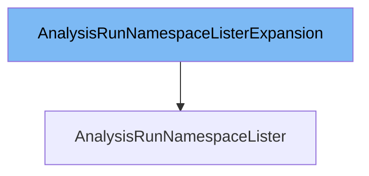

This document will cover the class `AnalysisRunNamespaceLister`. We will address the following points:

1. What is `AnalysisRunNamespaceListerExpansion`
2. What is `AnalysisRunNamespaceLister`
3. Variables and functions in `AnalysisRunNamespaceLister`



# What is `AnalysisRunNamespaceListerExpansion`

`AnalysisRunNamespaceListerExpansion` is an interface defined in `pkg/client/listers/rollouts/v1alpha1/expansion_generated.go`. It allows custom methods to be added to the `AnalysisRunNamespaceLister` interface. This is useful for extending the functionality of the lister without modifying the generated code.

# What is `AnalysisRunNamespaceLister`

`AnalysisRunNamespaceLister` is an interface defined in `pkg/client/listers/rollouts/v1alpha1/analysisrun.go`. It helps list and get `AnalysisRun` objects within a specific namespace. All objects returned by this lister must be treated as read-only. It is used to interact with the Kubernetes API to retrieve `AnalysisRun` resources in a namespace-specific manner.

<SwmSnippet path="/pkg/client/listers/rollouts/v1alpha1/analysisrun.go" line="77" repo-id="Z2l0aHViJTNBJTNBaW50dWl0LWFyZ28tcm9sbG91dHMtZGVtbyUzQSUzQVN3aW1tLURlbW8=">

---

# Variables and functions

The `indexer` variable is used to store a reference to the `cache.Indexer` which is used to index and retrieve `AnalysisRun` objects.

```go
	indexer   cache.Indexer
	namespace string
```

---

</SwmSnippet>

<SwmSnippet path="/pkg/client/listers/rollouts/v1alpha1/analysisrun.go" line="78" repo-id="Z2l0aHViJTNBJTNBaW50dWl0LWFyZ28tcm9sbG91dHMtZGVtbyUzQSUzQVN3aW1tLURlbW8=">

---

The `namespace` variable is used to store the namespace in which the `AnalysisRun` objects are to be listed or retrieved.

```go
	namespace string
}
```

---

</SwmSnippet>

<SwmSnippet path="/pkg/client/listers/rollouts/v1alpha1/analysisrun.go" line="81" repo-id="Z2l0aHViJTNBJTNBaW50dWl0LWFyZ28tcm9sbG91dHMtZGVtbyUzQSUzQVN3aW1tLURlbW8=">

---

The `List` function lists all `AnalysisRun` objects in the indexer for a given namespace. It uses the `cache.ListAllByNamespace` function to retrieve the objects and appends them to the `ret` slice.

```go
// List lists all AnalysisRuns in the indexer for a given namespace.
func (s analysisRunNamespaceLister) List(selector labels.Selector) (ret []*v1alpha1.AnalysisRun, err error) {
	err = cache.ListAllByNamespace(s.indexer, s.namespace, selector, func(m interface{}) {
		ret = append(ret, m.(*v1alpha1.AnalysisRun))
	})
	return ret, err
}
```

---

</SwmSnippet>

<SwmSnippet path="/pkg/client/listers/rollouts/v1alpha1/analysisrun.go" line="89" repo-id="Z2l0aHViJTNBJTNBaW50dWl0LWFyZ28tcm9sbG91dHMtZGVtbyUzQSUzQVN3aW1tLURlbW8=">

---

The `Get` function retrieves a specific `AnalysisRun` object from the indexer for a given namespace and name. It uses the `indexer.GetByKey` function to retrieve the object and returns an error if the object is not found.

```go
// Get retrieves the AnalysisRun from the indexer for a given namespace and name.
func (s analysisRunNamespaceLister) Get(name string) (*v1alpha1.AnalysisRun, error) {
	obj, exists, err := s.indexer.GetByKey(s.namespace + "/" + name)
	if err != nil {
		return nil, err
	}
	if !exists {
		return nil, errors.NewNotFound(v1alpha1.Resource("analysisrun"), name)
	}
	return obj.(*v1alpha1.AnalysisRun), nil
}
```

---

</SwmSnippet>

&nbsp;

*This is an auto-generated document by Swimm 🌊 and has not yet been verified by a human*

<SwmMeta version="3.0.0"><sup>Powered by [Swimm](https://staging.swimm.cloud/)</sup></SwmMeta>
