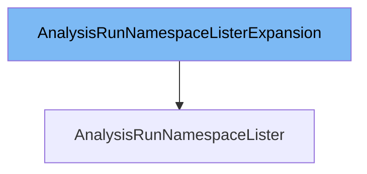

This document will cover the class <SwmToken path="pkg/client/listers/rollouts/v1alpha1/expansion_generated.go" pos="25:2:2" line-data="// AnalysisRunNamespaceListerExpansion allows custom methods to be added to">`AnalysisRunNamespaceListerExpansion`</SwmToken>. We will address the following points:

1. What is <SwmToken path="pkg/client/listers/rollouts/v1alpha1/expansion_generated.go" pos="25:2:2" line-data="// AnalysisRunNamespaceListerExpansion allows custom methods to be added to">`AnalysisRunNamespaceListerExpansion`</SwmToken>
2. Variables and functions
3. Usage example



# What is <SwmToken path="pkg/client/listers/rollouts/v1alpha1/expansion_generated.go" pos="25:2:2" line-data="// AnalysisRunNamespaceListerExpansion allows custom methods to be added to">`AnalysisRunNamespaceListerExpansion`</SwmToken>

The <SwmToken path="pkg/client/listers/rollouts/v1alpha1/expansion_generated.go" pos="25:2:2" line-data="// AnalysisRunNamespaceListerExpansion allows custom methods to be added to">`AnalysisRunNamespaceListerExpansion`</SwmToken> is an interface in the <SwmPath>[pkg/client/listers/rollouts/v1alpha1/expansion_generated.go](pkg/client/listers/rollouts/v1alpha1/expansion_generated.go)</SwmPath> file. It allows custom methods to be added to the <SwmToken path="pkg/client/listers/rollouts/v1alpha1/expansion_generated.go" pos="26:2:2" line-data="// AnalysisRunNamespaceLister.">`AnalysisRunNamespaceLister`</SwmToken>. This interface is part of the Kubernetes client-go library and is used to extend the functionality of the lister for <SwmToken path="pkg/apis/rollouts/v1alpha1/analysis_types.go" pos="367:2:2" line-data="type AnalysisRun struct {">`AnalysisRun`</SwmToken> resources within a specific namespace.

<SwmSnippet path="/pkg/client/listers/rollouts/v1alpha1/expansion_generated.go" line="25">

---

# Variables and functions

The <SwmToken path="pkg/client/listers/rollouts/v1alpha1/expansion_generated.go" pos="25:2:2" line-data="// AnalysisRunNamespaceListerExpansion allows custom methods to be added to">`AnalysisRunNamespaceListerExpansion`</SwmToken> interface itself does not define any variables or functions. It is an empty interface that serves as a placeholder for adding custom methods to the <SwmToken path="pkg/client/listers/rollouts/v1alpha1/expansion_generated.go" pos="26:2:2" line-data="// AnalysisRunNamespaceLister.">`AnalysisRunNamespaceLister`</SwmToken>.

```go
// AnalysisRunNamespaceListerExpansion allows custom methods to be added to
// AnalysisRunNamespaceLister.
type AnalysisRunNamespaceListerExpansion interface{}
```

---

</SwmSnippet>

# Usage example

To use the <SwmToken path="pkg/client/listers/rollouts/v1alpha1/expansion_generated.go" pos="25:2:2" line-data="// AnalysisRunNamespaceListerExpansion allows custom methods to be added to">`AnalysisRunNamespaceListerExpansion`</SwmToken> interface, you would typically define custom methods in a separate file that implements this interface. Here is an example of how you might extend the <SwmToken path="pkg/client/listers/rollouts/v1alpha1/expansion_generated.go" pos="26:2:2" line-data="// AnalysisRunNamespaceLister.">`AnalysisRunNamespaceLister`</SwmToken> with a custom method:

```go
package v1alpha1

// CustomAnalysisRunNamespaceLister is an implementation of AnalysisRunNamespaceListerExpansion
// that adds a custom method to list AnalysisRuns by a specific label.
type CustomAnalysisRunNamespaceLister struct {
	AnalysisRunNamespaceLister
}

// ListByLabel lists AnalysisRuns by a specific label.
func (c *CustomAnalysisRunNamespaceLister) ListByLabel(label string) ([]*v1alpha1.AnalysisRun, error) {
	// Custom implementation to list AnalysisRuns by label
}
```

In this example, `CustomAnalysisRunNamespaceLister` embeds the <SwmToken path="pkg/client/listers/rollouts/v1alpha1/expansion_generated.go" pos="26:2:2" line-data="// AnalysisRunNamespaceLister.">`AnalysisRunNamespaceLister`</SwmToken> and implements the <SwmToken path="pkg/client/listers/rollouts/v1alpha1/expansion_generated.go" pos="25:2:2" line-data="// AnalysisRunNamespaceListerExpansion allows custom methods to be added to">`AnalysisRunNamespaceListerExpansion`</SwmToken> interface by adding a `ListByLabel` method.

&nbsp;

*This is an auto-generated document by Swimm 🌊 and has not yet been verified by a human*

<SwmMeta version="3.0.0" repo-id="Z2l0aHViJTNBJTNBaW50dWl0LWFyZ28tcm9sbG91dHMtZGVtbyUzQSUzQVN3aW1tLURlbW8=" repo-name="intuit-argo-rollouts-demo"><sup>Powered by [Swimm](/)</sup></SwmMeta>
