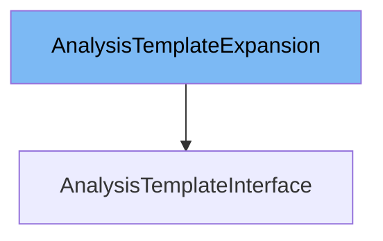

This document will cover the class <SwmToken path="pkg/client/clientset/versioned/typed/rollouts/v1alpha1/generated_expansion.go" pos="23:2:2" line-data="type AnalysisTemplateExpansion interface{}">`AnalysisTemplateExpansion`</SwmToken> in detail. We will discuss:

1. What is <SwmToken path="pkg/client/clientset/versioned/typed/rollouts/v1alpha1/generated_expansion.go" pos="23:2:2" line-data="type AnalysisTemplateExpansion interface{}">`AnalysisTemplateExpansion`</SwmToken>
2. Variables and functions in <SwmToken path="pkg/client/clientset/versioned/typed/rollouts/v1alpha1/generated_expansion.go" pos="23:2:2" line-data="type AnalysisTemplateExpansion interface{}">`AnalysisTemplateExpansion`</SwmToken>
3. Usage example of <SwmToken path="pkg/client/clientset/versioned/typed/rollouts/v1alpha1/generated_expansion.go" pos="23:2:2" line-data="type AnalysisTemplateExpansion interface{}">`AnalysisTemplateExpansion`</SwmToken>



# What is <SwmToken path="pkg/client/clientset/versioned/typed/rollouts/v1alpha1/generated_expansion.go" pos="23:2:2" line-data="type AnalysisTemplateExpansion interface{}">`AnalysisTemplateExpansion`</SwmToken>

The <SwmToken path="pkg/client/clientset/versioned/typed/rollouts/v1alpha1/generated_expansion.go" pos="23:2:2" line-data="type AnalysisTemplateExpansion interface{}">`AnalysisTemplateExpansion`</SwmToken> is an interface defined in the file <SwmPath>[pkg/client/clientset/versioned/typed/rollouts/v1alpha1/generated_expansion.go](pkg/client/clientset/versioned/typed/rollouts/v1alpha1/generated_expansion.go)</SwmPath>. It is part of the Kubernetes <SwmToken path="pkg/client/clientset/versioned/typed/rollouts/v1alpha1/analysistemplate.go" pos="30:8:10" line-data="	rest &quot;k8s.io/client-go/rest&quot;">`client-go`</SwmToken> library and is used to extend the functionalities of the <SwmToken path="pkg/apis/rollouts/v1alpha1/analysis_types.go" pos="39:2:2" line-data="type AnalysisTemplate struct {">`AnalysisTemplate`</SwmToken> resource in Argo Rollouts. This interface allows developers to add custom methods to the <SwmToken path="pkg/apis/rollouts/v1alpha1/analysis_types.go" pos="39:2:2" line-data="type AnalysisTemplate struct {">`AnalysisTemplate`</SwmToken> client without modifying the generated code.

<SwmSnippet path="/pkg/client/clientset/versioned/typed/rollouts/v1alpha1/generated_expansion.go" line="23">

---

# Variables and functions

The <SwmToken path="pkg/client/clientset/versioned/typed/rollouts/v1alpha1/generated_expansion.go" pos="23:2:2" line-data="type AnalysisTemplateExpansion interface{}">`AnalysisTemplateExpansion`</SwmToken> interface is defined here. It does not have any methods by default, but it provides a way to add custom methods to the <SwmToken path="pkg/apis/rollouts/v1alpha1/analysis_types.go" pos="39:2:2" line-data="type AnalysisTemplate struct {">`AnalysisTemplate`</SwmToken> client.

```go
type AnalysisTemplateExpansion interface{}
```

---

</SwmSnippet>

# Usage example

To use the <SwmToken path="pkg/client/clientset/versioned/typed/rollouts/v1alpha1/generated_expansion.go" pos="23:2:2" line-data="type AnalysisTemplateExpansion interface{}">`AnalysisTemplateExpansion`</SwmToken> interface, you need to define custom methods in a separate file and then implement those methods in the <SwmToken path="pkg/client/clientset/versioned/typed/rollouts/v1alpha1/analysistemplate.go" pos="33:16:16" line-data="// AnalysisTemplatesGetter has a method to return a AnalysisTemplateInterface.">`AnalysisTemplateInterface`</SwmToken>. Here is an example of how to extend the <SwmToken path="pkg/apis/rollouts/v1alpha1/analysis_types.go" pos="39:2:2" line-data="type AnalysisTemplate struct {">`AnalysisTemplate`</SwmToken> client with a custom method.

<SwmSnippet path="/pkg/client/clientset/versioned/typed/rollouts/v1alpha1/analysistemplate.go" line="1">

---

In this file, you can implement the custom methods defined in the <SwmToken path="pkg/client/clientset/versioned/typed/rollouts/v1alpha1/generated_expansion.go" pos="23:2:2" line-data="type AnalysisTemplateExpansion interface{}">`AnalysisTemplateExpansion`</SwmToken> interface. For example, you can add a method to fetch <SwmToken path="pkg/client/listers/rollouts/v1alpha1/analysistemplate.go" pos="35:1:1" line-data="	AnalysisTemplates(namespace string) AnalysisTemplateNamespaceLister">`AnalysisTemplates`</SwmToken> by a specific label.

```go
/*
Copyright The Kubernetes Authors.

Licensed under the Apache License, Version 2.0 (the "License");
you may not use this file except in compliance with the License.
You may obtain a copy of the License at

    http://www.apache.org/licenses/LICENSE-2.0

Unless required by applicable law or agreed to in writing, software
distributed under the License is distributed on an "AS IS" BASIS,
WITHOUT WARRANTIES OR CONDITIONS OF ANY KIND, either express or implied.
See the License for the specific language governing permissions and
limitations under the License.
*/
```

---

</SwmSnippet>

&nbsp;

*This is an auto-generated document by Swimm 🌊 and has not yet been verified by a human*

<SwmMeta version="3.0.0" repo-id="Z2l0aHViJTNBJTNBaW50dWl0LWFyZ28tcm9sbG91dHMtZGVtbyUzQSUzQVN3aW1tLURlbW8=" repo-name="intuit-argo-rollouts-demo"><sup>Powered by [Swimm](/)</sup></SwmMeta>
