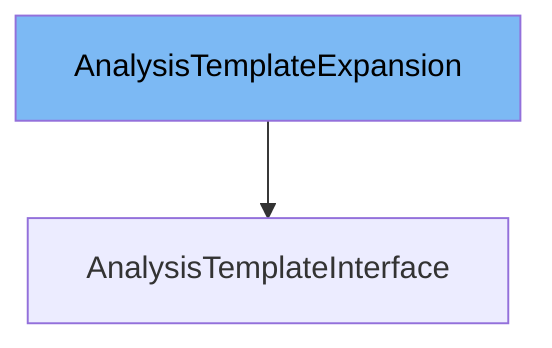

This document will cover the AnalysisTemplateInterface class. We will cover:

1. What is AnalysisTemplateExpansion
2. What is AnalysisTemplateInterface
3. Variables and functions in AnalysisTemplateInterface



# What is AnalysisTemplateExpansion

The AnalysisTemplateExpansion interface in pkg/client/clientset/versioned/typed/rollouts/v1alpha1/generated_expansion.go is an empty interface that allows for future expansion of the AnalysisTemplateInterface without breaking existing code. It is used as a placeholder for additional methods that can be added to the AnalysisTemplateInterface.

# What is AnalysisTemplateInterface

The AnalysisTemplateInterface in pkg/client/clientset/versioned/typed/rollouts/v1alpha1/analysistemplate.go is an interface that defines methods for working with AnalysisTemplate resources in Kubernetes. It provides methods for creating, updating, deleting, getting, listing, watching, and patching AnalysisTemplate resources. The AnalysisTemplateInterface is implemented by the analysisTemplates struct, which interacts with the Kubernetes API server to manage AnalysisTemplate resources.

<SwmSnippet path="/pkg/client/clientset/versioned/typed/rollouts/v1alpha1/analysistemplate.go" line="66" repo-id="Z2l0aHViJTNBJTNBaW50dWl0LWFyZ28tcm9sbG91dHMtZGVtbyUzQSUzQVN3aW1tLURlbW8=">

---

# Variables and functions

The function `Get` takes the name of the AnalysisTemplate and returns the corresponding AnalysisTemplate object, and an error if there is any. It interacts with the Kubernetes API server to retrieve the AnalysisTemplate resource.

```go
// Get takes name of the analysisTemplate, and returns the corresponding analysisTemplate object, and an error if there is any.
func (c *analysisTemplates) Get(ctx context.Context, name string, options v1.GetOptions) (result *v1alpha1.AnalysisTemplate, err error) {
	result = &v1alpha1.AnalysisTemplate{}
	err = c.client.Get().
		Namespace(c.ns).
		Resource("analysistemplates").
		Name(name).
		VersionedParams(&options, scheme.ParameterCodec).
		Do(ctx).
		Into(result)
	return
}
```

---

</SwmSnippet>

<SwmSnippet path="/pkg/client/clientset/versioned/typed/rollouts/v1alpha1/analysistemplate.go" line="79" repo-id="Z2l0aHViJTNBJTNBaW50dWl0LWFyZ28tcm9sbG91dHMtZGVtbyUzQSUzQVN3aW1tLURlbW8=">

---

The function `List` takes label and field selectors and returns the list of AnalysisTemplates that match those selectors. It interacts with the Kubernetes API server to retrieve the list of AnalysisTemplate resources.

```go
// List takes label and field selectors, and returns the list of AnalysisTemplates that match those selectors.
func (c *analysisTemplates) List(ctx context.Context, opts v1.ListOptions) (result *v1alpha1.AnalysisTemplateList, err error) {
	var timeout time.Duration
	if opts.TimeoutSeconds != nil {
		timeout = time.Duration(*opts.TimeoutSeconds) * time.Second
	}
	result = &v1alpha1.AnalysisTemplateList{}
	err = c.client.Get().
		Namespace(c.ns).
		Resource("analysistemplates").
		VersionedParams(&opts, scheme.ParameterCodec).
		Timeout(timeout).
		Do(ctx).
		Into(result)
	return
}
```

---

</SwmSnippet>

<SwmSnippet path="/pkg/client/clientset/versioned/typed/rollouts/v1alpha1/analysistemplate.go" line="96" repo-id="Z2l0aHViJTNBJTNBaW50dWl0LWFyZ28tcm9sbG91dHMtZGVtbyUzQSUzQVN3aW1tLURlbW8=">

---

The function `Watch` returns a watch.Interface that watches the requested AnalysisTemplates. It interacts with the Kubernetes API server to watch for changes to AnalysisTemplate resources.

```go
// Watch returns a watch.Interface that watches the requested analysisTemplates.
func (c *analysisTemplates) Watch(ctx context.Context, opts v1.ListOptions) (watch.Interface, error) {
	var timeout time.Duration
	if opts.TimeoutSeconds != nil {
		timeout = time.Duration(*opts.TimeoutSeconds) * time.Second
	}
	opts.Watch = true
	return c.client.Get().
		Namespace(c.ns).
		Resource("analysistemplates").
		VersionedParams(&opts, scheme.ParameterCodec).
		Timeout(timeout).
		Watch(ctx)
}
```

---

</SwmSnippet>

<SwmSnippet path="/pkg/client/clientset/versioned/typed/rollouts/v1alpha1/analysistemplate.go" line="111" repo-id="Z2l0aHViJTNBJTNBaW50dWl0LWFyZ28tcm9sbG91dHMtZGVtbyUzQSUzQVN3aW1tLURlbW8=">

---

The function `Create` takes the representation of an AnalysisTemplate and creates it. It returns the server's representation of the AnalysisTemplate and an error if there is any. It interacts with the Kubernetes API server to create the AnalysisTemplate resource.

```go
// Create takes the representation of a analysisTemplate and creates it.  Returns the server's representation of the analysisTemplate, and an error, if there is any.
func (c *analysisTemplates) Create(ctx context.Context, analysisTemplate *v1alpha1.AnalysisTemplate, opts v1.CreateOptions) (result *v1alpha1.AnalysisTemplate, err error) {
	result = &v1alpha1.AnalysisTemplate{}
	err = c.client.Post().
		Namespace(c.ns).
		Resource("analysistemplates").
		VersionedParams(&opts, scheme.ParameterCodec).
		Body(analysisTemplate).
		Do(ctx).
		Into(result)
	return
}
```

---

</SwmSnippet>

<SwmSnippet path="/pkg/client/clientset/versioned/typed/rollouts/v1alpha1/analysistemplate.go" line="124" repo-id="Z2l0aHViJTNBJTNBaW50dWl0LWFyZ28tcm9sbG91dHMtZGVtbyUzQSUzQVN3aW1tLURlbW8=">

---

The function `Update` takes the representation of an AnalysisTemplate and updates it. It returns the server's representation of the AnalysisTemplate and an error if there is any. It interacts with the Kubernetes API server to update the AnalysisTemplate resource.

```go
// Update takes the representation of a analysisTemplate and updates it. Returns the server's representation of the analysisTemplate, and an error, if there is any.
func (c *analysisTemplates) Update(ctx context.Context, analysisTemplate *v1alpha1.AnalysisTemplate, opts v1.UpdateOptions) (result *v1alpha1.AnalysisTemplate, err error) {
	result = &v1alpha1.AnalysisTemplate{}
	err = c.client.Put().
		Namespace(c.ns).
		Resource("analysistemplates").
		Name(analysisTemplate.Name).
		VersionedParams(&opts, scheme.ParameterCodec).
		Body(analysisTemplate).
		Do(ctx).
		Into(result)
	return
}
```

---

</SwmSnippet>

<SwmSnippet path="/pkg/client/clientset/versioned/typed/rollouts/v1alpha1/analysistemplate.go" line="138" repo-id="Z2l0aHViJTNBJTNBaW50dWl0LWFyZ28tcm9sbG91dHMtZGVtbyUzQSUzQVN3aW1tLURlbW8=">

---

The function `Delete` takes the name of the AnalysisTemplate and deletes it. It returns an error if one occurs. It interacts with the Kubernetes API server to delete the AnalysisTemplate resource.

```go
// Delete takes name of the analysisTemplate and deletes it. Returns an error if one occurs.
func (c *analysisTemplates) Delete(ctx context.Context, name string, opts v1.DeleteOptions) error {
	return c.client.Delete().
		Namespace(c.ns).
		Resource("analysistemplates").
		Name(name).
		Body(&opts).
		Do(ctx).
		Error()
}
```

---

</SwmSnippet>

<SwmSnippet path="/pkg/client/clientset/versioned/typed/rollouts/v1alpha1/analysistemplate.go" line="149" repo-id="Z2l0aHViJTNBJTNBaW50dWl0LWFyZ28tcm9sbG91dHMtZGVtbyUzQSUzQVN3aW1tLURlbW8=">

---

The function `DeleteCollection` deletes a collection of objects. It interacts with the Kubernetes API server to delete multiple AnalysisTemplate resources.

```go
// DeleteCollection deletes a collection of objects.
func (c *analysisTemplates) DeleteCollection(ctx context.Context, opts v1.DeleteOptions, listOpts v1.ListOptions) error {
	var timeout time.Duration
	if listOpts.TimeoutSeconds != nil {
		timeout = time.Duration(*listOpts.TimeoutSeconds) * time.Second
	}
	return c.client.Delete().
		Namespace(c.ns).
		Resource("analysistemplates").
		VersionedParams(&listOpts, scheme.ParameterCodec).
		Timeout(timeout).
		Body(&opts).
		Do(ctx).
		Error()
}
```

---

</SwmSnippet>

<SwmSnippet path="/pkg/client/clientset/versioned/typed/rollouts/v1alpha1/analysistemplate.go" line="165" repo-id="Z2l0aHViJTNBJTNBaW50dWl0LWFyZ28tcm9sbG91dHMtZGVtbyUzQSUzQVN3aW1tLURlbW8=">

---

The function `Patch` applies the patch and returns the patched AnalysisTemplate. It interacts with the Kubernetes API server to apply the patch to the AnalysisTemplate resource.

```go
// Patch applies the patch and returns the patched analysisTemplate.
func (c *analysisTemplates) Patch(ctx context.Context, name string, pt types.PatchType, data []byte, opts v1.PatchOptions, subresources ...string) (result *v1alpha1.AnalysisTemplate, err error) {
	result = &v1alpha1.AnalysisTemplate{}
	err = c.client.Patch(pt).
		Namespace(c.ns).
		Resource("analysistemplates").
		Name(name).
		SubResource(subresources...).
		VersionedParams(&opts, scheme.ParameterCodec).
		Body(data).
		Do(ctx).
		Into(result)
	return
}
```

---

</SwmSnippet>

&nbsp;

*This is an auto-generated document by Swimm 🌊 and has not yet been verified by a human*

<SwmMeta version="3.0.0"><sup>Powered by [Swimm](https://staging.swimm.cloud/)</sup></SwmMeta>
