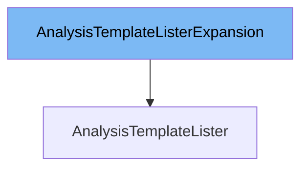

This document will cover the topic of the `AnalysisTemplateLister` class. We will discuss:

1. What `AnalysisTemplateListerExpansion` is and what it is used for.
2. What `AnalysisTemplateLister` is and what it is used for.
3. The variables and functions defined in `AnalysisTemplateLister`.



# What is AnalysisTemplateListerExpansion

`AnalysisTemplateListerExpansion` is an interface that allows custom methods to be added to the `AnalysisTemplateLister` interface. This interface is defined in `pkg/client/listers/rollouts/v1alpha1/expansion_generated.go` and is used to extend the functionality of the `AnalysisTemplateLister` without modifying the generated code.

# What is AnalysisTemplateLister

`AnalysisTemplateLister` is an interface defined in `pkg/client/listers/rollouts/v1alpha1/analysistemplate.go`. It provides methods to list and get `AnalysisTemplate` objects from an indexer. The interface includes methods like `List` and `AnalysisTemplates`, and it also inherits from `AnalysisTemplateListerExpansion` to allow for custom method additions.

<SwmSnippet path="/pkg/client/listers/rollouts/v1alpha1/analysistemplate.go" line="50" repo-id="Z2l0aHViJTNBJTNBaW50dWl0LWFyZ28tcm9sbG91dHMtZGVtbyUzQSUzQVN3aW1tLURlbW8=">

---

# Variables and functions

The `List` function lists all `AnalysisTemplates` in the indexer. It takes a `labels.Selector` as an argument and returns a slice of `AnalysisTemplate` pointers and an error. This function uses the `cache.ListAll` method to retrieve the objects from the indexer.

```go
func (s *analysisTemplateLister) List(selector labels.Selector) (ret []*v1alpha1.AnalysisTemplate, err error) {
	err = cache.ListAll(s.indexer, selector, func(m interface{}) {
		ret = append(ret, m.(*v1alpha1.AnalysisTemplate))
	})
	return ret, err
}
```

---

</SwmSnippet>

<SwmSnippet path="/pkg/client/listers/rollouts/v1alpha1/analysistemplate.go" line="57" repo-id="Z2l0aHViJTNBJTNBaW50dWl0LWFyZ28tcm9sbG91dHMtZGVtbyUzQSUzQVN3aW1tLURlbW8=">

---

The `AnalysisTemplates` function returns an object that can list and get `AnalysisTemplates` for a given namespace. It takes a namespace string as an argument and returns an `AnalysisTemplateNamespaceLister`.

```go
// AnalysisTemplates returns an object that can list and get AnalysisTemplates.
func (s *analysisTemplateLister) AnalysisTemplates(namespace string) AnalysisTemplateNamespaceLister {
	return analysisTemplateNamespaceLister{indexer: s.indexer, namespace: namespace}
}
```

---

</SwmSnippet>

<SwmSnippet path="/pkg/client/listers/rollouts/v1alpha1/analysistemplate.go" line="81" repo-id="Z2l0aHViJTNBJTNBaW50dWl0LWFyZ28tcm9sbG91dHMtZGVtbyUzQSUzQVN3aW1tLURlbW8=">

---

The `List` function in the `AnalysisTemplateNamespaceLister` interface lists all `AnalysisTemplates` in the indexer for a given namespace. It takes a `labels.Selector` as an argument and returns a slice of `AnalysisTemplate` pointers and an error. This function uses the `cache.ListAllByNamespace` method to retrieve the objects from the indexer.

```go
// List lists all AnalysisTemplates in the indexer for a given namespace.
func (s analysisTemplateNamespaceLister) List(selector labels.Selector) (ret []*v1alpha1.AnalysisTemplate, err error) {
	err = cache.ListAllByNamespace(s.indexer, s.namespace, selector, func(m interface{}) {
		ret = append(ret, m.(*v1alpha1.AnalysisTemplate))
	})
	return ret, err
}
```

---

</SwmSnippet>

<SwmSnippet path="/pkg/client/listers/rollouts/v1alpha1/analysistemplate.go" line="89" repo-id="Z2l0aHViJTNBJTNBaW50dWl0LWFyZ28tcm9sbG91dHMtZGVtbyUzQSUzQVN3aW1tLURlbW8=">

---

The `Get` function in the `AnalysisTemplateNamespaceLister` interface retrieves the `AnalysisTemplate` from the indexer for a given namespace and name. It takes a name string as an argument and returns a pointer to an `AnalysisTemplate` and an error. This function uses the `indexer.GetByKey` method to retrieve the object from the indexer.

```go
// Get retrieves the AnalysisTemplate from the indexer for a given namespace and name.
func (s analysisTemplateNamespaceLister) Get(name string) (*v1alpha1.AnalysisTemplate, error) {
	obj, exists, err := s.indexer.GetByKey(s.namespace + "/" + name)
	if err != nil {
		return nil, err
	}
	if !exists {
		return nil, errors.NewNotFound(v1alpha1.Resource("analysistemplate"), name)
	}
	return obj.(*v1alpha1.AnalysisTemplate), nil
}
```

---

</SwmSnippet>

&nbsp;

*This is an auto-generated document by Swimm 🌊 and has not yet been verified by a human*

<SwmMeta version="3.0.0"><sup>Powered by [Swimm](https://staging.swimm.cloud/)</sup></SwmMeta>
