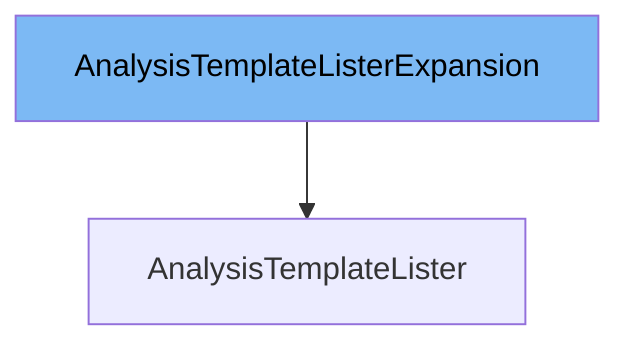

This document will cover the topic of the <SwmToken path="pkg/client/listers/rollouts/v1alpha1/expansion_generated.go" pos="29:2:2" line-data="// AnalysisTemplateListerExpansion allows custom methods to be added to">`AnalysisTemplateListerExpansion`</SwmToken> interface. We will discuss:

1. What <SwmToken path="pkg/client/listers/rollouts/v1alpha1/expansion_generated.go" pos="29:2:2" line-data="// AnalysisTemplateListerExpansion allows custom methods to be added to">`AnalysisTemplateListerExpansion`</SwmToken> is.
2. The variables and functions defined in <SwmToken path="pkg/client/listers/rollouts/v1alpha1/expansion_generated.go" pos="29:2:2" line-data="// AnalysisTemplateListerExpansion allows custom methods to be added to">`AnalysisTemplateListerExpansion`</SwmToken>.
3. An example of how to use <SwmToken path="pkg/client/listers/rollouts/v1alpha1/expansion_generated.go" pos="29:2:2" line-data="// AnalysisTemplateListerExpansion allows custom methods to be added to">`AnalysisTemplateListerExpansion`</SwmToken> in <SwmToken path="pkg/client/listers/rollouts/v1alpha1/expansion_generated.go" pos="30:2:2" line-data="// AnalysisTemplateLister.">`AnalysisTemplateLister`</SwmToken>.



# What is <SwmToken path="pkg/client/listers/rollouts/v1alpha1/expansion_generated.go" pos="29:2:2" line-data="// AnalysisTemplateListerExpansion allows custom methods to be added to">`AnalysisTemplateListerExpansion`</SwmToken>

<SwmToken path="pkg/client/listers/rollouts/v1alpha1/expansion_generated.go" pos="29:2:2" line-data="// AnalysisTemplateListerExpansion allows custom methods to be added to">`AnalysisTemplateListerExpansion`</SwmToken> is an interface defined in the file <SwmPath>[pkg/client/listers/rollouts/v1alpha1/expansion_generated.go](pkg/client/listers/rollouts/v1alpha1/expansion_generated.go)</SwmPath>. It allows custom methods to be added to the <SwmToken path="pkg/client/listers/rollouts/v1alpha1/expansion_generated.go" pos="30:2:2" line-data="// AnalysisTemplateLister.">`AnalysisTemplateLister`</SwmToken> interface. This means that developers can extend the functionality of <SwmToken path="pkg/client/listers/rollouts/v1alpha1/expansion_generated.go" pos="30:2:2" line-data="// AnalysisTemplateLister.">`AnalysisTemplateLister`</SwmToken> by implementing additional methods in <SwmToken path="pkg/client/listers/rollouts/v1alpha1/expansion_generated.go" pos="29:2:2" line-data="// AnalysisTemplateListerExpansion allows custom methods to be added to">`AnalysisTemplateListerExpansion`</SwmToken>.

<SwmSnippet path="/pkg/client/listers/rollouts/v1alpha1/expansion_generated.go" line="29">

---

# Variables and functions

The <SwmToken path="pkg/client/listers/rollouts/v1alpha1/expansion_generated.go" pos="29:2:2" line-data="// AnalysisTemplateListerExpansion allows custom methods to be added to">`AnalysisTemplateListerExpansion`</SwmToken> interface is defined here. It is an empty interface, which means it does not have any predefined methods. Developers can add custom methods to this interface to extend the functionality of <SwmToken path="pkg/client/listers/rollouts/v1alpha1/expansion_generated.go" pos="30:2:2" line-data="// AnalysisTemplateLister.">`AnalysisTemplateLister`</SwmToken>.

```go
// AnalysisTemplateListerExpansion allows custom methods to be added to
// AnalysisTemplateLister.
type AnalysisTemplateListerExpansion interface{}
```

---

</SwmSnippet>

# Usage example

To use <SwmToken path="pkg/client/listers/rollouts/v1alpha1/expansion_generated.go" pos="29:2:2" line-data="// AnalysisTemplateListerExpansion allows custom methods to be added to">`AnalysisTemplateListerExpansion`</SwmToken> in <SwmToken path="pkg/client/listers/rollouts/v1alpha1/expansion_generated.go" pos="30:2:2" line-data="// AnalysisTemplateLister.">`AnalysisTemplateLister`</SwmToken>, you would typically define custom methods in <SwmToken path="pkg/client/listers/rollouts/v1alpha1/expansion_generated.go" pos="29:2:2" line-data="// AnalysisTemplateListerExpansion allows custom methods to be added to">`AnalysisTemplateListerExpansion`</SwmToken> and then implement these methods in a struct that also implements <SwmToken path="pkg/client/listers/rollouts/v1alpha1/expansion_generated.go" pos="30:2:2" line-data="// AnalysisTemplateLister.">`AnalysisTemplateLister`</SwmToken>. Here is a conceptual example:

```go
// Define a custom method in AnalysisTemplateListerExpansion
func (l *myAnalysisTemplateLister) CustomMethod() {
    // Custom implementation
}

// Ensure myAnalysisTemplateLister implements both AnalysisTemplateLister and AnalysisTemplateListerExpansion
var _ AnalysisTemplateLister = &myAnalysisTemplateLister{}
var _ AnalysisTemplateListerExpansion = &myAnalysisTemplateLister{}
```

In this example, `myAnalysisTemplateLister` is a struct that implements both <SwmToken path="pkg/client/listers/rollouts/v1alpha1/expansion_generated.go" pos="30:2:2" line-data="// AnalysisTemplateLister.">`AnalysisTemplateLister`</SwmToken> and <SwmToken path="pkg/client/listers/rollouts/v1alpha1/expansion_generated.go" pos="29:2:2" line-data="// AnalysisTemplateListerExpansion allows custom methods to be added to">`AnalysisTemplateListerExpansion`</SwmToken>. The custom method `CustomMethod` is added to <SwmToken path="pkg/client/listers/rollouts/v1alpha1/expansion_generated.go" pos="29:2:2" line-data="// AnalysisTemplateListerExpansion allows custom methods to be added to">`AnalysisTemplateListerExpansion`</SwmToken> and implemented in `myAnalysisTemplateLister`.

&nbsp;

*This is an auto-generated document by Swimm 🌊 and has not yet been verified by a human*

<SwmMeta version="3.0.0" repo-id="Z2l0aHViJTNBJTNBaW50dWl0LWFyZ28tcm9sbG91dHMtZGVtbyUzQSUzQVN3aW1tLURlbW8=" repo-name="intuit-argo-rollouts-demo"><sup>Powered by [Swimm](/)</sup></SwmMeta>
