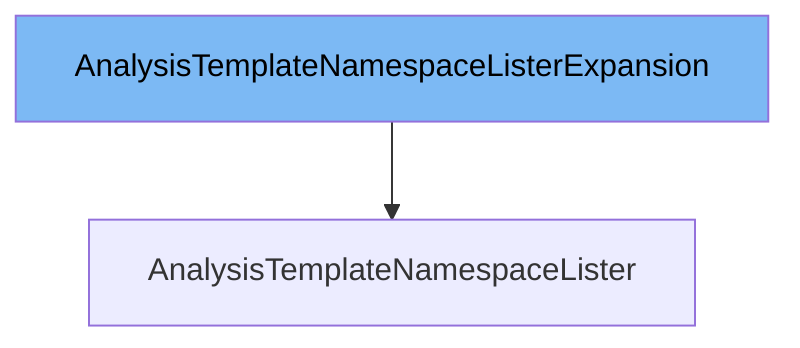

This document will cover the class `AnalysisTemplateNamespaceLister`. We will cover:

1. What is `AnalysisTemplateNamespaceListerExpansion` and what it is used for.
2. What is `AnalysisTemplateNamespaceLister` and what it is used for.
3. Variables and functions in `AnalysisTemplateNamespaceLister`.



# What is AnalysisTemplateNamespaceListerExpansion

The `AnalysisTemplateNamespaceListerExpansion` is an interface defined in the file `pkg/client/listers/rollouts/v1alpha1/expansion_generated.go`. It allows custom methods to be added to the `AnalysisTemplateNamespaceLister`. This interface is part of the Kubernetes `client-go` library and is used to extend the functionality of the lister for `AnalysisTemplate` resources within a specific namespace.

# What is AnalysisTemplateNamespaceLister

The `AnalysisTemplateNamespaceLister` is an interface defined in the file `pkg/client/listers/rollouts/v1alpha1/analysistemplate.go`. It helps list and get `AnalysisTemplates` within a specific namespace. All objects returned by this lister must be treated as read-only. The `AnalysisTemplateNamespaceLister` interface includes methods for listing all `AnalysisTemplates` in the indexer for a given namespace and retrieving a specific `AnalysisTemplate` by name. It is closely related to the `AnalysisTemplateNamespaceListerExpansion` interface, which allows for the addition of custom methods.

<SwmSnippet path="/pkg/client/listers/rollouts/v1alpha1/analysistemplate.go" line="62" repo-id="Z2l0aHViJTNBJTNBaW50dWl0LWFyZ28tcm9sbG91dHMtZGVtbyUzQSUzQVN3aW1tLURlbW8=">

---

# Variables and functions

The `AnalysisTemplateNamespaceLister` interface defines two main functions: `List` and `Get`. These functions are used to list all `AnalysisTemplates` in the indexer for a given namespace and to retrieve a specific `AnalysisTemplate` by name, respectively.

```go
// AnalysisTemplateNamespaceLister helps list and get AnalysisTemplates.
// All objects returned here must be treated as read-only.
type AnalysisTemplateNamespaceLister interface {
	// List lists all AnalysisTemplates in the indexer for a given namespace.
	// Objects returned here must be treated as read-only.
	List(selector labels.Selector) (ret []*v1alpha1.AnalysisTemplate, err error)
	// Get retrieves the AnalysisTemplate from the indexer for a given namespace and name.
	// Objects returned here must be treated as read-only.
	Get(name string) (*v1alpha1.AnalysisTemplate, error)
	AnalysisTemplateNamespaceListerExpansion
}
```

---

</SwmSnippet>

<SwmSnippet path="/pkg/client/listers/rollouts/v1alpha1/analysistemplate.go" line="81" repo-id="Z2l0aHViJTNBJTNBaW50dWl0LWFyZ28tcm9sbG91dHMtZGVtbyUzQSUzQVN3aW1tLURlbW8=">

---

The `List` function lists all `AnalysisTemplates` in the indexer for a given namespace. It takes a `labels.Selector` as an argument and returns a slice of `AnalysisTemplate` pointers and an error. The function uses `cache.ListAllByNamespace` to list the templates and appends them to the result slice.

```go
// List lists all AnalysisTemplates in the indexer for a given namespace.
func (s analysisTemplateNamespaceLister) List(selector labels.Selector) (ret []*v1alpha1.AnalysisTemplate, err error) {
	err = cache.ListAllByNamespace(s.indexer, s.namespace, selector, func(m interface{}) {
		ret = append(ret, m.(*v1alpha1.AnalysisTemplate))
	})
	return ret, err
}
```

---

</SwmSnippet>

<SwmSnippet path="/pkg/client/listers/rollouts/v1alpha1/analysistemplate.go" line="89" repo-id="Z2l0aHViJTNBJTNBaW50dWl0LWFyZ28tcm9sbG91dHMtZGVtbyUzQSUzQVN3aW1tLURlbW8=">

---

The `Get` function retrieves the `AnalysisTemplate` from the indexer for a given namespace and name. It takes the name of the template as an argument and returns a pointer to the `AnalysisTemplate` and an error. The function uses `s.indexer.GetByKey` to get the template by key, which is a combination of namespace and name.

```go
// Get retrieves the AnalysisTemplate from the indexer for a given namespace and name.
func (s analysisTemplateNamespaceLister) Get(name string) (*v1alpha1.AnalysisTemplate, error) {
	obj, exists, err := s.indexer.GetByKey(s.namespace + "/" + name)
	if err != nil {
		return nil, err
	}
	if !exists {
		return nil, errors.NewNotFound(v1alpha1.Resource("analysistemplate"), name)
	}
	return obj.(*v1alpha1.AnalysisTemplate), nil
}
```

---

</SwmSnippet>

&nbsp;

*This is an auto-generated document by Swimm 🌊 and has not yet been verified by a human*

<SwmMeta version="3.0.0"><sup>Powered by [Swimm](https://staging.swimm.cloud/)</sup></SwmMeta>
