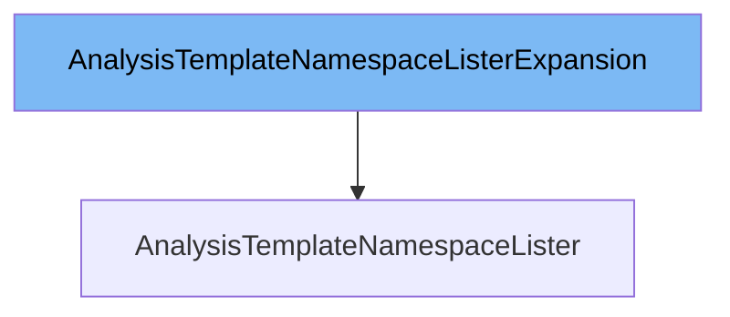

This document will cover the class <SwmToken path="pkg/client/listers/rollouts/v1alpha1/expansion_generated.go" pos="33:2:2" line-data="// AnalysisTemplateNamespaceListerExpansion allows custom methods to be added to">`AnalysisTemplateNamespaceListerExpansion`</SwmToken>. We will cover:

1. What is <SwmToken path="pkg/client/listers/rollouts/v1alpha1/expansion_generated.go" pos="33:2:2" line-data="// AnalysisTemplateNamespaceListerExpansion allows custom methods to be added to">`AnalysisTemplateNamespaceListerExpansion`</SwmToken>
2. Variables and functions
3. Usage example



# What is <SwmToken path="pkg/client/listers/rollouts/v1alpha1/expansion_generated.go" pos="33:2:2" line-data="// AnalysisTemplateNamespaceListerExpansion allows custom methods to be added to">`AnalysisTemplateNamespaceListerExpansion`</SwmToken>

The <SwmToken path="pkg/client/listers/rollouts/v1alpha1/expansion_generated.go" pos="33:2:2" line-data="// AnalysisTemplateNamespaceListerExpansion allows custom methods to be added to">`AnalysisTemplateNamespaceListerExpansion`</SwmToken> is an interface defined in the file <SwmPath>[pkg/client/listers/rollouts/v1alpha1/expansion_generated.go](pkg/client/listers/rollouts/v1alpha1/expansion_generated.go)</SwmPath>. It allows custom methods to be added to the <SwmToken path="pkg/client/listers/rollouts/v1alpha1/expansion_generated.go" pos="34:2:2" line-data="// AnalysisTemplateNamespaceLister.">`AnalysisTemplateNamespaceLister`</SwmToken>. This interface is part of the Kubernetes <SwmToken path="pkg/client/listers/rollouts/v1alpha1/analysistemplate.go" pos="25:6:8" line-data="	&quot;k8s.io/client-go/tools/cache&quot;">`client-go`</SwmToken> library and is used to extend the functionality of the lister for <SwmToken path="pkg/apis/rollouts/v1alpha1/analysis_types.go" pos="39:2:2" line-data="type AnalysisTemplate struct {">`AnalysisTemplate`</SwmToken> resources within a specific namespace.

<SwmSnippet path="/pkg/client/listers/rollouts/v1alpha1/expansion_generated.go" line="33">

---

# Variables and functions

The <SwmToken path="pkg/client/listers/rollouts/v1alpha1/expansion_generated.go" pos="33:2:2" line-data="// AnalysisTemplateNamespaceListerExpansion allows custom methods to be added to">`AnalysisTemplateNamespaceListerExpansion`</SwmToken> interface itself does not define any variables or functions. It is an empty interface that serves as a placeholder for adding custom methods to the <SwmToken path="pkg/client/listers/rollouts/v1alpha1/expansion_generated.go" pos="34:2:2" line-data="// AnalysisTemplateNamespaceLister.">`AnalysisTemplateNamespaceLister`</SwmToken>.

```go
// AnalysisTemplateNamespaceListerExpansion allows custom methods to be added to
// AnalysisTemplateNamespaceLister.
type AnalysisTemplateNamespaceListerExpansion interface{}
```

---

</SwmSnippet>

# Usage example

To use the <SwmToken path="pkg/client/listers/rollouts/v1alpha1/expansion_generated.go" pos="33:2:2" line-data="// AnalysisTemplateNamespaceListerExpansion allows custom methods to be added to">`AnalysisTemplateNamespaceListerExpansion`</SwmToken>, you would typically define custom methods in a separate file that implements this interface. Here is an example of how you might extend the <SwmToken path="pkg/client/listers/rollouts/v1alpha1/expansion_generated.go" pos="34:2:2" line-data="// AnalysisTemplateNamespaceLister.">`AnalysisTemplateNamespaceLister`</SwmToken> with a custom method.

<SwmSnippet path="/pkg/client/listers/rollouts/v1alpha1/analysistemplate.go" line="1">

---

In this example, we define a custom method `GetByName` that retrieves an <SwmToken path="pkg/apis/rollouts/v1alpha1/analysis_types.go" pos="39:2:2" line-data="type AnalysisTemplate struct {">`AnalysisTemplate`</SwmToken> by its name within a specific namespace. This method would be added to the <SwmToken path="pkg/client/listers/rollouts/v1alpha1/expansion_generated.go" pos="34:2:2" line-data="// AnalysisTemplateNamespaceLister.">`AnalysisTemplateNamespaceLister`</SwmToken> by implementing the <SwmToken path="pkg/client/listers/rollouts/v1alpha1/expansion_generated.go" pos="33:2:2" line-data="// AnalysisTemplateNamespaceListerExpansion allows custom methods to be added to">`AnalysisTemplateNamespaceListerExpansion`</SwmToken> interface.

```go
/*
Copyright The Kubernetes Authors.

Licensed under the Apache License, Version 2.0 (the "License");
you may not use this file except in compliance with the License.
You may obtain a copy of the License at

    http://www.apache.org/licenses/LICENSE-2.0

Unless required by applicable law or agreed to in writing, software
distributed under the License is distributed on an "AS IS" BASIS,
WITHOUT WARRANTIES OR CONDITIONS OF ANY KIND, either express or implied.
See the License for the specific language governing permissions and
limitations under the License.
*/
```

---

</SwmSnippet>

&nbsp;

*This is an auto-generated document by Swimm 🌊 and has not yet been verified by a human*

<SwmMeta version="3.0.0" repo-id="Z2l0aHViJTNBJTNBaW50dWl0LWFyZ28tcm9sbG91dHMtZGVtbyUzQSUzQVN3aW1tLURlbW8=" repo-name="intuit-argo-rollouts-demo"><sup>Powered by [Swimm](/)</sup></SwmMeta>
