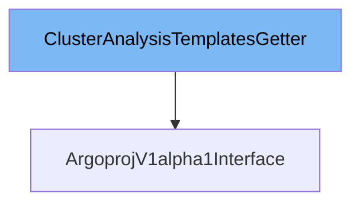

This document will cover the class `ArgoprojV1alpha1Interface` in detail. We will cover:

1. What `ClusterAnalysisTemplateInterface` is and what it is used for.
2. What `ArgoprojV1alpha1Interface` is and what it is used for.
3. Variables and functions defined in `ArgoprojV1alpha1Interface`.



# What is ClusterAnalysisTemplateInterface

`ClusterAnalysisTemplateInterface` is an interface in the `pkg/client/clientset/versioned/typed/rollouts/v1alpha1/clusteranalysistemplate.go` file. It provides methods to work with `ClusterAnalysisTemplate` resources, such as creating, updating, deleting, and retrieving `ClusterAnalysisTemplate` objects. This interface is essential for managing `ClusterAnalysisTemplate` resources within the Kubernetes cluster.

# What is ArgoprojV1alpha1Interface

`ArgoprojV1alpha1Interface` is an interface in the `pkg/client/clientset/versioned/typed/rollouts/v1alpha1/rollouts_client.go` file. It defines methods for interacting with various resources provided by the `argoproj.io` group, such as `AnalysisRuns`, `AnalysisTemplates`, `ClusterAnalysisTemplates`, `Experiments`, and `Rollouts`. This interface is crucial for managing these resources within the Kubernetes cluster.

<SwmSnippet path="/pkg/client/clientset/versioned/typed/rollouts/v1alpha1/rollouts_client.go" line="43" repo-id="Z2l0aHViJTNBJTNBaW50dWl0LWFyZ28tcm9sbG91dHMtZGVtbyUzQSUzQVN3aW1tLURlbW8=">

---

# Variables and functions

The function `AnalysisRuns` is used to return an `AnalysisRunInterface` for the specified namespace. This interface provides methods to interact with `AnalysisRun` resources.

```go
func (c *ArgoprojV1alpha1Client) AnalysisRuns(namespace string) AnalysisRunInterface {
	return newAnalysisRuns(c, namespace)
}
```

---

</SwmSnippet>

<SwmSnippet path="/pkg/client/clientset/versioned/typed/rollouts/v1alpha1/rollouts_client.go" line="47" repo-id="Z2l0aHViJTNBJTNBaW50dWl0LWFyZ28tcm9sbG91dHMtZGVtbyUzQSUzQVN3aW1tLURlbW8=">

---

The function `AnalysisTemplates` is used to return an `AnalysisTemplateInterface` for the specified namespace. This interface provides methods to interact with `AnalysisTemplate` resources.

```go
func (c *ArgoprojV1alpha1Client) AnalysisTemplates(namespace string) AnalysisTemplateInterface {
	return newAnalysisTemplates(c, namespace)
}
```

---

</SwmSnippet>

<SwmSnippet path="/pkg/client/clientset/versioned/typed/rollouts/v1alpha1/rollouts_client.go" line="51" repo-id="Z2l0aHViJTNBJTNBaW50dWl0LWFyZ28tcm9sbG91dHMtZGVtbyUzQSUzQVN3aW1tLURlbW8=">

---

The function `ClusterAnalysisTemplates` is used to return a `ClusterAnalysisTemplateInterface`. This interface provides methods to interact with `ClusterAnalysisTemplate` resources.

```go
func (c *ArgoprojV1alpha1Client) ClusterAnalysisTemplates() ClusterAnalysisTemplateInterface {
	return newClusterAnalysisTemplates(c)
}
```

---

</SwmSnippet>

<SwmSnippet path="/pkg/client/clientset/versioned/typed/rollouts/v1alpha1/rollouts_client.go" line="55" repo-id="Z2l0aHViJTNBJTNBaW50dWl0LWFyZ28tcm9sbG91dHMtZGVtbyUzQSUzQVN3aW1tLURlbW8=">

---

The function `Experiments` is used to return an `ExperimentInterface` for the specified namespace. This interface provides methods to interact with `Experiment` resources.

```go
func (c *ArgoprojV1alpha1Client) Experiments(namespace string) ExperimentInterface {
	return newExperiments(c, namespace)
}
```

---

</SwmSnippet>

<SwmSnippet path="/pkg/client/clientset/versioned/typed/rollouts/v1alpha1/rollouts_client.go" line="59" repo-id="Z2l0aHViJTNBJTNBaW50dWl0LWFyZ28tcm9sbG91dHMtZGVtbyUzQSUzQVN3aW1tLURlbW8=">

---

The function `Rollouts` is used to return a `RolloutInterface` for the specified namespace. This interface provides methods to interact with `Rollout` resources.

```go
func (c *ArgoprojV1alpha1Client) Rollouts(namespace string) RolloutInterface {
	return newRollouts(c, namespace)
}
```

---

</SwmSnippet>

<SwmSnippet path="/pkg/client/clientset/versioned/typed/rollouts/v1alpha1/rollouts_client.go" line="120" repo-id="Z2l0aHViJTNBJTNBaW50dWl0LWFyZ28tcm9sbG91dHMtZGVtbyUzQSUzQVN3aW1tLURlbW8=">

---

The function `RESTClient` returns a `RESTClient` that is used to communicate with the API server by this client implementation.

```go
// RESTClient returns a RESTClient that is used to communicate
// with API server by this client implementation.
func (c *ArgoprojV1alpha1Client) RESTClient() rest.Interface {
	if c == nil {
		return nil
	}
	return c.restClient
}
```

---

</SwmSnippet>

&nbsp;

*This is an auto-generated document by Swimm 🌊 and has not yet been verified by a human*

<SwmMeta version="3.0.0"><sup>Powered by [Swimm](https://staging.swimm.cloud/)</sup></SwmMeta>
