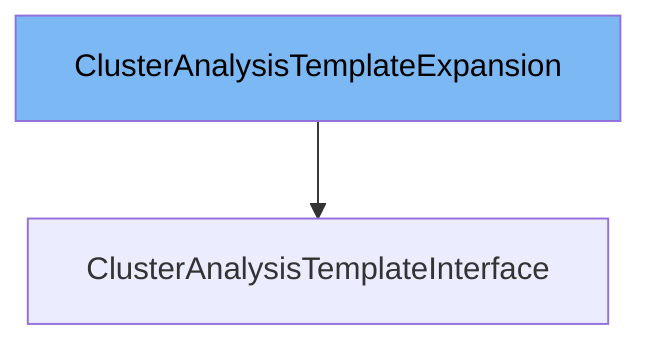

This document will cover the class <SwmToken path="pkg/client/clientset/versioned/typed/rollouts/v1alpha1/generated_expansion.go" pos="25:2:2" line-data="type ClusterAnalysisTemplateExpansion interface{}">`ClusterAnalysisTemplateExpansion`</SwmToken>. We will discuss:

1. What <SwmToken path="pkg/client/clientset/versioned/typed/rollouts/v1alpha1/generated_expansion.go" pos="25:2:2" line-data="type ClusterAnalysisTemplateExpansion interface{}">`ClusterAnalysisTemplateExpansion`</SwmToken> is.
2. The variables and functions defined in <SwmToken path="pkg/client/clientset/versioned/typed/rollouts/v1alpha1/generated_expansion.go" pos="25:2:2" line-data="type ClusterAnalysisTemplateExpansion interface{}">`ClusterAnalysisTemplateExpansion`</SwmToken>.
3. An example of how to use <SwmToken path="pkg/client/clientset/versioned/typed/rollouts/v1alpha1/generated_expansion.go" pos="25:2:2" line-data="type ClusterAnalysisTemplateExpansion interface{}">`ClusterAnalysisTemplateExpansion`</SwmToken> in <SwmToken path="pkg/client/clientset/versioned/typed/rollouts/v1alpha1/clusteranalysistemplate.go" pos="40:2:2" line-data="type ClusterAnalysisTemplateInterface interface {">`ClusterAnalysisTemplateInterface`</SwmToken>.



# What is <SwmToken path="pkg/client/clientset/versioned/typed/rollouts/v1alpha1/generated_expansion.go" pos="25:2:2" line-data="type ClusterAnalysisTemplateExpansion interface{}">`ClusterAnalysisTemplateExpansion`</SwmToken>

The <SwmToken path="pkg/client/clientset/versioned/typed/rollouts/v1alpha1/generated_expansion.go" pos="25:2:2" line-data="type ClusterAnalysisTemplateExpansion interface{}">`ClusterAnalysisTemplateExpansion`</SwmToken> is an interface defined in the file <SwmPath>[pkg/client/clientset/versioned/typed/rollouts/v1alpha1/generated_expansion.go](pkg/client/clientset/versioned/typed/rollouts/v1alpha1/generated_expansion.go)</SwmPath>. It is used to extend the functionality of the <SwmToken path="pkg/apis/rollouts/v1alpha1/analysis_types.go" pos="19:2:2" line-data="type ClusterAnalysisTemplate struct {">`ClusterAnalysisTemplate`</SwmToken> resource in Kubernetes. This interface allows for additional methods to be added to the <SwmToken path="pkg/apis/rollouts/v1alpha1/analysis_types.go" pos="19:2:2" line-data="type ClusterAnalysisTemplate struct {">`ClusterAnalysisTemplate`</SwmToken> client without modifying the generated client code.

<SwmSnippet path="/pkg/client/clientset/versioned/typed/rollouts/v1alpha1/generated_expansion.go" line="25">

---

# Variables and functions

The <SwmToken path="pkg/client/clientset/versioned/typed/rollouts/v1alpha1/generated_expansion.go" pos="25:2:2" line-data="type ClusterAnalysisTemplateExpansion interface{}">`ClusterAnalysisTemplateExpansion`</SwmToken> interface is defined here. It is currently an empty interface, meaning it does not declare any methods. This allows for future expansion without breaking existing code.

```go
type ClusterAnalysisTemplateExpansion interface{}
```

---

</SwmSnippet>

# Usage example

To use the <SwmToken path="pkg/client/clientset/versioned/typed/rollouts/v1alpha1/generated_expansion.go" pos="25:2:2" line-data="type ClusterAnalysisTemplateExpansion interface{}">`ClusterAnalysisTemplateExpansion`</SwmToken> interface, you would typically implement it in a struct that also implements the <SwmToken path="pkg/client/clientset/versioned/typed/rollouts/v1alpha1/clusteranalysistemplate.go" pos="40:2:2" line-data="type ClusterAnalysisTemplateInterface interface {">`ClusterAnalysisTemplateInterface`</SwmToken>. Here is an example of how you might use it:

```go
package main

import (
	"fmt"
	"pkg/client/clientset/versioned/typed/rollouts/v1alpha1"
)

// MyClusterAnalysisTemplateClient is a custom client that implements the ClusterAnalysisTemplateInterface
// and extends it using the ClusterAnalysisTemplateExpansion interface.
type MyClusterAnalysisTemplateClient struct {
	v1alpha1.ClusterAnalysisTemplateInterface
	v1alpha1.ClusterAnalysisTemplateExpansion
}

func main() {
	client := &MyClusterAnalysisTemplateClient{}
	fmt.Println("Custom client with ClusterAnalysisTemplateExpansion created:", client)
}
```

In this example, `MyClusterAnalysisTemplateClient` embeds both <SwmToken path="pkg/client/clientset/versioned/typed/rollouts/v1alpha1/clusteranalysistemplate.go" pos="40:2:2" line-data="type ClusterAnalysisTemplateInterface interface {">`ClusterAnalysisTemplateInterface`</SwmToken> and <SwmToken path="pkg/client/clientset/versioned/typed/rollouts/v1alpha1/generated_expansion.go" pos="25:2:2" line-data="type ClusterAnalysisTemplateExpansion interface{}">`ClusterAnalysisTemplateExpansion`</SwmToken>, allowing it to use methods from both interfaces.

&nbsp;

*This is an auto-generated document by Swimm 🌊 and has not yet been verified by a human*

<SwmMeta version="3.0.0" repo-id="Z2l0aHViJTNBJTNBaW50dWl0LWFyZ28tcm9sbG91dHMtZGVtbyUzQSUzQVN3aW1tLURlbW8=" repo-name="intuit-argo-rollouts-demo"><sup>Powered by [Swimm](/)</sup></SwmMeta>
