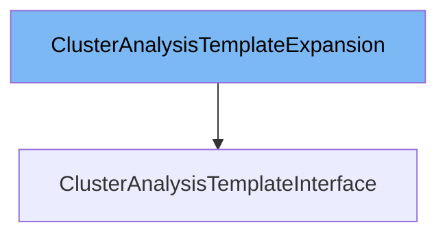

This document will cover the `ClusterAnalysisTemplateInterface` in detail. We will address the following points:

1. What is `generated_expansion.go`
2. What is `ClusterAnalysisTemplateInterface`
3. Variables and functions in `ClusterAnalysisTemplateInterface`



# What is `generated_expansion.go`

`generated_expansion.go` is a file that contains expansion interfaces for various resources in the Argo Rollouts project. These expansion interfaces are used to extend the functionality of the clientset interfaces without modifying the generated code. This allows developers to add custom methods to the clientset interfaces in a clean and maintainable way.

# What is `ClusterAnalysisTemplateInterface`

`ClusterAnalysisTemplateInterface` is an interface in `pkg/client/clientset/versioned/typed/rollouts/v1alpha1/clusteranalysistemplate.go` that defines methods for working with `ClusterAnalysisTemplate` resources. It provides methods for creating, updating, deleting, getting, listing, watching, and patching `ClusterAnalysisTemplate` resources. This interface is implemented by the `clusterAnalysisTemplates` struct, which interacts with the Kubernetes API server using a REST client.

<SwmSnippet path="/pkg/client/clientset/versioned/typed/rollouts/v1alpha1/clusteranalysistemplate.go" line="64" repo-id="Z2l0aHViJTNBJTNBaW50dWl0LWFyZ28tcm9sbG91dHMtZGVtbyUzQSUzQVN3aW1tLURlbW8=">

---

# Variables and functions

The `Get` function retrieves a `ClusterAnalysisTemplate` resource by its name. It sends a GET request to the Kubernetes API server and returns the corresponding `ClusterAnalysisTemplate` object.

```go
// Get takes name of the clusterAnalysisTemplate, and returns the corresponding clusterAnalysisTemplate object, and an error if there is any.
func (c *clusterAnalysisTemplates) Get(ctx context.Context, name string, options v1.GetOptions) (result *v1alpha1.ClusterAnalysisTemplate, err error) {
	result = &v1alpha1.ClusterAnalysisTemplate{}
	err = c.client.Get().
		Resource("clusteranalysistemplates").
		Name(name).
		VersionedParams(&options, scheme.ParameterCodec).
		Do(ctx).
		Into(result)
	return
}
```

---

</SwmSnippet>

<SwmSnippet path="/pkg/client/clientset/versioned/typed/rollouts/v1alpha1/clusteranalysistemplate.go" line="76" repo-id="Z2l0aHViJTNBJTNBaW50dWl0LWFyZ28tcm9sbG91dHMtZGVtbyUzQSUzQVN3aW1tLURlbW8=">

---

The `List` function retrieves a list of `ClusterAnalysisTemplate` resources that match the specified label and field selectors. It sends a GET request to the Kubernetes API server and returns a list of matching `ClusterAnalysisTemplate` objects.

```go
// List takes label and field selectors, and returns the list of ClusterAnalysisTemplates that match those selectors.
func (c *clusterAnalysisTemplates) List(ctx context.Context, opts v1.ListOptions) (result *v1alpha1.ClusterAnalysisTemplateList, err error) {
	var timeout time.Duration
	if opts.TimeoutSeconds != nil {
		timeout = time.Duration(*opts.TimeoutSeconds) * time.Second
	}
	result = &v1alpha1.ClusterAnalysisTemplateList{}
	err = c.client.Get().
		Resource("clusteranalysistemplates").
		VersionedParams(&opts, scheme.ParameterCodec).
		Timeout(timeout).
		Do(ctx).
		Into(result)
	return
}
```

---

</SwmSnippet>

<SwmSnippet path="/pkg/client/clientset/versioned/typed/rollouts/v1alpha1/clusteranalysistemplate.go" line="92" repo-id="Z2l0aHViJTNBJTNBaW50dWl0LWFyZ28tcm9sbG91dHMtZGVtbyUzQSUzQVN3aW1tLURlbW8=">

---

The `Watch` function returns a watch.Interface that watches the requested `ClusterAnalysisTemplate` resources. It sends a GET request to the Kubernetes API server with the watch option enabled.

```go
// Watch returns a watch.Interface that watches the requested clusterAnalysisTemplates.
func (c *clusterAnalysisTemplates) Watch(ctx context.Context, opts v1.ListOptions) (watch.Interface, error) {
	var timeout time.Duration
	if opts.TimeoutSeconds != nil {
		timeout = time.Duration(*opts.TimeoutSeconds) * time.Second
	}
	opts.Watch = true
	return c.client.Get().
		Resource("clusteranalysistemplates").
		VersionedParams(&opts, scheme.ParameterCodec).
		Timeout(timeout).
		Watch(ctx)
}
```

---

</SwmSnippet>

<SwmSnippet path="/pkg/client/clientset/versioned/typed/rollouts/v1alpha1/clusteranalysistemplate.go" line="106" repo-id="Z2l0aHViJTNBJTNBaW50dWl0LWFyZ28tcm9sbG91dHMtZGVtbyUzQSUzQVN3aW1tLURlbW8=">

---

The `Create` function creates a new `ClusterAnalysisTemplate` resource. It sends a POST request to the Kubernetes API server with the representation of the `ClusterAnalysisTemplate` to be created.

```go
// Create takes the representation of a clusterAnalysisTemplate and creates it.  Returns the server's representation of the clusterAnalysisTemplate, and an error, if there is any.
func (c *clusterAnalysisTemplates) Create(ctx context.Context, clusterAnalysisTemplate *v1alpha1.ClusterAnalysisTemplate, opts v1.CreateOptions) (result *v1alpha1.ClusterAnalysisTemplate, err error) {
	result = &v1alpha1.ClusterAnalysisTemplate{}
	err = c.client.Post().
		Resource("clusteranalysistemplates").
		VersionedParams(&opts, scheme.ParameterCodec).
		Body(clusterAnalysisTemplate).
		Do(ctx).
		Into(result)
	return
}
```

---

</SwmSnippet>

<SwmSnippet path="/pkg/client/clientset/versioned/typed/rollouts/v1alpha1/clusteranalysistemplate.go" line="118" repo-id="Z2l0aHViJTNBJTNBaW50dWl0LWFyZ28tcm9sbG91dHMtZGVtbyUzQSUzQVN3aW1tLURlbW8=">

---

The `Update` function updates an existing `ClusterAnalysisTemplate` resource. It sends a PUT request to the Kubernetes API server with the representation of the `ClusterAnalysisTemplate` to be updated.

```go
// Update takes the representation of a clusterAnalysisTemplate and updates it. Returns the server's representation of the clusterAnalysisTemplate, and an error, if there is any.
func (c *clusterAnalysisTemplates) Update(ctx context.Context, clusterAnalysisTemplate *v1alpha1.ClusterAnalysisTemplate, opts v1.UpdateOptions) (result *v1alpha1.ClusterAnalysisTemplate, err error) {
	result = &v1alpha1.ClusterAnalysisTemplate{}
	err = c.client.Put().
		Resource("clusteranalysistemplates").
		Name(clusterAnalysisTemplate.Name).
		VersionedParams(&opts, scheme.ParameterCodec).
		Body(clusterAnalysisTemplate).
		Do(ctx).
		Into(result)
	return
}
```

---

</SwmSnippet>

<SwmSnippet path="/pkg/client/clientset/versioned/typed/rollouts/v1alpha1/clusteranalysistemplate.go" line="131" repo-id="Z2l0aHViJTNBJTNBaW50dWl0LWFyZ28tcm9sbG91dHMtZGVtbyUzQSUzQVN3aW1tLURlbW8=">

---

The `Delete` function deletes a `ClusterAnalysisTemplate` resource by its name. It sends a DELETE request to the Kubernetes API server.

```go
// Delete takes name of the clusterAnalysisTemplate and deletes it. Returns an error if one occurs.
func (c *clusterAnalysisTemplates) Delete(ctx context.Context, name string, opts v1.DeleteOptions) error {
	return c.client.Delete().
		Resource("clusteranalysistemplates").
		Name(name).
		Body(&opts).
		Do(ctx).
		Error()
```

---

</SwmSnippet>

<SwmSnippet path="/pkg/client/clientset/versioned/typed/rollouts/v1alpha1/clusteranalysistemplate.go" line="141" repo-id="Z2l0aHViJTNBJTNBaW50dWl0LWFyZ28tcm9sbG91dHMtZGVtbyUzQSUzQVN3aW1tLURlbW8=">

---

The `DeleteCollection` function deletes a collection of `ClusterAnalysisTemplate` resources. It sends a DELETE request to the Kubernetes API server with the specified list options.

```go
// DeleteCollection deletes a collection of objects.
func (c *clusterAnalysisTemplates) DeleteCollection(ctx context.Context, opts v1.DeleteOptions, listOpts v1.ListOptions) error {
	var timeout time.Duration
	if listOpts.TimeoutSeconds != nil {
		timeout = time.Duration(*listOpts.TimeoutSeconds) * time.Second
	}
	return c.client.Delete().
		Resource("clusteranalysistemplates").
		VersionedParams(&listOpts, scheme.ParameterCodec).
		Timeout(timeout).
		Body(&opts).
		Do(ctx).
		Error()
}
```

---

</SwmSnippet>

<SwmSnippet path="/pkg/client/clientset/versioned/typed/rollouts/v1alpha1/clusteranalysistemplate.go" line="156" repo-id="Z2l0aHViJTNBJTNBaW50dWl0LWFyZ28tcm9sbG91dHMtZGVtbyUzQSUzQVN3aW1tLURlbW8=">

---

The `Patch` function applies a patch to a `ClusterAnalysisTemplate` resource. It sends a PATCH request to the Kubernetes API server with the patch data and returns the patched `ClusterAnalysisTemplate` object.

```go
// Patch applies the patch and returns the patched clusterAnalysisTemplate.
func (c *clusterAnalysisTemplates) Patch(ctx context.Context, name string, pt types.PatchType, data []byte, opts v1.PatchOptions, subresources ...string) (result *v1alpha1.ClusterAnalysisTemplate, err error) {
	result = &v1alpha1.ClusterAnalysisTemplate{}
	err = c.client.Patch(pt).
		Resource("clusteranalysistemplates").
		Name(name).
		SubResource(subresources...).
		VersionedParams(&opts, scheme.ParameterCodec).
		Body(data).
		Do(ctx).
		Into(result)
	return
}
```

---

</SwmSnippet>

&nbsp;

*This is an auto-generated document by Swimm 🌊 and has not yet been verified by a human*

<SwmMeta version="3.0.0"><sup>Powered by [Swimm](https://staging.swimm.cloud/)</sup></SwmMeta>
