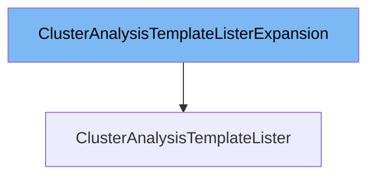

This document will cover the `ClusterAnalysisTemplateLister` class. We will discuss:

1. What `ClusterAnalysisTemplateListerExpansion` is and what it is used for.
2. What `ClusterAnalysisTemplateLister` is and what it is used for.
3. Variables and functions defined in `ClusterAnalysisTemplateLister`.



# What is ClusterAnalysisTemplateListerExpansion

`ClusterAnalysisTemplateListerExpansion` is an interface defined in `pkg/client/listers/rollouts/v1alpha1/expansion_generated.go`. It allows custom methods to be added to the `ClusterAnalysisTemplateLister` interface. This interface is part of the Kubernetes client library and is used to extend the functionality of the lister for `ClusterAnalysisTemplate` resources.

# What is ClusterAnalysisTemplateLister

`ClusterAnalysisTemplateLister` is an interface defined in `pkg/client/listers/rollouts/v1alpha1/clusteranalysistemplate.go`. It helps list `ClusterAnalysisTemplate` resources and retrieve them by name. All objects returned by this lister must be treated as read-only. The `ClusterAnalysisTemplateLister` interface includes two main methods: `List` and `Get`. It also includes the `ClusterAnalysisTemplateListerExpansion` interface, allowing for custom methods to be added.

<SwmSnippet path="/pkg/client/listers/rollouts/v1alpha1/clusteranalysistemplate.go" line="31" repo-id="Z2l0aHViJTNBJTNBaW50dWl0LWFyZ28tcm9sbG91dHMtZGVtbyUzQSUzQVN3aW1tLURlbW8=">

---

# Variables and functions

The `List` function lists all `ClusterAnalysisTemplate` resources in the indexer. It takes a `labels.Selector` as an argument and returns a slice of pointers to `ClusterAnalysisTemplate` objects and an error.

```go
	// List lists all ClusterAnalysisTemplates in the indexer.
	// Objects returned here must be treated as read-only.
	List(selector labels.Selector) (ret []*v1alpha1.ClusterAnalysisTemplate, err error)
```

---

</SwmSnippet>

<SwmSnippet path="/pkg/client/listers/rollouts/v1alpha1/clusteranalysistemplate.go" line="34" repo-id="Z2l0aHViJTNBJTNBaW50dWl0LWFyZ28tcm9sbG91dHMtZGVtbyUzQSUzQVN3aW1tLURlbW8=">

---

The `Get` function retrieves a `ClusterAnalysisTemplate` resource from the indexer by its name. It takes a string `name` as an argument and returns a pointer to a `ClusterAnalysisTemplate` object and an error.

```go
	// Get retrieves the ClusterAnalysisTemplate from the index for a given name.
	// Objects returned here must be treated as read-only.
	Get(name string) (*v1alpha1.ClusterAnalysisTemplate, error)
```

---

</SwmSnippet>

<SwmSnippet path="/pkg/client/listers/rollouts/v1alpha1/clusteranalysistemplate.go" line="40" repo-id="Z2l0aHViJTNBJTNBaW50dWl0LWFyZ28tcm9sbG91dHMtZGVtbyUzQSUzQVN3aW1tLURlbW8=">

---

The `indexer` variable is a member of the `clusterAnalysisTemplateLister` struct. It is of type `cache.Indexer` and is used to store and retrieve `ClusterAnalysisTemplate` resources.

```go
// clusterAnalysisTemplateLister implements the ClusterAnalysisTemplateLister interface.
type clusterAnalysisTemplateLister struct {
	indexer cache.Indexer
}
```

---

</SwmSnippet>

<SwmSnippet path="/pkg/client/listers/rollouts/v1alpha1/clusteranalysistemplate.go" line="45" repo-id="Z2l0aHViJTNBJTNBaW50dWl0LWFyZ28tcm9sbG91dHMtZGVtbyUzQSUzQVN3aW1tLURlbW8=">

---

The `NewClusterAnalysisTemplateLister` function returns a new instance of `ClusterAnalysisTemplateLister`. It takes a `cache.Indexer` as an argument and returns a `ClusterAnalysisTemplateLister`.

```go
// NewClusterAnalysisTemplateLister returns a new ClusterAnalysisTemplateLister.
func NewClusterAnalysisTemplateLister(indexer cache.Indexer) ClusterAnalysisTemplateLister {
	return &clusterAnalysisTemplateLister{indexer: indexer}
}
```

---

</SwmSnippet>

<SwmSnippet path="/pkg/client/listers/rollouts/v1alpha1/clusteranalysistemplate.go" line="50" repo-id="Z2l0aHViJTNBJTNBaW50dWl0LWFyZ28tcm9sbG91dHMtZGVtbyUzQSUzQVN3aW1tLURlbW8=">

---

The `List` function implementation in the `clusterAnalysisTemplateLister` struct lists all `ClusterAnalysisTemplate` resources in the indexer. It uses the `cache.ListAll` function to retrieve the resources and append them to a slice.

```go
// List lists all ClusterAnalysisTemplates in the indexer.
func (s *clusterAnalysisTemplateLister) List(selector labels.Selector) (ret []*v1alpha1.ClusterAnalysisTemplate, err error) {
	err = cache.ListAll(s.indexer, selector, func(m interface{}) {
		ret = append(ret, m.(*v1alpha1.ClusterAnalysisTemplate))
	})
	return ret, err
}
```

---

</SwmSnippet>

<SwmSnippet path="/pkg/client/listers/rollouts/v1alpha1/clusteranalysistemplate.go" line="58" repo-id="Z2l0aHViJTNBJTNBaW50dWl0LWFyZ28tcm9sbG91dHMtZGVtbyUzQSUzQVN3aW1tLURlbW8=">

---

The `Get` function implementation in the `clusterAnalysisTemplateLister` struct retrieves a `ClusterAnalysisTemplate` resource from the indexer by its name. It uses the `indexer.GetByKey` function to get the resource and returns an error if the resource is not found.

```go
// Get retrieves the ClusterAnalysisTemplate from the index for a given name.
func (s *clusterAnalysisTemplateLister) Get(name string) (*v1alpha1.ClusterAnalysisTemplate, error) {
	obj, exists, err := s.indexer.GetByKey(name)
	if err != nil {
		return nil, err
	}
	if !exists {
		return nil, errors.NewNotFound(v1alpha1.Resource("clusteranalysistemplate"), name)
	}
	return obj.(*v1alpha1.ClusterAnalysisTemplate), nil
}
```

---

</SwmSnippet>

&nbsp;

*This is an auto-generated document by Swimm 🌊 and has not yet been verified by a human*

<SwmMeta version="3.0.0"><sup>Powered by [Swimm](https://staging.swimm.cloud/)</sup></SwmMeta>
