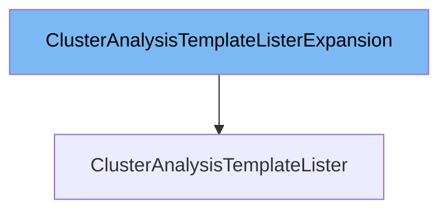

This document will cover the <SwmToken path="pkg/client/listers/rollouts/v1alpha1/expansion_generated.go" pos="37:2:2" line-data="// ClusterAnalysisTemplateListerExpansion allows custom methods to be added to">`ClusterAnalysisTemplateListerExpansion`</SwmToken> interface. We will discuss:

1. What <SwmToken path="pkg/client/listers/rollouts/v1alpha1/expansion_generated.go" pos="37:2:2" line-data="// ClusterAnalysisTemplateListerExpansion allows custom methods to be added to">`ClusterAnalysisTemplateListerExpansion`</SwmToken> is.
2. The variables and functions defined in <SwmToken path="pkg/client/listers/rollouts/v1alpha1/expansion_generated.go" pos="37:2:2" line-data="// ClusterAnalysisTemplateListerExpansion allows custom methods to be added to">`ClusterAnalysisTemplateListerExpansion`</SwmToken>.
3. An example of how to use <SwmToken path="pkg/client/listers/rollouts/v1alpha1/expansion_generated.go" pos="37:2:2" line-data="// ClusterAnalysisTemplateListerExpansion allows custom methods to be added to">`ClusterAnalysisTemplateListerExpansion`</SwmToken> in <SwmToken path="pkg/client/listers/rollouts/v1alpha1/expansion_generated.go" pos="38:2:2" line-data="// ClusterAnalysisTemplateLister.">`ClusterAnalysisTemplateLister`</SwmToken>.



# What is <SwmToken path="pkg/client/listers/rollouts/v1alpha1/expansion_generated.go" pos="37:2:2" line-data="// ClusterAnalysisTemplateListerExpansion allows custom methods to be added to">`ClusterAnalysisTemplateListerExpansion`</SwmToken>

The <SwmToken path="pkg/client/listers/rollouts/v1alpha1/expansion_generated.go" pos="37:2:2" line-data="// ClusterAnalysisTemplateListerExpansion allows custom methods to be added to">`ClusterAnalysisTemplateListerExpansion`</SwmToken> interface is defined in <SwmPath>[pkg/client/listers/rollouts/v1alpha1/expansion_generated.go](pkg/client/listers/rollouts/v1alpha1/expansion_generated.go)</SwmPath>. It allows custom methods to be added to the <SwmToken path="pkg/client/listers/rollouts/v1alpha1/expansion_generated.go" pos="38:2:2" line-data="// ClusterAnalysisTemplateLister.">`ClusterAnalysisTemplateLister`</SwmToken>. This interface is part of the Kubernetes client library and is used to extend the functionality of the lister for <SwmToken path="pkg/apis/rollouts/v1alpha1/analysis_types.go" pos="19:2:2" line-data="type ClusterAnalysisTemplate struct {">`ClusterAnalysisTemplate`</SwmToken> resources.

<SwmSnippet path="/pkg/client/listers/rollouts/v1alpha1/expansion_generated.go" line="37">

---

# Variables and functions

The <SwmToken path="pkg/client/listers/rollouts/v1alpha1/expansion_generated.go" pos="37:2:2" line-data="// ClusterAnalysisTemplateListerExpansion allows custom methods to be added to">`ClusterAnalysisTemplateListerExpansion`</SwmToken> interface itself does not define any variables or functions. It is an empty interface that serves as a placeholder for adding custom methods to the <SwmToken path="pkg/client/listers/rollouts/v1alpha1/expansion_generated.go" pos="38:2:2" line-data="// ClusterAnalysisTemplateLister.">`ClusterAnalysisTemplateLister`</SwmToken>.

```go
// ClusterAnalysisTemplateListerExpansion allows custom methods to be added to
// ClusterAnalysisTemplateLister.
type ClusterAnalysisTemplateListerExpansion interface{}
```

---

</SwmSnippet>

# Usage example

To use the <SwmToken path="pkg/client/listers/rollouts/v1alpha1/expansion_generated.go" pos="37:2:2" line-data="// ClusterAnalysisTemplateListerExpansion allows custom methods to be added to">`ClusterAnalysisTemplateListerExpansion`</SwmToken> interface, you would typically implement it in a custom lister that extends the <SwmToken path="pkg/client/listers/rollouts/v1alpha1/expansion_generated.go" pos="38:2:2" line-data="// ClusterAnalysisTemplateLister.">`ClusterAnalysisTemplateLister`</SwmToken>. Here is an example of how it might be used in the <SwmToken path="pkg/client/listers/rollouts/v1alpha1/expansion_generated.go" pos="38:2:2" line-data="// ClusterAnalysisTemplateLister.">`ClusterAnalysisTemplateLister`</SwmToken>.

<SwmSnippet path="/pkg/client/listers/rollouts/v1alpha1/clusteranalysistemplate.go" line="1">

---

In this example, the <SwmToken path="pkg/client/listers/rollouts/v1alpha1/expansion_generated.go" pos="38:2:2" line-data="// ClusterAnalysisTemplateLister.">`ClusterAnalysisTemplateLister`</SwmToken> is defined, and you can add custom methods by implementing the <SwmToken path="pkg/client/listers/rollouts/v1alpha1/expansion_generated.go" pos="37:2:2" line-data="// ClusterAnalysisTemplateListerExpansion allows custom methods to be added to">`ClusterAnalysisTemplateListerExpansion`</SwmToken> interface. This allows you to extend the functionality of the lister to meet your specific needs.

```go
/*
Copyright The Kubernetes Authors.

Licensed under the Apache License, Version 2.0 (the "License");
you may not use this file except in compliance with the License.
You may obtain a copy of the License at

    http://www.apache.org/licenses/LICENSE-2.0

Unless required by applicable law or agreed to in writing, software
distributed under the License is distributed on an "AS IS" BASIS,
WITHOUT WARRANTIES OR CONDITIONS OF ANY KIND, either express or implied.
See the License for the specific language governing permissions and
limitations under the License.
*/
```

---

</SwmSnippet>

&nbsp;

*This is an auto-generated document by Swimm 🌊 and has not yet been verified by a human*

<SwmMeta version="3.0.0" repo-id="Z2l0aHViJTNBJTNBaW50dWl0LWFyZ28tcm9sbG91dHMtZGVtbyUzQSUzQVN3aW1tLURlbW8=" repo-name="intuit-argo-rollouts-demo"><sup>Powered by [Swimm](/)</sup></SwmMeta>
