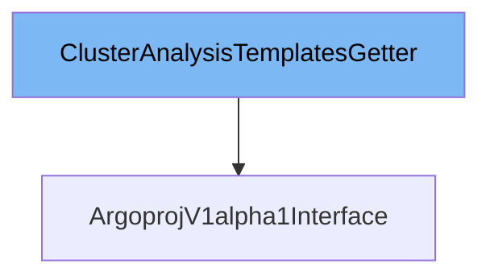

This document will cover the class <SwmToken path="pkg/client/clientset/versioned/typed/rollouts/v1alpha1/rollouts_client.go" pos="33:1:1" line-data="	ClusterAnalysisTemplatesGetter">`ClusterAnalysisTemplatesGetter`</SwmToken> in detail. We will cover:

1. What is <SwmToken path="pkg/client/clientset/versioned/typed/rollouts/v1alpha1/rollouts_client.go" pos="33:1:1" line-data="	ClusterAnalysisTemplatesGetter">`ClusterAnalysisTemplatesGetter`</SwmToken>
2. Variables and functions
3. Usage example



# What is <SwmToken path="pkg/client/clientset/versioned/typed/rollouts/v1alpha1/rollouts_client.go" pos="33:1:1" line-data="	ClusterAnalysisTemplatesGetter">`ClusterAnalysisTemplatesGetter`</SwmToken>

The <SwmToken path="pkg/client/clientset/versioned/typed/rollouts/v1alpha1/rollouts_client.go" pos="33:1:1" line-data="	ClusterAnalysisTemplatesGetter">`ClusterAnalysisTemplatesGetter`</SwmToken> is an interface in the <SwmPath>[pkg/client/clientset/versioned/typed/rollouts/v1alpha1/clusteranalysistemplate.go](pkg/client/clientset/versioned/typed/rollouts/v1alpha1/clusteranalysistemplate.go)</SwmPath> file. It is used to return a <SwmToken path="pkg/client/clientset/versioned/typed/rollouts/v1alpha1/clusteranalysistemplate.go" pos="33:16:16" line-data="// ClusterAnalysisTemplatesGetter has a method to return a ClusterAnalysisTemplateInterface.">`ClusterAnalysisTemplateInterface`</SwmToken>, which provides methods to work with <SwmToken path="pkg/client/clientset/versioned/typed/rollouts/v1alpha1/clusteranalysistemplate.go" pos="65:36:36" line-data="func (c *clusterAnalysisTemplates) Get(ctx context.Context, name string, options v1.GetOptions) (result *v1alpha1.ClusterAnalysisTemplate, err error) {">`ClusterAnalysisTemplate`</SwmToken> resources. This interface is typically implemented by a group's client to manage cluster-scoped analysis templates in Kubernetes.

<SwmSnippet path="/pkg/client/clientset/versioned/typed/rollouts/v1alpha1/clusteranalysistemplate.go" line="64">

---

# Variables and functions

The <SwmToken path="pkg/client/clientset/versioned/typed/rollouts/v1alpha1/clusteranalysistemplate.go" pos="64:2:2" line-data="// Get takes name of the clusterAnalysisTemplate, and returns the corresponding clusterAnalysisTemplate object, and an error if there is any.">`Get`</SwmToken> function takes the name of the <SwmToken path="pkg/client/clientset/versioned/typed/rollouts/v1alpha1/clusteranalysistemplate.go" pos="65:36:36" line-data="func (c *clusterAnalysisTemplates) Get(ctx context.Context, name string, options v1.GetOptions) (result *v1alpha1.ClusterAnalysisTemplate, err error) {">`ClusterAnalysisTemplate`</SwmToken> and returns the corresponding <SwmToken path="pkg/client/clientset/versioned/typed/rollouts/v1alpha1/clusteranalysistemplate.go" pos="65:36:36" line-data="func (c *clusterAnalysisTemplates) Get(ctx context.Context, name string, options v1.GetOptions) (result *v1alpha1.ClusterAnalysisTemplate, err error) {">`ClusterAnalysisTemplate`</SwmToken> object. It uses the <SwmToken path="pkg/client/clientset/versioned/typed/rollouts/v1alpha1/clusteranalysistemplate.go" pos="67:7:11" line-data="	err = c.client.Get().">`client.Get()`</SwmToken> method to fetch the resource from the Kubernetes API.

```go
// Get takes name of the clusterAnalysisTemplate, and returns the corresponding clusterAnalysisTemplate object, and an error if there is any.
func (c *clusterAnalysisTemplates) Get(ctx context.Context, name string, options v1.GetOptions) (result *v1alpha1.ClusterAnalysisTemplate, err error) {
	result = &v1alpha1.ClusterAnalysisTemplate{}
	err = c.client.Get().
		Resource("clusteranalysistemplates").
		Name(name).
		VersionedParams(&options, scheme.ParameterCodec).
		Do(ctx).
		Into(result)
	return
}
```

---

</SwmSnippet>

<SwmSnippet path="/pkg/client/clientset/versioned/typed/rollouts/v1alpha1/clusteranalysistemplate.go" line="76">

---

The `List` function takes label and field selectors and returns a list of <SwmToken path="pkg/client/clientset/versioned/typed/rollouts/v1alpha1/clusteranalysistemplate.go" pos="76:25:25" line-data="// List takes label and field selectors, and returns the list of ClusterAnalysisTemplates that match those selectors.">`ClusterAnalysisTemplates`</SwmToken> that match those selectors. It uses the <SwmToken path="pkg/client/clientset/versioned/typed/rollouts/v1alpha1/clusteranalysistemplate.go" pos="83:7:11" line-data="	err = c.client.Get().">`client.Get()`</SwmToken> method with the specified selectors to fetch the resources.

```go
// List takes label and field selectors, and returns the list of ClusterAnalysisTemplates that match those selectors.
func (c *clusterAnalysisTemplates) List(ctx context.Context, opts v1.ListOptions) (result *v1alpha1.ClusterAnalysisTemplateList, err error) {
	var timeout time.Duration
	if opts.TimeoutSeconds != nil {
		timeout = time.Duration(*opts.TimeoutSeconds) * time.Second
	}
	result = &v1alpha1.ClusterAnalysisTemplateList{}
	err = c.client.Get().
		Resource("clusteranalysistemplates").
		VersionedParams(&opts, scheme.ParameterCodec).
		Timeout(timeout).
		Do(ctx).
		Into(result)
	return
}
```

---

</SwmSnippet>

<SwmSnippet path="/pkg/client/clientset/versioned/typed/rollouts/v1alpha1/clusteranalysistemplate.go" line="92">

---

The <SwmToken path="pkg/client/clientset/versioned/typed/rollouts/v1alpha1/clusteranalysistemplate.go" pos="92:2:2" line-data="// Watch returns a watch.Interface that watches the requested clusterAnalysisTemplates.">`Watch`</SwmToken> function returns a <SwmToken path="pkg/client/clientset/versioned/typed/rollouts/v1alpha1/clusteranalysistemplate.go" pos="92:8:10" line-data="// Watch returns a watch.Interface that watches the requested clusterAnalysisTemplates.">`watch.Interface`</SwmToken> that watches the requested <SwmToken path="pkg/client/clientset/versioned/typed/rollouts/v1alpha1/clusteranalysistemplate.go" pos="76:25:25" line-data="// List takes label and field selectors, and returns the list of ClusterAnalysisTemplates that match those selectors.">`ClusterAnalysisTemplates`</SwmToken>. It uses the <SwmToken path="pkg/client/clientset/versioned/typed/rollouts/v1alpha1/clusteranalysistemplate.go" pos="99:5:9" line-data="	return c.client.Get().">`client.Get()`</SwmToken> method with the <SwmToken path="pkg/client/clientset/versioned/typed/rollouts/v1alpha1/clusteranalysistemplate.go" pos="92:2:2" line-data="// Watch returns a watch.Interface that watches the requested clusterAnalysisTemplates.">`Watch`</SwmToken> option set to true to create a watch on the resources.

```go
// Watch returns a watch.Interface that watches the requested clusterAnalysisTemplates.
func (c *clusterAnalysisTemplates) Watch(ctx context.Context, opts v1.ListOptions) (watch.Interface, error) {
	var timeout time.Duration
	if opts.TimeoutSeconds != nil {
		timeout = time.Duration(*opts.TimeoutSeconds) * time.Second
	}
	opts.Watch = true
	return c.client.Get().
		Resource("clusteranalysistemplates").
		VersionedParams(&opts, scheme.ParameterCodec).
		Timeout(timeout).
		Watch(ctx)
}
```

---

</SwmSnippet>

<SwmSnippet path="/pkg/client/clientset/versioned/typed/rollouts/v1alpha1/clusteranalysistemplate.go" line="106">

---

The <SwmToken path="pkg/client/clientset/versioned/typed/rollouts/v1alpha1/clusteranalysistemplate.go" pos="106:2:2" line-data="// Create takes the representation of a clusterAnalysisTemplate and creates it.  Returns the server&#39;s representation of the clusterAnalysisTemplate, and an error, if there is any.">`Create`</SwmToken> function takes the representation of a <SwmToken path="pkg/client/clientset/versioned/typed/rollouts/v1alpha1/clusteranalysistemplate.go" pos="107:23:23" line-data="func (c *clusterAnalysisTemplates) Create(ctx context.Context, clusterAnalysisTemplate *v1alpha1.ClusterAnalysisTemplate, opts v1.CreateOptions) (result *v1alpha1.ClusterAnalysisTemplate, err error) {">`ClusterAnalysisTemplate`</SwmToken> and creates it. It uses the <SwmToken path="pkg/client/clientset/versioned/typed/rollouts/v1alpha1/clusteranalysistemplate.go" pos="109:7:11" line-data="	err = c.client.Post().">`client.Post()`</SwmToken> method to send the resource to the Kubernetes API and returns the server's representation of the created resource.

```go
// Create takes the representation of a clusterAnalysisTemplate and creates it.  Returns the server's representation of the clusterAnalysisTemplate, and an error, if there is any.
func (c *clusterAnalysisTemplates) Create(ctx context.Context, clusterAnalysisTemplate *v1alpha1.ClusterAnalysisTemplate, opts v1.CreateOptions) (result *v1alpha1.ClusterAnalysisTemplate, err error) {
	result = &v1alpha1.ClusterAnalysisTemplate{}
	err = c.client.Post().
		Resource("clusteranalysistemplates").
		VersionedParams(&opts, scheme.ParameterCodec).
		Body(clusterAnalysisTemplate).
		Do(ctx).
		Into(result)
	return
}
```

---

</SwmSnippet>

<SwmSnippet path="/pkg/client/clientset/versioned/typed/rollouts/v1alpha1/clusteranalysistemplate.go" line="118">

---

The <SwmToken path="pkg/client/clientset/versioned/typed/rollouts/v1alpha1/clusteranalysistemplate.go" pos="118:2:2" line-data="// Update takes the representation of a clusterAnalysisTemplate and updates it. Returns the server&#39;s representation of the clusterAnalysisTemplate, and an error, if there is any.">`Update`</SwmToken> function takes the representation of a <SwmToken path="pkg/client/clientset/versioned/typed/rollouts/v1alpha1/clusteranalysistemplate.go" pos="119:23:23" line-data="func (c *clusterAnalysisTemplates) Update(ctx context.Context, clusterAnalysisTemplate *v1alpha1.ClusterAnalysisTemplate, opts v1.UpdateOptions) (result *v1alpha1.ClusterAnalysisTemplate, err error) {">`ClusterAnalysisTemplate`</SwmToken> and updates it. It uses the <SwmToken path="pkg/client/clientset/versioned/typed/rollouts/v1alpha1/clusteranalysistemplate.go" pos="121:7:11" line-data="	err = c.client.Put().">`client.Put()`</SwmToken> method to send the updated resource to the Kubernetes API and returns the server's representation of the updated resource.

```go
// Update takes the representation of a clusterAnalysisTemplate and updates it. Returns the server's representation of the clusterAnalysisTemplate, and an error, if there is any.
func (c *clusterAnalysisTemplates) Update(ctx context.Context, clusterAnalysisTemplate *v1alpha1.ClusterAnalysisTemplate, opts v1.UpdateOptions) (result *v1alpha1.ClusterAnalysisTemplate, err error) {
	result = &v1alpha1.ClusterAnalysisTemplate{}
	err = c.client.Put().
		Resource("clusteranalysistemplates").
		Name(clusterAnalysisTemplate.Name).
		VersionedParams(&opts, scheme.ParameterCodec).
		Body(clusterAnalysisTemplate).
		Do(ctx).
		Into(result)
	return
}
```

---

</SwmSnippet>

<SwmSnippet path="/pkg/client/clientset/versioned/typed/rollouts/v1alpha1/clusteranalysistemplate.go" line="131">

---

The <SwmToken path="pkg/client/clientset/versioned/typed/rollouts/v1alpha1/clusteranalysistemplate.go" pos="131:2:2" line-data="// Delete takes name of the clusterAnalysisTemplate and deletes it. Returns an error if one occurs.">`Delete`</SwmToken> function takes the name of the <SwmToken path="pkg/client/clientset/versioned/typed/rollouts/v1alpha1/clusteranalysistemplate.go" pos="65:36:36" line-data="func (c *clusterAnalysisTemplates) Get(ctx context.Context, name string, options v1.GetOptions) (result *v1alpha1.ClusterAnalysisTemplate, err error) {">`ClusterAnalysisTemplate`</SwmToken> and deletes it. It uses the <SwmToken path="pkg/client/clientset/versioned/typed/rollouts/v1alpha1/clusteranalysistemplate.go" pos="133:5:9" line-data="	return c.client.Delete().">`client.Delete()`</SwmToken> method to remove the resource from the Kubernetes API.

```go
// Delete takes name of the clusterAnalysisTemplate and deletes it. Returns an error if one occurs.
func (c *clusterAnalysisTemplates) Delete(ctx context.Context, name string, opts v1.DeleteOptions) error {
	return c.client.Delete().
		Resource("clusteranalysistemplates").
		Name(name).
		Body(&opts).
		Do(ctx).
		Error()
}
```

---

</SwmSnippet>

<SwmSnippet path="/pkg/client/clientset/versioned/typed/rollouts/v1alpha1/clusteranalysistemplate.go" line="141">

---

The <SwmToken path="pkg/client/clientset/versioned/typed/rollouts/v1alpha1/clusteranalysistemplate.go" pos="141:2:2" line-data="// DeleteCollection deletes a collection of objects.">`DeleteCollection`</SwmToken> function deletes a collection of <SwmToken path="pkg/client/clientset/versioned/typed/rollouts/v1alpha1/clusteranalysistemplate.go" pos="65:36:36" line-data="func (c *clusterAnalysisTemplates) Get(ctx context.Context, name string, options v1.GetOptions) (result *v1alpha1.ClusterAnalysisTemplate, err error) {">`ClusterAnalysisTemplate`</SwmToken> objects. It uses the <SwmToken path="pkg/client/clientset/versioned/typed/rollouts/v1alpha1/clusteranalysistemplate.go" pos="147:5:9" line-data="	return c.client.Delete().">`client.Delete()`</SwmToken> method with the specified list options to remove the resources from the Kubernetes API.

```go
// DeleteCollection deletes a collection of objects.
func (c *clusterAnalysisTemplates) DeleteCollection(ctx context.Context, opts v1.DeleteOptions, listOpts v1.ListOptions) error {
	var timeout time.Duration
	if listOpts.TimeoutSeconds != nil {
		timeout = time.Duration(*listOpts.TimeoutSeconds) * time.Second
	}
	return c.client.Delete().
		Resource("clusteranalysistemplates").
		VersionedParams(&listOpts, scheme.ParameterCodec).
		Timeout(timeout).
		Body(&opts).
		Do(ctx).
		Error()
}
```

---

</SwmSnippet>

<SwmSnippet path="/pkg/client/clientset/versioned/typed/rollouts/v1alpha1/clusteranalysistemplate.go" line="156">

---

The <SwmToken path="pkg/client/clientset/versioned/typed/rollouts/v1alpha1/clusteranalysistemplate.go" pos="156:2:2" line-data="// Patch applies the patch and returns the patched clusterAnalysisTemplate.">`Patch`</SwmToken> function applies a patch to a <SwmToken path="pkg/client/clientset/versioned/typed/rollouts/v1alpha1/clusteranalysistemplate.go" pos="157:56:56" line-data="func (c *clusterAnalysisTemplates) Patch(ctx context.Context, name string, pt types.PatchType, data []byte, opts v1.PatchOptions, subresources ...string) (result *v1alpha1.ClusterAnalysisTemplate, err error) {">`ClusterAnalysisTemplate`</SwmToken> and returns the patched resource. It uses the `client.Patch()` method to send the patch data to the Kubernetes API and returns the server's representation of the patched resource.

```go
// Patch applies the patch and returns the patched clusterAnalysisTemplate.
func (c *clusterAnalysisTemplates) Patch(ctx context.Context, name string, pt types.PatchType, data []byte, opts v1.PatchOptions, subresources ...string) (result *v1alpha1.ClusterAnalysisTemplate, err error) {
	result = &v1alpha1.ClusterAnalysisTemplate{}
	err = c.client.Patch(pt).
		Resource("clusteranalysistemplates").
		Name(name).
		SubResource(subresources...).
		VersionedParams(&opts, scheme.ParameterCodec).
		Body(data).
		Do(ctx).
		Into(result)
	return
}
```

---

</SwmSnippet>

# Usage example

To use the <SwmToken path="pkg/client/clientset/versioned/typed/rollouts/v1alpha1/rollouts_client.go" pos="33:1:1" line-data="	ClusterAnalysisTemplatesGetter">`ClusterAnalysisTemplatesGetter`</SwmToken> in the <SwmToken path="pkg/client/clientset/versioned/typed/rollouts/v1alpha1/rollouts_client.go" pos="29:2:2" line-data="type ArgoprojV1alpha1Interface interface {">`ArgoprojV1alpha1Interface`</SwmToken>, you can call the <SwmToken path="pkg/client/clientset/versioned/typed/rollouts/v1alpha1/clusteranalysistemplate.go" pos="36:1:3" line-data="	ClusterAnalysisTemplates() ClusterAnalysisTemplateInterface">`ClusterAnalysisTemplates()`</SwmToken> method to get a <SwmToken path="pkg/client/clientset/versioned/typed/rollouts/v1alpha1/clusteranalysistemplate.go" pos="33:16:16" line-data="// ClusterAnalysisTemplatesGetter has a method to return a ClusterAnalysisTemplateInterface.">`ClusterAnalysisTemplateInterface`</SwmToken>. This interface provides methods to create, update, delete, list, watch, and patch <SwmToken path="pkg/client/clientset/versioned/typed/rollouts/v1alpha1/clusteranalysistemplate.go" pos="65:36:36" line-data="func (c *clusterAnalysisTemplates) Get(ctx context.Context, name string, options v1.GetOptions) (result *v1alpha1.ClusterAnalysisTemplate, err error) {">`ClusterAnalysisTemplate`</SwmToken> resources. For example:

```go
client := argoprojV1alpha1Client.ClusterAnalysisTemplates()
clusterAnalysisTemplate, err := client.Get(ctx, "example-template", v1.GetOptions{})
if err != nil {
    // handle error
}
// use the clusterAnalysisTemplate object
```

&nbsp;

*This is an auto-generated document by Swimm 🌊 and has not yet been verified by a human*

<SwmMeta version="3.0.0" repo-id="Z2l0aHViJTNBJTNBaW50dWl0LWFyZ28tcm9sbG91dHMtZGVtbyUzQSUzQVN3aW1tLURlbW8=" repo-name="intuit-argo-rollouts-demo"><sup>Powered by [Swimm](/)</sup></SwmMeta>
