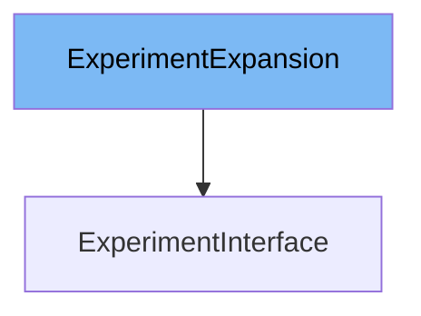

This document will cover the <SwmToken path="pkg/client/clientset/versioned/typed/rollouts/v1alpha1/generated_expansion.go" pos="27:2:2" line-data="type ExperimentExpansion interface{}">`ExperimentExpansion`</SwmToken> interface. We will discuss:

1. What <SwmToken path="pkg/client/clientset/versioned/typed/rollouts/v1alpha1/generated_expansion.go" pos="27:2:2" line-data="type ExperimentExpansion interface{}">`ExperimentExpansion`</SwmToken> is.
2. The variables and functions defined in <SwmToken path="pkg/client/clientset/versioned/typed/rollouts/v1alpha1/generated_expansion.go" pos="27:2:2" line-data="type ExperimentExpansion interface{}">`ExperimentExpansion`</SwmToken>.
3. An example of how to use <SwmToken path="pkg/client/clientset/versioned/typed/rollouts/v1alpha1/generated_expansion.go" pos="27:2:2" line-data="type ExperimentExpansion interface{}">`ExperimentExpansion`</SwmToken> in <SwmToken path="pkg/client/clientset/versioned/typed/rollouts/v1alpha1/experiment.go" pos="33:16:16" line-data="// ExperimentsGetter has a method to return a ExperimentInterface.">`ExperimentInterface`</SwmToken>.



# What is <SwmToken path="pkg/client/clientset/versioned/typed/rollouts/v1alpha1/generated_expansion.go" pos="27:2:2" line-data="type ExperimentExpansion interface{}">`ExperimentExpansion`</SwmToken>

<SwmToken path="pkg/client/clientset/versioned/typed/rollouts/v1alpha1/generated_expansion.go" pos="27:2:2" line-data="type ExperimentExpansion interface{}">`ExperimentExpansion`</SwmToken> is an interface defined in the <SwmPath>[pkg/client/clientset/versioned/typed/rollouts/v1alpha1/generated_expansion.go](pkg/client/clientset/versioned/typed/rollouts/v1alpha1/generated_expansion.go)</SwmPath> file. It is used to extend the functionality of the Experiment client in Kubernetes. This interface allows for additional methods to be added to the Experiment client without modifying the generated client code.

<SwmSnippet path="/pkg/client/clientset/versioned/typed/rollouts/v1alpha1/generated_expansion.go" line="27">

---

# Variables and functions

The <SwmToken path="pkg/client/clientset/versioned/typed/rollouts/v1alpha1/generated_expansion.go" pos="27:2:2" line-data="type ExperimentExpansion interface{}">`ExperimentExpansion`</SwmToken> interface is defined here. It is currently an empty interface, meaning it does not declare any methods. This allows for future expansion without breaking existing code.

```go
type ExperimentExpansion interface{}
```

---

</SwmSnippet>

# Usage example

To use <SwmToken path="pkg/client/clientset/versioned/typed/rollouts/v1alpha1/generated_expansion.go" pos="27:2:2" line-data="type ExperimentExpansion interface{}">`ExperimentExpansion`</SwmToken>, you would typically define additional methods in a separate file that extends the Experiment client. Here is an example of how you might use <SwmToken path="pkg/client/clientset/versioned/typed/rollouts/v1alpha1/generated_expansion.go" pos="27:2:2" line-data="type ExperimentExpansion interface{}">`ExperimentExpansion`</SwmToken> in <SwmToken path="pkg/client/clientset/versioned/typed/rollouts/v1alpha1/experiment.go" pos="33:16:16" line-data="// ExperimentsGetter has a method to return a ExperimentInterface.">`ExperimentInterface`</SwmToken>.

<SwmSnippet path="/pkg/client/clientset/versioned/typed/rollouts/v1alpha1/experiment.go" line="27">

---

The <SwmToken path="pkg/client/clientset/versioned/typed/rollouts/v1alpha1/experiment.go" pos="33:16:16" line-data="// ExperimentsGetter has a method to return a ExperimentInterface.">`ExperimentInterface`</SwmToken> is an example of how <SwmToken path="pkg/client/clientset/versioned/typed/rollouts/v1alpha1/generated_expansion.go" pos="27:2:2" line-data="type ExperimentExpansion interface{}">`ExperimentExpansion`</SwmToken> can be used. By embedding <SwmToken path="pkg/client/clientset/versioned/typed/rollouts/v1alpha1/generated_expansion.go" pos="27:2:2" line-data="type ExperimentExpansion interface{}">`ExperimentExpansion`</SwmToken>, any additional methods defined in <SwmToken path="pkg/client/clientset/versioned/typed/rollouts/v1alpha1/generated_expansion.go" pos="27:2:2" line-data="type ExperimentExpansion interface{}">`ExperimentExpansion`</SwmToken> will be available in <SwmToken path="pkg/client/clientset/versioned/typed/rollouts/v1alpha1/experiment.go" pos="33:16:16" line-data="// ExperimentsGetter has a method to return a ExperimentInterface.">`ExperimentInterface`</SwmToken>.

```go
	v1 "k8s.io/apimachinery/pkg/apis/meta/v1"
```

---

</SwmSnippet>

&nbsp;

*This is an auto-generated document by Swimm 🌊 and has not yet been verified by a human*

<SwmMeta version="3.0.0" repo-id="Z2l0aHViJTNBJTNBaW50dWl0LWFyZ28tcm9sbG91dHMtZGVtbyUzQSUzQVN3aW1tLURlbW8=" repo-name="intuit-argo-rollouts-demo"><sup>Powered by [Swimm](/)</sup></SwmMeta>
