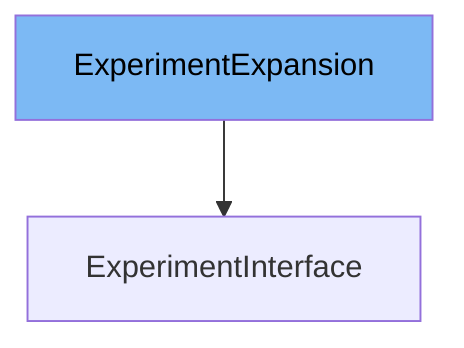

This document will cover the `ExperimentInterface` class. We will cover:

1. What `ExperimentExpansion` is and what it is used for.
2. What `ExperimentInterface` is and what it is used for.
3. Variables and functions defined in `ExperimentInterface`.



# What is ExperimentExpansion

`ExperimentExpansion` is an interface defined in `pkg/client/clientset/versioned/typed/rollouts/v1alpha1/generated_expansion.go`. It is used to allow additional methods to be added to the `ExperimentInterface` without modifying the generated code. This is useful for extending the functionality of the `ExperimentInterface` with custom methods.

# What is ExperimentInterface

`ExperimentInterface` is an interface defined in `pkg/client/clientset/versioned/typed/rollouts/v1alpha1/experiment.go`. It provides methods to work with `Experiment` resources in Kubernetes. This interface includes methods for creating, updating, deleting, retrieving, listing, and watching `Experiment` resources. The `ExperimentInterface` inherits from `ExperimentExpansion`, allowing it to be extended with additional methods.

<SwmSnippet path="/pkg/client/clientset/versioned/typed/rollouts/v1alpha1/experiment.go" line="67" repo-id="Z2l0aHViJTNBJTNBaW50dWl0LWFyZ28tcm9sbG91dHMtZGVtbyUzQSUzQVN3aW1tLURlbW8=">

---

# Variables and functions

The `Get` function takes the name of the experiment and returns the corresponding experiment object. It interacts with the Kubernetes API server to retrieve the experiment resource.

```go
// Get takes name of the experiment, and returns the corresponding experiment object, and an error if there is any.
func (c *experiments) Get(ctx context.Context, name string, options v1.GetOptions) (result *v1alpha1.Experiment, err error) {
	result = &v1alpha1.Experiment{}
	err = c.client.Get().
		Namespace(c.ns).
		Resource("experiments").
		Name(name).
		VersionedParams(&options, scheme.ParameterCodec).
		Do(ctx).
		Into(result)
	return
}
```

---

</SwmSnippet>

<SwmSnippet path="/pkg/client/clientset/versioned/typed/rollouts/v1alpha1/experiment.go" line="80" repo-id="Z2l0aHViJTNBJTNBaW50dWl0LWFyZ28tcm9sbG91dHMtZGVtbyUzQSUzQVN3aW1tLURlbW8=">

---

The `List` function takes label and field selectors and returns a list of experiments that match those selectors. It interacts with the Kubernetes API server to retrieve the list of experiment resources.

```go
// List takes label and field selectors, and returns the list of Experiments that match those selectors.
func (c *experiments) List(ctx context.Context, opts v1.ListOptions) (result *v1alpha1.ExperimentList, err error) {
	var timeout time.Duration
	if opts.TimeoutSeconds != nil {
		timeout = time.Duration(*opts.TimeoutSeconds) * time.Second
	}
	result = &v1alpha1.ExperimentList{}
	err = c.client.Get().
		Namespace(c.ns).
		Resource("experiments").
		VersionedParams(&opts, scheme.ParameterCodec).
		Timeout(timeout).
		Do(ctx).
		Into(result)
	return
}
```

---

</SwmSnippet>

<SwmSnippet path="/pkg/client/clientset/versioned/typed/rollouts/v1alpha1/experiment.go" line="97" repo-id="Z2l0aHViJTNBJTNBaW50dWl0LWFyZ28tcm9sbG91dHMtZGVtbyUzQSUzQVN3aW1tLURlbW8=">

---

The `Watch` function returns a watch.Interface that watches the requested experiments. It interacts with the Kubernetes API server to watch for changes to experiment resources.

```go
// Watch returns a watch.Interface that watches the requested experiments.
func (c *experiments) Watch(ctx context.Context, opts v1.ListOptions) (watch.Interface, error) {
	var timeout time.Duration
	if opts.TimeoutSeconds != nil {
		timeout = time.Duration(*opts.TimeoutSeconds) * time.Second
	}
	opts.Watch = true
	return c.client.Get().
		Namespace(c.ns).
		Resource("experiments").
		VersionedParams(&opts, scheme.ParameterCodec).
		Timeout(timeout).
		Watch(ctx)
}
```

---

</SwmSnippet>

<SwmSnippet path="/pkg/client/clientset/versioned/typed/rollouts/v1alpha1/experiment.go" line="112" repo-id="Z2l0aHViJTNBJTNBaW50dWl0LWFyZ28tcm9sbG91dHMtZGVtbyUzQSUzQVN3aW1tLURlbW8=">

---

The `Create` function takes the representation of an experiment and creates it. It interacts with the Kubernetes API server to create the experiment resource.

```go
// Create takes the representation of a experiment and creates it.  Returns the server's representation of the experiment, and an error, if there is any.
func (c *experiments) Create(ctx context.Context, experiment *v1alpha1.Experiment, opts v1.CreateOptions) (result *v1alpha1.Experiment, err error) {
	result = &v1alpha1.Experiment{}
	err = c.client.Post().
		Namespace(c.ns).
		Resource("experiments").
		VersionedParams(&opts, scheme.ParameterCodec).
		Body(experiment).
		Do(ctx).
		Into(result)
	return
}
```

---

</SwmSnippet>

<SwmSnippet path="/pkg/client/clientset/versioned/typed/rollouts/v1alpha1/experiment.go" line="125" repo-id="Z2l0aHViJTNBJTNBaW50dWl0LWFyZ28tcm9sbG91dHMtZGVtbyUzQSUzQVN3aW1tLURlbW8=">

---

The `Update` function takes the representation of an experiment and updates it. It interacts with the Kubernetes API server to update the experiment resource.

```go
// Update takes the representation of a experiment and updates it. Returns the server's representation of the experiment, and an error, if there is any.
func (c *experiments) Update(ctx context.Context, experiment *v1alpha1.Experiment, opts v1.UpdateOptions) (result *v1alpha1.Experiment, err error) {
	result = &v1alpha1.Experiment{}
	err = c.client.Put().
		Namespace(c.ns).
		Resource("experiments").
		Name(experiment.Name).
		VersionedParams(&opts, scheme.ParameterCodec).
		Body(experiment).
		Do(ctx).
		Into(result)
	return
```

---

</SwmSnippet>

<SwmSnippet path="/pkg/client/clientset/versioned/typed/rollouts/v1alpha1/experiment.go" line="139" repo-id="Z2l0aHViJTNBJTNBaW50dWl0LWFyZ28tcm9sbG91dHMtZGVtbyUzQSUzQVN3aW1tLURlbW8=">

---

The `UpdateStatus` function updates the status of an experiment. It interacts with the Kubernetes API server to update the status of the experiment resource.

```go
// UpdateStatus was generated because the type contains a Status member.
// Add a +genclient:noStatus comment above the type to avoid generating UpdateStatus().
func (c *experiments) UpdateStatus(ctx context.Context, experiment *v1alpha1.Experiment, opts v1.UpdateOptions) (result *v1alpha1.Experiment, err error) {
	result = &v1alpha1.Experiment{}
	err = c.client.Put().
		Namespace(c.ns).
		Resource("experiments").
		Name(experiment.Name).
		SubResource("status").
		VersionedParams(&opts, scheme.ParameterCodec).
		Body(experiment).
		Do(ctx).
		Into(result)
	return
```

---

</SwmSnippet>

<SwmSnippet path="/pkg/client/clientset/versioned/typed/rollouts/v1alpha1/experiment.go" line="155" repo-id="Z2l0aHViJTNBJTNBaW50dWl0LWFyZ28tcm9sbG91dHMtZGVtbyUzQSUzQVN3aW1tLURlbW8=">

---

The `Delete` function takes the name of the experiment and deletes it. It interacts with the Kubernetes API server to delete the experiment resource.

```go
// Delete takes name of the experiment and deletes it. Returns an error if one occurs.
func (c *experiments) Delete(ctx context.Context, name string, opts v1.DeleteOptions) error {
	return c.client.Delete().
		Namespace(c.ns).
		Resource("experiments").
		Name(name).
		Body(&opts).
		Do(ctx).
		Error()
}
```

---

</SwmSnippet>

<SwmSnippet path="/pkg/client/clientset/versioned/typed/rollouts/v1alpha1/experiment.go" line="166" repo-id="Z2l0aHViJTNBJTNBaW50dWl0LWFyZ28tcm9sbG91dHMtZGVtbyUzQSUzQVN3aW1tLURlbW8=">

---

The `DeleteCollection` function deletes a collection of experiment objects. It interacts with the Kubernetes API server to delete the collection of experiment resources.

```go
// DeleteCollection deletes a collection of objects.
func (c *experiments) DeleteCollection(ctx context.Context, opts v1.DeleteOptions, listOpts v1.ListOptions) error {
	var timeout time.Duration
	if listOpts.TimeoutSeconds != nil {
		timeout = time.Duration(*listOpts.TimeoutSeconds) * time.Second
	}
	return c.client.Delete().
		Namespace(c.ns).
		Resource("experiments").
		VersionedParams(&listOpts, scheme.ParameterCodec).
		Timeout(timeout).
		Body(&opts).
		Do(ctx).
		Error()
}
```

---

</SwmSnippet>

<SwmSnippet path="/pkg/client/clientset/versioned/typed/rollouts/v1alpha1/experiment.go" line="182" repo-id="Z2l0aHViJTNBJTNBaW50dWl0LWFyZ28tcm9sbG91dHMtZGVtbyUzQSUzQVN3aW1tLURlbW8=">

---

The `Patch` function applies a patch and returns the patched experiment. It interacts with the Kubernetes API server to patch the experiment resource.

```go
// Patch applies the patch and returns the patched experiment.
func (c *experiments) Patch(ctx context.Context, name string, pt types.PatchType, data []byte, opts v1.PatchOptions, subresources ...string) (result *v1alpha1.Experiment, err error) {
	result = &v1alpha1.Experiment{}
	err = c.client.Patch(pt).
		Namespace(c.ns).
		Resource("experiments").
		Name(name).
		SubResource(subresources...).
		VersionedParams(&opts, scheme.ParameterCodec).
		Body(data).
		Do(ctx).
		Into(result)
	return
}
```

---

</SwmSnippet>

&nbsp;

*This is an auto-generated document by Swimm 🌊 and has not yet been verified by a human*

<SwmMeta version="3.0.0"><sup>Powered by [Swimm](https://staging.swimm.cloud/)</sup></SwmMeta>
