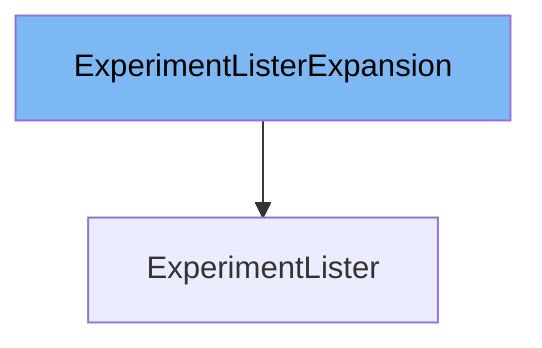

This document will cover the class `ExperimentLister`. We will discuss:

1. What is `ExperimentListerExpansion` and what it is used for.
2. What is `ExperimentLister` and its relationship to `ExperimentListerExpansion`.
3. Variables and functions in `ExperimentLister`.



# What is `ExperimentListerExpansion`

`ExperimentListerExpansion` is an interface that allows custom methods to be added to the `ExperimentLister` interface. It is used to extend the functionality of the `ExperimentLister` without modifying the original interface definition.

# What is `ExperimentLister`

`ExperimentLister` is an interface in `pkg/client/listers/rollouts/v1alpha1/experiment.go` that helps list `Experiments`. It provides methods to list all `Experiments` in the indexer and to get `Experiments` within a specific namespace. `ExperimentLister` ensures that all objects returned are treated as read-only. It includes the `ExperimentListerExpansion` interface to allow for custom method additions.

<SwmSnippet path="/pkg/client/listers/rollouts/v1alpha1/experiment.go" line="50" repo-id="Z2l0aHViJTNBJTNBaW50dWl0LWFyZ28tcm9sbG91dHMtZGVtbyUzQSUzQVN3aW1tLURlbW8=">

---

# Variables and functions

The function `List` lists all `Experiments` in the indexer. It takes a `labels.Selector` as a parameter and returns a slice of pointers to `v1alpha1.Experiment` and an error.

```go
func (s *experimentLister) List(selector labels.Selector) (ret []*v1alpha1.Experiment, err error) {
	err = cache.ListAll(s.indexer, selector, func(m interface{}) {
		ret = append(ret, m.(*v1alpha1.Experiment))
	})
	return ret, err
}
```

---

</SwmSnippet>

<SwmSnippet path="/pkg/client/listers/rollouts/v1alpha1/experiment.go" line="57" repo-id="Z2l0aHViJTNBJTNBaW50dWl0LWFyZ28tcm9sbG91dHMtZGVtbyUzQSUzQVN3aW1tLURlbW8=">

---

The function `Experiments` returns an object that can list and get `Experiments` within a specific namespace. It takes a namespace string as a parameter and returns an `ExperimentNamespaceLister`.

```go
// Experiments returns an object that can list and get Experiments.
func (s *experimentLister) Experiments(namespace string) ExperimentNamespaceLister {
	return experimentNamespaceLister{indexer: s.indexer, namespace: namespace}
}
```

---

</SwmSnippet>

<SwmSnippet path="/pkg/client/listers/rollouts/v1alpha1/experiment.go" line="81" repo-id="Z2l0aHViJTNBJTNBaW50dWl0LWFyZ28tcm9sbG91dHMtZGVtbyUzQSUzQVN3aW1tLURlbW8=">

---

The function `List` in `experimentNamespaceLister` lists all `Experiments` in the indexer for a given namespace. It takes a `labels.Selector` as a parameter and returns a slice of pointers to `v1alpha1.Experiment` and an error.

```go
// List lists all Experiments in the indexer for a given namespace.
func (s experimentNamespaceLister) List(selector labels.Selector) (ret []*v1alpha1.Experiment, err error) {
	err = cache.ListAllByNamespace(s.indexer, s.namespace, selector, func(m interface{}) {
		ret = append(ret, m.(*v1alpha1.Experiment))
	})
	return ret, err
}
```

---

</SwmSnippet>

<SwmSnippet path="/pkg/client/listers/rollouts/v1alpha1/experiment.go" line="89" repo-id="Z2l0aHViJTNBJTNBaW50dWl0LWFyZ28tcm9sbG91dHMtZGVtbyUzQSUzQVN3aW1tLURlbW8=">

---

The function `Get` in `experimentNamespaceLister` retrieves the `Experiment` from the indexer for a given namespace and name. It takes a name string as a parameter and returns a pointer to `v1alpha1.Experiment` and an error.

```go
// Get retrieves the Experiment from the indexer for a given namespace and name.
func (s experimentNamespaceLister) Get(name string) (*v1alpha1.Experiment, error) {
	obj, exists, err := s.indexer.GetByKey(s.namespace + "/" + name)
	if err != nil {
		return nil, err
	}
	if !exists {
		return nil, errors.NewNotFound(v1alpha1.Resource("experiment"), name)
	}
	return obj.(*v1alpha1.Experiment), nil
}
```

---

</SwmSnippet>

&nbsp;

*This is an auto-generated document by Swimm 🌊 and has not yet been verified by a human*

<SwmMeta version="3.0.0"><sup>Powered by [Swimm](https://staging.swimm.cloud/)</sup></SwmMeta>
