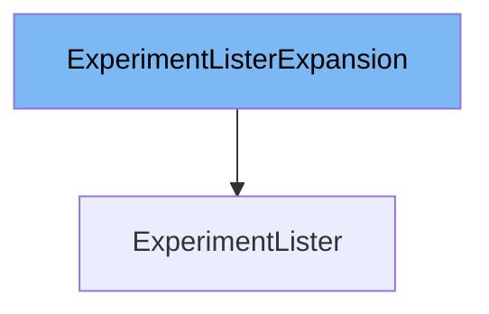

This document will cover the class <SwmToken path="pkg/client/listers/rollouts/v1alpha1/expansion_generated.go" pos="41:2:2" line-data="// ExperimentListerExpansion allows custom methods to be added to">`ExperimentListerExpansion`</SwmToken>. We will discuss:

1. What is <SwmToken path="pkg/client/listers/rollouts/v1alpha1/expansion_generated.go" pos="41:2:2" line-data="// ExperimentListerExpansion allows custom methods to be added to">`ExperimentListerExpansion`</SwmToken>
2. Variables and functions in <SwmToken path="pkg/client/listers/rollouts/v1alpha1/expansion_generated.go" pos="41:2:2" line-data="// ExperimentListerExpansion allows custom methods to be added to">`ExperimentListerExpansion`</SwmToken>
3. Usage example of <SwmToken path="pkg/client/listers/rollouts/v1alpha1/expansion_generated.go" pos="41:2:2" line-data="// ExperimentListerExpansion allows custom methods to be added to">`ExperimentListerExpansion`</SwmToken>



# What is <SwmToken path="pkg/client/listers/rollouts/v1alpha1/expansion_generated.go" pos="41:2:2" line-data="// ExperimentListerExpansion allows custom methods to be added to">`ExperimentListerExpansion`</SwmToken>

The <SwmToken path="pkg/client/listers/rollouts/v1alpha1/expansion_generated.go" pos="41:2:2" line-data="// ExperimentListerExpansion allows custom methods to be added to">`ExperimentListerExpansion`</SwmToken> is an interface defined in <SwmPath>[pkg/client/listers/rollouts/v1alpha1/expansion_generated.go](pkg/client/listers/rollouts/v1alpha1/expansion_generated.go)</SwmPath>. It allows custom methods to be added to the <SwmToken path="pkg/client/listers/rollouts/v1alpha1/expansion_generated.go" pos="42:2:2" line-data="// ExperimentLister.">`ExperimentLister`</SwmToken>. This interface is part of the Kubernetes <SwmToken path="pkg/client/listers/rollouts/v1alpha1/experiment.go" pos="25:6:8" line-data="	&quot;k8s.io/client-go/tools/cache&quot;">`client-go`</SwmToken> library and is used to extend the functionality of the listers generated by the <SwmToken path="pkg/client/listers/rollouts/v1alpha1/expansion_generated.go" pos="17:8:10" line-data="// Code generated by lister-gen. DO NOT EDIT.">`lister-gen`</SwmToken> tool.

<SwmSnippet path="/pkg/client/listers/rollouts/v1alpha1/expansion_generated.go" line="41">

---

# Variables and functions

The <SwmToken path="pkg/client/listers/rollouts/v1alpha1/expansion_generated.go" pos="41:2:2" line-data="// ExperimentListerExpansion allows custom methods to be added to">`ExperimentListerExpansion`</SwmToken> interface is defined here. It does not contain any methods by default, but it allows developers to add custom methods to the <SwmToken path="pkg/client/listers/rollouts/v1alpha1/expansion_generated.go" pos="42:2:2" line-data="// ExperimentLister.">`ExperimentLister`</SwmToken>.

```go
// ExperimentListerExpansion allows custom methods to be added to
// ExperimentLister.
type ExperimentListerExpansion interface{}
```

---

</SwmSnippet>

# Usage example

To use the <SwmToken path="pkg/client/listers/rollouts/v1alpha1/expansion_generated.go" pos="41:2:2" line-data="// ExperimentListerExpansion allows custom methods to be added to">`ExperimentListerExpansion`</SwmToken>, you would typically define custom methods in your implementation of the <SwmToken path="pkg/client/listers/rollouts/v1alpha1/expansion_generated.go" pos="42:2:2" line-data="// ExperimentLister.">`ExperimentLister`</SwmToken>. Here is an example of how you might extend the <SwmToken path="pkg/client/listers/rollouts/v1alpha1/expansion_generated.go" pos="42:2:2" line-data="// ExperimentLister.">`ExperimentLister`</SwmToken> with a custom method.

<SwmSnippet path="/pkg/client/listers/rollouts/v1alpha1/experiment.go" line="1">

---

In this file, you would implement the <SwmToken path="pkg/client/listers/rollouts/v1alpha1/expansion_generated.go" pos="42:2:2" line-data="// ExperimentLister.">`ExperimentLister`</SwmToken> and add custom methods as needed. For example, you might add a method to filter experiments based on specific criteria.

```go
/*
Copyright The Kubernetes Authors.

Licensed under the Apache License, Version 2.0 (the "License");
you may not use this file except in compliance with the License.
You may obtain a copy of the License at

    http://www.apache.org/licenses/LICENSE-2.0

Unless required by applicable law or agreed to in writing, software
distributed under the License is distributed on an "AS IS" BASIS,
WITHOUT WARRANTIES OR CONDITIONS OF ANY KIND, either express or implied.
See the License for the specific language governing permissions and
limitations under the License.
*/
```

---

</SwmSnippet>

&nbsp;

*This is an auto-generated document by Swimm 🌊 and has not yet been verified by a human*

<SwmMeta version="3.0.0" repo-id="Z2l0aHViJTNBJTNBaW50dWl0LWFyZ28tcm9sbG91dHMtZGVtbyUzQSUzQVN3aW1tLURlbW8=" repo-name="intuit-argo-rollouts-demo"><sup>Powered by [Swimm](/)</sup></SwmMeta>
