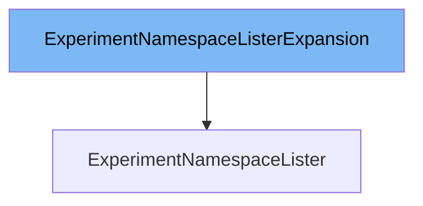

This document will cover the class `ExperimentNamespaceLister`. We will discuss:

1. What is `ExperimentNamespaceListerExpansion`
2. What is `ExperimentNamespaceLister`
3. Variables and functions in `ExperimentNamespaceLister`



# What is `ExperimentNamespaceListerExpansion`

`ExperimentNamespaceListerExpansion` is an interface defined in `pkg/client/listers/rollouts/v1alpha1/expansion_generated.go`. It allows custom methods to be added to the `ExperimentNamespaceLister` interface. This means that developers can extend the functionality of `ExperimentNamespaceLister` by implementing additional methods in this interface.

# What is `ExperimentNamespaceLister`

`ExperimentNamespaceLister` is an interface defined in `pkg/client/listers/rollouts/v1alpha1/experiment.go`. It helps list and get `Experiment` objects within a specific namespace. All objects returned by this lister must be treated as read-only. The `ExperimentNamespaceLister` interface includes methods for listing all experiments in a namespace and retrieving a specific experiment by name. It is related to `ExperimentNamespaceListerExpansion` in that the latter allows for the addition of custom methods to the former.

<SwmSnippet path="/pkg/client/listers/rollouts/v1alpha1/experiment.go" line="81" repo-id="Z2l0aHViJTNBJTNBaW50dWl0LWFyZ28tcm9sbG91dHMtZGVtbyUzQSUzQVN3aW1tLURlbW8=">

---

# Variables and functions

The `List` function lists all `Experiment` objects in the indexer for a given namespace. It uses the `cache.ListAllByNamespace` function to retrieve the experiments and appends them to the return slice.

```go
// List lists all Experiments in the indexer for a given namespace.
func (s experimentNamespaceLister) List(selector labels.Selector) (ret []*v1alpha1.Experiment, err error) {
	err = cache.ListAllByNamespace(s.indexer, s.namespace, selector, func(m interface{}) {
		ret = append(ret, m.(*v1alpha1.Experiment))
	})
	return ret, err
}
```

---

</SwmSnippet>

<SwmSnippet path="/pkg/client/listers/rollouts/v1alpha1/experiment.go" line="89" repo-id="Z2l0aHViJTNBJTNBaW50dWl0LWFyZ28tcm9sbG91dHMtZGVtbyUzQSUzQVN3aW1tLURlbW8=">

---

The `Get` function retrieves an `Experiment` object from the indexer for a given namespace and name. It uses the `indexer.GetByKey` function to get the experiment and returns an error if the experiment is not found.

```go
// Get retrieves the Experiment from the indexer for a given namespace and name.
func (s experimentNamespaceLister) Get(name string) (*v1alpha1.Experiment, error) {
	obj, exists, err := s.indexer.GetByKey(s.namespace + "/" + name)
	if err != nil {
		return nil, err
	}
	if !exists {
		return nil, errors.NewNotFound(v1alpha1.Resource("experiment"), name)
	}
	return obj.(*v1alpha1.Experiment), nil
}
```

---

</SwmSnippet>

&nbsp;

*This is an auto-generated document by Swimm 🌊 and has not yet been verified by a human*

<SwmMeta version="3.0.0"><sup>Powered by [Swimm](https://staging.swimm.cloud/)</sup></SwmMeta>
