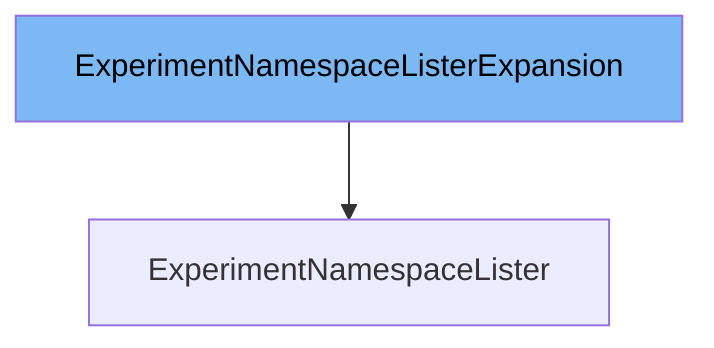

This document will cover the class <SwmToken path="pkg/client/listers/rollouts/v1alpha1/expansion_generated.go" pos="45:2:2" line-data="// ExperimentNamespaceListerExpansion allows custom methods to be added to">`ExperimentNamespaceListerExpansion`</SwmToken>. We will discuss:

1. What is <SwmToken path="pkg/client/listers/rollouts/v1alpha1/expansion_generated.go" pos="45:2:2" line-data="// ExperimentNamespaceListerExpansion allows custom methods to be added to">`ExperimentNamespaceListerExpansion`</SwmToken>
2. Variables and functions
3. Usage example



# What is <SwmToken path="pkg/client/listers/rollouts/v1alpha1/expansion_generated.go" pos="45:2:2" line-data="// ExperimentNamespaceListerExpansion allows custom methods to be added to">`ExperimentNamespaceListerExpansion`</SwmToken>

The <SwmToken path="pkg/client/listers/rollouts/v1alpha1/expansion_generated.go" pos="45:2:2" line-data="// ExperimentNamespaceListerExpansion allows custom methods to be added to">`ExperimentNamespaceListerExpansion`</SwmToken> is an interface defined in the file <SwmPath>[pkg/client/listers/rollouts/v1alpha1/expansion_generated.go](pkg/client/listers/rollouts/v1alpha1/expansion_generated.go)</SwmPath>. It allows custom methods to be added to the <SwmToken path="pkg/client/listers/rollouts/v1alpha1/expansion_generated.go" pos="46:2:2" line-data="// ExperimentNamespaceLister.">`ExperimentNamespaceLister`</SwmToken>. This interface is part of the Kubernetes client-go library and is used to extend the functionality of the lister for experiments within a specific namespace.

<SwmSnippet path="/pkg/client/listers/rollouts/v1alpha1/expansion_generated.go" line="45">

---

# Variables and functions

The <SwmToken path="pkg/client/listers/rollouts/v1alpha1/expansion_generated.go" pos="45:2:2" line-data="// ExperimentNamespaceListerExpansion allows custom methods to be added to">`ExperimentNamespaceListerExpansion`</SwmToken> interface itself does not define any variables or functions. It is an empty interface that serves as a placeholder for adding custom methods to the <SwmToken path="pkg/client/listers/rollouts/v1alpha1/expansion_generated.go" pos="46:2:2" line-data="// ExperimentNamespaceLister.">`ExperimentNamespaceLister`</SwmToken>.

```go
// ExperimentNamespaceListerExpansion allows custom methods to be added to
// ExperimentNamespaceLister.
type ExperimentNamespaceListerExpansion interface{}
```

---

</SwmSnippet>

# Usage example

To use the <SwmToken path="pkg/client/listers/rollouts/v1alpha1/expansion_generated.go" pos="45:2:2" line-data="// ExperimentNamespaceListerExpansion allows custom methods to be added to">`ExperimentNamespaceListerExpansion`</SwmToken> interface, you would typically define custom methods in a separate file that implements this interface. Here is an example of how you might extend the <SwmToken path="pkg/client/listers/rollouts/v1alpha1/expansion_generated.go" pos="46:2:2" line-data="// ExperimentNamespaceLister.">`ExperimentNamespaceLister`</SwmToken> with a custom method:

```go
package v1alpha1

// CustomExperimentNamespaceLister is a custom implementation of the ExperimentNamespaceListerExpansion interface
// that adds a custom method to list experiments by a specific label.
type CustomExperimentNamespaceLister struct {
    ExperimentNamespaceLister
}

// ListExperimentsByLabel lists experiments in a namespace by a specific label.
func (c *CustomExperimentNamespaceLister) ListExperimentsByLabel(namespace string, label string) ([]*v1alpha1.Experiment, error) {
    // Custom implementation to list experiments by label
}
```

In this example, `CustomExperimentNamespaceLister` embeds the <SwmToken path="pkg/client/listers/rollouts/v1alpha1/expansion_generated.go" pos="46:2:2" line-data="// ExperimentNamespaceLister.">`ExperimentNamespaceLister`</SwmToken> and implements a custom method `ListExperimentsByLabel`.

&nbsp;

*This is an auto-generated document by Swimm 🌊 and has not yet been verified by a human*

<SwmMeta version="3.0.0" repo-id="Z2l0aHViJTNBJTNBaW50dWl0LWFyZ28tcm9sbG91dHMtZGVtbyUzQSUzQVN3aW1tLURlbW8=" repo-name="intuit-argo-rollouts-demo"><sup>Powered by [Swimm](/)</sup></SwmMeta>
